# 010：迭代器实现与运行时分析入门 🧠


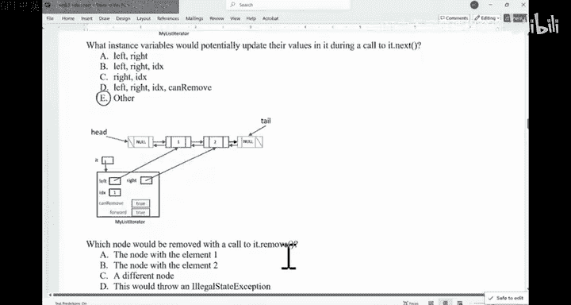


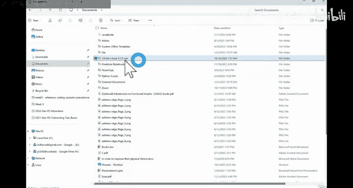


在本节课中，我们将学习如何为一个自定义链表实现迭代器，并初步了解程序运行时分析的重要性。我们将通过一个具体的“FriendList”示例，逐步构建节点类、迭代器类和链表类，并理解它们如何协同工作。

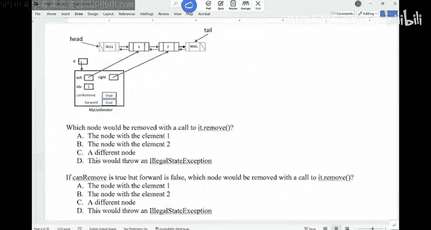

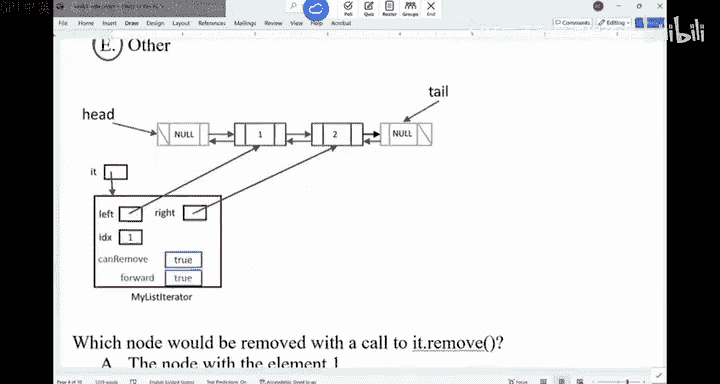

---

## 节点类的实现 🔗


上一节我们讨论了迭代器的概念，本节我们首先来实现链表的基本构建块——节点（Node）。

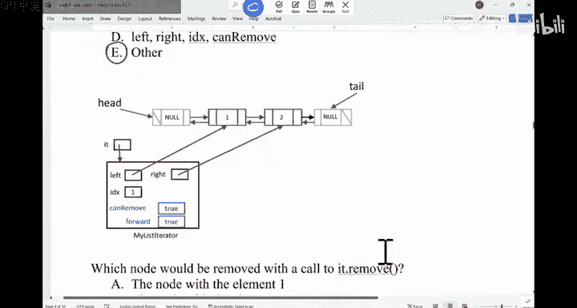


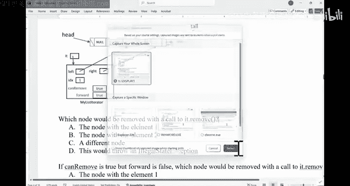

节点类包含数据和指向下一个节点的引用。在我们的示例中，它是一个内部类，这意味着它可以访问外部链表类的私有成员，反之亦然。

以下是节点类的核心部分，我们需要完成其构造方法：

```java
public class Node {
    String data;
    Node next;

    // 构造方法1：创建一个孤立节点
    public Node(String d) {
        data = d;
        next = null;
    }

    // 构造方法2：在指定节点‘before’之后插入新节点
    public Node(String d, Node before) {
        // 需要完成的三行代码：
        // 1. 将新节点的数据字段设置为 d
        // 2. 将新节点的 next 指向 before 节点原来指向的下一个节点
        // 3. 将 before 节点的 next 指向这个新节点
        data = d;
        next = before.next;
        before.next = this;
    }

    // 获取下一个节点的方法
    public Node next() {
        return next;
    }
}
```

**代码解释**：
*   第一行 `data = d;` 将传入的数据 `d` 存储到节点的 `data` 字段。
*   第二行 `next = before.next;` 让新节点指向 `before` 节点原本指向的下一个节点。
*   第三行 `before.next = this;` 将 `before` 节点的 `next` 引用更新为指向这个新创建的节点，从而完成插入。

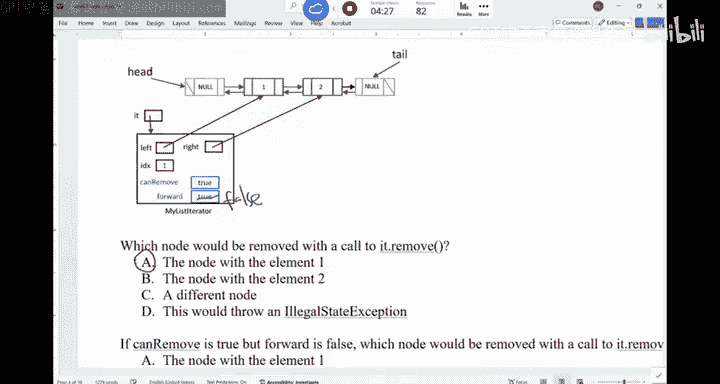


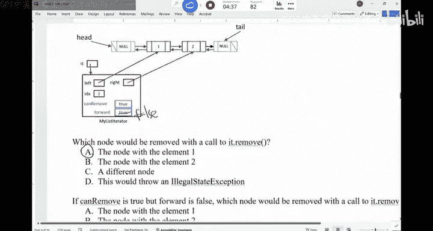

---

## 迭代器类的实现 🚶

现在，我们来看看如何为链表实现一个迭代器。迭代器的目的是让用户能够方便地遍历链表，而无需了解其内部结构。


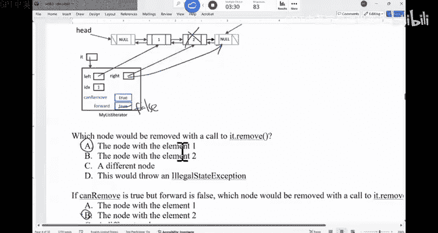


我们的 `FriendIterator` 是一个内部类，它维护着几个关键状态：`left`、`right`、`index` 和 `canRemove`。

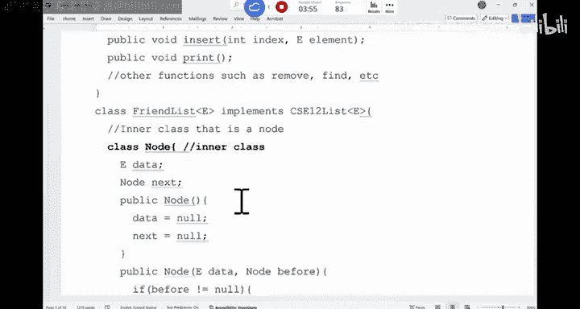


### 构造方法与初始化


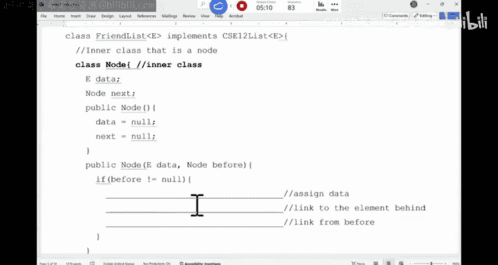


首先，我们需要完成迭代器的构造方法，正确初始化其状态。

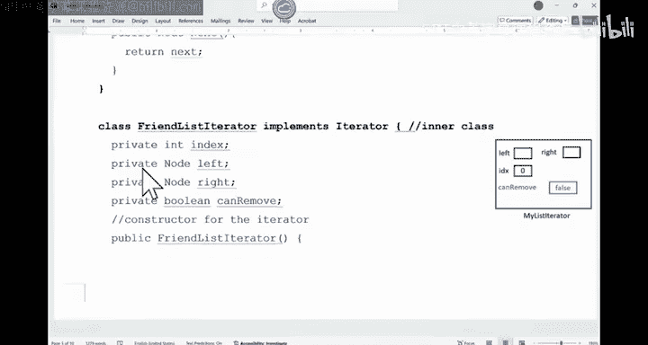

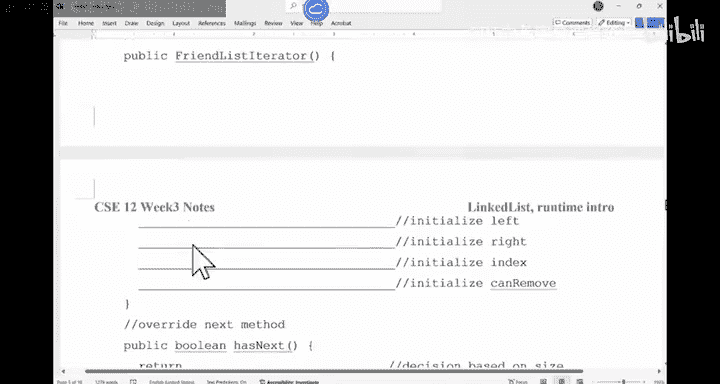

```java
public class FriendIterator implements Iterator<String> {
    private Node left;
    private Node right;
    private int index;
    private boolean canRemove;

    // 构造方法
    public FriendIterator() {
        // 需要完成的四行初始化代码：
        left = head;          // left 指向头节点（哑元节点）
        right = left.next();  // right 指向第一个实际数据节点（如果存在）
        index = 0;            // 索引从0开始
        canRemove = false;    // 初始时不能删除，因为尚未调用 next() 或 previous()
    }
}
```

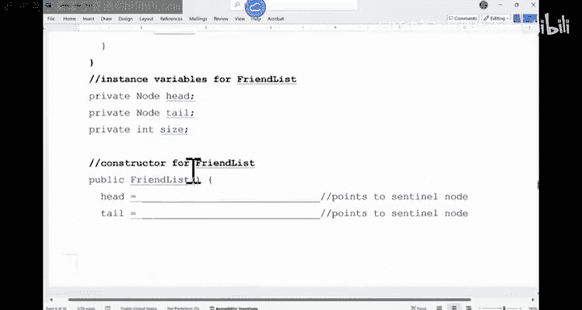

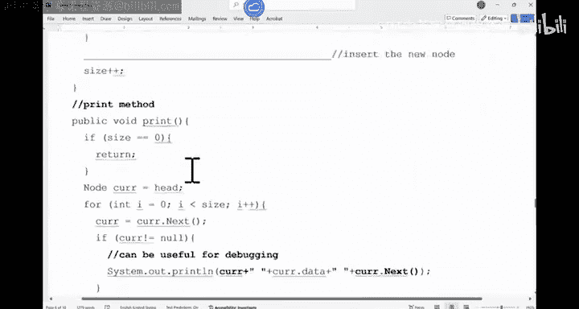

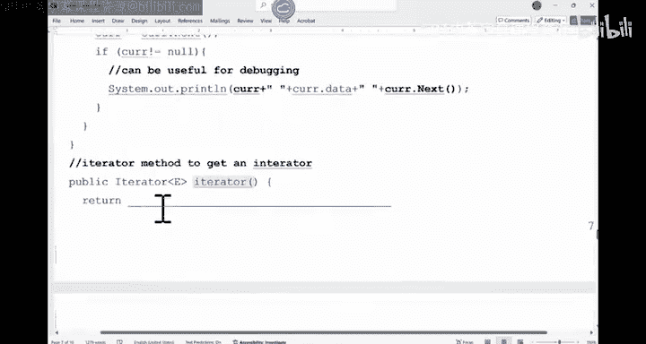


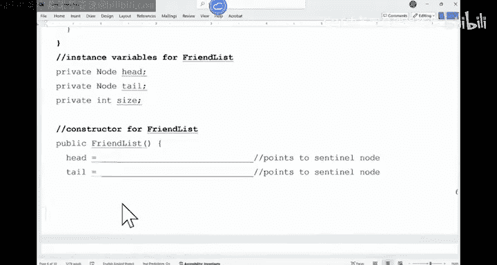

**状态说明**：
*   `left` 和 `right` 定义了迭代器“光标”的位置，`left` 是刚访问过的节点，`right` 是将要访问的下一个节点。
*   `index` 记录当前迭代器在链表中的逻辑位置。
*   `canRemove` 是一个安全标志，只有调用 `next()` 或 `previous()` 之后，它才变为 `true`，此时才能调用 `remove()` 方法。


### 核心遍历方法：hasNext 与 next

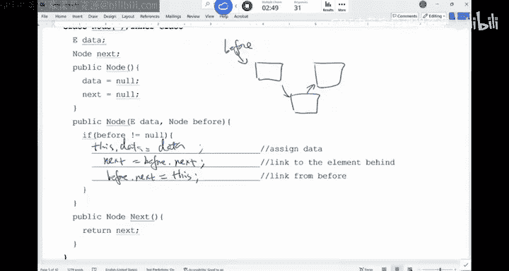

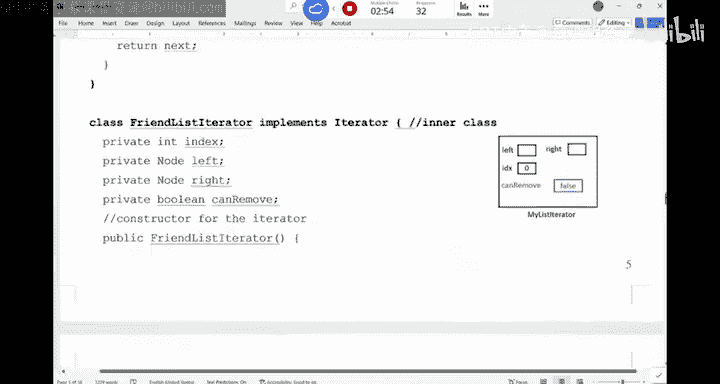

接下来，我们实现判断是否有下一个元素的 `hasNext()` 方法和获取下一个元素的 `next()` 方法。


```java
    // 判断是否还有下一个元素
    public boolean hasNext() {
        // 如果当前索引小于链表大小，则存在下一个元素
        return index < size;
    }

    // 返回下一个元素，并移动迭代器
    public String next() {
        String result = null;
        if (size == 0) {
            return null; // 链表为空，返回null
        }
        // 这是一个定制化的next方法：只返回以字母‘A’开头的字符串
        if (right.data().startsWith("A")) {
            result = right.data();
        } else {
            result = null;
        }

        // 移动迭代器的四步操作：
        if (right.next() != null) {
            left = left.next();   // 1. left 移动到下一个节点
            right = right.next(); // 2. right 移动到下一个节点
            index++;              // 3. 索引增加
            canRemove = true;     // 4. 允许删除操作
            // 注意：实际还应设置 forward = true 以指示向前移动
        }
        return result;
    }
```

**方法要点**：
*   `hasNext()` 通过比较当前 `index` 和链表总 `size` 来判断。
*   这个示例中的 `next()` 方法被定制为只处理以‘A’开头的字符串，展示了迭代器行为的可定制性。
*   移动迭代器需要同步更新 `left`、`right`、`index` 和 `canRemove` 四个状态。

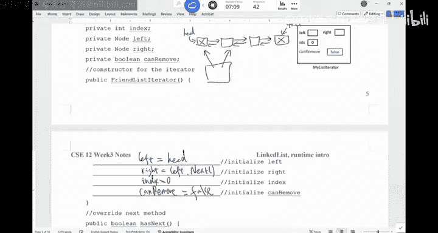

---


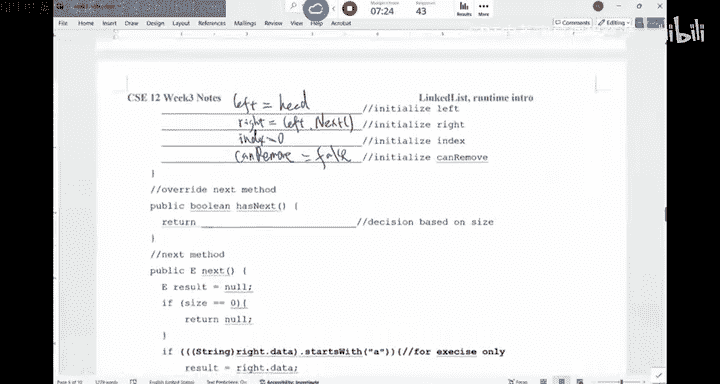

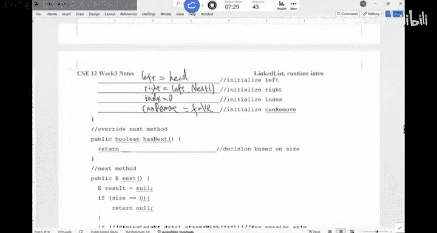


## 链表主类的实现 📝

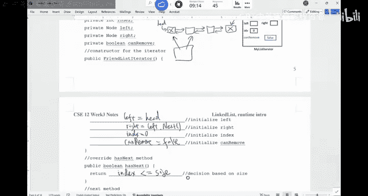

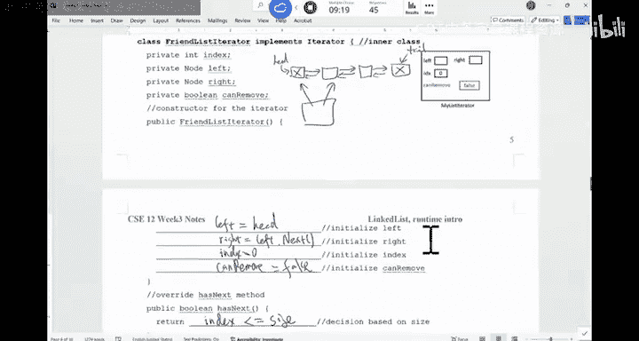

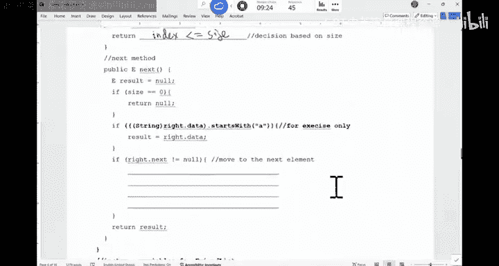

最后，我们整合节点和迭代器，完成链表主类 `FriendList` 的框架。

### 链表初始化

链表包含头节点、尾节点和大小信息。初始化时需要建立头尾哑元节点之间的连接。


```java
public class FriendList {
    private Node head;
    private Node tail;
    private int size;

    // 构造方法
    public FriendList() {
        head = new Node(null); // 创建头哑元节点
        tail = new Node(null); // 创建尾哑元节点
        // 连接头尾节点（对于双向链表）
        head.next = tail;
        tail.prev = head; // 假设Node类有prev字段
        size = 0;
    }
}
```

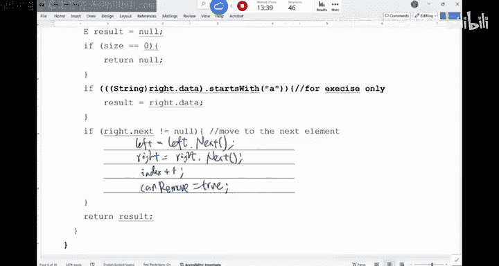


### 插入元素与获取迭代器


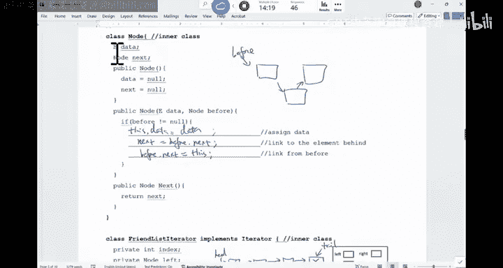

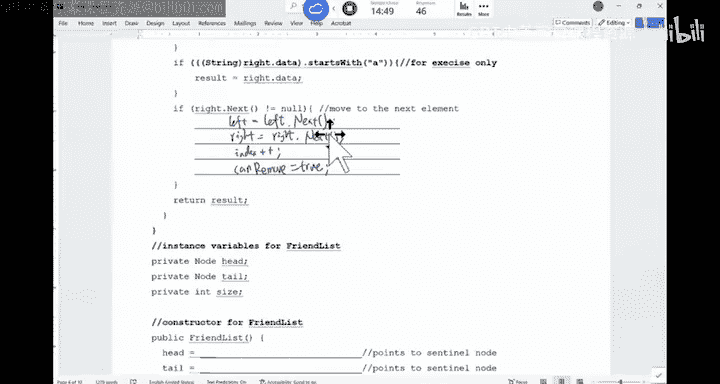

插入元素的方法与我们之前实现的 `add` 方法类似。此外，链表需要提供一个方法来获取迭代器实例。

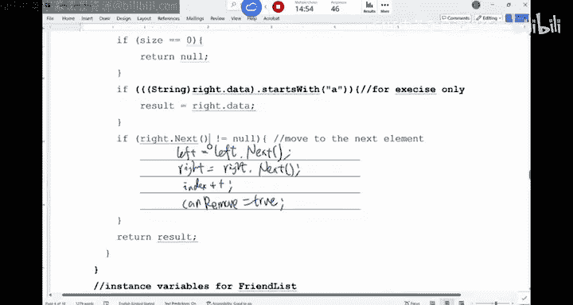

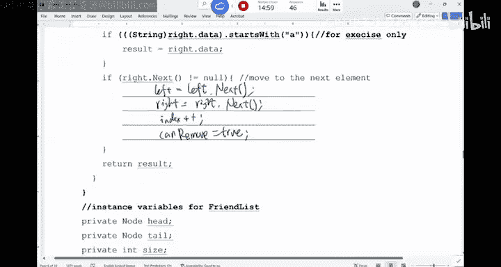

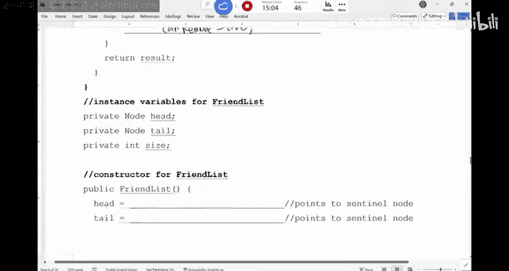

```java
    // 在链表末尾插入元素
    public void insert(String element) {
        if (element == null) return;
        Node current = head;
        // 遍历到最后一个实际节点之前（即tail的前一个）
        while (current.next != tail) {
            current = current.next;
        }
        // 使用Node的第二个构造方法，在current后插入新节点
        new Node(element, current);
        size++;
    }

    // 返回此链表的迭代器
    public Iterator<String> iterator() {
        return new FriendIterator(); // 创建并返回一个新的迭代器对象
    }
```

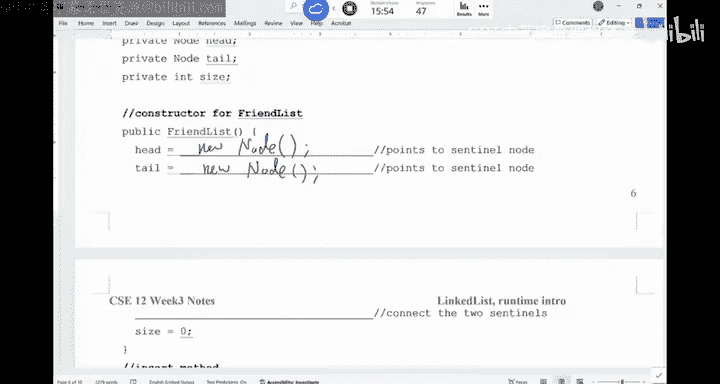


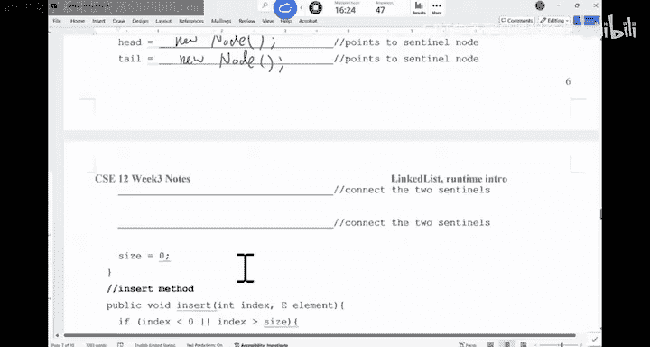

### 调试技巧：打印链表信息


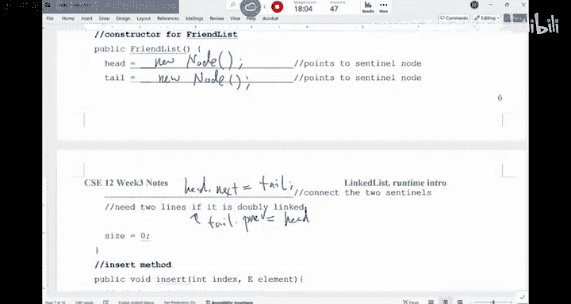

在实现数据结构时，一个能打印节点数据和引用地址的 `print` 方法对于调试至关重要。

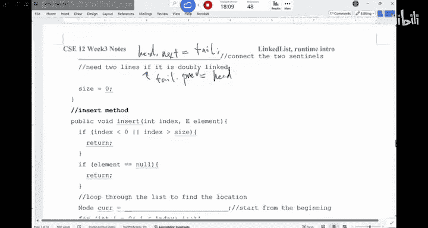


```java
    public void print() {
        Node current = head.next; // 跳过头哑元节点
        while (current != tail) { // 遇到尾哑元节点停止
            // 打印：当前节点数据 + “ -> ” + 当前节点next引用指向的地址
            System.out.println(current.data + " -> " + current.next);
            current = current.next;
        }
    }
```

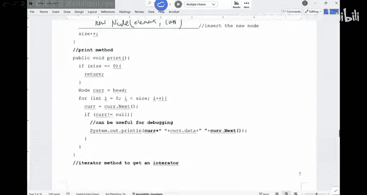

**调试提示**：打印出的引用地址（如 `@4e50df2e`）可以帮助你验证节点之间的连接是否正确。前一个节点的 `next` 输出地址应该等于下一个节点自身的地址。

---

## 使用迭代器遍历链表 🔄


链表和迭代器都实现后，我们可以这样使用它们：

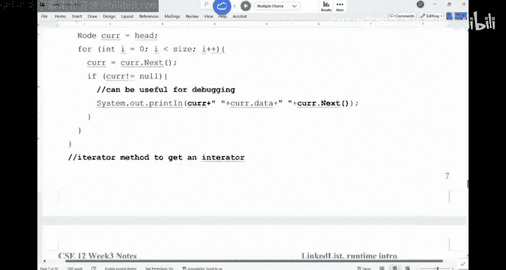

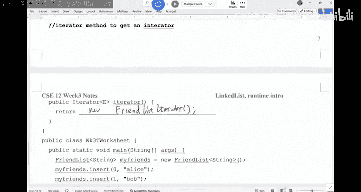

```java
    public static void main(String[] args) {
        FriendList myFriends = new FriendList();
        myFriends.insert("Bob");
        myFriends.insert("Abigail");
        myFriends.insert("Charlie");
        myFriends.insert("Alice");

        // 获取迭代器并遍历
        Iterator<String> itr = myFriends.iterator(); // 第一空：获取迭代器
        while (itr.hasNext()) {                     // 第二空：判断是否有下一个元素
            String name = itr.next();
            if (name != null) {
                System.out.println(name); // 只会打印出以‘A’开头的名字
            }
        }
    }
```


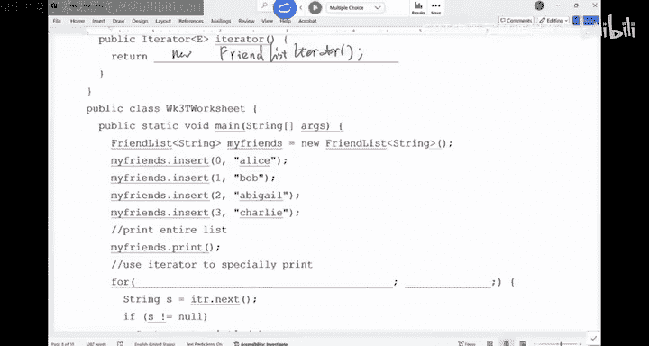

---

## 运行时分析简介 ⏱️


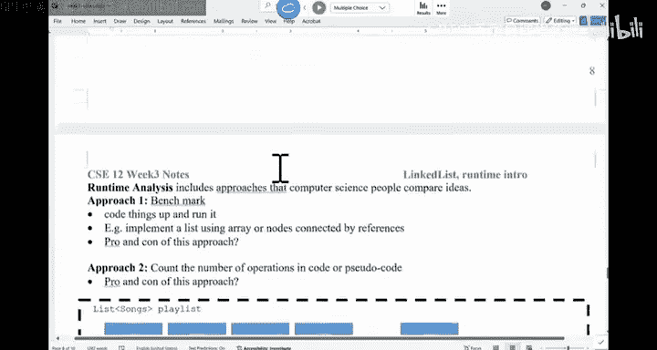

在实现了功能正确的数据结构后，我们必须考虑其效率。这就是运行时分析的意义。

衡量算法效率通常有两种方式：

1.  **基准测试**：编写代码，在特定机器和输入上实际运行并计时。
    *   **优点**：结果真实可靠，是工业界和科研中验证性能的最终手段。
    *   **挑战**：结果受编程语言、程序员水平、机器性能、输入数据等多种因素影响，需要严格控制变量。

2.  **理论分析**：我们将在课程中重点学习的方法。它不依赖于具体机器和实现，而是分析算法执行的基本操作数量（如比较、赋值）与输入规模 `n` 之间的关系，并用**大O符号**（如 `O(n)`， `O(n²)`）来描述其**渐进时间复杂度**。
    *   **优点**：抽象、通用，便于在实现前比较不同算法思想的优劣。
    *   **目标**：编写不仅正确，而且**高效**的代码。

虽然基准测试至关重要，但在CSD12中，我们将从理论分析入手，建立评估算法效率的思维框架。

---

本节课中，我们一起学习了如何为自定义链表实现迭代器，包括节点、迭代器和链表主类的完整构建流程。我们还初步了解了程序运行时分析的重要性，以及基准测试与理论分析的区别。掌握这些知识，是编写高效、专业代码的基础。