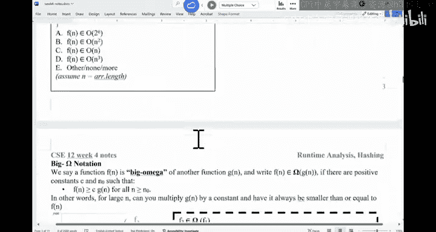

# 数据结构与面向对象设计：011：算法运行时间分析入门


在本节课中，我们将要学习算法运行时间分析的基础概念，包括基准测试与渐近分析的区别、如何计算最坏情况运行时间，以及如何使用大O符号来描述算法的时间复杂度。

## 基准测试与渐近分析

上一节我们介绍了算法效率的重要性。本节中我们来看看评估算法效率的两种主要方法。

第一种方法是**基准测试**。这意味着将不同想法的代码实现出来，然后比较它们的实际运行时间。基准测试的好处是结果真实可靠。然而，它的一个潜在问题是，如果某个程序员编码能力更强，即使他的算法思想稍差，也可能获得更快的基准测试结果。

第二种方法是**渐近分析**。这种方法通过数学分析来估算程序需要执行的操作数量，而无需实际编写代码。你只需审视算法思路或伪代码，然后进行计数。这种方法的问题在于它并非基于真实运行数据。当两种算法的渐近分析结果相似时，我们仍需借助基准测试来决断。

在CSE12课程中，我们主要关注渐近分析。但请记住，在实际的计算机科学研究或工作中，这两种方法通常都需要。

## 理解最坏情况分析

当我们分析算法时，需要考虑不同的输入场景。以一个包含20首歌曲的播放列表为例，我们想查找其中一首特定的歌曲。

以下是可能的情况：
*   **最佳情况**：第一首歌曲就是我们要找的。只需查看1次。
*   **最坏情况**：要查找的歌曲不存在于列表中，或者它是列表中的最后一首。需要查看全部20次。

在计算机科学中，我们通常关注**最坏情况**。因为我们不能依赖运气，最坏情况给出了程序运行时间的上界，这有助于我们进行可靠的规划和预算。

## 计算操作步骤

让我们通过一个具体的代码示例来学习如何计数。假设我们有一个包含 `n` 个元素的列表，我们使用一个简单的循环来查找某个目标值。

```java
boolean find(String[] list, String target) {
    for (int i = 0; i < list.length; i++) {
        if (list[i].equals(target)) {
            return true;
        }
    }
    return false;
}
```

在最坏情况下（目标不存在），我们来计数执行的操作：
1.  `int i = 0` 执行 **1** 次。
2.  `i < list.length` 比较执行 **n+1** 次（包括最后一次导致循环退出的比较）。
3.  `i++` 自增操作执行 **n** 次。
4.  `list[i].equals(target)` 方法调用执行 **n** 次（注意：字符串比较本身可能很耗时，但此处我们暂时忽略其内部细节）。
5.  `return false` 执行 **1** 次。

因此，总操作数大致为 **3n + 3**。这是一个关于输入大小 `n` 的**线性**函数。

## 大O符号：忽略常数因子

上一节我们计算出了具体的操作数。本节中我们来看看如何用大O符号来简化描述。

观察以下两个查找函数：

```java
// 函数A
boolean find(String[] list, String target) {
    for (int i = 0; i < list.length; i++) {
        if (list[i].equals(target)) {
            return true;
        }
    }
    return false;
}

// 函数B
boolean mysteryFind(String[] list, String target) {
    int count = 0;
    for (int i = 0; i < list.length; i++) {
        count = count + 1; // 一个额外的操作
        if (list[i].equals(target)) {
            return true;
        }
    }
    return false;
}
```

函数A的操作数约为 `3n + 3`，函数B由于多了一个计数操作，可能约为 `4n + 4`。在基准测试中，函数A可能更快。然而，在进行渐近分析时，我们使用大O符号来**忽略常数因子和低阶项**。因此，两者都被归类为 **O(n)**，即线性时间复杂度。

大O符号的正式定义是：我们说函数 **f(n) = O(g(n))**，如果存在正常数 **c** 和 **n₀**，使得对于所有 **n ≥ n₀**，都有 **f(n) ≤ c · g(n)**。

这意味着当 `n` 足够大时，`g(n)` 乘以某个常数后，会成为 `f(n)` 的上界。我们只关心输入规模很大时的增长趋势。

## 如何确定时间复杂度

最后，我们来总结一下分析算法时间复杂度的步骤。

以下是基本流程：
1.  **计数**：分析代码，计算在最坏情况下作为输入大小 `n` 的函数的基本操作次数。
2.  **找出主导项**：简化计数结果，保留当 `n` 趋于无穷大时增长最快的项（主导项），并忽略其系数和常数。
3.  **用大O表示**：用大O符号描述这个主导项。例如，如果操作数是 `5n² + 3n + 10`，则时间复杂度为 **O(n²)**。

## 总结



本节课中我们一起学习了算法运行时间分析的核心概念。我们了解了基准测试与渐近分析的区别，明白了为什么需要关注最坏情况，并练习了通过计数操作步骤来估算运行时间。最重要的是，我们学习了大O符号的意义——它用于描述算法时间复杂度的**渐进上界**，并忽略常数因子和低阶项，使我们能够专注于算法随输入规模增长的根本效率。