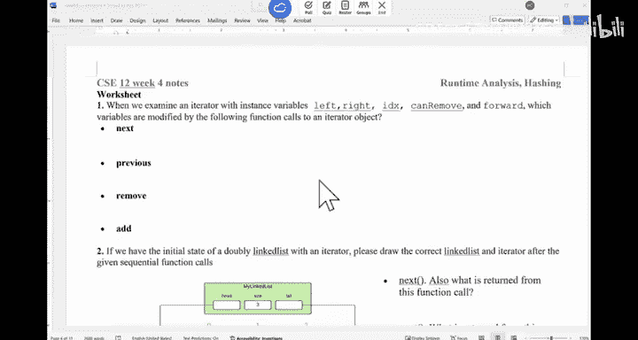

# 013：期中复习与迭代器深入

在本节课中，我们将复习期中考试的相关信息，并深入探讨迭代器的实现细节和运行时分析。课程内容将围绕期中考试准备、迭代器方法的行为分析以及不同数据结构上操作的运行时复杂度展开。

## 期中考试信息

下周我们将进行期中考试。考试将涵盖从第一天到今天的全部内容，包括异常、泛型、数组、链表、迭代器和运行时分析等主题。

考试形式将与以往有所不同，将包含相当数量的编程题。这些编程题将基于编程作业中的方法，但会进行轻微修改。因此，理解并能够独立编写代码至关重要。

## 迭代器方法分析

上一节我们介绍了期中考试，本节中我们来看看迭代器内部方法的具体行为。理解迭代器中各个实例变量（如 `left`、`right`、`index`、`canMove`、`forward`）在调用不同方法时的变化是关键。

以下是调用不同迭代器方法时，哪些变量会被修改的分析：

*   **`next()` 方法**：调用 `next()` 会返回当前 `right` 指针指向的元素。`left` 和 `right` 指针会向前移动一位，`index` 会增加1，`canMove` 和 `forward` 会被设置为 `true`。
*   **`previous()` 方法**：其行为与 `next()` 类似，但方向相反。`left` 和 `right` 指针会向后移动，`index` 会减少1，`canMove` 会被设置为 `true`，`forward` 会被设置为 `false`。
*   **`remove()` 方法**：此方法会移除最近一次 `next()` 或 `previous()` 调用返回的元素。具体修改 `left` 还是 `right` 指针取决于 `forward` 的值。`index` 可能根据删除节点的位置而改变。调用后，`canMove` 必须被重置为 `false`，以防止连续删除。
*   **`add(E e)` 方法**：此方法将新元素插入到隐式游标之前。`left` 或 `right` 指针之一会更新以指向新节点，`index` 会增加1。调用 `add` 后，`canMove` 必须被设置为 `false`。此外，链表的 `size` 也需要更新。

## 编程作业注意事项

在开始编程作业4之前，请确保你的编程作业3（链表实现）是完全正确的。编程作业4的迭代器测试将使用我们提供的链表实现，如果你的链表有错误，可能会影响迭代器的测试结果，但不会因此被扣分。然而，为了顺利实现迭代器，一个功能正确的链表是基础。

编程作业4主要关注细节，没有特别复杂的逻辑。仔细阅读作业说明，并注意在实现各个方法时正确更新相关的实例变量。

## 运行时复杂度分析

我们之前讨论了遍历链表时应避免使用 `get(i)` 方法，因为其时间复杂度是 O(n)，在循环中使用会导致 O(n²) 的总复杂度。使用迭代器进行遍历可以将复杂度优化到 O(n)。

现在，我们来分析在 `ArrayList` 上进行类似操作的时间复杂度。

*   **使用迭代器遍历 `ArrayList`**：时间复杂度为 **O(n)**。迭代器内部通常使用索引，每次移动是常数时间操作。
*   **使用 `get(i)` 循环遍历 `ArrayList`**：`ArrayList` 的 `get(i)` 是常数时间操作 **O(1)**。因此，整个循环的时间复杂度仍然是 **O(n)**。

关键在于，`ArrayList` 支持常数时间的随机访问，而链表不支持。

## 大O符号与数据结构操作复杂度

以下是关于算法复杂度大O符号和数据结构基本操作的一些判断题解析。我们默认讨论最坏情况下的时间复杂度。

1.  **若 f(n) 是 O(n)，则 f(n) 也是 O(n²)**：**正确**。大O符号表示上界，一个属于 O(n) 的函数必然也属于更宽松的上界 O(n²)。
2.  **若 f(n) 是 O(n)，g(n) 是 O(n²)，则 f(n) 优于 g(n)**：**错误**。如果不假设紧确界，我们无法比较。例如，f(n)=3n+5 是 O(n)，g(n)=100 是 O(n²)，但显然对于较小的n，g(n) 更小。
3.  **大O符号关心输入规模n很大时的行为**：**正确**。
4.  **在数组中插入一个元素的时间复杂度是 O(n)**：**正确**。最坏情况（在数组开头插入）需要移动其后所有元素。
5.  **在数组中搜索一个元素的时间复杂度是 O(n²)**：**错误**。顺序搜索的最坏情况是 O(n)。
6.  **在数组中删除一个元素的时间复杂度是 O(1)**：**错误**。类似插入，最坏情况（删除开头元素）需要移动元素，是 O(n)。
7.  **在链表中插入一个元素的时间复杂度是 O(1)**：**错误**。找到插入位置可能需要遍历链表，最坏情况是 O(n)。（注：在已知节点后插入是 O(1)，但通常的 `add(index, element)` 操作需要先找到位置）。

## 代码段运行时分析

最后，我们分析几个代码段的时间复杂度。

1.  **嵌套循环 (i从0到n，j从0到i)**：时间复杂度为 **O(n²)**。内层循环次数总和约为 n*(n+1)/2。
2.  **顺序执行一个O(n)循环和一个O(n²)循环**：时间复杂度为 **O(n²)**。总复杂度由其中最大的部分决定，即 **O(max(f(n), g(n)))**。
3.  **外层循环 `i=n; i>0; i/=2`，内层循环 `j=0; j<i; j++`**：时间复杂度为 **O(n)**。内层循环运行次数为 n + n/2 + n/4 + ... < 2n。

本节课中我们一起学习了期中考试的格式和重点，深入剖析了链表迭代器各方法的实现细节，比较了链表和数组列表在不同遍历方式下的性能差异，并复习了大O符号的含义以及常见数据结构操作的时间复杂度。理解这些概念对于准备考试和完成后续编程作业都至关重要。