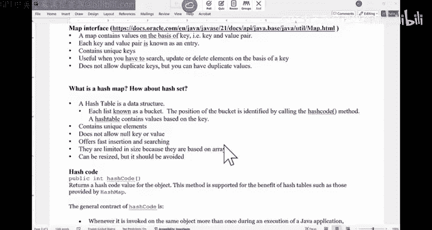
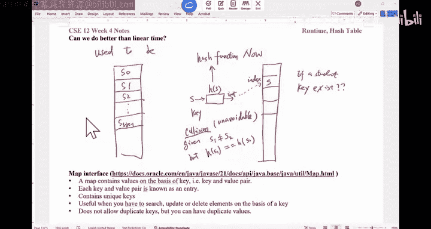
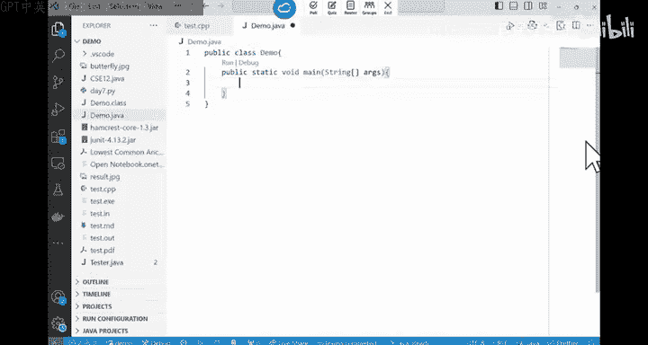
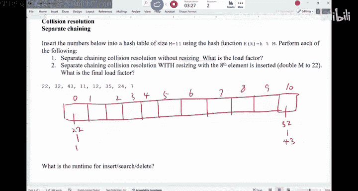
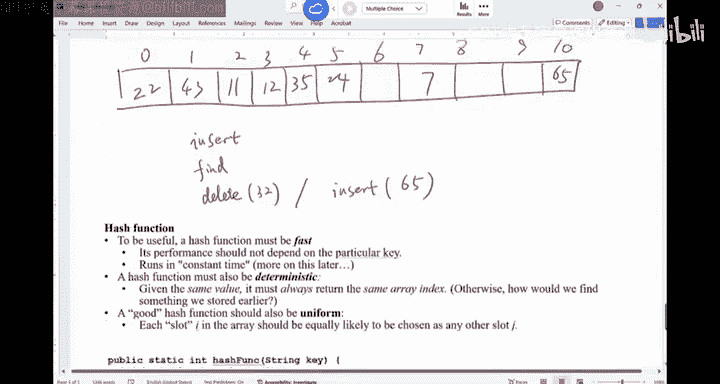

# 数据结构与面向对象设计：015：哈希表基础

在本节课中，我们将要学习哈希表的基本概念，包括其核心思想、Java中的实现（`HashMap`与`HashSet`）、哈希码的规范，以及处理哈希冲突的两种主要策略：分离链接法和线性探测法。

## 哈希的核心思想



上一节我们回顾了期中考试的情况，本节中我们来看看哈希表的核心思想。哈希的目的是为了高效地存储和检索数据。




传统上，我们将数据顺序存储在数组或链表中，然后进行线性搜索。这种方法的问题是时间复杂度为线性（O(n)），速度较慢。


哈希的思想是：首先通过一个**哈希函数**将数据（通常是键）转换成一个整数索引。然后，将这个数据项存储在一个称为“哈希表”的数组的对应索引位置上。这样，在理想情况下，我们可以通过计算键的哈希值直接定位到数据，实现接近常数时间的操作。

**核心公式**：`index = hash(key) % tableSize`


然而，冲突是不可避免的。就像生日悖论一样，无论哈希函数设计得多好，只要数据量足够大，不同的键就有可能被映射到同一个索引上。



## Java中的哈希实现：Map与Set

理解了哈希的基本思想后，我们来看看它在Java中的具体实现。Java主要通过`Map`和`Set`接口及其实现（如`HashMap`和`HashSet`）来应用哈希思想。

*   **`Map`（映射）**：存储**键值对**。它基于键来组织值，每个键必须是唯一的。当你存储或查找一个值时，实际上是先对键进行哈希运算。
    *   示例：学生ID（键）映射到学生档案（值）。
*   **`Set`（集合）**：只存储**唯一的键**，没有与之关联的值。它同样使用哈希来快速判断一个元素是否存在于集合中。

两者的本质都是将键通过哈希函数转换为索引，并将键（对于`Map`，连同其值）存储在哈希表的对应位置。`Map`比`Set`多了一个关联的值。

以下是简单的代码示例：

```java
// HashMap 示例：映射学生姓名到GPA
HashMap<String, Double> studentGPAs = new HashMap<>();
studentGPAs.put("Paul", 3.0); // 插入键值对
Double paulsGPA = studentGPAs.get("Paul"); // 通过键“Paul”查找值

// HashSet 示例：存储唯一的学生姓名
HashSet<String> studentNames = new HashSet<>();
studentNames.add("Paul"); // 插入键
boolean hasPaul = studentNames.contains("Paul"); // 检查键是否存在
```

## 哈希码的规范


在Java中，`hashCode()`方法负责将对象转换为一个`int`类型的哈希码。每个Java对象都有此方法。为了正确地在哈希集合或映射中使用自定义类，通常需要重写`equals`、`toString`和`hashCode`方法。

`hashCode()`方法必须遵守以下规范：
1.  **一致性**：在程序的一次执行中，对同一个对象多次调用`hashCode()`必须返回相同的整数。
2.  **相等性**：如果两个对象根据`equals(Object)`方法是相等的，那么调用它们各自的`hashCode()`方法必须产生相同的整数结果。
    *   公式：`if (o1.equals(o2))` 则必须保证 `o1.hashCode() == o2.hashCode()`
3.  **不保证不等性**：如果两个对象根据`equals(Object)`方法不相等，并不要求它们的`hashCode()`值一定不同。这暗示了哈希冲突是允许的。

一个简单的为重写`hashCode()`的策略是：先重写`toString()`方法，将对象所有重要字段拼接成一个字符串，然后返回这个字符串的哈希码。

```java
@Override
public int hashCode() {
    return this.toString().hashCode();
}
```


**重要提示**：`hashCode()`返回的整数值范围很大，不能直接用作哈希表的索引，否则会导致数组越界。必须对哈希表大小取模：`index = hashCode(key) % tableSize`。

## 处理冲突：分离链接法

由于冲突不可避免，我们需要策略来处理它。第一种常见策略是**分离链接法**。

在这种方法中，哈希表的每个位置（称为“桶”）不再直接存储一个元素，而是存储一个链表的头节点。当发生冲突时（即多个键被哈希到同一个索引），新的元素被添加到该索引对应的链表中。



以下是插入元素的步骤：
1.  计算键的哈希值并取模得到索引。
2.  找到该索引对应的链表。
3.  **遍历整个链表**，检查是否已存在相同的键（避免重复）。
4.  将新的键值对插入到链表末尾。

查找和删除操作类似：先定位到索引对应的链表，然后在链表中进行线性查找或删除。

**性能分析**：
*   **最坏情况**：所有元素都哈希到同一个桶中，整个哈希表退化为一个链表，操作时间复杂度为O(n)。
*   **平均情况**：假设元素均匀分布，每个链表的平均长度为 **α = n / m**，其中n是元素数量，m是哈希表大小（桶的数量）。这个α称为**负载因子**。平均操作时间复杂度为O(1 + α)。为了保持高效，通常需要保持负载因子较低（例如小于0.75）。

## 处理冲突：线性探测法

第二种常见的冲突解决策略是**线性探测法**，它是一种开放寻址法。

在这种方法中，所有元素都直接存储在哈希表数组本身。当插入一个新元素发生冲突时，算法会从冲突发生的索引开始，按顺序（通常是依次检查下一个位置）遍历数组，直到找到一个空槽位，并将元素插入其中。


查找操作：从哈希计算出的索引开始查找，如果该位置不是要查找的键，则继续顺序查找，直到找到该键或遇到一个空槽位（说明键不存在）。


删除操作：删除较为复杂。不能简单地将槽位置空，因为这会切断后续查找的“探测路径”。通常的做法是标记该位置为“已删除”（例如使用一个特殊的墓碑对象）。在后续的插入操作中，这个标记位置可以被复用。

**性能与考虑**：线性探测法利用CPU缓存局部性好的特点，在实践中往往表现优异。但它对负载因子更敏感，当表较满时容易产生“聚集”现象，导致性能下降。同样需要监控负载因子并在必要时扩容（重哈希）。

## 字符串哈希函数示例

最后，我们简要看一下如何为字符串设计一个哈希函数。一个常见的方法是将其视为一个多进制数。

例如，字符串“Paul Cao”：
1.  将每个字符转换为其ASCII值。
2.  选择一个基数（如27，代表26个字母加一个空格）。
3.  从字符串的末尾（或开头）开始，为每个字符位置赋予一个权重，即基数的幂次。
4.  计算加权和：`hash = char0 * base^0 + char1 * base^1 + char2 * base^2 + ...`

为了避免直接计算大幂次，可以使用霍纳法则进行递归计算，提高效率。Java标准库中`String`类的`hashCode()`方法就采用了类似的思路。





---


本节课中我们一起学习了哈希表的基础知识。我们了解了哈希通过将键映射到索引来实现快速访问的核心思想，认识了Java中的`HashMap`和`HashSet`。我们明确了`hashCode()`方法的规范，并深入探讨了解决哈希冲突的两种基本方法：分离链接法和线性探测法，包括它们的原理、操作步骤以及性能特点。理解这些内容是完成后续相关编程作业的基础。