# 016：栈与队列 🧱

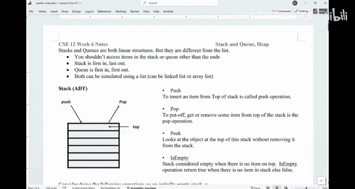

在本节课中，我们将要学习两种新的线性数据结构：栈和队列。我们将了解它们的基本概念、操作、在Java中的实现方式，并通过两个经典应用场景来深入理解它们的工作原理和区别。

---

## 栈与队列的基本概念

上一节我们介绍了哈希表这种高效的数据结构。本节中，我们来看看两种新的线性结构：栈和队列。

栈和队列都是线性数据结构，但它们与数组和链表有一个关键区别：数据只能从边界访问。

### 栈：后进先出 (LIFO)

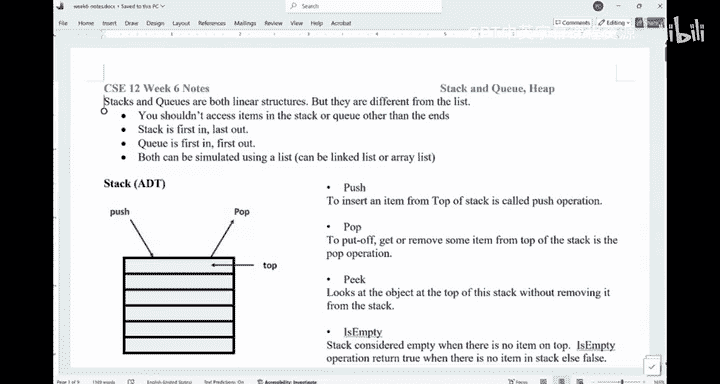


栈可以想象成一叠盘子。你只能从最顶部放入新盘子或拿走最顶部的盘子。在栈中，你只能访问最顶部的元素。


以下是栈的核心操作：
*   **push(item)**: 将元素 `item` 压入栈顶。
*   **pop()**: 移除并返回栈顶的元素。
*   **peek()**: 查看栈顶的元素但不移除它。
*   **isEmpty()**: 检查栈是否为空。
*   **size()**: 返回栈中元素的数量。

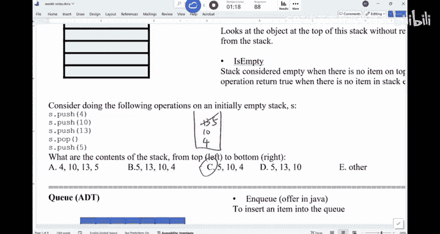

栈遵循 **后进先出** 的原则。第一个进入栈的元素将是最后一个出来的。

### 队列：先进先出 (FIFO)


队列就像在星巴克排队。新来的人排在队伍末尾，队伍最前面的人先得到服务并离开。在队列中，数据从一端（队尾）插入，从另一端（队首）移除。

以下是队列的核心操作：
*   **enqueue(item)** 或 **offer(item)**: 将元素 `item` 插入队尾。
*   **dequeue()** 或 **poll()**: 移除并返回队首的元素。
*   **peek()**: 查看队首的元素但不移除它。
*   **isEmpty()**: 检查队列是否为空。
*   **size()**: 返回队列中元素的数量。

队列遵循 **先进先出** 的原则。第一个进入队列的元素也将是第一个出来的。


---

## 在Java中使用栈和队列

理解了基本概念后，我们来看看如何在Java中实际使用它们。


在Java中，`Stack` 是一个类，可以直接使用。而 `Queue` 是一个接口，通常用 `LinkedList` 来实现，因为 `LinkedList` 实现了 `Queue` 接口的所有功能。

以下是使用示例：

```java
// 使用 LinkedList 实现一个队列
Queue<String> names = new LinkedList<>();
names.offer("CSE"); // 入队
names.offer("12");
names.offer("107");
System.out.println(names.peek()); // 查看队首，输出 "CSE"
names.poll(); // 出队，移除 "CSE"
System.out.println(names.poll()); // 再次出队，输出 "12"

// 使用 Stack 类
Stack<Integer> stack = new Stack<>();
stack.push(11);
stack.push(22);
System.out.println(stack.peek()); // 查看栈顶，输出 22
stack.pop(); // 出栈，移除 22
System.out.println(stack.pop()); // 再次出栈，输出 11
```

---

## 栈的应用：括号匹配

栈和队列的用途可能看起来有些特定。下面我们通过两个应用来理解为什么需要它们。第一个应用是使用栈来检查括号是否匹配。

问题是：给定一个只包含圆括号 `()` 和方括号 `[]` 的字符串，判断它们是否正确地匹配闭合。

解决这个问题的关键在于：当我们遇到一个右括号（如 `)` 或 `]`）时，我们需要检查**最近遇到的、尚未匹配的左括号**是否与之对应。我们并不关心更早的左括号，它们会在后面被匹配。

因此，我们需要保存遇到的左括号，并且在需要检查时，总是使用**最近保存**的那一个。这正好符合栈的 **后进先出** 特性。

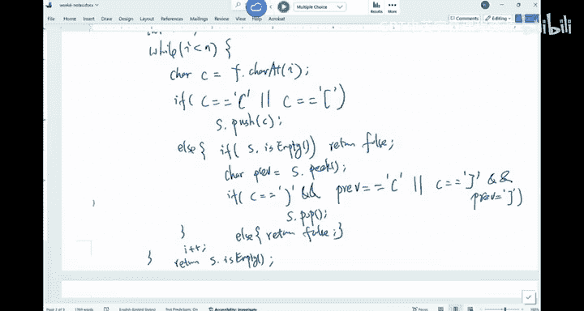

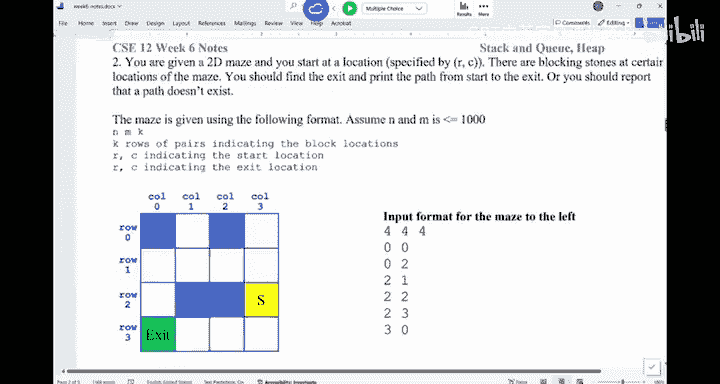

以下是解决思路：
1.  创建一个空栈。
2.  遍历字符串中的每个字符。
3.  如果字符是左括号（`(` 或 `[`），将其压入栈中。
4.  如果字符是右括号（`)` 或 `]`）：
    *   如果栈为空，说明没有左括号与之匹配，返回 `false`。
    *   查看栈顶的左括号。
    *   如果栈顶的左括号与当前的右括号匹配（即 `(` 配 `)`，`[` 配 `]`），则将栈顶元素弹出。
    *   如果不匹配，直接返回 `false`。
5.  遍历结束后，如果栈为空，说明所有括号都正确匹配，返回 `true`；否则返回 `false`。

代码实现如下：

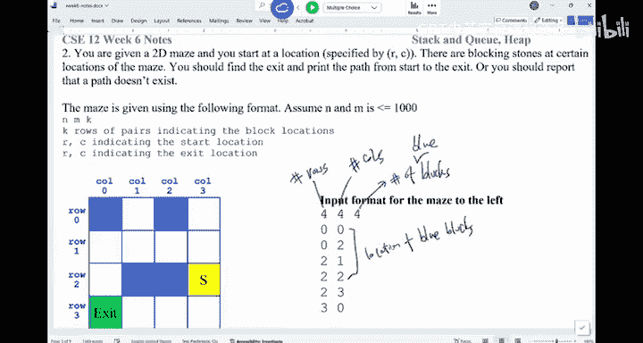

```java
public boolean isBalanced(String s) {
    Stack<Character> stack = new Stack<>();
    for (int i = 0; i < s.length(); i++) {
        char c = s.charAt(i);
        if (c == '(' || c == '[') {
            stack.push(c); // 遇到左括号，入栈
        } else { // 遇到右括号
            if (stack.isEmpty()) {
                return false; // 栈为空，无法匹配
            }
            char top = stack.peek(); // 查看栈顶的左括号
            if ((c == ')' && top == '(') || (c == ']' && top == '[')) {
                stack.pop(); // 匹配成功，弹出栈顶
            } else {
                return false; // 匹配失败
            }
        }
    }
    return stack.isEmpty(); // 最终栈必须为空才算完全匹配
}
```


---

## 栈与队列在迷宫遍历中的应用


第二个应用是在迷宫路径搜索中。这能帮助我们理解栈和队列在算法策略上的根本区别。


假设有一个网格迷宫，有起点、终点和障碍物。我们需要找到从起点到终点的路径，或者判断是否无法到达。

有两种经典的搜索策略：

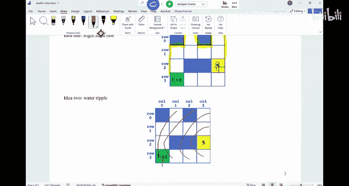

1.  **深度优先搜索**：选择一条路走到底，直到碰壁，然后回溯到上一个岔路口尝试另一条路。这就像在玉米迷宫里一直用右手摸着墙走。
2.  **广度优先搜索**：从起点开始，一层一层地向外探索所有可能的位置。先探索所有距离起点为1步的点，再探索距离为2步的点，以此类推。这就像在水中投入石子，涟漪一圈圈扩散出去。

这两种策略都需要保存“待探索的位置”。区别在于**从保存的位置集合中取出下一个探索位置的顺序**。


*   在**深度优先搜索**中，我们总是探索**最新发现**的路径的尽头。当走到死胡同时，我们回溯到**最近的一个岔路口**。这要求我们最后保存的位置最先被取出检查，这正是 **栈** 的行为。
*   在**广度优先搜索**中，我们按发现顺序逐一探索。先发现的点（离起点近的）先被探索，后发现的点后被探索。这要求我们最先保存的位置最先被取出，这正是 **队列** 的行为。

因此：
*   **深度优先搜索 通常使用 栈 来实现。**
*   **广度优先搜索 通常使用 队列 来实现。**

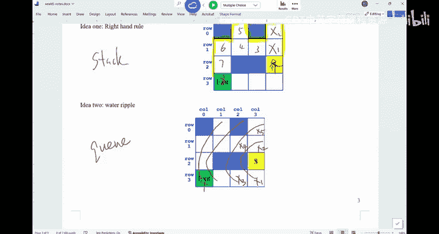

这两种算法（DFS和BFS）是图论和许多其他算法的基础，理解它们底层依赖于栈或队列至关重要。

---

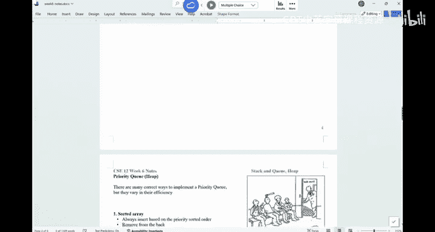

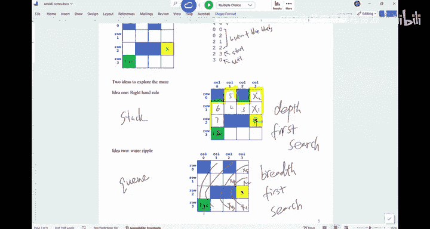

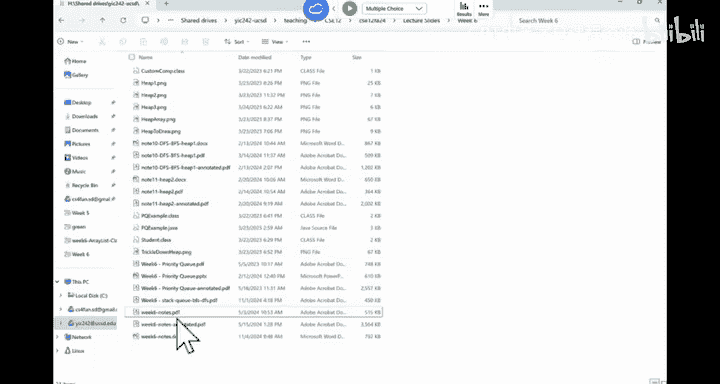

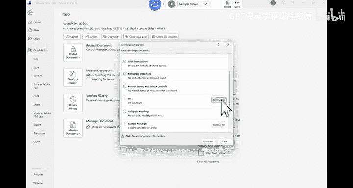


本节课中我们一起学习了栈和队列这两种重要的线性数据结构。我们明确了栈是LIFO（后进先出），队列是FIFO（先进先出），并通过括号匹配和迷宫搜索的例子，深入理解了它们各自的应用场景和背后的逻辑：**栈用于需要优先处理最近数据的场景，而队列用于需要按到达顺序处理的场景**。掌握这些概念将为学习更复杂的算法打下坚实基础。