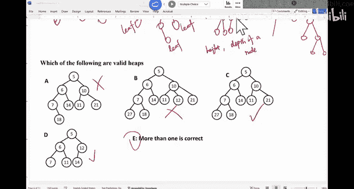

# 数据结构与面向对象设计：018：优先队列与堆基础 🎯

在本节课中，我们将要学习一种新的数据结构——优先队列，并深入探讨其最高效的实现方式：堆。我们将了解堆的定义、特性，以及它为何能高效地支持优先队列的操作。

---

## 优先队列的概念

上一节我们介绍了栈和队列。本节中我们来看看优先队列。

优先队列是一种抽象数据类型，其行为类似于常规队列，但元素的出队顺序不是由入队时间决定，而是由元素的“优先级”决定。优先级最高的元素总是最先出队。

一个现实世界的例子是医院急诊室。病人的就诊顺序并非基于到达时间，而是基于病情的严重程度。病情更严重的病人拥有更高的优先级，会优先得到处理。在计算机系统中，操作系统调度进程时也使用类似的机制，为不同进程分配优先级。

然而，优先队列的设计需要注意“饥饿”问题。如果一个低优先级的任务不断被新到来的高优先级任务插队，它可能永远得不到处理。

## 实现优先队列的几种思路

为了理解堆的优势，我们先探讨几种实现优先队列的简单方法及其时间复杂度。

以下是三种可能的实现方式及其入队和出队操作的最坏情况时间复杂度分析：

1.  **使用有序数组**
    *   **入队**：为了保持数组有序，需要找到正确的插入位置（可优化至 O(log n)），但插入元素后可能需要移动后续所有元素，因此最坏情况为 **O(n)**。
    *   **出队**：优先级最高的元素在数组末尾，直接移除即可，时间复杂度为 **O(1)**。

2.  **使用无序链表**
    *   **入队**：在链表头部或尾部插入新节点，时间复杂度为 **O(1)**。
    *   **出队**：需要遍历整个链表以找到优先级最高的元素，然后将其移除，时间复杂度为 **O(n)**。

3.  **使用有序链表**
    *   **入队**：需要遍历链表找到正确的插入位置，时间复杂度为 **O(n)**。
    *   **出队**：优先级最高的元素在链表头部，直接移除即可，时间复杂度为 **O(1)**。

可以看到，上述方法都无法同时让入队和出队操作都保持高效。我们的目标是找到一种数据结构，能让这两个操作都达到接近常数时间的效率。

## 堆的引入

堆就是为了解决上述问题而设计的数据结构。对于堆实现的优先队列：
*   **入队** 时间复杂度为 **O(log n)**。
*   **出队** 时间复杂度为 **O(log n)**。

虽然是对数时间复杂度，但它的增长极其缓慢。例如，处理10亿个数据仅需约30次操作，处理1万亿个数据也仅需约40次操作，性能接近常数时间，远优于线性时间。

## 堆的定义与性质

堆是一种特殊的完全二叉树，并满足堆序性质。

### 树结构相关术语
首先，我们明确几个树结构的基本术语：
*   **树**：一个无环的连通图。
*   **根节点**：没有父节点的节点。
*   **叶节点**：没有子节点的节点。
*   **二叉树**：每个节点最多有两个子节点的树。
*   **节点的深度**：从根节点到该节点的边数。
*   **树的高度**：从根节点到最深叶节点的边数。

### 完全二叉树
堆在结构上必须是一棵**完全二叉树**。
完全二叉树是指除了最后一层外，其他所有层都被完全填满，并且最后一层的节点都尽可能靠左排列。这意味着树形结构是紧凑的，不会在左侧出现空缺。

### 堆序性质
堆在数据上必须满足**堆序性质**。
*   在**最小堆**中，每个节点的值都**小于或等于**其所有子节点的值。因此，根节点是整个树中的最小值。
*   在**最大堆**中，每个节点的值都**大于或等于**其所有子节点的值。因此，根节点是整个树中的最大值。

堆序性质是一种“局部有序”的性质，它只规定了父节点与子节点之间的大小关系，**并不要求**左子节点和右子节点之间有大小顺序。

### 堆的示例
根据堆的定义（完全二叉树 + 堆序性质），我们可以判断以下哪些结构是堆：
*   ❌ 结构A：不是完全二叉树（最后一层节点未从左至右连续填充）。
*   ❌ 结构B：不是二叉树（节点有三个子节点）。
*   ✅ 结构C：是完全二叉树，且满足最小堆性质。
*   ✅ 结构D：是完全二叉树，且满足最小堆性质。
*   ✅ 结构E：包含了C和D，两者都是有效的堆。

---

本节课中我们一起学习了优先队列的概念，分析了其简单实现方式的局限性，并引出了高效实现数据结构——堆。我们详细定义了堆作为一种完全二叉树所需满足的结构性（完全二叉树）和有序性（堆序性质）条件，为下一节课学习堆的具体操作打下了基础。