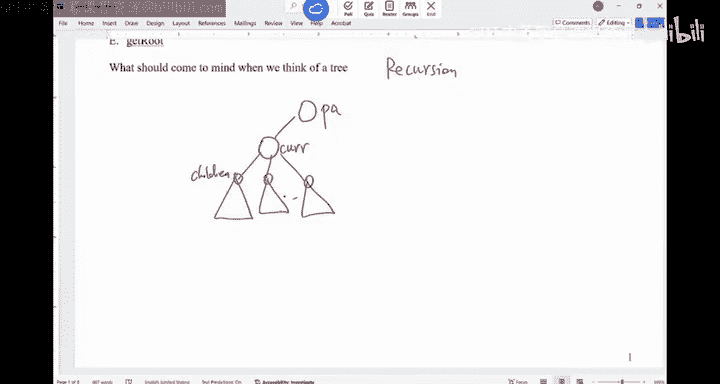
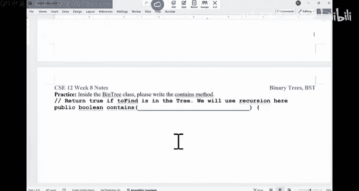
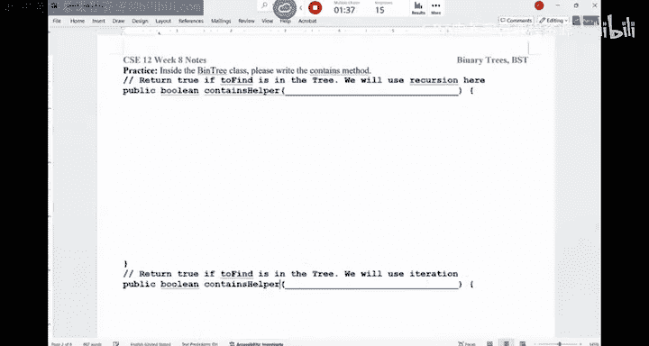
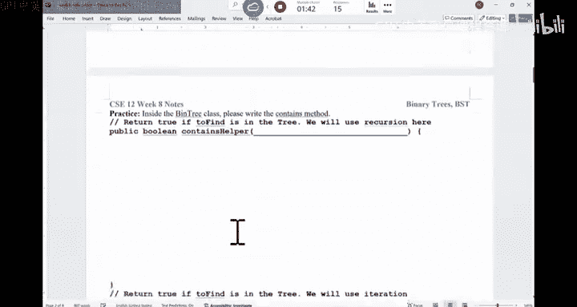
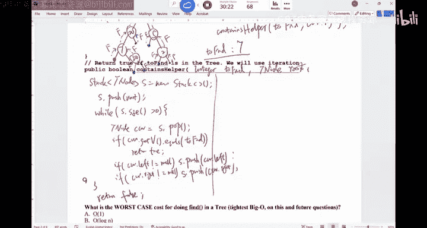
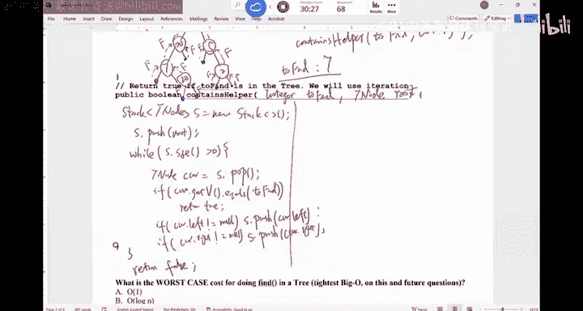
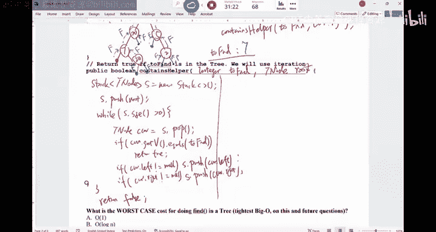
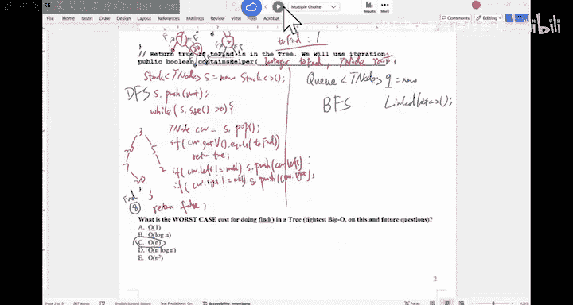
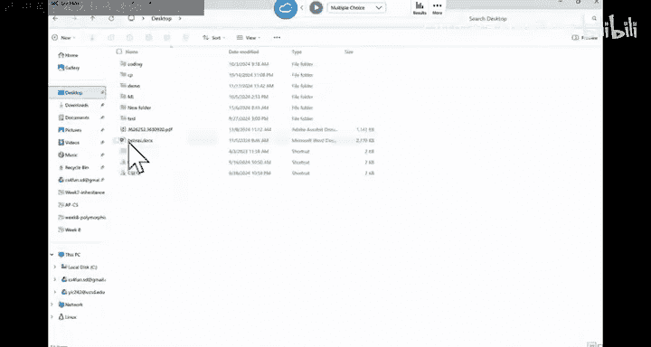
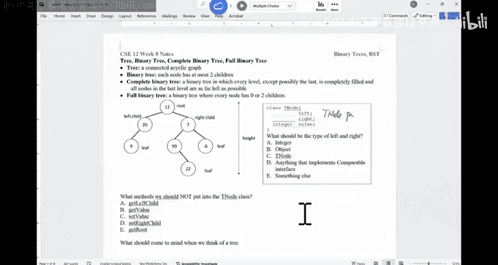

# 数据结构与面向对象设计：021：树结构基础与遍历算法 🌳

在本节课中，我们将学习树结构的基本概念，并重点探讨如何在树结构上使用递归和迭代两种方法实现搜索操作。我们将通过具体的代码示例，理解深度优先搜索（DFS）和广度优先搜索（BFS）在树中的应用。

## 树结构概述与递归思想

上一节我们介绍了树的基本结构。本节中，我们来看看处理树结构时一个至关重要的思想：**递归**。

处理任何树结构时，必须首先考虑递归。不使用递归，很难高效地解决树相关问题。虽然可以通过队列、栈等数据结构辅助，但递归会让解决方案简洁得多。

编写关于树的代码时，脑海中应浮现一个通用结构：你总是在为树中的某个特定节点编写代码。由于递归，同一段代码将应用于树中的每个节点。你为当前节点编写代码，这个节点可能有父节点，也可能有多个子节点。



设计当前节点的解决方案时，通常可以访问其子节点（例如，二叉树有左、右引用）。当前节点可能依赖其父节点或子节点的信息进行计算，然后汇总这些信息，进行一些运算，再将结果返回给父节点或递归传递给子节点。



## 递归实现树搜索





以下是递归实现树搜索的步骤：

1.  检查当前节点是否为空，若为空则返回 `false`。
2.  检查当前节点的值是否等于目标值，若相等则返回 `true`。
3.  若不等，则递归地在左子树和右子树中搜索，使用逻辑或（`||`）操作符合并结果。

对应的递归辅助方法代码如下：

```java
private boolean containsHelper(int toFind, TNode current) {
    if (current == null) {
        return false;
    }
    if (current.getData().equals(toFind)) {
        return true;
    }
    return containsHelper(toFind, current.left) || containsHelper(toFind, current.right);
}
```

公共方法则调用此辅助方法，从根节点开始搜索：


```java
public boolean contains(int toFind) {
    return containsHelper(toFind, root);
}
```

以一棵树 `(3 (20 (7 (null 20)) 5) (5 (2)))` 为例，搜索目标值 `8` 时，递归访问节点的顺序为：3, 20, 7, null, 20, null, null, 5, 2, null, null。搜索目标值 `7` 时，由于短路求值，访问顺序为：3, 20, 7，找到后立即返回。

## 迭代实现树搜索（栈 - DFS）

现在，我们来看看如何使用迭代方法实现相同的搜索功能。我们将使用栈来模拟递归过程，实现深度优先搜索。

以下是使用栈进行迭代搜索的步骤：

1.  创建一个栈，并将根节点压入栈中。
2.  当栈不为空时，循环执行：
    *   弹出栈顶节点作为当前节点。
    *   检查当前节点的值是否等于目标值，若相等则返回 `true`。
    *   若不等，则将其非空的左子节点和右子节点依次压入栈中。
3.  若循环结束仍未找到，则返回 `false`。

对应的迭代方法代码如下：

```java
public boolean containsIterativeDFS(int toFind) {
    if (root == null) return false;
    Stack<TNode> stack = new Stack<>();
    stack.push(root);
    while (!stack.isEmpty()) {
        TNode current = stack.pop();
        if (current.getData().equals(toFind)) {
            return true;
        }
        if (current.right != null) stack.push(current.right);
        if (current.left != null) stack.push(current.left);
    }
    return false;
}
```

在之前的树中搜索 `8`，使用栈（DFS）的访问顺序可能是：3, 5, 2, 20, 7, 20。访问顺序取决于子节点入栈的顺序。

## 迭代实现树搜索（队列 - BFS）


除了栈，我们还可以使用队列来实现迭代搜索，这将导致广度优先搜索（BFS）的遍历顺序。

以下是使用队列进行迭代搜索的步骤：


1.  创建一个队列，并将根节点加入队列。
2.  当队列不为空时，循环执行：
    *   从队列中取出队首节点作为当前节点。
    *   检查当前节点的值是否等于目标值，若相等则返回 `true`。
    *   若不等，则将其非空的左子节点和右子节点依次加入队列。
3.  若循环结束仍未找到，则返回 `false`。

对应的迭代方法代码如下：





```java
public boolean containsIterativeBFS(int toFind) {
    if (root == null) return false;
    Queue<TNode> queue = new LinkedList<>();
    queue.add(root);
    while (!queue.isEmpty()) {
        TNode current = queue.poll();
        if (current.getData().equals(toFind)) {
            return true;
        }
        if (current.left != null) queue.add(current.left);
        if (current.right != null) queue.add(current.right);
    }
    return false;
}
```



在之前的树中搜索 `8`，使用队列（BFS）的访问顺序是：3, 20, 5, 7, 2, 20。这是按层级进行遍历的。

## 算法对比与总结

本节课中我们一起学习了树结构的递归和迭代搜索方法。


*   **递归方法**：代码简洁，直观体现了树的结构，本质上是深度优先搜索（DFS）。
*   **迭代栈方法**：显式使用栈，避免了递归的函数调用开销，也是深度优先搜索（DFS）。
*   **迭代队列方法**：使用队列，实现了广度优先搜索（BFS），按层级遍历节点。

这三种方法在最坏情况下（目标不存在）都需要访问树中的所有 `N` 个节点，因此时间复杂度均为 **O(N)**。


最后，一个关键区别是：在图或迷宫的 DFS/BFS 中需要记录节点的访问状态（`visited`），以防止重复访问。但在树结构中，任意两节点间只有唯一路径，不存在环路，因此不需要 `visited` 标记。








理解这些基础的遍历方法是学习更复杂树结构（如二叉搜索树）操作的重要基石。