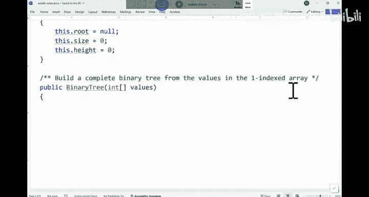

# 数据结构与面向对象设计：022：二叉树基础操作 🧮


在本节课中，我们将学习二叉树的基本概念，并通过实践练习来掌握如何构建二叉树、按层遍历以及计算树的高度。这些操作是理解更复杂数据结构（如二叉搜索树）的基础。

---

## 构建完全二叉树 🌲

上一节我们介绍了二叉树节点的基本结构。本节中，我们来看看如何根据一个给定的数组来构建一个**完全二叉树**。

给定一个非空的整型数组，我们需要构建一个完全二叉树来存储这些值。例如，对于数组 `[3, 2, 20, 30, 1, 0]`，我们希望构建的树结构如下：

```
        3
       / \
      2   20
     / \  /
    30 1 0
```

以下是构建完全二叉树的步骤：

1.  创建一个根节点，其值为数组的第一个元素（假设数组为1-索引）。
2.  使用一个队列来辅助进行广度优先构建。
3.  将根节点加入队列。
4.  当队列不为空时，执行以下循环：
    *   从队列中取出一个节点 `current`。
    *   计算该节点在数组中可能存在的左孩子索引 `2*i` 和右孩子索引 `2*i+1`。
    *   如果左孩子索引在数组范围内，则为 `current` 创建左孩子节点，并将其加入队列。
    *   如果右孩子索引在数组范围内，则为 `current` 创建右孩子节点，并将其加入队列。
5.  循环结束后，树即构建完成。

核心逻辑的伪代码如下：
```java
Queue<TreeNode> queue = new LinkedList<>();
queue.offer(root);
int i = 1; // 假设数组为1-索引
while (!queue.isEmpty()) {
    TreeNode current = queue.poll();
    if (2*i < values.length) {
        current.left = new TreeNode(values[2*i]);
        queue.offer(current.left);
    }
    if (2*i + 1 < values.length) {
        current.right = new TreeNode(values[2*i + 1]);
        queue.offer(current.right);
    }
    i++;
}
```

---

## 二叉树的层序遍历 📊

构建好树之后，我们常常需要遍历它。本节我们学习如何按层（广度优先）打印二叉树的所有节点值。

按层遍历与构建树的思路非常相似，同样需要使用队列。以下是具体步骤：

1.  如果根节点为空，则直接返回。
2.  创建一个队列，并将根节点加入队列。
3.  当队列不为空时，执行以下循环：
    *   从队列中取出一个节点 `current`。
    *   打印 `current` 节点的值。
    *   如果 `current` 有左孩子，则将左孩子加入队列。
    *   如果 `current` 有右孩子，则将右孩子加入队列。

核心逻辑的伪代码如下：
```java
if (root == null) return;
Queue<TreeNode> queue = new LinkedList<>();
queue.offer(root);
while (!queue.isEmpty()) {
    TreeNode current = queue.poll();
    System.out.print(current.value + " ");
    if (current.left != null) queue.offer(current.left);
    if (current.right != null) queue.offer(current.right);
}
```

如果将上述代码中的队列（Queue）替换为栈（Stack），则遍历顺序将变为深度优先。

---

## 计算二叉树的高度 📏

了解了遍历，我们来看一个经典的递归问题：计算二叉树的高度（或深度）。树的高度定义为从根节点到最远叶子节点的路径上的边数（或节点数，定义需统一）。

递归是解决此问题最简洁的方法。思路如下：

1.  基准情况：如果当前节点 `current` 为空，则返回 `-1`（表示空树高度为-1）或 `0`（取决于定义）。
2.  递归计算左子树的高度 `leftHeight`。
3.  递归计算右子树的高度 `rightHeight`。
4.  当前节点的高度为 `max(leftHeight, rightHeight) + 1`。

核心逻辑的伪代码如下：
```java
public int getHeight(TreeNode current) {
    if (current == null) {
        return -1; // 或 return 0;
    }
    int leftHeight = getHeight(current.left);
    int rightHeight = getHeight(current.right);
    return Math.max(leftHeight, rightHeight) + 1;
}
```

这个递归过程体现了“分而治之”的思想：每个节点只负责询问其左右子树的高度，然后结合自身（+1）将结果向上汇报。

---

## 递归思想的强化：计算子树规模 👥

最后，我们通过一个类似的问题来强化递归思维：计算以某个节点为根的子树中包含的节点总数（即该节点“管理”的人数）。

思路与计算高度类似：

1.  基准情况：如果当前节点为空，返回 `0`。
2.  递归计算左子树的节点数 `leftSize`。
3.  递归计算右子树的节点数 `rightSize`。
4.  当前子树的节点总数为 `leftSize + rightSize + 1`（`+1` 代表当前节点自身）。

核心逻辑的伪代码如下：
```java
public int getSize(TreeNode current) {
    if (current == null) {
        return 0;
    }
    int leftSize = getSize(current.left);
    int rightSize = getSize(current.right);
    return leftSize + rightSize + 1;
}
```

无论是计算高度、规模还是其他属性，递归在树结构中的应用模式都是：**向下递归到叶子节点，然后自底向上地组合信息并返回**。

---



本节课中我们一起学习了二叉树的基本操作：如何从数组构建完全二叉树、如何进行层序遍历、如何递归地计算树的高度和子树规模。掌握这些基础是后续学习二叉搜索树等更高级结构的关键。下节课我们将进入二叉搜索树的学习。