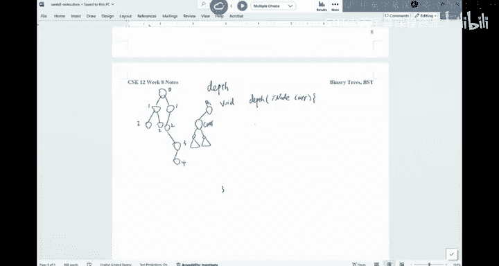

# 数据结构与面向对象设计：023：二叉树与二叉搜索树


在本节课中，我们将完成对二叉树的讨论，并开始学习一种特殊的二叉树——二叉搜索树。我们将学习如何遍历二叉树、计算其属性，并探索二叉搜索树的基本操作，如查找和插入。

---

## 二叉树回顾与属性计算

上一节我们介绍了二叉树的基本结构和遍历。本节中，我们来看看如何计算二叉树的一些属性，例如每个节点的“下属”数量或深度。

### 计算节点的下属数量

以下是计算一个节点及其所有后代节点总数的方法。我们假设每个节点有一个 `left`、`right`、`value` 和一个 `count` 变量来存储这个数量。

```java
int subordinates(TreeNode current) {
    if (current == null) {
        return -1; // 空节点代表-1个下属
    }
    int leftCount = subordinates(current.left);
    int rightCount = subordinates(current.right);
    current.count = leftCount + rightCount + 2; // 加上两个直接子节点
    return current.count;
}
```

**核心思想**：每个节点的下属总数等于其左子树下属数 + 右子树下属数 + 2（其直接子节点）。叶节点的下属数为0。

### 计算节点的深度

节点的深度是指该节点到根节点的距离。我们可以通过递归，利用父节点的深度信息来计算。

```java
void updateDepth(TreeNode current) {
    if (current == null) {
        return; // 到达叶节点的子节点，返回
    }
    if (current.parent == null) { // 当前节点是根节点
        current.depth = 0;
    } else {
        current.depth = current.parent.depth + 1;
    }
    // 递归更新左右子节点
    updateDepth(current.left);
    updateDepth(current.right);
}
```

**核心思想**：当前节点的深度等于其父节点的深度加1。根节点的深度为0。

---

## 二叉搜索树简介

现在，我们聚焦于一种特殊的二叉树——二叉搜索树。并非所有二叉树都是二叉搜索树。二叉搜索树具有一个关键属性：对于树中的任意节点，其左子树中的所有键值都小于或等于该节点的键值，其右子树中的所有键值都大于或等于该节点的键值。

**公式**：对于节点 `x`，满足 `left_subtree_keys ≤ x.key ≤ right_subtree_keys`。

这与堆不同。堆（如最小堆）要求父节点小于子节点，但没有左右子树之间的排序要求。二叉搜索树是Java中 `TreeSet` 和 `TreeMap` 等集合类的基础数据结构。

### 识别二叉搜索树

以下哪个是二叉搜索树？
*   **A**：一个向右倾斜的链表（如 1 -> 2 -> 3）。**是BST**，因为它满足左小右大的性质。
*   **B**：一个平衡的树，根为42，左子为10，右子为55。**是BST**。
*   **C**：一个违反性质的树（例如，左子树包含大于根节点的值）。**不是BST**。
*   **D**：一个看似平衡但右子树的左节点（如50）小于根节点（42）的树。**不是BST**，因为必须检查整个子树。

一个常见的面试问题是：给定一棵二叉树，验证它是否是二叉搜索树。

---

## 二叉搜索树的操作

### 查找操作

在普通二叉树中，查找需要遍历左右子树。在二叉搜索树中，我们可以利用其有序性进行优化。

```java
boolean containsHelper(TreeNode current, Key key) {
    if (current == null) {
        return false; // 未找到
    }
    int cmp = key.compareTo(current.data);
    if (cmp == 0) {
        return true; // 找到
    } else if (cmp < 0) {
        // 目标值小于当前节点值，只在左子树中查找
        return containsHelper(current.left, key);
    } else {
        // 目标值大于当前节点值，只在右子树中查找
        return containsHelper(current.right, key);
    }
}
```

**时间复杂度分析**：在平衡的二叉搜索树中，查找的时间复杂度为 **O(log n)**。然而，在最坏情况下（例如树退化成链表），时间复杂度会变为 **O(n)**。

### 插入操作

插入操作类似于查找。我们沿着树向下寻找合适的插入位置，并记住父节点以便链接新节点。

插入步骤：
1.  从根节点开始。
2.  将待插入值与当前节点值比较。
3.  如果值更小，转向左子树；如果值更大，转向右子树。
4.  重复步骤2-3，直到到达一个空位置（`null`）。
5.  在该空位置创建新节点，并将其链接到父节点。

```java
boolean addHelper(TreeNode current, Value toAdd) {
    int cmp = toAdd.compareTo(current.data);
    if (cmp == 0) {
        return false; // 重复值，不插入
    } else if (cmp < 0) {
        // 应插入左子树
        if (current.left == null) {
            current.left = new TreeNode(toAdd); // 找到插入点
            return true;
        } else {
            return addHelper(current.left, toAdd); // 继续向左递归
        }
    } else {
        // 应插入右子树
        if (current.right == null) {
            current.right = new TreeNode(toAdd); // 找到插入点
            return true;
        } else {
            return addHelper(current.right, toAdd); // 继续向右递归
        }
    }
}
```

**关键点**：插入时，必须检查子节点是否为 `null` 以确定插入位置，而不能直接递归到 `null` 节点，因为那样会丢失父节点的信息。

---

## 总结

本节课中我们一起学习了：
1.  如何递归地计算二叉树的属性，如节点下属数量和深度。
2.  二叉搜索树的定义：左子树所有节点值 ≤ 根节点值 ≤ 右子树所有节点值。
3.  二叉搜索树的高效查找操作，其最坏时间复杂度为 O(n)，发生在树不平衡时。
4.  二叉搜索树的插入操作，其过程类似于查找，但需要小心处理父节点链接。



下节课我们将探讨二叉搜索树中更复杂的操作——删除节点，并介绍树的遍历方式。