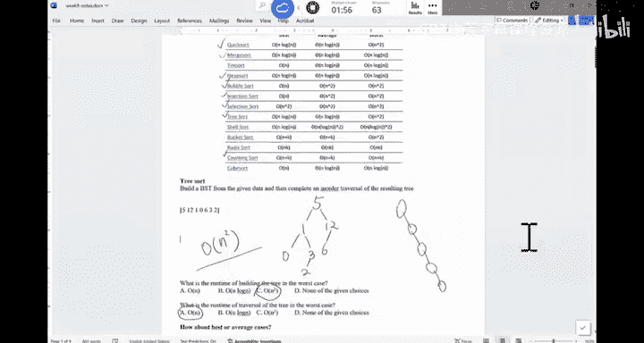

# 024：二叉搜索树（下）与排序入门 🧠


在本节课中，我们将完成二叉搜索树（BST）的讲解，学习删除节点、寻找后继节点以及树的遍历。随后，我们将开启排序算法的学习，首先了解树排序的基本概念。

---

## 二叉搜索树删除操作

上一节我们介绍了BST的插入和查找。本节中，我们来看看如何从BST中删除一个节点。删除操作比插入和查找更复杂，因为需要考虑被删除节点的子节点情况。

删除节点时，主要分为三种情况：

以下是三种需要处理的情况：

1.  **删除叶子节点**：如果节点没有子节点，可以直接将其删除。例如，删除节点35，只需将其父节点对应的子节点引用设为`null`。
2.  **删除只有一个子节点的节点**：如果节点只有一个子节点，可以将该子节点直接连接到其父节点上，然后删除该节点。例如，删除节点12，可以让节点6直接成为节点32的左子节点。
3.  **删除有两个子节点的节点**：这是最复杂的情况。策略是找到该节点的**后继节点**（即中序遍历中的下一个节点），用后继节点的值替换要删除的节点的值，然后删除原来的后继节点。例如，要删除节点32，其后继节点是35。我们将节点32的值替换为35，然后删除原来值为35的节点。

---

## 寻找后继节点

在删除有两个子节点的节点时，我们需要找到它的后继节点。后继节点的定义是：比当前节点大的所有节点中最小的那个。

以下是寻找后继节点的两种主要情况：

*   **情况一：节点有右子树**。后继节点是其**右子树中的最左节点**。代码逻辑可以描述为：从右子节点出发，一直向左走，直到没有左子节点为止。
    ```java
    Node successor = node.right;
    while (successor.left != null) {
        successor = successor.left;
    }
    // 此时 successor 就是后继节点
    ```
*   **情况二：节点没有右子树**。需要向上回溯，直到找到一个祖先节点，使得当前节点位于该祖先节点的**左子树**中。这个祖先节点就是后继节点。如果回溯到根节点仍未找到这样的祖先，则该节点没有后继（它是树中的最大值）。

---

## 树的遍历

遍历二叉树有三种标准方式：中序遍历、前序遍历和后序遍历。它们定义了访问节点及其子节点的顺序。

以下是三种遍历方式的定义：

*   **中序遍历**：顺序为 **左子树 -> 根节点 -> 右子树**。对BST进行中序遍历，会得到一个**升序排列**的序列。
*   **前序遍历**：顺序为 **根节点 -> 左子树 -> 右子树**。常用于复制树的结构。
*   **后序遍历**：顺序为 **左子树 -> 右子树 -> 根节点**。常用于删除树或计算表达式。

以图中的树为例：
*   中序遍历结果：`6, 12, 32, 35, 42, 48, 56, 60`
*   前序遍历结果：`42, 32, 12, 6, 35, 56, 48, 60`
*   后序遍历结果：`6, 12, 35, 32, 48, 60, 56, 42`

---

## 排序算法入门：树排序

现在，我们开始学习排序算法。第一个算法是**树排序**，它直接利用了BST的性质。

树排序的步骤非常简单：
1.  根据待排序数组，构建一棵BST（插入所有元素）。
2.  对这棵BST进行**中序遍历**，得到的序列就是排序结果。

**时间复杂度分析**：
*   构建BST：平均情况为 **O(n log n)**，最坏情况（输入已排序）会退化成链表，时间复杂度为 **O(n²)**。
*   中序遍历：无论树形如何，都需要访问每个节点一次，时间复杂度为 **O(n)**。
*   因此，树排序的整体最坏时间复杂度是 **O(n²)**，平均时间复杂度是 **O(n log n)**。

---



本节课中我们一起学习了BST删除节点的三种情况、如何寻找后继节点、树的三种遍历方式，并引入了第一个排序算法——树排序及其时间复杂度分析。下节课我们将继续探讨更多高效的排序算法。