# 数据结构与面向对象设计：025：排序算法（下）📊


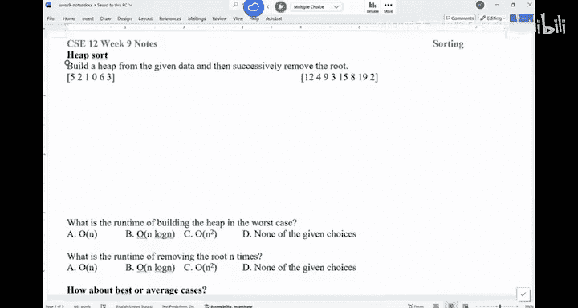

在本节课中，我们将继续学习排序算法。我们将重点介绍堆排序、冒泡排序、选择排序、插入排序和归并排序的核心思想、实现步骤以及时间复杂度分析。理解这些算法对于掌握数据处理和算法设计至关重要。


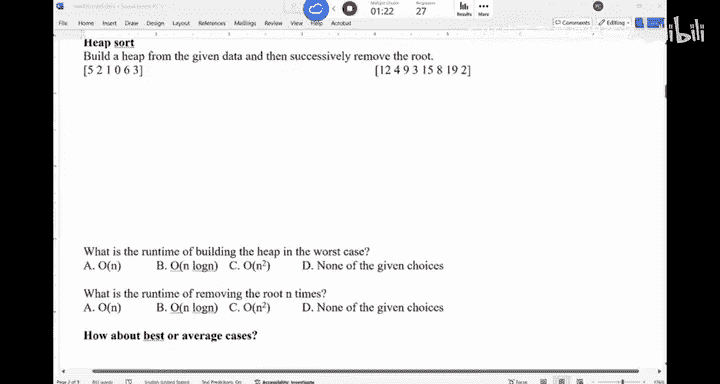


---

## 堆排序 (Heap Sort) ⛰️

上一节我们介绍了树排序，本节中我们来看看堆排序。堆排序基于堆这种数据结构。其基本思想是：首先将数组构建成一个堆，然后反复移除堆顶元素（即当前最大或最小元素），从而得到一个有序序列。

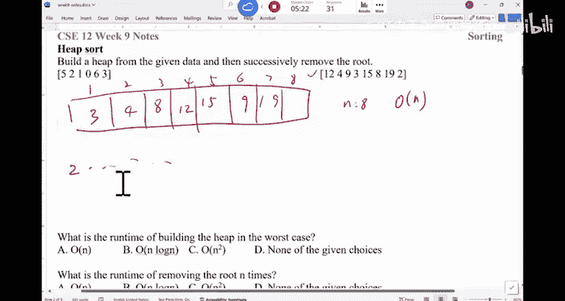


以下是堆排序的两个核心步骤：

1.  **构建堆 (Heapify)**： 将给定的无序数组调整为一个堆。对于一个大小为 `n` 的数组，可以从最后一个非叶子节点开始，向上进行“下滤”操作，确保每个子树都满足堆的性质。这个过程的时间复杂度是 **O(n)**。
    *   公式：从索引 `floor(n/2) - 1` 开始，递减到 0，对每个索引 `i` 执行 `heapify(arr, n, i)`。


2.  **排序**： 将堆顶元素（根节点，通常是最大或最小值）与堆的最后一个元素交换，然后减小堆的大小，并对新的堆顶元素执行“下滤”操作以恢复堆的性质。重复此过程 `n-1` 次。
    *   代码描述：
        ```java
        for (int i = n - 1; i > 0; i--) {
            // 将当前根节点（最大值）与末尾元素交换
            swap(arr[0], arr[i]);
            // 在缩小的堆上恢复堆性质
            heapify(arr, i, 0);
        }
        ```

堆排序的整体时间复杂度在最好、最坏和平均情况下都是 **O(n log n)**。它是一种原地排序算法，但通常不稳定。


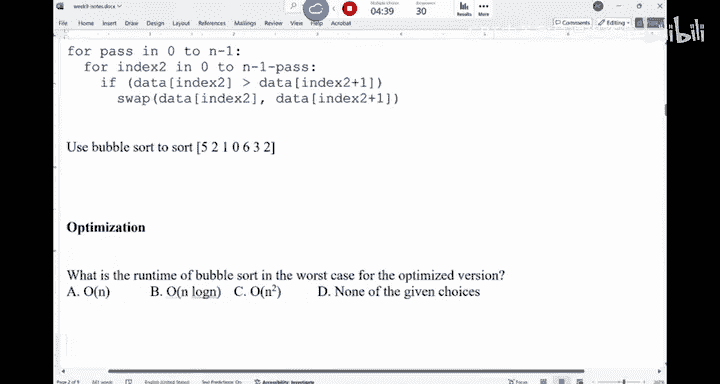

---

## 简单排序算法对比 🔄

接下来，我们看看几种基于简单比较和交换思想的排序算法：冒泡排序、选择排序和插入排序。这些算法虽然效率不高，但思想直观，易于理解和实现。


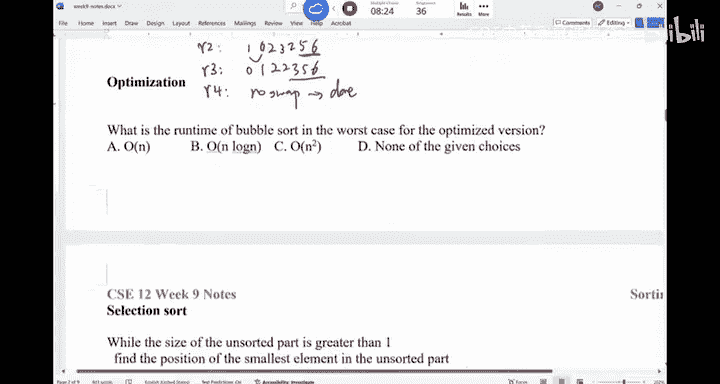

### 冒泡排序 (Bubble Sort) 🫧

冒泡排序重复地遍历要排序的列表，比较相邻的元素，如果它们的顺序错误就把它们交换过来。遍历列表的工作会重复进行，直到列表已经排序完成。


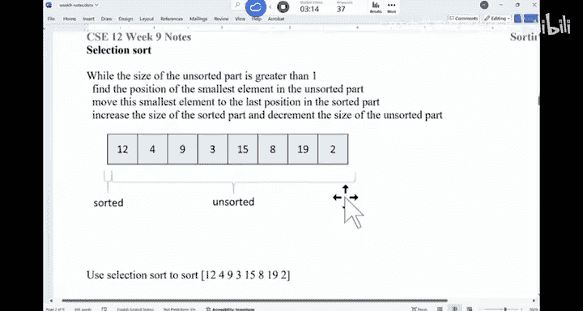

以下是冒泡排序的核心逻辑：

*   算法描述：进行 `n` 轮遍历。在每一轮中，从数组开头开始，比较每对相邻元素 `(arr[j], arr[j+1])`，如果 `arr[j] > arr[j+1]` 则交换它们。经过一轮遍历，最大的元素会“冒泡”到数组末尾。
*   代码描述：
    ```java
    for (int i = 0; i < n-1; i++) {
        for (int j = 0; j < n-i-1; j++) {
            if (arr[j] > arr[j+1]) {
                swap(arr[j], arr[j+1]);
            }
        }
    }
    ```
*   时间复杂度：
    *   最坏情况（数组完全逆序）：**O(n²)**
    *   最好情况（数组已排序）：**O(n)**（但需要一次完整的遍历来确认）
    *   平均情况：**O(n²)**

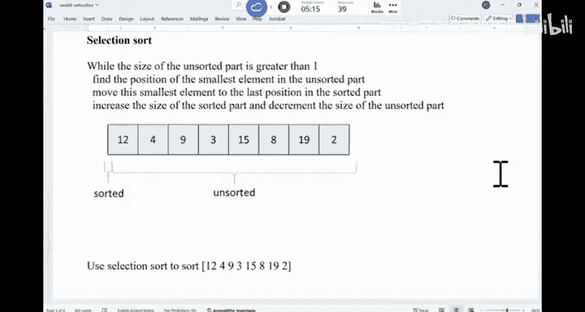

### 选择排序 (Selection Sort) 🎯


选择排序将数组分为“已排序”和“未排序”两部分。它不断地从未排序部分中选择最小（或最大）的元素，将其放到已排序部分的末尾。


以下是选择排序的核心步骤：

1.  在未排序序列中找到最小元素。
2.  将其与未排序序列的第一个元素交换。
3.  将未排序序列的边界向后移动一位，重复步骤1和2。
*   代码描述：
    ```java
    for (int i = 0; i < n-1; i++) {
        int minIdx = i;
        for (int j = i+1; j < n; j++) {
            if (arr[j] < arr[minIdx]) {
                minIdx = j;
            }
        }
        swap(arr[i], arr[minIdx]);
    }
    ```
*   时间复杂度：无论数据如何分布，比较次数固定，均为 **O(n²)**。

### 插入排序 (Insertion Sort) 📥


插入排序的工作方式类似于整理手中的扑克牌。它将数组视为已排序和未排序两部分，每次从未排序部分取出一个元素，将其插入到已排序部分的正确位置。


以下是插入排序的核心逻辑：


*   算法描述：从第二个元素开始（第一个元素视为已排序），将该元素与前面已排序的元素从后向前依次比较，如果该元素更小，则将比较的元素向后移动一位，直到找到合适的位置插入。
*   代码描述：
    ```java
    for (int i = 1; i < n; i++) {
        int key = arr[i];
        int j = i - 1;
        while (j >= 0 && arr[j] > key) {
            arr[j + 1] = arr[j];
            j--;
        }
        arr[j + 1] = key;
    }
    ```
*   时间复杂度：
    *   最坏情况（数组完全逆序）：**O(n²)**
    *   最好情况（数组已排序）：**O(n)**
    *   平均情况：**O(n²)**

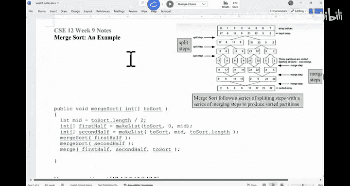

> **总结对比**：冒泡、选择、插入排序在最坏和平均情况下的时间复杂度都是 **O(n²)**，远差于堆排序的 **O(n log n)**。它们通常不用于大规模数据排序，但冒泡和插入排序因其简单性，在小规模数据或近乎有序的数据中可能有用。

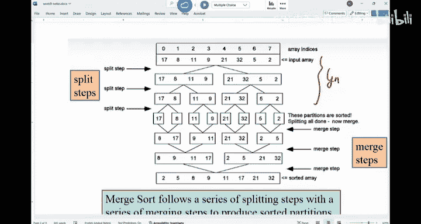

---

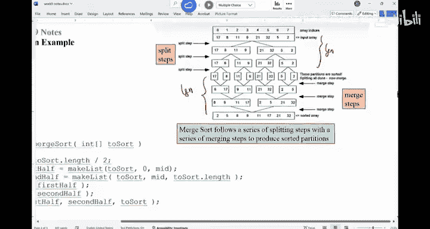

## 归并排序 (Merge Sort) 🤝


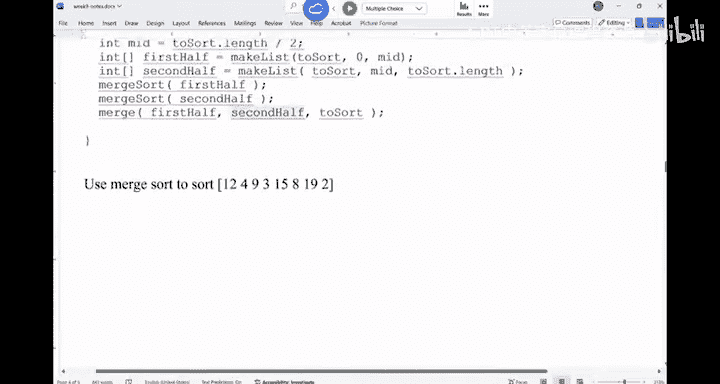

归并排序采用分治策略。它将数组递归地分成两半，分别对两半进行排序，然后将两个已排序的子数组合并成一个完整的已排序数组。


以下是归并排序的递归框架：

1.  **分解**：如果数组长度大于1，找到中点 `mid`，将数组分成左半部分 `arr[0...mid-1]` 和右半部分 `arr[mid...n-1]`。
2.  **解决**：递归地对左半部分和右半部分调用归并排序。
3.  **合并**：将两个已排序的子数组合并成一个有序数组。这是算法的关键步骤。

合并两个已排序数组 `A` 和 `B` 到 `C` 的算法如下：

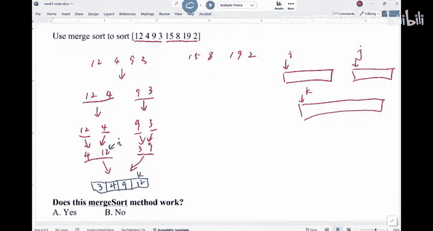


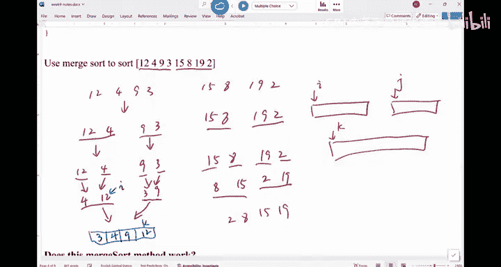

```java
int i = 0, j = 0, k = 0; // i指向A, j指向B, k指向C
while (i < A.length && j < B.length) {
    if (A[i] <= B[j]) {
        C[k++] = A[i++];
    } else {
        C[k++] = B[j++];
    }
}
// 拷贝剩余元素
while (i < A.length) { C[k++] = A[i++]; }
while (j < B.length) { C[k++] = B[j++]; }
```

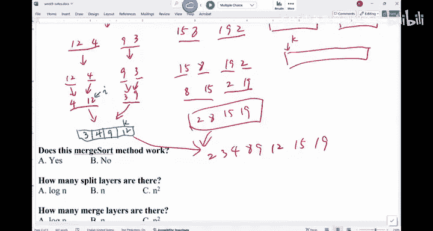


*   **时间复杂度分析**：
    *   分解过程形成一棵深度为 **log₂ n** 的递归树。
    *   在每一层递归上，合并所有子数组的总工作量是 **O(n)**（因为需要遍历和比较所有元素）。
    *   因此，归并排序的总时间复杂度为 **O(n log n)**。
*   **空间复杂度**：归并排序不是原地排序算法，它需要额外的空间来存储临时数组，空间复杂度为 **O(n)**。

归并排序在最好、最坏和平均情况下的时间复杂度都是 **O(n log n)**，是一种稳定且高效的排序算法。


---


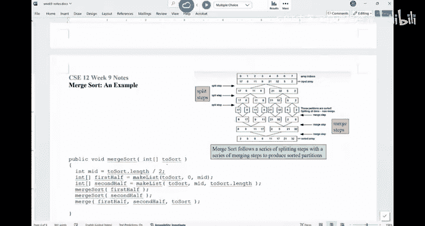


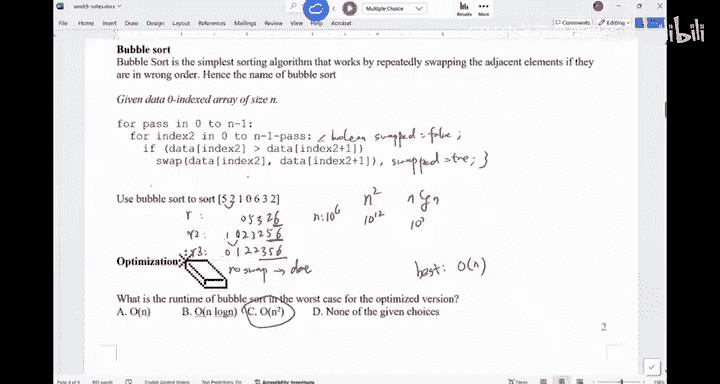

本节课中我们一起学习了堆排序、冒泡排序、选择排序、插入排序和归并排序。我们了解了它们的基本思想、实现方式以及时间复杂度特性。其中，堆排序和归并排序具有 **O(n log n)** 的优异性能，而简单的交换和选择类算法性能较差。理解这些差异是选择合适排序算法的基础。快速排序我们将在下节课详细讨论。