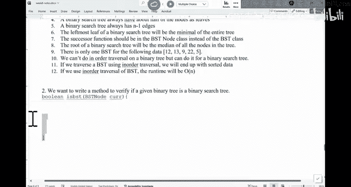

# 数据结构与面向对象设计：026：Lecture 27

## 概述
在本节课中，我们将学习关于课程安排和考试政策的基本信息。内容主要涉及考试安排、特殊情况处理以及相关的学术规定。

## 课程安排与考试政策

上一节我们介绍了课程的基本框架，本节中我们来看看具体的考试安排与政策。

### 考试安排
通常情况下，课程会按照既定的时间表进行考试。

**公式**：`考试时间 = 预设时间表`

这意味着考试日期和时间通常是固定的，不会随意更改。

### 特殊情况处理
对于有特殊需求的学生，学校会提供相应的便利措施。

以下是关于便利措施的具体说明：
*   学校会为符合条件的学生提供考试便利。
*   这些便利旨在确保所有学生都有公平的评估机会。

### 学术规定
学生需要遵守相关的学术规定，以确保学习环境的公平性。

## 总结
本节课中我们一起学习了课程考试的基本安排、特殊情况的处理方式以及需要遵守的学术规定。理解这些政策有助于你更好地规划学习并顺利完成课程要求。