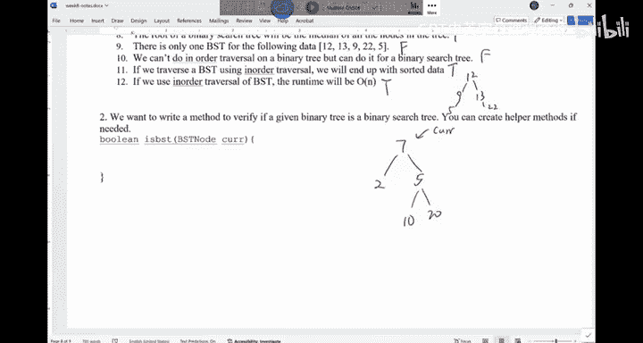
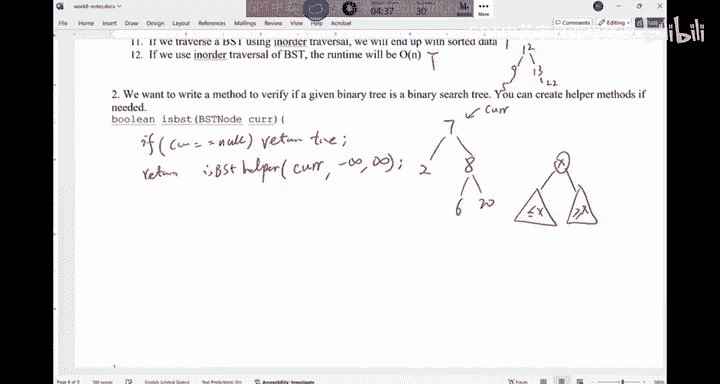
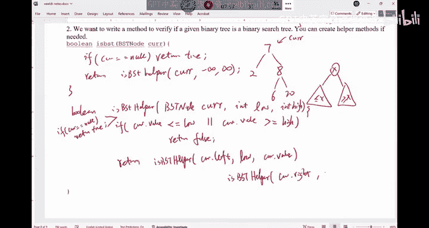
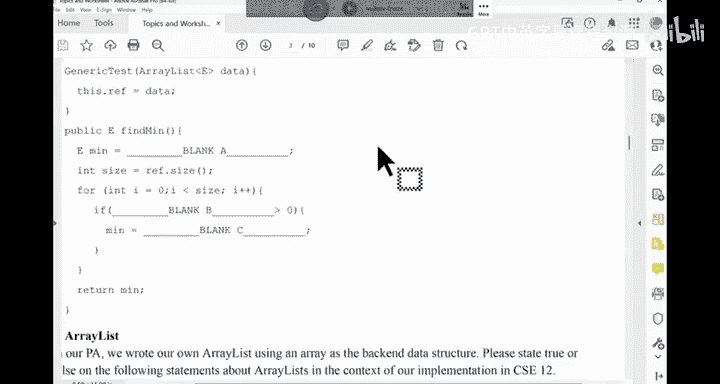
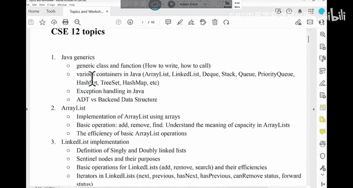
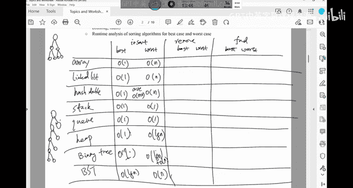

# CSE 12：027：课程总结与期末考试复习 📚

在本节课中，我们将完成关于树结构的练习，并对整个CSE 12课程进行全面的期末考试复习。我们将回顾本学期学习的所有核心数据结构和算法，并分析它们在不同操作下的性能。

---

## 树结构练习回顾 🌳

上一节我们介绍了树、堆和二叉搜索树的基本概念。本节中，我们来看看一些相关的判断题，以巩固理解。

以下是关于树结构的一些判断题及其解析：

1.  **一个二叉树总是有 n-1 条边。**
    *   **答案：正确。** 任何具有 n 个节点的树（无论是否为二叉树）都有 n-1 条边。二叉搜索树是二叉树的一种特例，此规则同样适用。

2.  **二叉搜索树中最左边的叶子节点是整个树中的最小值。**
    *   **答案：错误。** 二叉搜索树中的最小值节点是最左边的节点，但该节点不一定是叶子节点。例如，一个具有左子树的节点可能是最小值，但它本身不是叶子。

3.  **如果将 `successor`（后继者）函数放入二叉搜索树节点类中，则该类必须包含指向父节点的引用。**
    *   **答案：正确。** 在寻找一个节点的后继者时，如果该节点没有右子树，则需要向上遍历查找父节点。因此，访问父节点的能力是必要的。

4.  **二叉搜索树的根节点一定是树中所有节点的中位数。**
    *   **答案：错误。** 只有在平衡的二叉搜索树中，根节点才可能是中位数。对于倾斜的树，无法保证这一点。

5.  **对于一组给定的数据，只存在一种合法的二叉搜索树结构。**
    *   **答案：错误。** 二叉搜索树的最终结构取决于数据插入的顺序。不同的插入顺序可能产生结构不同但包含相同数据的二叉搜索树。

6.  **只能对二叉搜索树进行中序遍历，不能对普通二叉树进行中序遍历。**
    *   **答案：错误。** 可以对任何二叉树进行前序、中序、后序遍历。对于二叉搜索树，中序遍历会产生有序序列；对于普通二叉树，中序遍历只是以特定顺序访问所有节点。

7.  **对二叉搜索树进行中序遍历的时间复杂度是 O(n)。**
    *   **答案：正确。** 中序遍历会访问每个节点常数次（最多几次），并且遍历的边数也与 n 成线性关系，因此是线性时间复杂度。



---

## 面试题实践：验证二叉搜索树 ✅



接下来，我们看一个常见的面试问题：如何验证一个给定的二叉树是否是二叉搜索树。

**核心思路**：不能仅检查每个节点是否大于其左子节点且小于其右子节点。必须确保节点的左子树中的所有值都小于该节点，右子树中的所有值都大于该节点。



一种有效的方法是使用递归，并为每个节点维护一个允许取值的上下界区间。

以下是该算法的代码实现：



```java
boolean isBST(TreeNode root) {
    return isBSTHelper(root, Integer.MIN_VALUE, Integer.MAX_VALUE);
}



boolean isBSTHelper(TreeNode node, int low, int high) {
    // 空树是有效的BST
    if (node == null) {
        return true;
    }
    // 当前节点的值必须在 (low, high) 区间内
    if (node.val <= low || node.val >= high) {
        return false;
    }
    // 递归检查左子树和右子树，并更新边界
    // 左子树的所有值必须小于当前节点值 (high = node.val)
    // 右子树的所有值必须大于当前节点值 (low = node.val)
    return isBSTHelper(node.left, low, node.val) && isBSTHelper(node.right, node.val, high);
}
```

**另一种方法**：对树进行中序遍历，检查遍历得到的序列是否是严格递增的。这也是一种可行方案。


---

## 期末考试总复习 📖

现在，我们开始进行期末考试的总复习。本学期我们涵盖了以下主要主题：

1.  **Java 基础**：接口继承、泛型。
2.  **数据结构**：数组、链表、哈希表、栈、队列、堆、二叉树、二叉搜索树。
3.  **算法**：广度优先搜索（BFS）、深度优先搜索（DFS）、各种排序算法（如归并排序、快速排序）。

对于每种数据结构，最重要的两点是：
*   **何时使用**：了解其优势和劣势。
*   **性能分析**：能够分析基于该数据结构的各种操作的时间复杂度。

---

## 数据结构操作性能分析表 📊

为了帮助理解，我们创建一个表格来分析不同数据结构在 `插入`、`删除` 和 `查找` 操作下的最佳情况与最坏情况时间复杂度。假设数据规模为 `n`，哈希表大小为 `m`。

| 数据结构 | 插入（最佳/最坏） | 删除（最佳/最坏） | 查找（最佳/最坏） | 支持查找？ |
| :--- | :--- | :--- | :--- | :--- |
| **数组 (Array)** | **O(1)** / **O(n)** | **O(1)** / **O(n)** | **O(1)** / **O(n)** | 是 |
| **链表 (Linked List)** | **O(1)** / **O(n)** | **O(1)** / **O(n)** | **O(1)** / **O(n)** | 是 |
| **哈希表 (Hash Table)** | **O(1)** / **O(n)** | **O(1)** / **O(n)** | **O(1)** / **O(n)** | 是 |
| **栈 (Stack)** | **O(1)** | **O(1)** | 不支持 | 否 |
| **队列 (Queue)** | **O(1)** | **O(1)** | 不支持 | 否 |
| **堆 (Heap)** | **O(1)** / **O(log n)** | **O(log n)** | 不支持 | 否 |
| **二叉树 (Binary Tree)** | **O(1)** / **O(n)** | **O(1)** / **O(n)** | **O(1)** / **O(n)** | 是 |
| **二叉搜索树 (BST)** | **O(1)** / **O(n)** | **O(1)** / **O(n)** | **O(1)** / **O(n)** | 是 |

**关键点说明**：
*   **最佳情况**：通常发生在操作位置已知或极其幸运时（例如，在链表头部插入、在哈希表中无冲突插入）。
*   **最坏情况**：通常与数据分布或结构状态有关（例如，数组中间插入导致移位、链表遍历到末尾、BST退化成链表）。
*   **平均情况**：对于哈希表，我们更关注平均情况性能，约为 **O(1 + α)**，其中 α 是负载因子。
*   **不支持的操作**：栈、队列、堆这些数据结构的设计目的不是用于随机查找元素。

**请勿死记硬背此表**。重要的是理解每种数据结构的工作原理，从而能够在脑海中推导出这些复杂度。



---

## 总结 🎯

本节课中我们一起学习了：
1.  通过判断题深化了对树、堆、二叉搜索树性质的理解。
2.  实践了一个经典的面试编码问题——验证二叉搜索树，并掌握了递归和边界检查的解决方法。
3.  系统回顾了本学期学习的所有核心数据结构和算法主题。
4.  通过性能分析表，对比了不同数据结构在关键操作上的时间复杂度，强化了根据应用场景选择合适数据结构的能力。


期末考试的重点在于理解概念而非死记硬背。请利用过去的试卷和课堂练习进行复习，并准备好周五的答疑环节。祝大家复习顺利！