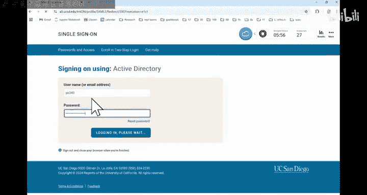
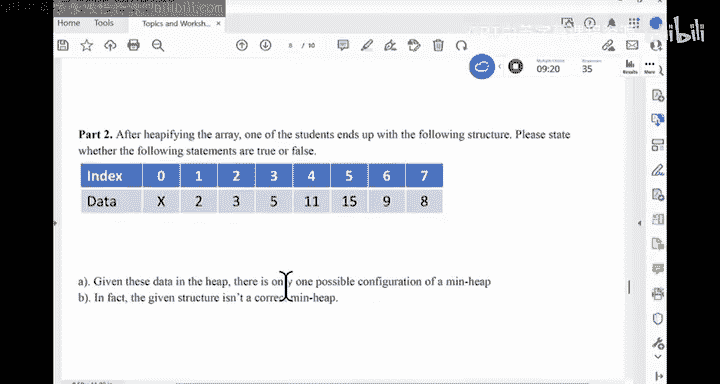
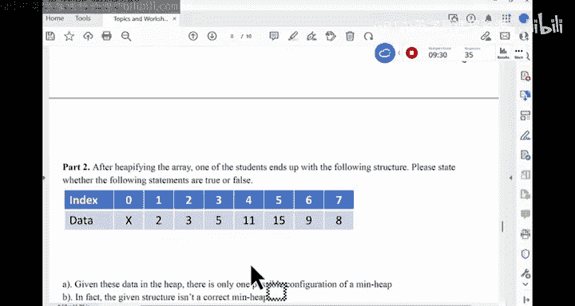
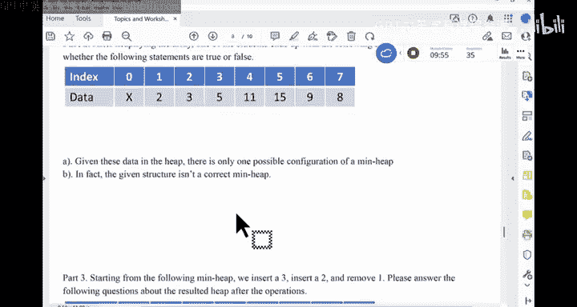
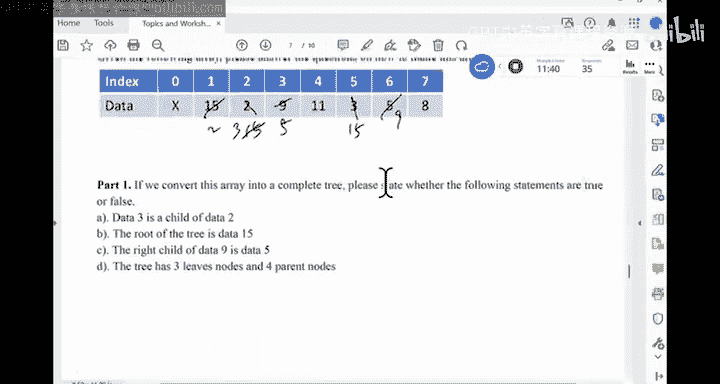
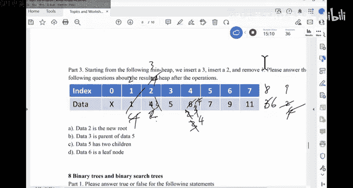
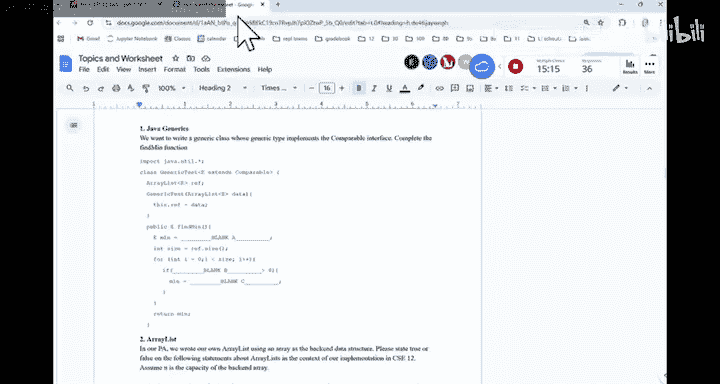
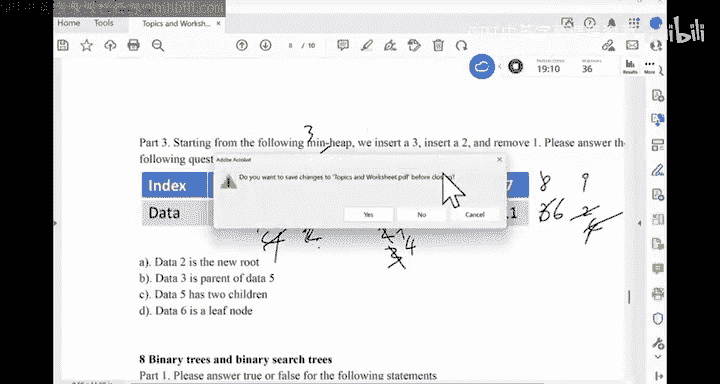
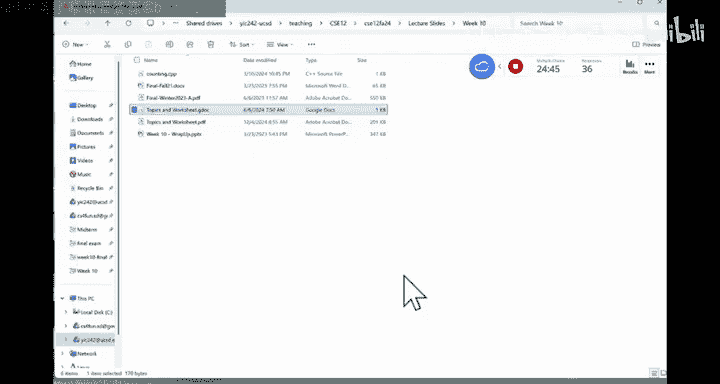

# CSE 12：028：期末考试复习与答疑 📚

在本节课中，我们将一起回顾课程的核心概念，并为期末考试做准备。课程内容涵盖数据结构、算法、递归、迭代器、泛型以及堆等关键主题。我们将通过解答常见问题来巩固理解。

---

## 期末考试安排与结构 📅




期末考试将于明天下午3点至6点举行，地点在Center 1，15。请准时参加，并准备好铅笔和纸张。


考试分为两个部分：
*   **第一部分**：涵盖期中考试之前的内容，共26分。如果得分高于20分（例如24分），则这部分可获得满分，并可用于替换期中考试成绩。
*   **第二部分**：涵盖期中考试之后的内容，共60分。

整场考试共有四道编程题。编程题要求编写完整代码，而非填空。


---

## 核心概念回顾与答疑 🤔

上一节我们介绍了考试的整体安排，本节中我们来看看一些核心概念的具体问题。

### 关于树的基本概念

以下是关于满树和完全树的区别：
*   **满树**：每个节点要么有0个子节点，要么有2个子节点。
*   **完全树**：除了最底层，其他层都是满的，并且最底层的节点都尽可能靠左排列。一个完全树不一定是满树。

### 树的遍历（前序、中序、后序）

树的遍历通常采用递归方法。以下是三种遍历方式的递归框架：

```java
// 伪代码框架
void traverse(Node current) {
    if (current == null) return;
    // 前序：操作当前节点
    // operate(current);
    traverse(current.left);
    // 中序：操作当前节点
    // operate(current);
    traverse(current.right);
    // 后序：操作当前节点
    // operate(current);
}
```

三种遍历方式的区别仅在于“操作当前节点”这一步骤在递归调用中的位置。

### 归并排序的时间复杂度


归并排序的时间复杂度是 **O(n log n)**。
*   **分割阶段**：每次将数组分成两半，需要 log n 层。每层复制数组的操作是 O(n)，所以分割总成本是 O(n log n)。
*   **合并阶段**：合并两个已排序数组是线性操作 O(n)，同样需要进行 log n 层，所以合并总成本也是 O(n log n)。


### 迭代器的作用与使用

迭代器是一种工具，它允许用户遍历数据结构中的元素，而无需了解数据结构的内部实现细节。
以下是关于迭代器的几个要点：
*   可以为链表、数组、树等提供迭代器。
*   遍历链表时，使用迭代器比使用索引的 `get` 方法更高效。
*   使用迭代器删除元素时，通常要求前一个操作是 `next()` 或 `previous()`。
*   迭代器通常实现为外部类的私有内部类，以便访问外部类的私有数据。

### 泛型与对象创建

在Java中，不能直接创建泛型类型 `E` 的对象，例如 `new E()`。这是因为在编译时，泛型类型 `E` 会被擦除为 `Object`，但编译器无法确定具体要实例化哪种类型的对象。

### 堆化数组

堆化（Heapify）是一个将普通数组转换为堆的过程。对于构建最小堆，算法从最后一个非叶子节点开始，向上遍历每个节点，确保每个节点都满足堆的性质（父节点小于子节点）。这个过程的时间复杂度是 **O(n)**。

以下是堆化过程中可能涉及的节点交换操作（以最小堆为例）：
```
if (array[parent] > array[child]) {
    swap(array, parent, child);
    // 可能需要继续向下调整
}
```


### 深度优先搜索与广度优先搜索

DFS和BFS是遍历图（或树、迷宫）的基本算法。
*   **核心思想**：从起始节点开始，访问其未探索的邻居，并将其加入一个数据结构中，然后重复此过程。
*   **区别**：
    *   **DFS** 使用**栈**作为数据结构，遵循后进先出的原则。
    *   **BFS** 使用**队列**作为数据结构，遵循先进先出的原则。
*   在遍历过程中，一个节点可能会被多次加入数据结构（如果它被多个邻居发现时还未被处理）。






---





## 总结 📝




本节课中我们一起学习了期末考试的重要信息和核心概念的复习要点。关键内容包括：
1.  考试分为两部分，第一部分可替换期中成绩。
2.  编程题需要编写完整代码。
3.  理解了满树与完全树的区别。
4.  掌握了树的前序、中序、后序遍历的递归方法。
5.  明确了归并排序 **O(n log n)** 的时间复杂度。
6.  了解了迭代器的用途和正确使用方法。
7.  知道了Java中不能直接实例化泛型对象。
8.  复习了堆化数组的线性时间算法。
9.  区分了DFS（使用栈）和BFS（使用队列）的遍历机制。









请利用Canvas上的历年试卷进行练习。祝大家在期末考试中取得好成绩！