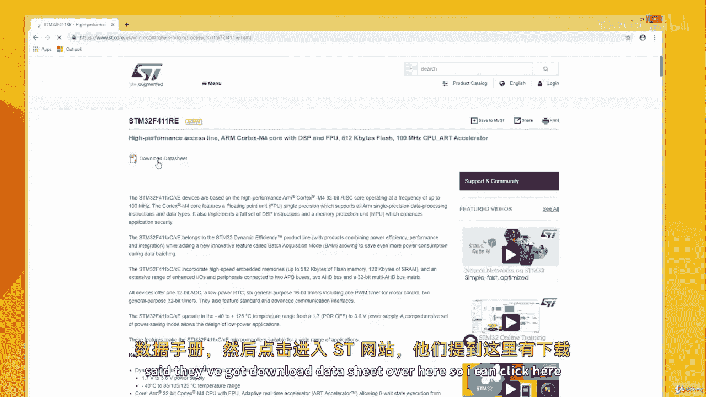
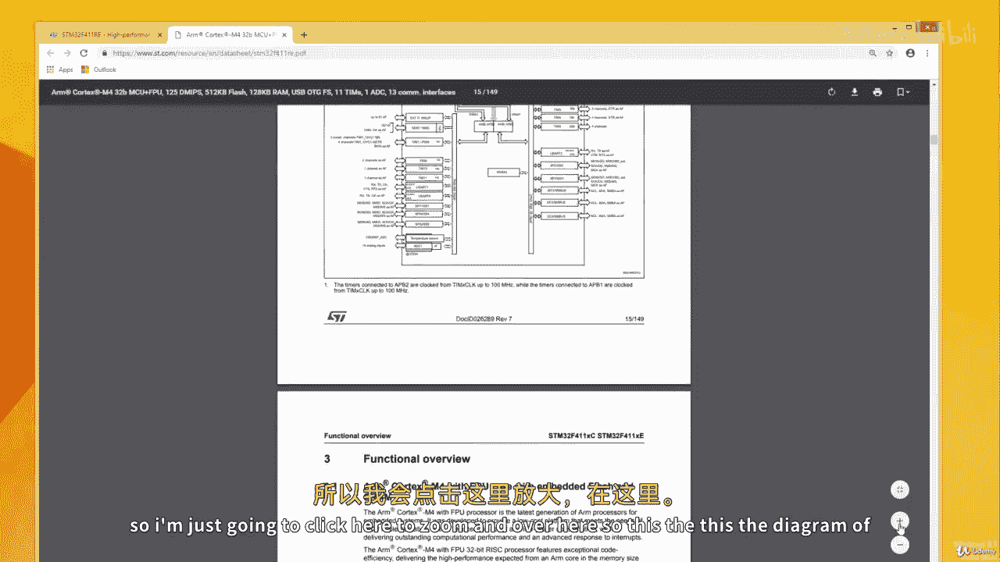
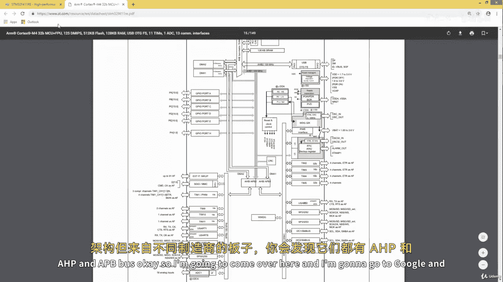
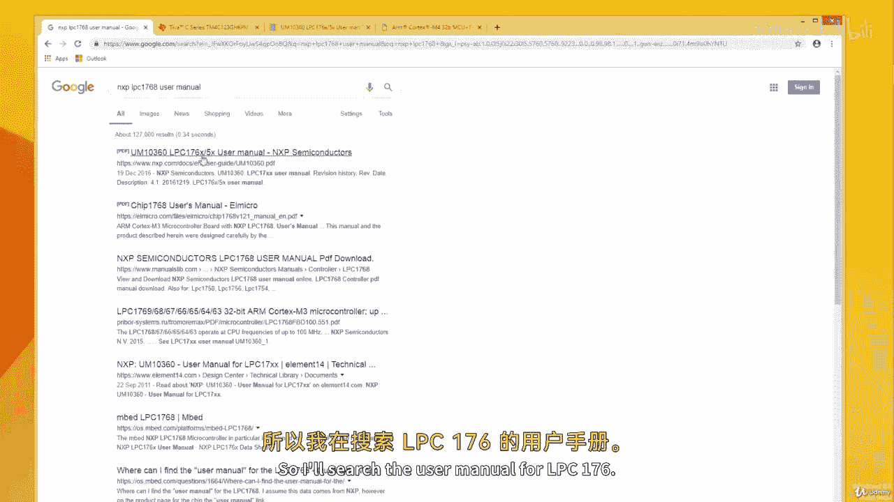
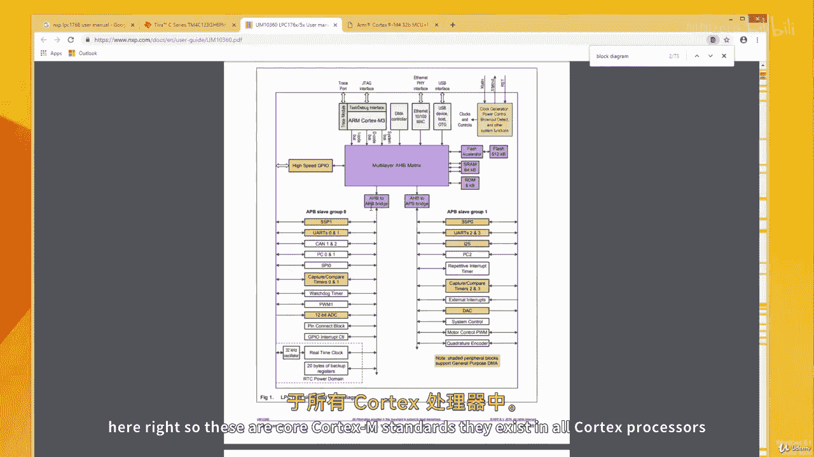

# 001：ARM Cortex-M通用输入输出(GPIO)模块概述 🚀

在本节课中，我们将要学习ARM Cortex-M微控制器中通用输入输出(GPIO)模块的基础知识。我们将了解微控制器如何与外部设备通信，以及其内部总线结构如何影响我们对GPIO的访问方式。

## 微控制器中的输入输出类型

上一节我们介绍了内存与CPU的关系，本节中我们来看看CPU如何与外部世界交互。在微控制器中，输入输出端口是CPU访问输入和输出设备的桥梁。

微控制器中存在两种类型的输入输出：

*   **通用输入输出**：通常缩写为GPIO。这些端口用于连接通用设备。
*   **特殊功能输入输出**：这些端口具有指定的专用功能。

以下是两种类型的具体应用场景：

*   **GPIO** 用于连接诸如LED、开关、LCD键盘、直流电机等通用设备。
*   **特殊功能IO** 则用于实现特定功能，例如模数转换、数模转换、定时器操作以及通用异步收发传输器。

在微控制器中，同一个物理引脚可以被配置为GPIO或特殊功能IO。我们需要明确告知微控制器，我们希望将该引脚用于特殊功能，还是作为普通的通用引脚。

## 端口与引脚命名规则

在微控制器中，引脚被分组到不同的端口，例如端口A、端口B、端口C等。每个端口包含一定数量的引脚。

引脚命名遵循“端口名 + 引脚号”的规则。例如：
*   `PA1` 代表端口A的第1号引脚。
*   `PE3` 代表端口E的第3号引脚。

因此，在访问这些引脚时，我们需要向开发环境指明具体的端口和引脚编号。所有微控制器都遵循这一命名惯例。

然而，当使用如Arduino或Mbed这类高级平台时，你通常不需要直接指定端口。这些平台的封装层已经处理了这些细节，并将引脚重命名为更简单的名称，例如`P1`到`P30`，而无需指明它们属于哪个端口。在Arduino或Mbed中编码时，你无需担心这些底层细节。

但当你进行**裸机编程**时，你必须清楚你想要访问的特定引脚所属的端口及其编号。

## 微控制器总线结构：AHB与APB

大多数Cortex-M微控制器拥有两种类型的总线：
*   **高级外设总线**：通常写作 **APB**。
*   **高级高性能总线**：通常写作 **AHB**。

这两种总线在访问速度上存在差异：
*   使用**APB**访问一个外设至少需要**两个时钟周期**。
*   使用**AHB**访问外设则可能只需要**一个时钟周期**。

我们将查看来自三家不同厂商的四款ARM Cortex微控制器的数据手册，你会发现这些总线结构普遍存在。无论微控制器来自NXP、德州仪器还是意法半导体，它们都具备这些总线。

## 实践：在数据手册中定位总线结构

本课程的一个目标是使你能够独立查阅任何微控制器的数据手册和用户手册，以便在使用外设和解决实际问题时，能够随着嵌入式开发技能的提升而自主工作。

现在，让我们看看如何找到特定微控制器的数据手册，并查看其总线结构。

### 1. 意法半导体 STM32F4系列

我们以STM32F411RE微控制器为例。在搜索引擎中搜索“STM32F411RE datasheet”并打开官方数据手册。

数据手册提供了微控制器的概要信息，包括外设数量、功耗限制和**框图**。你可以将数据手册视为摘要，而参考手册则包含更详细的数千页内容。

在数据手册中向下滚动，找到系统框图。图中清晰标出了**AHB总线**和**APB总线**（如APB1、APB2）。例如，GPIO端口A、B、C、D、H可以连接到AHB总线，而某些外设（如UART）则只连接到APB总线。

在编程时，我们需要牢记这一点。例如，我们不能尝试使用AHB总线去初始化一个只支持APB总线的UART2外设。

### 2. 德州仪器 TM4C123系列

接下来，搜索“TM4C123GH6PM datasheet”并打开其数据手册。通过查找“框图”或使用Ctrl+F搜索关键词，可以快速定位。

在TM4C123的框图中，我们同样可以看到**AHB总线**和**APB总线**。只有那些有箭头指向AHB总线的外设才能使用它。例如，SSI（同步串行接口）外设的箭头指向APB，因此它只能使用APB总线。而DMA（直接内存访问）控制器则能够同时使用AHB和APB总线。

### 3. NXP LPC1768系列

最后，搜索“LPC1768 user manual”并打开用户手册。同样，通过搜索“block diagram”来查找简化框图。

在LPC1768的框图中，我们可以看到其总线系统，包括**AHB矩阵**和**AHB到APB的桥接器**。一部分外设作为“AHB从机组1”连接到AHB总线，另一部分外设则通过桥接器连接到APB总线。

这体现了作为嵌入式系统开发者应具备的能力：你应该能够使用提供给你的任何微控制器。许多人停留在舒适区，认为从一家厂商（如ST）切换到另一家会非常困难。但事实并非如此，如果你掌握了查阅数据手册和用户手册的方法，你就能同样自如地使用不同芯片制造商的产品。

这些总线结构是ARM Cortex-M处理器的核心标准，存在于所有Cortex-M处理器中。

## 总结

本节课中我们一起学习了ARM Cortex-M微控制器GPIO模块的基础。我们明确了GPIO与特殊功能IO的区别，理解了端口和引脚的命名规则。更重要的是，我们探讨了微控制器内部的AHB和APB总线结构，并通过实际查阅三家不同厂商（ST、TI、NXP）微控制器的数据手册，验证了这一通用架构的存在。掌握查阅官方文档的技能，是迈向独立嵌入式开发的关键一步。