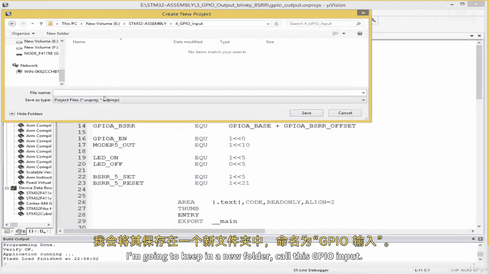
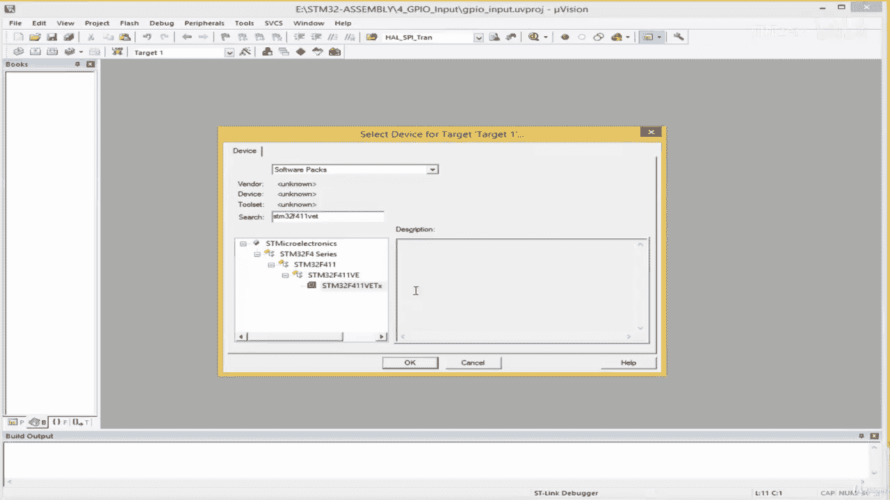
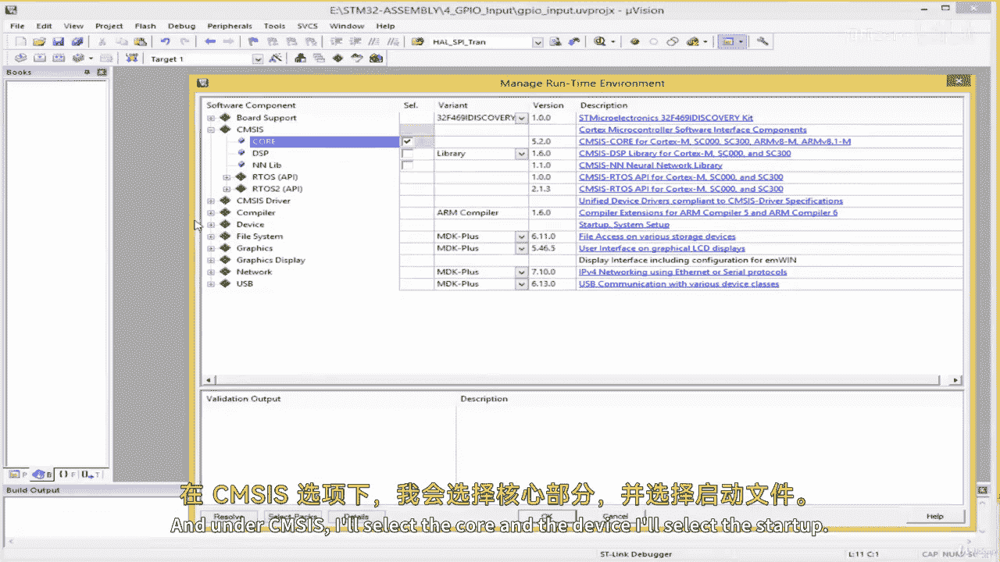
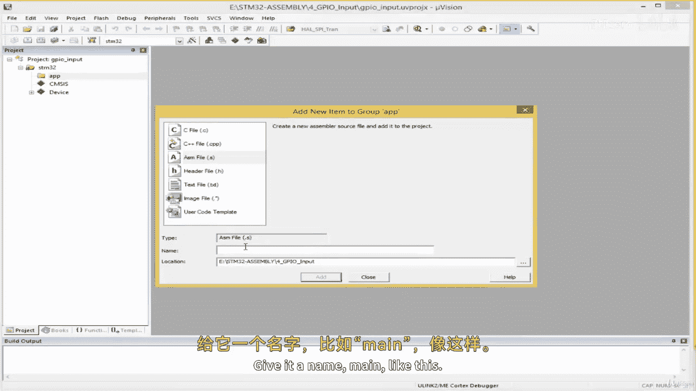
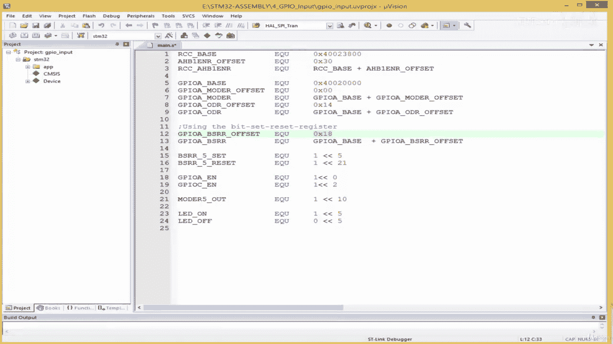
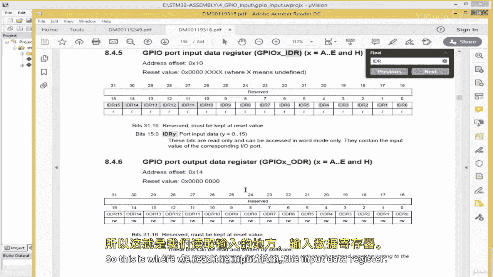
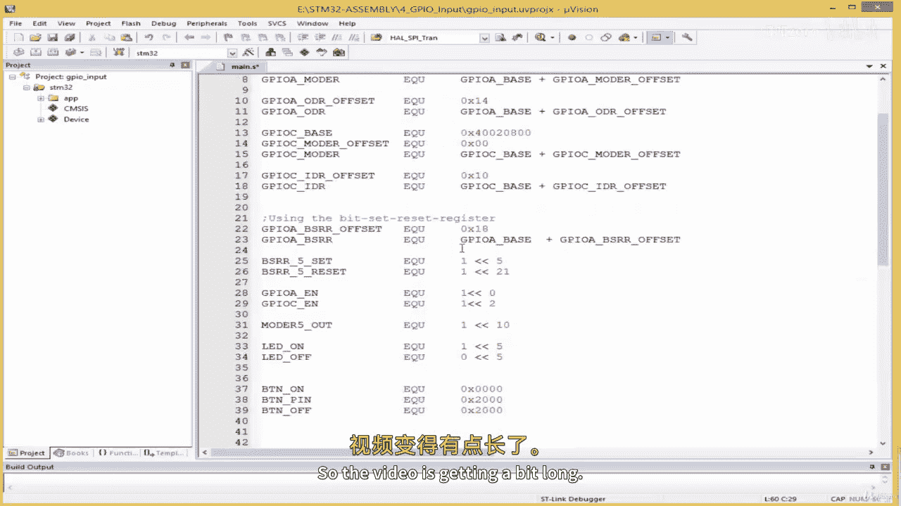

# 006：GPIO输入驱动开发（第一部分）🚀



在本节课中，我们将学习如何配置STM32微控制器的GPIO引脚作为输入。我们将以开发板上的一个按键（连接至PC13引脚）为例，逐步讲解如何初始化GPIO端口、配置输入模式，并理解相关的寄存器操作。





---

## 概述



上一节我们介绍了如何配置GPIO输出以控制LED。本节中，我们来看看如何配置GPIO输入来读取外部按键的状态。我们将创建一个新的工程，初始化GPIO端口，并设置PC13引脚为输入模式，为后续读取按键值做好准备。

## 创建新工程

首先，我们需要在Keil uVision中创建一个新项目。

1.  打开Keil uVision，选择“Project” -> “New uVision Project”。
2.  创建一个新文件夹，命名为“GPIO_input”。
3.  将项目也命名为“GPIO_input”。
4.  在设备选择窗口中，选择“STM32F411VETx”。




5.  在接下来的对话框中，选择“CMSIS”下的“CORE”以及“Device”下的“Startup”。然后点击“OK”。


## 添加并配置源文件

接下来，我们需要添加一个汇编源文件。

1.  在“Target 1”上右键，选择“Manage Project Items”。
2.  将“Source Group 1”重命名为“App”。
3.  在“App”组下，点击“Add New Item”。
4.  选择“Asm File (.s)”，并命名为“main”，然后点击“Add”。


5.  配置调试选项：点击工具栏的“Options for Target”按钮（或按Alt+F7）。
6.  在“Debug”选项卡中，选择“Use: ST-Link Debugger”。
7.  在“Utilities”选项卡中，确保“Use Target Driver for Flash Programming”也选择了“ST-Link Debugger”，然后点击“OK”。



## 硬件连接与原理

在我们的开发板上，按键（Push Button）连接到了**PC13**引脚。因此，我们需要将PC13配置为GPIO输入引脚。

这个按键是**低电平有效**的。这意味着：
*   当按键未被按下时，PC13引脚读到的逻辑电平为**1**（高电平）。
*   当按键被按下时，PC13引脚读到的逻辑电平为**0**（低电平）。

用公式表示这个关系：
```
按键状态 = !(PC13引脚电平)
当 PC13 = 1 时，按键状态 = 0 (关闭)
当 PC13 = 0 时，按键状态 = 1 (按下)
```

## 定义寄存器地址与常量

在编写代码前，我们需要查阅数据手册和参考手册，找到相关寄存器的地址和偏移量。

以下是需要定义的关键地址和常量：

```assembly
; 端口C的基地址
GPIOC_BASE         EQU 0x40020800

; 模式寄存器的偏移量 (对所有端口相同)
GPIOx_MODER_OFFSET EQU 0x00
; 为端口C定义模式寄存器地址
GPIOC_MODER        EQU GPIOC_BASE + GPIOx_MODER_OFFSET

; 输入数据寄存器(IDR)的偏移量
GPIOx_IDR_OFFSET   EQU 0x10
; 为端口C定义输入数据寄存器地址
GPIOC_IDR          EQU GPIOC_BASE + GPIOx_IDR_OFFSET

; RCC AHB1外设时钟使能寄存器地址
RCC_AHB1ENR        EQU 0x40023830

; 使能GPIOC的位掩码 (AHB1ENR寄存器的位2)
GPIOC_ENABLE       EQU (1 << 2)

; 按键引脚定义 (PC13)
BTN_PIN            EQU (1 << 13)
; 按键状态定义
BTN_ON             EQU 0x0000  ; 按键按下时，PC13读为0
BTN_OFF            EQU 0x2000  ; 按键释放时，PC13读为1 (1<<13 = 0x2000)
```

**代码解释**：
*   `EQU`指令用于定义常量，提高代码可读性。
*   端口C的基地址`0x40020800`来自数据手册。
*   输入数据寄存器`IDR`的偏移量`0x10`来自参考手册。
*   `BTN_PIN`的值`(1 << 13)`表示二进制的第13位为1，对应PC13引脚。
*   `BTN_OFF`的值`0x2000`是`1<<13`的十六进制表示，同样代表PC13。

## 编写初始化子程序

现在，我们将编写一个子程序`GPIO_Init`，用于初始化LED所用的GPIOA和按键所用的GPIOC。

以下是初始化过程的步骤：

```assembly
                AREA    |.text|, CODE, READONLY, ALIGN=2
                THUMB
                ENTRY

__main
                B       GPIO_Init        ; 跳转到初始化子程序

GPIO_Init
                ; 1. 使能GPIOA的时钟 (用于LED)
                LDR     R0, =RCC_AHB1ENR ; 加载RCC_AHB1ENR寄存器地址到R0
                LDR     R1, [R0]         ; 读取当前寄存器值到R1
                ORR     R1, #1           ; 设置位0 (GPIOAEN) 为1
                STR     R1, [R0]         ; 将新值写回寄存器

                ; 2. 配置GPIOA引脚为输出模式 (以PA5为例)
                LDR     R0, =GPIOA_MODER ; 加载GPIOA模式寄存器地址
                LDR     R1, [R0]         ; 读取当前值
                LDR     R2, =0x00000400  ; 掩码：清除PA5的原有模式位 (位11:10)
                BIC     R1, R1, R2       ; 清除位
                LDR     R2, =0x00000400  ; 掩码：设置PA5为通用输出模式 (01)
                ORR     R1, R1, R2       ; 设置位
                STR     R1, [R0]         ; 写回新配置

                ; 3. 使能GPIOC的时钟 (用于按键PC13)
                LDR     R0, =RCC_AHB1ENR ; 再次加载RCC_AHB1ENR地址
                LDR     R1, [R0]         ; 读取当前值
                LDR     R2, =GPIOC_ENABLE; 加载GPIOC使能掩码 (1<<2)
                ORR     R1, R1, R2       ; 设置位2 (GPIOCEN) 为1
                STR     R1, [R0]         ; 写回新值

                ; 4. 配置GPIOC的PC13引脚为输入模式
                LDR     R0, =GPIOC_MODER ; 加载GPIOC模式寄存器地址
                LDR     R1, [R0]         ; 读取当前值
                LDR     R2, =0x0C000000  ; 掩码：清除PC13的原有模式位 (位27:26)
                BIC     R1, R1, R2       ; 清除位 (00 表示输入模式)
                STR     R1, [R0]         ; 写回新配置，PC13现已配置为输入

                BX      LR               ; 从子程序返回

                ALIGN
                END
```

**代码流程解析**：
1.  **使能时钟**：通过设置`RCC_AHB1ENR`寄存器的对应位，来打开GPIOA和GPIOC的时钟信号。没有时钟，外设无法工作。
2.  **配置模式寄存器**：
    *   对于输出引脚（如PA5），需要将其模式位设置为`01`（通用输出模式）。
    *   对于输入引脚（如PC13），需要将其模式位设置为`00`（输入模式）。这是复位后的默认值，但显式设置是一个好习惯。
3.  **使用`BIC`和`ORR`指令**：在修改寄存器特定位时，通常先使用`BIC`（位清除）指令清除旧配置，再用`ORR`（位或）指令设置新配置，避免影响其他位。

## 总结

本节课中我们一起学习了GPIO输入配置的基础知识。我们创建了一个新工程，定义了按键所需的寄存器地址和常量，并编写了`GPIO_Init`子程序的前半部分，成功初始化了GPIOA（输出）和GPIOC（输入）的时钟与引脚模式。

关键要点如下：
*   **输入配置**与输出配置类似，都需要先使能外设时钟。
*   配置引脚为**输入模式**时，需将模式寄存器`MODER`中对应的2位设置为`00`。
*   对于**低电平有效**的按键，引脚读到的`0`表示按下，`1`表示释放。
*   使用`EQU`定义常量和`LDR Rd, =label`伪指令，能使汇编代码更清晰、更易维护。

在下一部分，我们将完善这个驱动，学习如何读取`IDR`（输入数据寄存器）的值来获取按键状态，并实现一个简单的按键检测循环。



