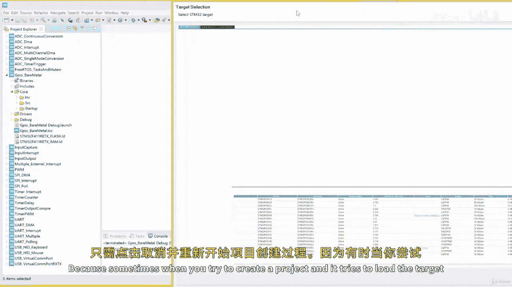
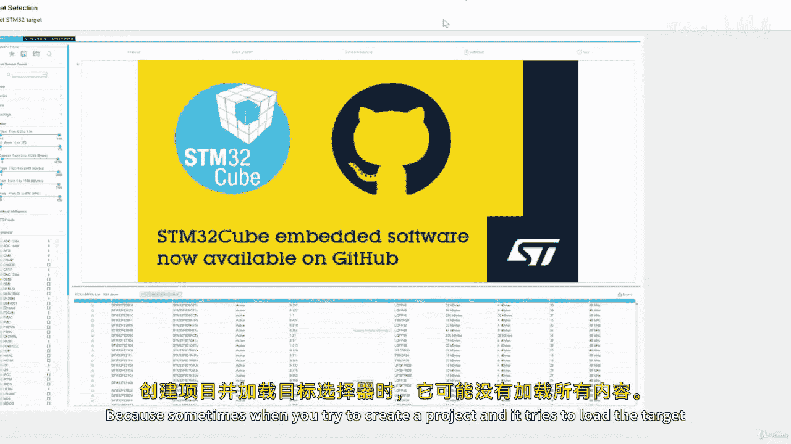
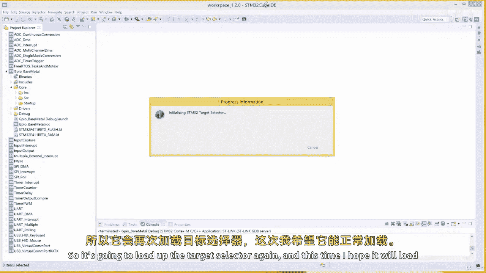
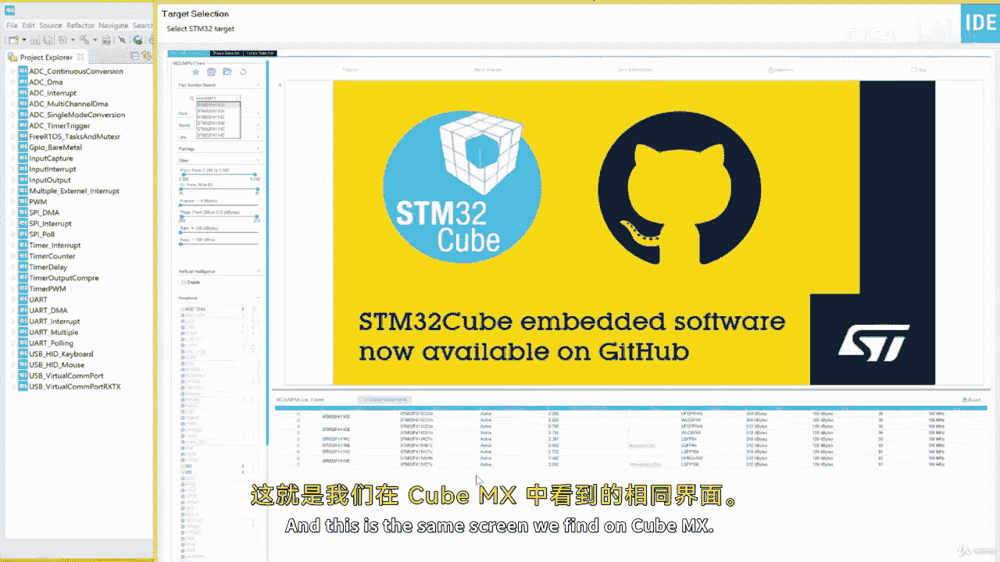

# 008：编写一个简单的汇编项目 🛠️





在本节课中，我们将学习如何在STM32CubeIDE中创建并编写一个简单的ARM汇编语言项目。我们将从创建新项目开始，逐步编写汇编代码，并最终在调试器中验证代码的正确执行。

## 项目创建与设置

上一节我们介绍了汇编语言的基础概念，本节中我们来看看如何在集成开发环境中实际创建一个项目。





首先，我们需要在STM32CubeIDE中创建一个新的STM32项目。以下是具体步骤：

1.  点击菜单栏的 **File** -> **New** -> **STM32 Project**。
2.  系统会加载目标选择器。如果面板没有正常显示可搜索开发板的区域，请点击 **Cancel**，然后重新开始创建项目的过程。这是因为CubeIDE有时在加载目标选择器时存在显示Bug。
3.  在重新打开的目标选择器中，搜索你的开发板型号（例如 `STM32F411`），然后选中它。
4.  点击 **Next**，为项目命名（例如 `simple_assembly`），再次点击 **Next**，最后点击 **Finish** 完成创建。

项目创建完成后，IDE可能会询问是否切换到Kernel视角，选择 **No** 即可。

## 编写汇编代码

项目创建好后，我们需要准备编写汇编代码的环境。默认生成的 `main.c` 文件对我们没有用处，可以将其删除。

接下来，在 `Src` 文件夹中创建一个新的汇编源文件：

1.  右键点击 `Src` 文件夹，选择 **New** -> **File**。
2.  将文件命名为 `main.s`，然后点击 **Finish**。

现在，我们可以在 `main.s` 文件中开始编写汇编代码。汇编程序由指令（Instructions）和伪指令（Directives）组成。伪指令不是CPU执行的命令，而是告诉汇编器如何编译代码的指示。不同的汇编器（如GCC汇编器和ARM汇编器）可能使用不同的伪指令，但核心指令集是相同的。

以下是我们将写入 `main.s` 的完整代码，它完成一个简单的加法循环：

```assembly
.section .text
.cpu cortex-m4
.global main

main:
    MOV R5, #0x64
    MOV R4, #0

loop:
    ADD R5, R5, #1
    ADD R4, R4, #1
    B loop
```

让我们逐行分析这段代码：
*   `.section .text`：这是一个伪指令，声明接下来的代码属于 `.text` 段，即可执行代码段。
*   `.cpu cortex-m4`：伪指令，指明目标CPU是Cortex-M4内核。
*   `.global main`：伪指令，将 `main` 标签声明为全局符号，使其可以被项目中的其他文件访问。
*   `main:`：这是一个标签（Label），它标记了程序入口点的位置。
*   `MOV R5, #0x64`：指令，将立即数 `0x64`（即十进制的100）移动到寄存器R5中。**注意**：在ARM汇编中，立即数前需要加 `#` 符号。
*   `MOV R4, #0`：指令，将立即数0移动到寄存器R4中。
*   `loop:`：另一个标签，标记循环的起点。
*   `ADD R5, R5, #1`：指令，将寄存器R5的值加1，结果存回R5。
*   `ADD R4, R4, #1`：指令，将寄存器R4的值加1，结果存回R4。
*   `B loop`：指令，无条件跳转（Branch）到 `loop` 标签处，从而形成一个无限循环。

编写完成后，保存文件（Ctrl+S）。

## 构建与调试

代码编写完毕，下一步是构建项目以检查语法错误，然后通过调试器观察程序的运行。

首先点击工具栏上的 **Build** 按钮（或按Ctrl+B）进行编译。如果代码书写正确，控制台会显示“Build Finished”且没有错误。如果出现错误，请根据提示信息进行修改，最常见的错误是忘记在立即数前加 `#` 号。

构建成功后，点击 **Debug** 按钮（或按F11）启动调试会话。首次调试可能需要配置，通常直接点击 **OK** 即可。

调试界面打开后，我们需要打开寄存器视图来观察CPU寄存器的值变化：
*   如果右侧没有显示寄存器窗口，请点击菜单栏 **Window** -> **Show View** -> **Registers**。

在寄存器视图中，你可以看到 `R0` 到 `R15` 等通用寄存器的当前值。

现在，使用工具栏上的调试控制按钮单步执行程序：
*   **Step Into (F5)**：单步执行，遇到函数调用会进入函数内部。
*   **Step Over (F6)**：单步执行，但将函数调用作为一步执行。
*   **Step Return (F7)**：执行完当前函数，返回到调用处。

当前，黄色箭头指向 `MOV R5, #0x64` 这一行，表示这是即将执行的下一条指令。

1.  点击 **Step Into**。执行后，观察寄存器视图，可以看到 `R5` 的值变为 `0x00000064`（即100）。
2.  再次点击 **Step Into**，执行 `MOV R4, #0`。`R4` 的值变为0。
3.  继续点击 **Step Into**，执行 `B loop`。程序会跳转到 `loop:` 标签处，黄色箭头指向 `ADD R5, R5, #1`。
4.  点击 **Step Into** 执行该加法指令。观察 `R5` 的值从100变为101。
5.  再次点击 **Step Into** 执行下一条 `ADD R4, R4, #1` 指令。观察 `R4` 的值从0变为1。

至此，我们成功验证了汇编代码在硬件上的执行过程。

## 理解“main”标签的重要性

在之前的代码中，我们将入口点标签命名为 `main`。这是因为在STM32的启动文件（Startup File）中，系统复位后最终会跳转到一个名为 `main` 的标签。

你可以通过以下路径查看启动文件：`Project` -> `Core` -> `Startup` -> `startup_stm32f411xe.s`。在这个文件中，找到 `Reset_Handler` 子程序，在其末尾可以看到一条指令 `B main`。这条指令就是跳转到应用程序的入口点。

因此，如果你的项目中没有 `main.c` 文件，那么汇编文件中的入口标签**必须**命名为 `main`，否则链接器会报“undefined reference to main”的错误。如果你希望使用其他名称（如 `start`），则必须同时修改启动文件中的 `B main` 指令，但这通常不是推荐的做法。

## 总结


本节课中我们一起学习了如何在STM32CubeIDE中创建一个完整的ARM汇编项目。我们经历了从创建项目、编写包含伪指令和基本指令的汇编代码，到构建、调试并观察寄存器变化的完整流程。关键点在于理解了程序入口标签 `main` 的命名与系统启动流程的关联。通过这个简单的加法循环示例，你已经掌握了在集成开发环境中进行汇编语言开发的基础操作。