# 009：03.3. 开发 GPIO 驱动程序（第一部分）

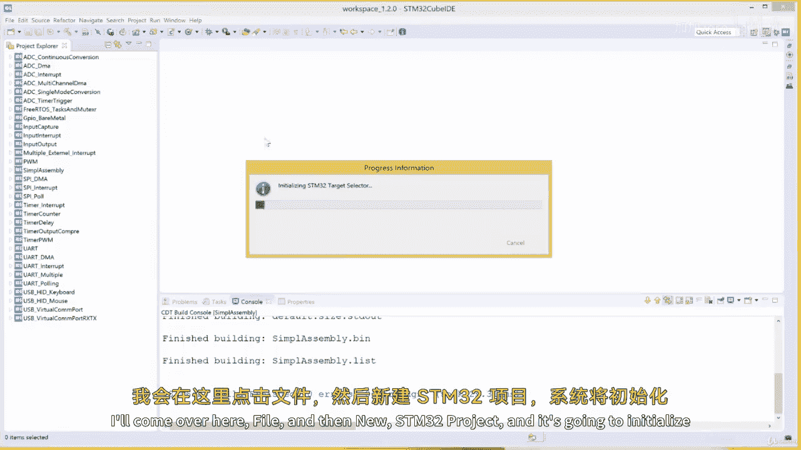

在本节课中，我们将通过一个更实际的例子来学习 ARM 汇编。我们将使用 STM32CubeIDE，仅用汇编代码编写一个 GPIO 驱动程序。我们将从数据手册和参考手册中提取内存地址，为它们分配符号名称，然后使用汇编指令访问这些内存地址并操作其中的位。

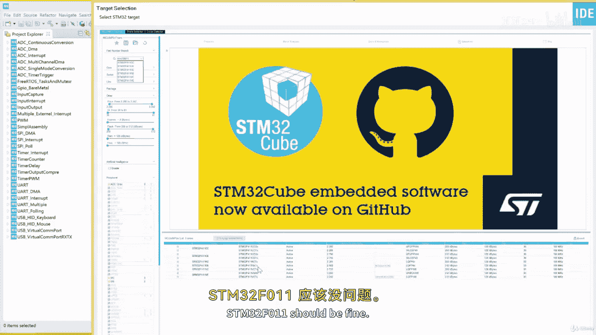

## 创建新项目

首先，我们需要在 STM32CubeIDE 中创建一个新项目。

1.  点击 **File** -> **New** -> **STM32 Project**。
2.  在目标选择器中，选择我们的开发板型号 **STM32F411VETx**。
3.  点击 **Next**。
4.  为项目命名，例如 `GPIO_Assembly`。
5.  再次点击 **Next**，然后点击 **Finish**。

项目创建完成后，我们需要清理源文件目录。

1.  在项目资源管理器中，导航到 `Core/Src` 文件夹。
2.  删除 `main.c` 文件。其他文件暂时可以保留，稍后测试无误后再删除。

## GPIO 驱动程序步骤

我们的目标是控制一个连接到 PA5 引脚的 LED。为此，我们需要完成以下三个核心步骤：

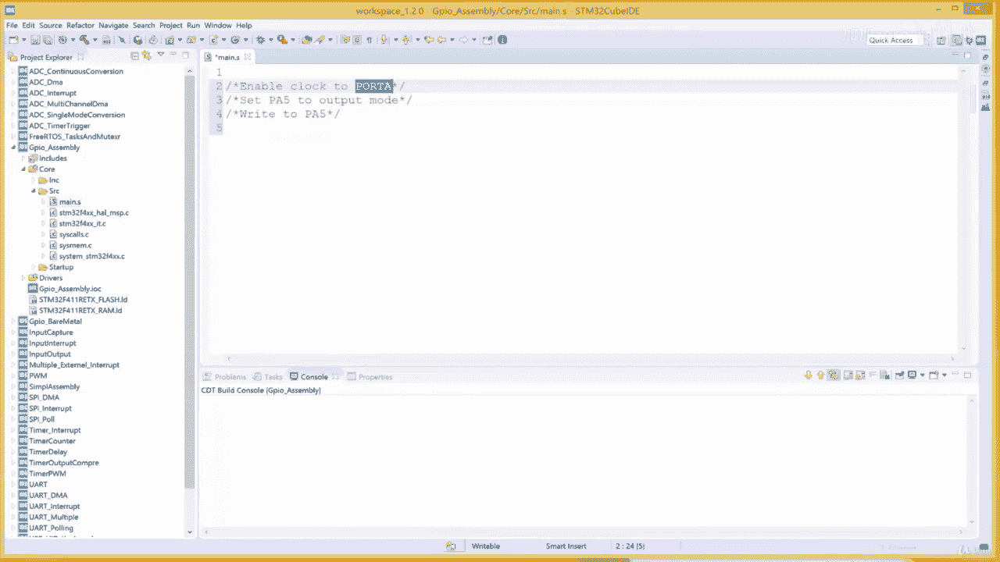

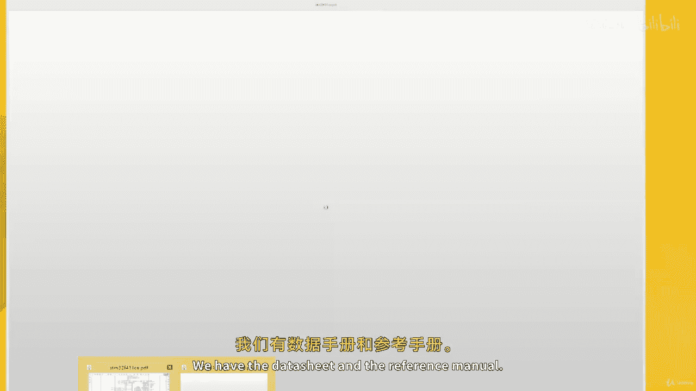

1.  **启用 GPIOA 端口的时钟**。
2.  **将 PA5 引脚设置为输出模式**。
3.  **向 PA5 引脚写入数据以控制 LED**。

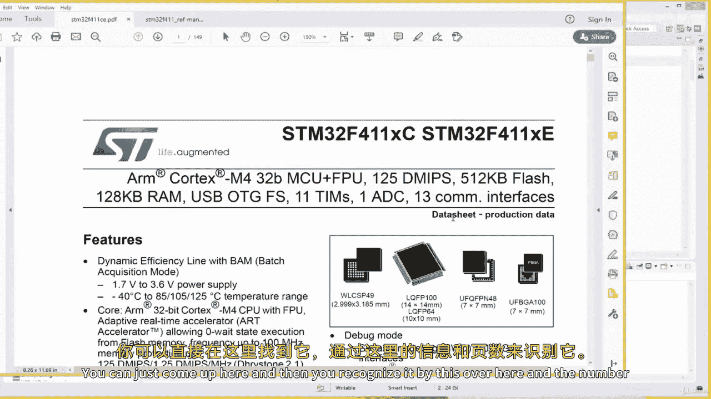

为了实现这些步骤，我们需要找到并操作对应的硬件寄存器。这涉及到理解“基地址”和“偏移量”的概念。

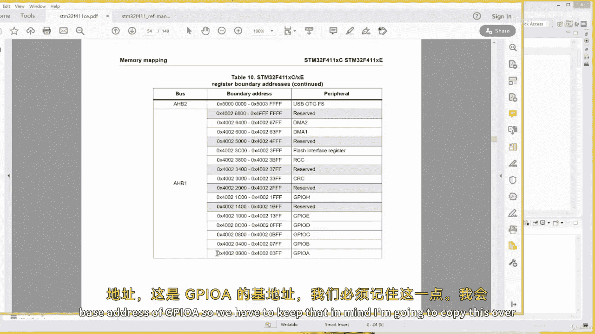

## 理解基地址与偏移量

微控制器中的每个外设（如 GPIO、RCC）都有一组寄存器，它们被映射到特定的内存地址。这些地址通常以“基地址+偏移量”的形式组织。

*   **基地址**：一个外设所有寄存器的起始地址。
*   **偏移量**：某个特定寄存器相对于其外设基地址的距离。

例如，在参考手册中，你可能会看到 `RCC_AHB1ENR` 或 `GPIOA_MODER` 这样的寄存器名。这里的 `RCC` 和 `GPIOA` 就是基地址，`AHB1ENR` 和 `MODER` 就是偏移量。要得到 `GPIOA_MODER` 的实际地址，计算公式是：
`GPIOA_MODER 地址 = GPIOA 基地址 + MODER 偏移量`

## 查找并定义寄存器地址

现在，我们打开数据手册和参考手册，查找所需的地址。

### 1. 查找基地址

首先，我们需要 GPIOA 和 RCC 的基地址。

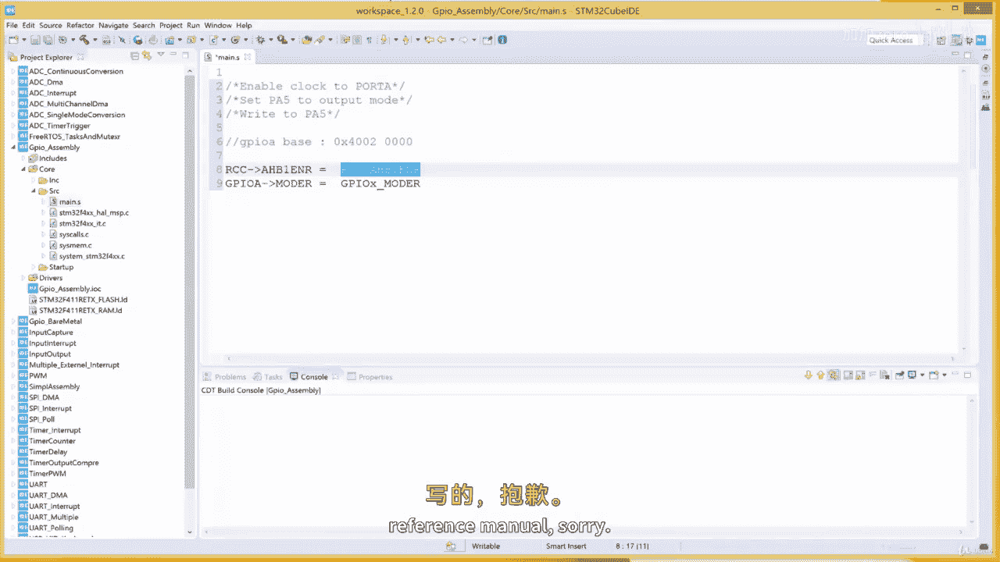

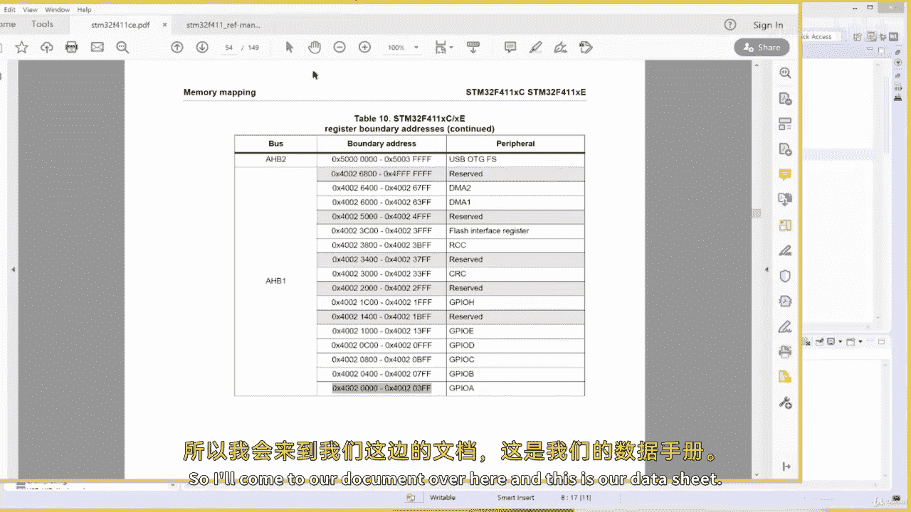

1.  打开数据手册（约140页的文档）。
2.  翻到第54页，找到“存储器映射”章节。
3.  在列表中，可以找到 `GPIOA` 的起始地址为 **0x4002 0000**。这就是 GPIOA 的基地址。
4.  同样，可以找到 `RCC` 的起始地址为 **0x4002 3800**。这就是 RCC 的基地址。

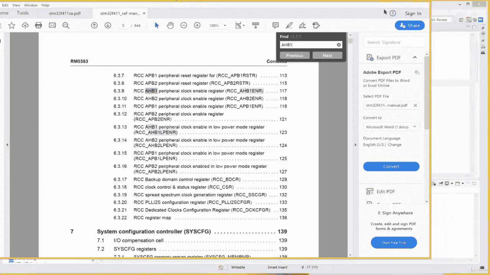

### 2. 查找偏移量并定义符号

接下来，我们需要三个关键寄存器的偏移量：
*   `RCC_AHB1ENR`：用于启用 GPIOA 时钟。
*   `GPIOA_MODER`：用于设置引脚模式（输入/输出）。
*   `GPIOA_ODR`：用于控制引脚的输出电平（高/低）。

我们使用汇编指令 `.EQU` 来为这些地址和偏移量创建易于理解的符号名称。

以下是查找和定义过程：

1.  打开参考手册（页数更多的文档）。
2.  搜索 `AHB1ENR`，找到其偏移量为 **0x30**。
3.  搜索 `MODER`，找到其偏移量为 **0x00**。
4.  搜索 `ODR`，找到其偏移量为 **0x14**。

现在，我们可以在汇编文件中编写以下定义：

```assembly
/* 定义基地址 */
.EQU GPIOA_BASE, 0x40020000
.EQU RCC_BASE,   0x40023800

/* 定义偏移量 */
.EQU AHB1ENR_OFFSET, 0x30
.EQU MODER_OFFSET,   0x00
.EQU ODR_OFFSET,     0x14

/* 通过基地址+偏移量定义完整的寄存器地址 */
.EQU RCC_AHB1ENR, RCC_BASE + AHB1ENR_OFFSET
.EQU GPIOA_MODER, GPIOA_BASE + MODER_OFFSET
.EQU GPIOA_ODR,   GPIOA_BASE + ODR_OFFSET
```

## 编写汇编程序框架

在定义了所有必要的地址之后，我们可以开始搭建汇编程序的基本结构。

```assembly
.syntax unified
.cpu cortex-m4
.thumb

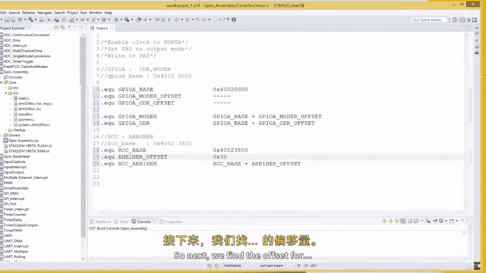

/* 寄存器地址定义（如上所示） */
.EQU GPIOA_BASE, 0x40020000
.EQU RCC_BASE,   0x40023800
.EQU AHB1ENR_OFFSET, 0x30
.EQU MODER_OFFSET,   0x00
.EQU ODR_OFFSET,     0x14
.EQU RCC_AHB1ENR, RCC_BASE + AHB1ENR_OFFSET
.EQU GPIOA_MODER, GPIOA_BASE + MODER_OFFSET
.EQU GPIOA_ODR,   GPIOA_BASE + ODR_OFFSET

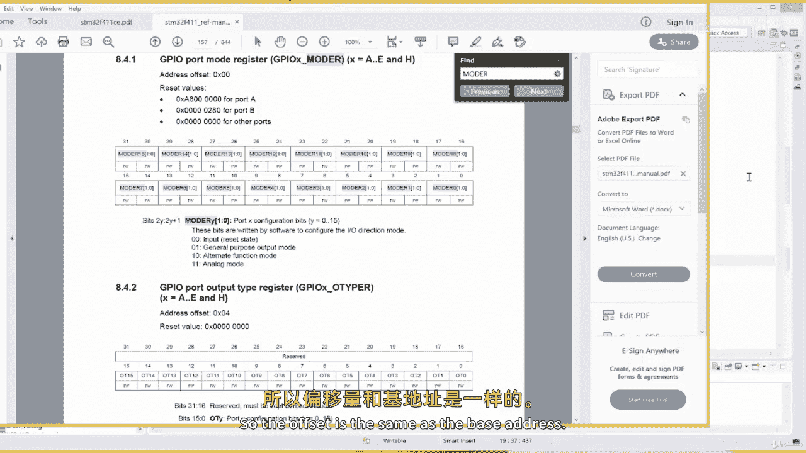

/* 声明主函数为全局标签，供启动文件调用 */
.global main

/* 代码段 */
.section .text
main:
    /* 主程序代码将在这里编写 */
    /* 步骤1：启用GPIOA时钟 */
    /* 步骤2：配置PA5为输出模式 */
    /* 步骤3：控制PA5输出电平 */

    /* 程序结束循环 */
    B .
```

## 总结

本节课中，我们一起学习了开发 GPIO 驱动程序的第一步。我们掌握了如何从官方文档中查找外设的基地址和寄存器偏移量，并利用 `.EQU` 指令为这些地址创建清晰的符号别名。我们还建立了汇编程序的基本框架，为下一节课实际编写初始化代码和控制逻辑打下了坚实的基础。

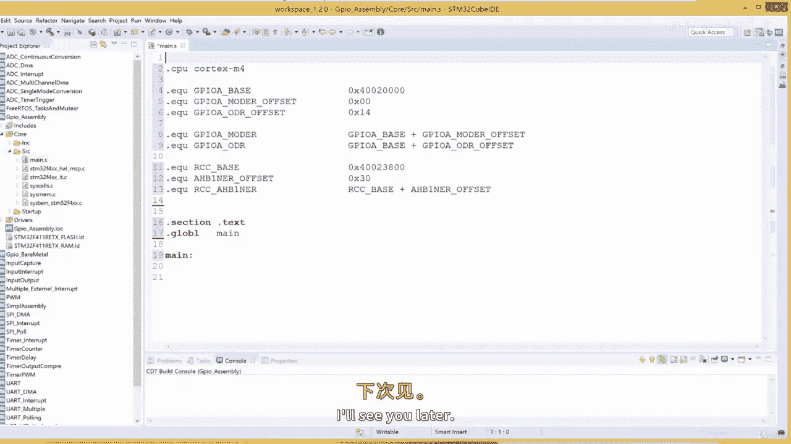

下一节，我们将在这个框架内填入具体的指令，完成时钟使能、模式配置和输出控制，最终让 LED 闪烁起来。