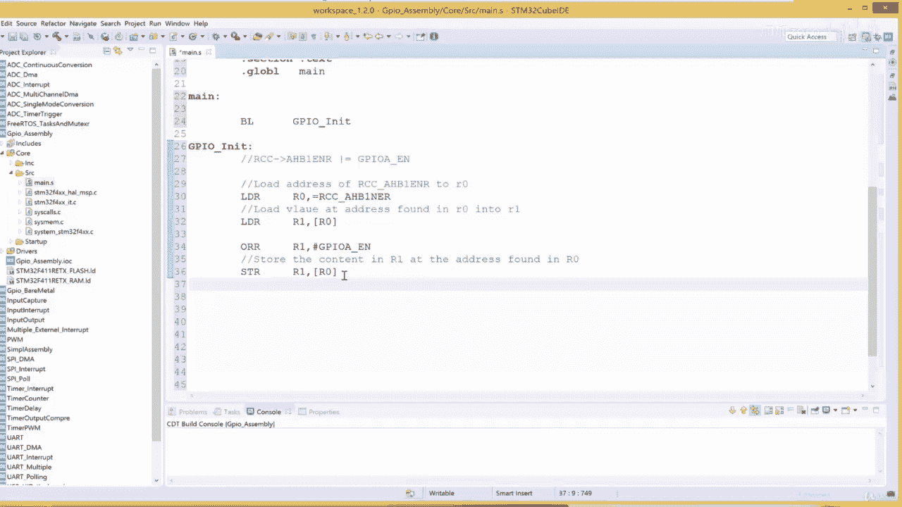
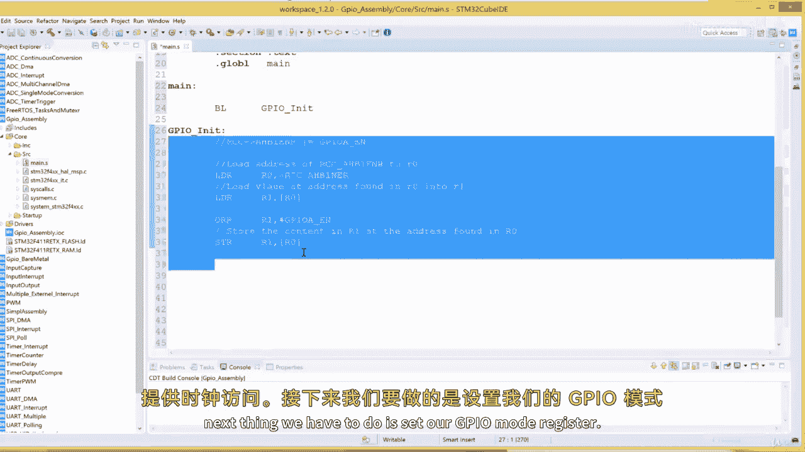
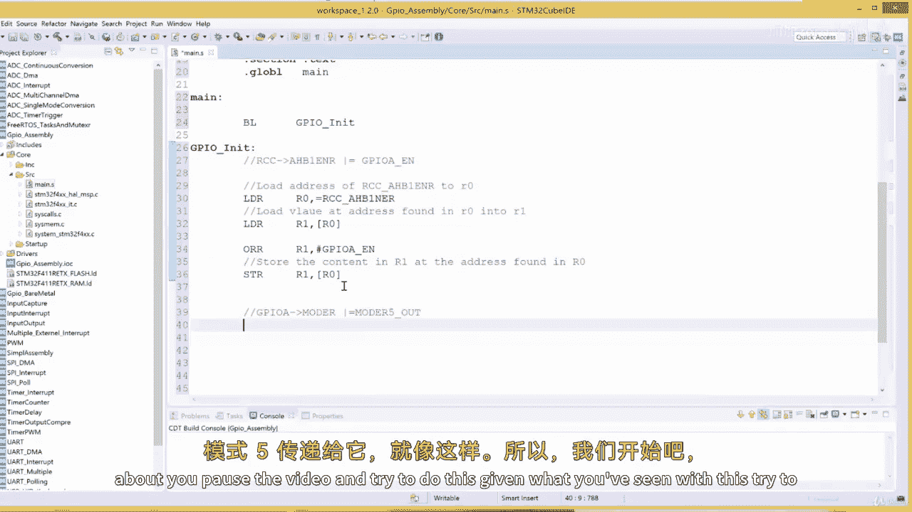
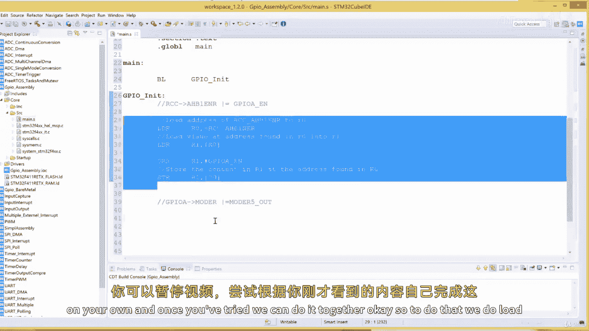
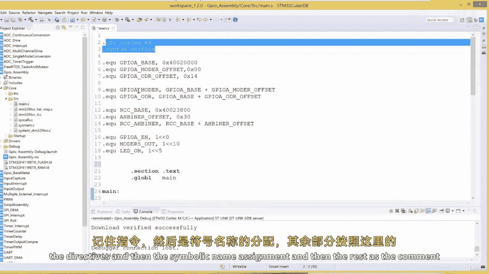
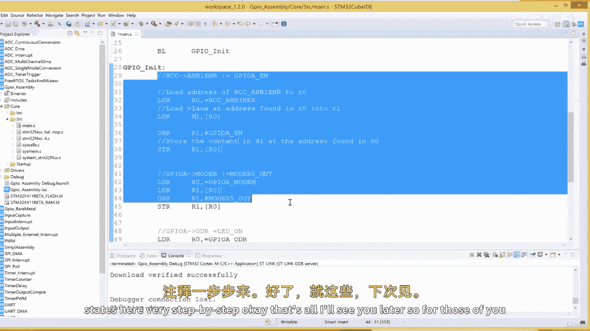
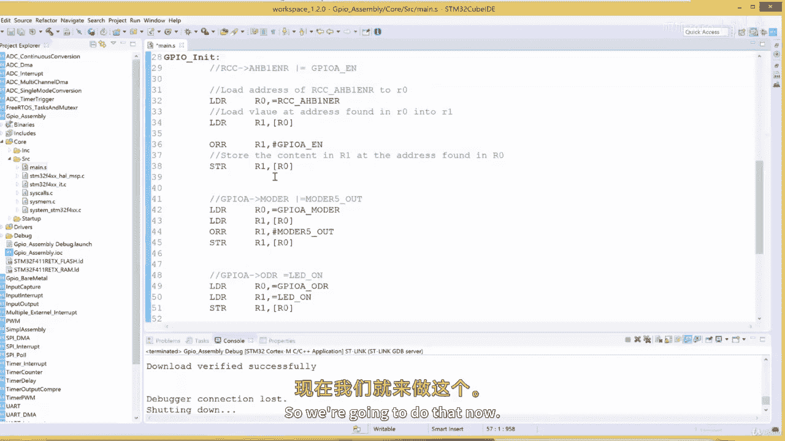

# 010：开发GPIO驱动（第二部分）🚀

在本节课中，我们将继续开发GPIO驱动。我们将基于上一节获取的寄存器地址和定义的符号名称，开始编写初始化子程序。这个子程序将负责启用GPIO端口的时钟、配置引脚为输出模式，并点亮一个LED。

---

## 初始化子程序的结构

上一节我们介绍了如何从数据手册中查找寄存器地址并为其定义符号名称。本节中，我们来看看如何将这些符号应用到实际的初始化代码中。

我们的程序将从 `main` 标签开始执行。进入 `main` 后，程序会立即跳转到一个名为 `GPIOA_INIT` 的子程序。

以下是 `main` 部分的代码框架：

```assembly
.syntax unified
.global main

main:
    BL GPIOA_INIT
```

这段代码使用 `BL` 指令跳转到 `GPIOA_INIT` 子程序。

---

## 定义常量符号

在编写初始化逻辑之前，我们先定义一些常量，使代码更清晰易读。

以下是需要定义的常量：
*   `GPIOA_EN`：用于在RCC寄存器中启用GPIOA时钟的位掩码（第0位）。
*   `MODE5_OUT`：用于将GPIOA引脚5配置为输出模式的位掩码（第10位和第11位）。
*   `LED_ON`：用于设置GPIOA输出数据寄存器（ODR）第5位为1（点亮LED）的值。
*   `LED_OFF`：用于设置GPIOA输出数据寄存器（ODR）第5位为0（熄灭LED）的值。

定义代码如下：

```assembly
.equ GPIOA_EN,   0x01
.equ MODE5_OUT,  0x400   @ 1 << 10
.equ LED_ON,     0x20    @ 1 << 5
.equ LED_OFF,    0x00
```

---

## 编写GPIOA初始化子程序

现在，我们开始实现 `GPIOA_INIT` 子程序。该子程序需要完成三个步骤。

### 步骤一：启用GPIOA时钟

首先，我们需要启用GPIOA端口的时钟。这通过设置RCC AHB1外设时钟使能寄存器（`RCC_AHB1ENR`）的第0位来实现。





在C语言中，操作类似于：
```c
RCC->AHB1ENR |= 0x01;
```



在汇编中，我们遵循“加载-操作-写回”的模式：
1.  将寄存器地址加载到 `R0`。
2.  将当前寄存器值加载到 `R1`。
3.  使用 `ORR` 指令将 `GPIOA_EN` 掩码与 `R1` 的值进行或运算，以启用GPIOA时钟而不影响其他位。
4.  将结果写回内存地址。



以下是实现代码：

```assembly
GPIOA_INIT:
    @ 启用 GPIOA 时钟
    LDR R0, =RCC_AHB1ENR    @ 将 RCC_AHB1ENR 的地址加载到 R0
    LDR R1, [R0]            @ 将地址 R0 处的值（当前寄存器内容）加载到 R1
    ORR R1, R1, #GPIOA_EN   @ 将 R1 的值与 GPIOA_EN 进行或运算，结果存回 R1
    STR R1, [R0]            @ 将 R1 的值存储回地址 R0 指向的内存
```

### 步骤二：配置引脚5为输出模式

接下来，我们需要将GPIOA的引脚5配置为输出模式。这通过设置GPIOA模式寄存器（`GPIOA_MODER`）的第10位和第11位来实现。

操作流程与步骤一类似：
1.  将模式寄存器地址加载到 `R0`。
2.  将当前寄存器值加载到 `R1`。
3.  使用 `ORR` 指令设置输出模式位。
4.  将结果写回。

以下是实现代码：

```assembly
    @ 配置 PA5 为输出模式
    LDR R0, =GPIOA_MODER    @ 将 GPIOA_MODER 的地址加载到 R0
    LDR R1, [R0]            @ 加载当前值到 R1
    ORR R1, R1, #MODE5_OUT  @ 设置 MODER5 为输出模式
    STR R1, [R0]            @ 写回结果
```

### 步骤三：点亮LED（设置引脚输出为高）

最后，我们通过设置GPIOA输出数据寄存器（`GPIOA_ODR`）的第5位为1来点亮LED。

这次我们采用直接写入值的方法，而不是“或”操作，因为我们可能不关心其他引脚的状态：
1.  将输出数据寄存器地址加载到 `R0`。
2.  将 `LED_ON` 的值（0x20）加载到 `R1`。
3.  将 `R1` 的值直接存储到 `R0` 指向的地址。

以下是实现代码：

```assembly
    @ 点亮 LED (设置 PA5 输出为高)
    LDR R0, =GPIOA_ODR      @ 将 GPIOA_ODR 的地址加载到 R0
    LDR R1, =LED_ON         @ 将 LED_ON 的值加载到 R1
    STR R1, [R0]            @ 将 R1 的值存储到 ODR，点亮 LED
```

完成所有操作后，使用 `BX LR` 指令从子程序返回。

```assembly
    BX LR                   @ 从子程序返回
.end
```

---

## 完整代码与调试

将以上所有部分组合起来，就得到了完整的GPIO驱动初始化代码。在集成开发环境中构建此代码时，需要注意两点：
1.  使用 `.syntax unified` 指令来指定统一的汇编语法。
2.  确保符号定义（`.equ`）的语法正确，等号后需有逗号。





构建成功后，进入调试模式并运行程序，连接到GPIOA引脚5的LED应该被点亮。

---

## 总结

本节课中我们一起学习了如何用ARM汇编语言编写一个完整的GPIO驱动初始化子程序。我们回顾了三个核心步骤：
1.  **启用外设时钟**：通过操作RCC寄存器为GPIOA提供时钟信号。
2.  **配置引脚模式**：设置特定的GPIO引脚为输出模式。
3.  **控制引脚电平**：通过写输出数据寄存器来点亮LED。



我们掌握了“加载-操作-写回”这一操作寄存器的基本模式，并学会了使用 `.equ` 定义常量来提高代码可读性。这个简单的驱动是控制所有STM32外设的基础，相同的原理可以应用于配置定时器、ADC、串口等更复杂的模块。