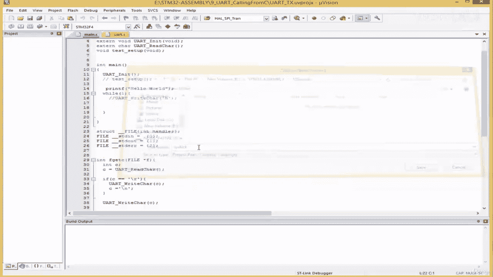
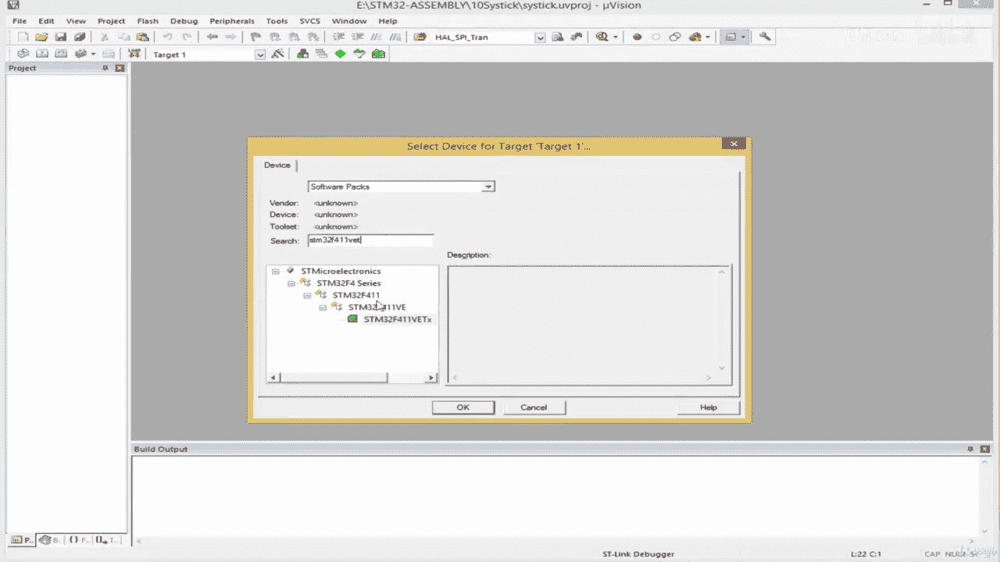
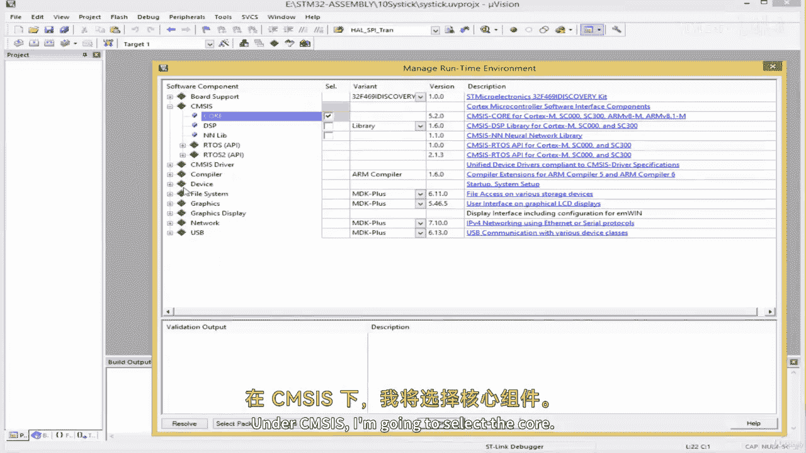
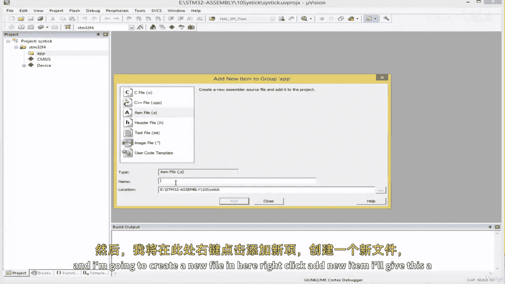
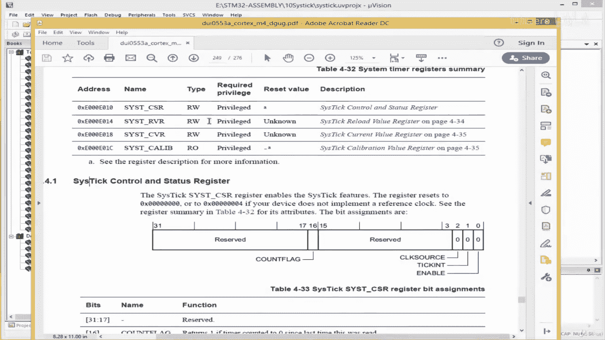
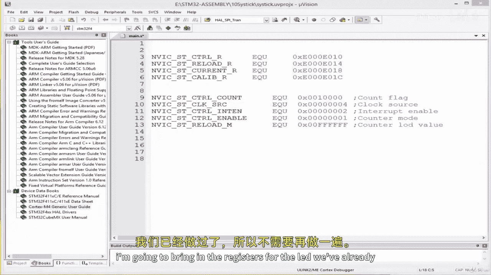

# 021：为 SysTick 寄存器分配符号名称 🧩







在本节课中，我们将学习如何为 ARM Cortex-M 核心外设 SysTick 定时器编写驱动程序。我们将从创建新项目开始，并了解如何为相关的 SysTick 寄存器定义符号名称，以便后续进行配置和控制。



## 创建新项目

首先，我们需要创建一个新的项目。在 IDE 中，选择创建新项目，并选择适用于 STM32F411VET 开发板的项目模板。


项目创建完成后，将目标设备设置为 STM32F4 系列，并将主代码组重命名为 APP。接着，在 APP 组中创建一个新的源文件，命名为 `main.s`。


## 了解 SysTick 定时器

SysTick 定时器是 ARM Cortex-M 架构的一个核心外设。这意味着无论芯片制造商是谁，任何基于 ARM Cortex-M 内核的微控制器都包含此定时器。因此，我们为 SysTick 编写的驱动程序可以适用于 Cortex-M3、M4 或 M7 等多种内核。



要配置 SysTick 定时器，我们需要查阅 ARM Cortex-M4 通用用户指南，而不是特定于某款芯片的数据手册。在指南的第 218 页，可以找到关于核心外设的概述，其中包含了 SysTick 定时器的信息。


配置 SysTick 主要涉及三个寄存器：
*   **SysTick 控制和状态寄存器**
*   **SysTick 重载值寄存器**
*   **SysTick 当前值寄存器**

此外，还有一个 SysTick 校准值寄存器，但在基础配置中可能不常用到。

## 定义寄存器地址的符号名称

为了在代码中清晰、专业地引用这些寄存器，我们将遵循行业惯例，为它们定义符号名称。通常，与嵌套向量中断控制器相关的寄存器会以 `NVIC` 为前缀。

以下是需要定义的寄存器及其地址：

```assembly
; SysTick 寄存器基地址（位于 NVIC 地址空间）
NVIC_ST_CTRL_R    EQU 0xE000E010  ; 控制和状态寄存器
NVIC_ST_RELOAD_R  EQU 0xE000E014  ; 重载值寄存器
NVIC_ST_CURRENT_R EQU 0xE000E018  ; 当前值寄存器
NVIC_ST_CALIB_R   EQU 0xE000E01C  ; 校准值寄存器
```

## 定义控制位配置的符号名称

接下来，我们需要为 SysTick 控制寄存器中的各个功能位定义易于理解的符号名称。这有助于我们在设置寄存器时明确每个值的含义。

以下是控制寄存器中关键位的配置值定义：

```assembly
; SysTick 控制寄存器位定义
NVIC_ST_CTRL_COUNT  EQU 0x00010000  ; 计数标志位（第16位）
NVIC_ST_CTRL_CLK_SRC EQU 0x00000004 ; 时钟源选择：处理器时钟（第2位）
NVIC_ST_CTRL_INTEN   EQU 0x00000002 ; 中断使能（第1位）
NVIC_ST_CTRL_ENABLE  EQU 0x00000001 ; 使能 SysTick 计数器（第0位）
```

**如何理解这些十六进制值？**
每个十六进制数字对应4位二进制数。通过将其转换为二进制，可以清楚地看到哪个位被设置为1。例如，`0x00000001` 的二进制是 `...0001`，表示最低位（第0位）为1。在数据手册中，可以查到该位对应“计数器使能”功能。

## 定义重载值

SysTick 是一个24位递减计数器。我们需要为其设置一个初始的重载值，以决定定时周期。

```assembly
; SysTick 重载值（24位最大值）
NVIC_ST_RELOAD_M   EQU 0x00FFFFFF  ; 最大重载值 (2^24 - 1)
```

## 为 LED 配置定义符号名称（示例）

为了后续演示 SysTick 延时功能，我们还需要配置一个 LED。以下是针对特定开发板（LED 连接在 PA5 引脚）的 GPIO 配置示例：

```assembly
; GPIOA 寄存器地址 (示例，需根据实际数据手册调整)
GPIOA_BASE        EQU 0x40020000
GPIOA_MODER_OFFSET EQU 0x00
GPIOA_ODR_OFFSET   EQU 0x14

GPIOA_MODER_R     EQU GPIOA_BASE + GPIOA_MODER_OFFSET
GPIOA_ODR_R       EQU GPIOA_BASE + GPIOA_ODR_OFFSET

; 引脚配置值
PIN5_OUTPUT_MODE  EQU (0x01 << 10) ; 设置 PA5 为输出模式（位10:11 = 01）
LED_ON            EQU (0x01 << 5)  ; 设置 PA5 输出高电平，点亮 LED
LED_OFF           EQU (0x00 << 5)  ; 设置 PA5 输出低电平，熄灭 LED
```



## 总结

本节课中，我们一起学习了为 SysTick 定时器编写驱动程序的准备工作。我们创建了新项目，了解了 SysTick 作为 ARM 核心外设的特性，并从通用用户指南中找到了关键的寄存器地址。最重要的是，我们为这些寄存器地址以及控制寄存器中的各个配置位定义了清晰、专业的符号名称。这些定义是后续进行实际寄存器操作、实现延时和中断功能的基础。在下一节课中，我们将利用这些定义开始编写具体的汇编代码来控制 SysTick 定时器。