# 030：07.4 编写与测试ADC驱动程序 🔧

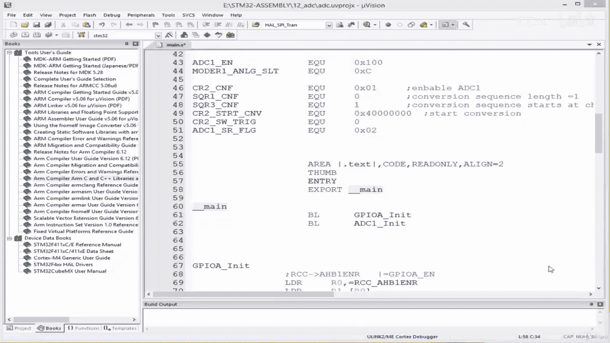

在本节课中，我们将学习如何编写一个ADC驱动程序，并通过LED来测试其功能。我们将创建一个简单的阈值检测系统，当传感器读数超过预设值时，LED将被点亮。

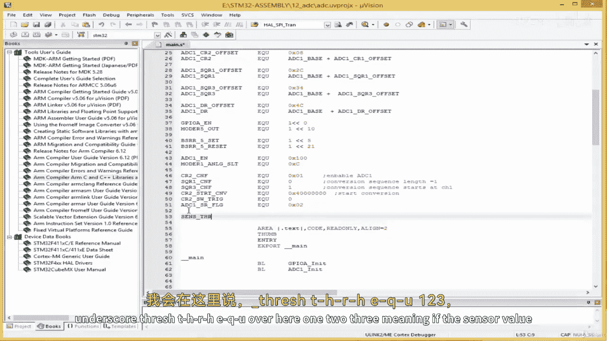

---

## 概述 📋

本节教程将指导您完成以下步骤：
1.  定义传感器阈值。
2.  编写一个LED控制子程序，根据ADC读数与阈值的比较结果来控制LED的开关。
3.  在主循环中整合ADC读取和LED控制逻辑。
4.  构建代码、下载到开发板并进行测试。

---

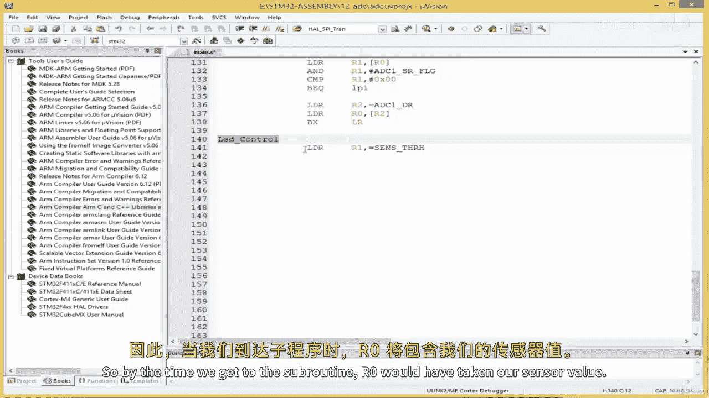

## 定义传感器阈值

首先，我们需要定义一个阈值常量。STM32微控制器的ADC是12位的，这意味着其最大读数值为4095。

我们将创建一个名为 `SENSOR_THRESH` 的常量，并将其值设置为3000。当传感器读数超过此值时，将触发一个动作（点亮LED）。

**代码示例：**
```assembly
SENSOR_THRESH EQU 3000
```

---

## 编写LED控制子程序

上一节我们介绍了如何读取ADC值。本节中，我们来看看如何根据该值来控制LED。

我们将创建一个名为 `LED_CONTROL` 的子程序。其逻辑是：比较存储在寄存器R0中的ADC读数与我们定义的阈值。如果读数大于阈值，则跳转到 `LED_ON` 标签点亮LED；如果小于阈值，则跳转到 `LED_OFF` 标签关闭LED。

**代码示例：**
```assembly
LED_CONTROL:
    LDR R1, =SENSOR_THRESH  ; 将阈值常量加载到R1
    CMP R0, R1              ; 比较ADC值(R0)与阈值(R1)
    BGT LED_ON              ; 如果 R0 > R1，跳转到LED_ON
    BLT LED_OFF             ; 如果 R0 < R1，跳转到LED_OFF
    BX LR                   ; 返回调用处

LED_ON:
    LDR R5, =GPIOA_BSRR     ; 加载GPIOA端口置位寄存器地址到R5
    MOV R1, #GPIO_PIN_5_SET ; 设置点亮LED（引脚5）的值
    STR R1, [R5]            ; 将值写入BSRR寄存器以点亮LED
    BX LR                   ; 返回

LED_OFF:
    LDR R5, =GPIOA_BSRR     ; 加载GPIOA端口置位寄存器地址到R5
    MOV R1, #GPIO_PIN_5_RESET ; 设置熄灭LED（引脚5）的值
    STR R1, [R5]            ; 将值写入BSRR寄存器以熄灭LED
    BX LR                   ; 返回
```

以下是关键步骤的说明：
*   `CMP R0, R1`：比较指令，用于设置条件标志。
*   `BGT` / `BLT`：条件分支指令，根据比较结果进行跳转。
*   `LDR R5, =GPIOA_BSRR`：将GPIOA_BSRR寄存器的内存地址加载到R5。
*   `STR R1, [R5]`：将R1中的值存储到R5所指向的内存地址（即GPIOA_BSRR寄存器）。

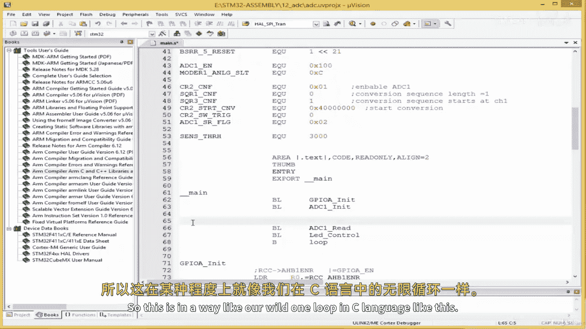

---

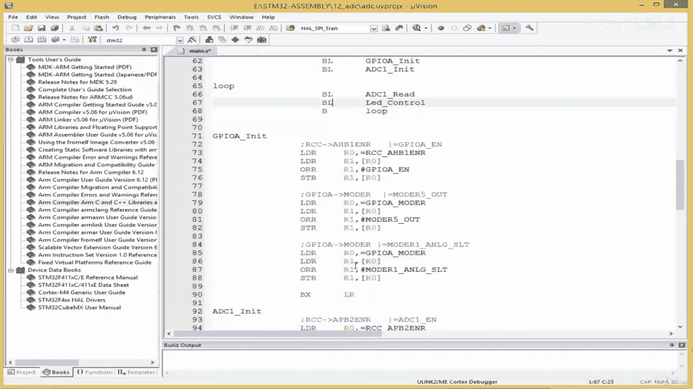

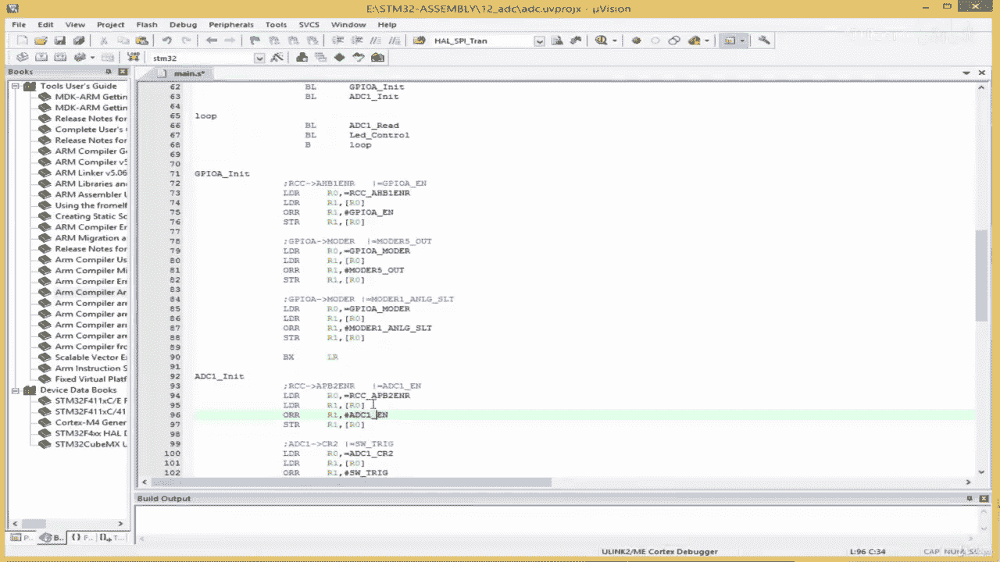

## 整合主程序循环

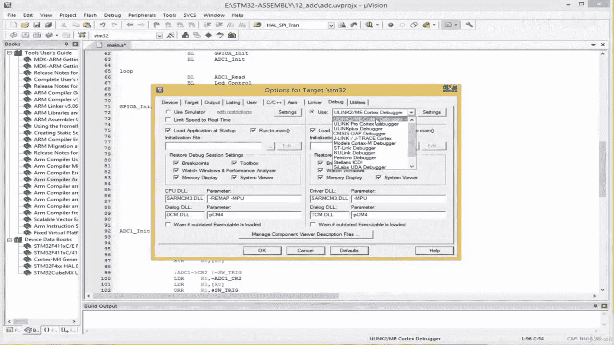

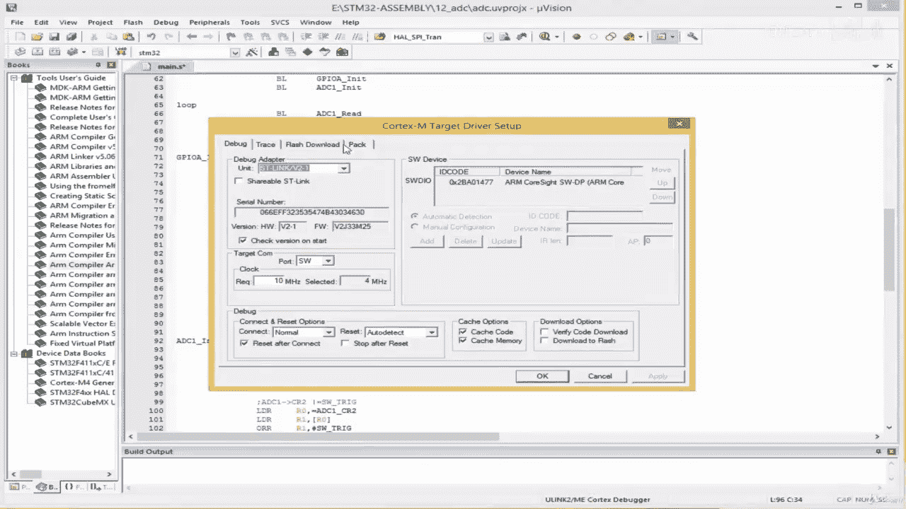

现在，我们需要在主程序中调用这些子程序。程序流程如下：初始化GPIO和ADC，然后进入一个无限循环，在循环中不断读取ADC值并据此控制LED。

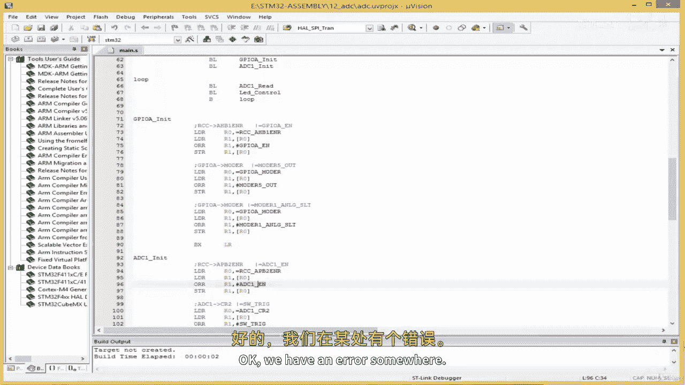

**代码示例：**
```assembly
    BL GPIO_INIT   ; 初始化GPIO
    BL ADC_INIT    ; 初始化ADC

main_loop:
    BL ADC1_READ   ; 读取ADC值，结果存入R0
    BL LED_CONTROL ; 根据R0的值控制LED
    B main_loop    ; 跳回循环开始，实现类似C语言中while(1)的效果
```

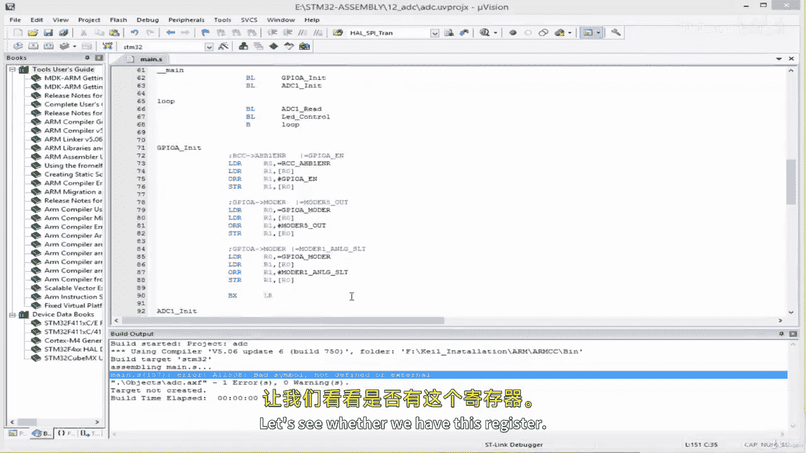

---

## 构建与调试

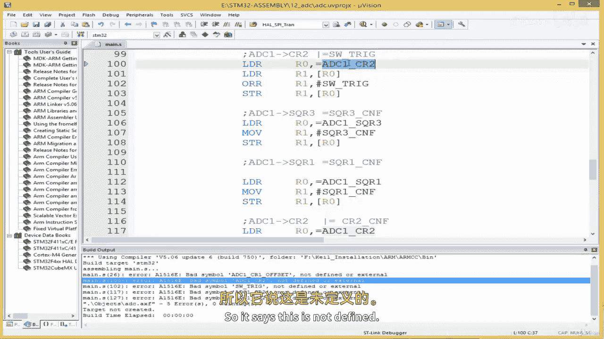

代码编写完成后，需要进行构建和调试。以下是可能遇到的常见错误及解决方法：

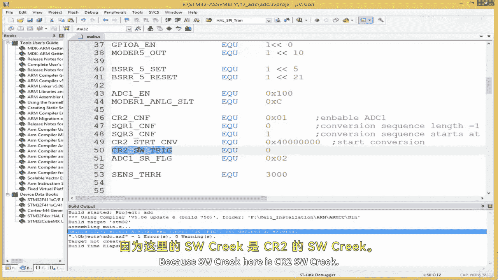

1.  **语法错误**：例如遗漏等号（`=`）或使用了未定义的符号。仔细检查所有常量和标签的拼写。
2.  **寄存器名称错误**：确保引用的外设寄存器名称（如`GPIOA_BSRR`， `ADC1_CR2`）与芯片手册完全一致。
3.  **链接错误**：确保所有引用的子程序或标签都已正确定义。

在集成开发环境中正确设置调试选项（如选择调试器、设置复位和运行模式）后，即可将程序下载到开发板。

---

## 硬件连接与测试 🧪

为了测试程序，需要将电位器连接到开发板：
*   **电位器中间引脚**：连接到微控制器的 **PA1** 引脚（ADC输入通道）。
*   **电位器一端**：连接到 **3.3V**。
*   **电位器另一端**：连接到 **GND**。

测试时，旋转电位器。当ADC读数超过3000（阈值）时，LED应点亮；当读数低于3000时，LED应熄灭。

---

## 总结 🎯

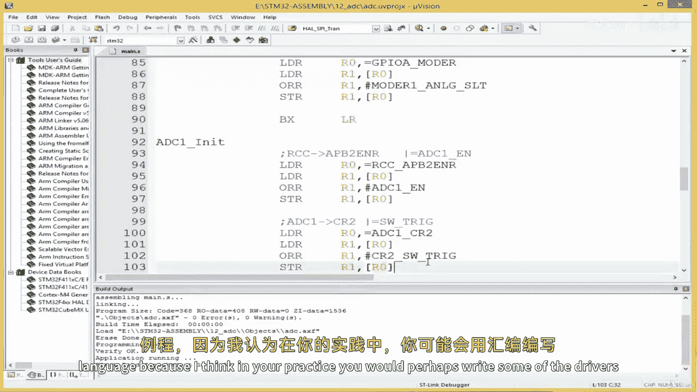

本节课中我们一起学习了：
1.  如何为ADC读数定义一个阈值常量。
2.  如何编写一个包含条件判断的汇编子程序来控制LED。
3.  如何将ADC读取和LED控制逻辑整合到一个主循环中。
4.  如何构建程序、解决常见错误，并在实际硬件上进行测试。

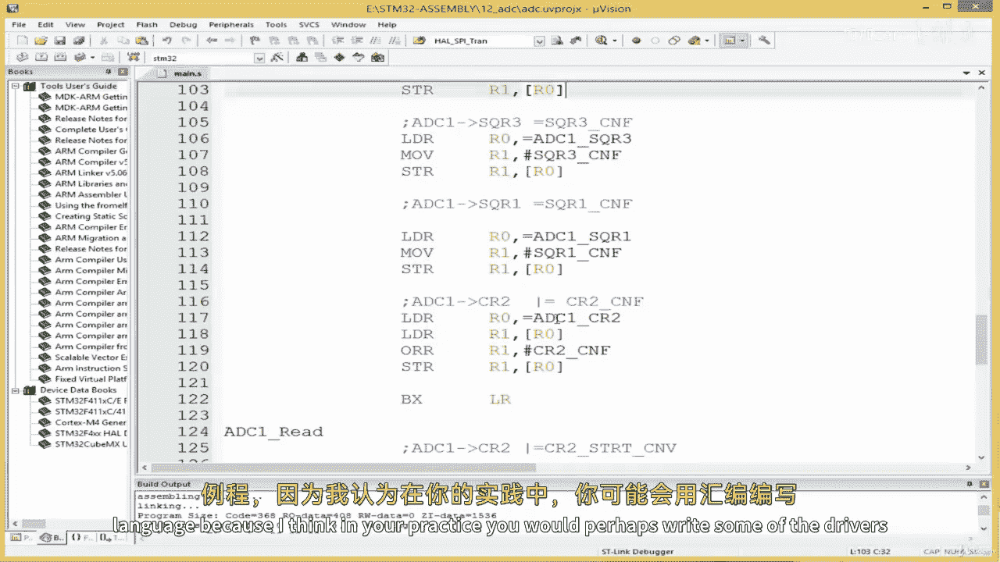

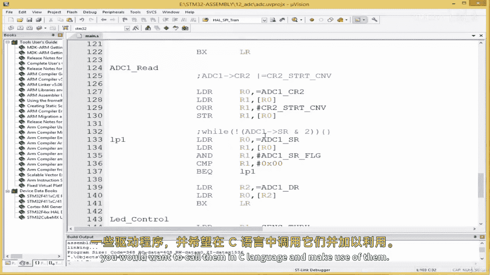

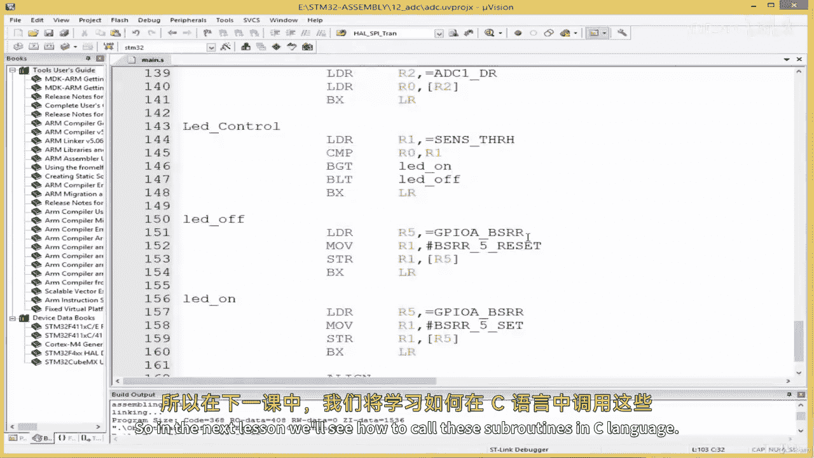

通过这个实践，我们掌握了使用ARM汇编语言处理模拟信号并驱动数字输出的基本流程。在下一课中，我们将探讨如何从C语言中调用这些用汇编编写的驱动程序，以实现更复杂的应用。