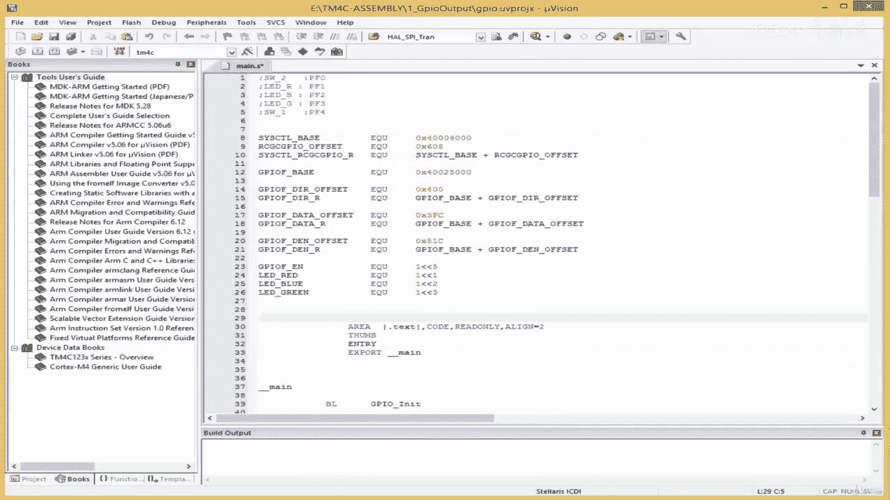
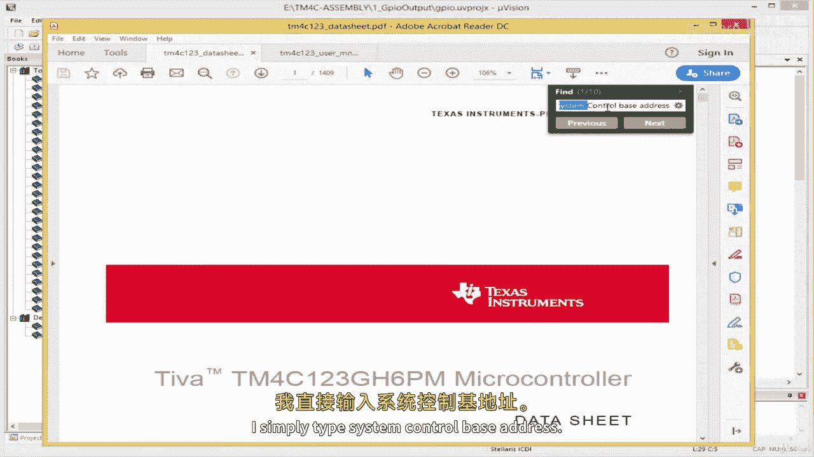
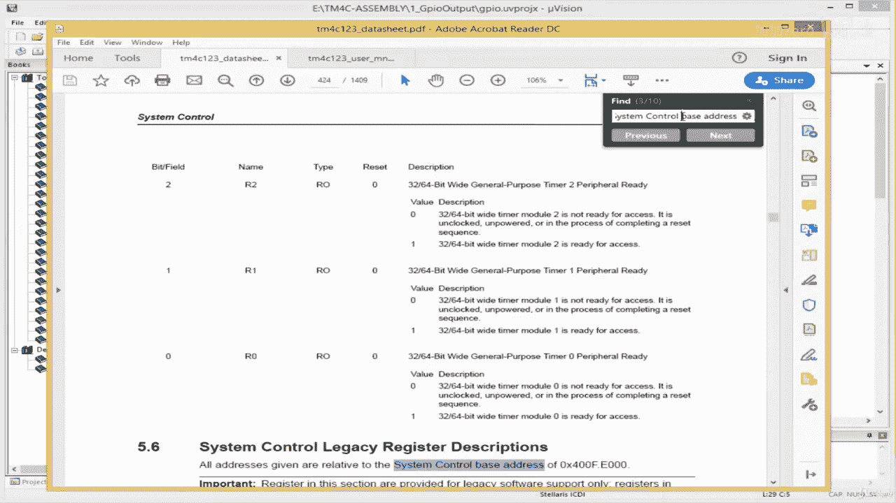
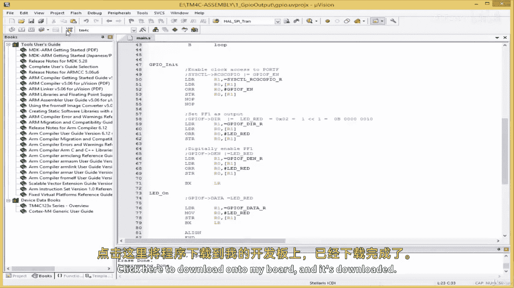

# 034：编写 GPIO 输出驱动 🚦

在本节课中，我们将学习如何为 ARM 微控制器编写一个基础的 GPIO 输出驱动程序。我们将从设置时钟访问开始，到配置引脚为输出模式，最后实现控制 LED 点亮的功能。通过动手实践，你将理解如何用汇编语言直接操作硬件寄存器。

## 概述
本节教程将指导你使用 ARM 汇编语言，为 GPIO 端口编写一个完整的输出驱动程序。我们将逐步实现初始化、引脚配置和输出控制，并最终在开发板上点亮一个 LED。

---

### 编写 GPIO 初始化子程序

首先，我们需要设置代码区域和入口点。使用 `AREA` 指令定义一个只读的代码段，并使用 `THUMB` 模式，因为 Cortex-M 系列处理器通常运行在此模式下。

```assembly
AREA    |.text|, CODE, READONLY, ALIGN=2
THUMB
ENTRY
EXPORT __main
```

接下来，我们进入 `__main` 函数，并首先跳转到名为 `GPIO_INIT` 的子程序，以初始化 GPIO 端口。

```assembly
__main
    B   GPIO_INIT
```

### 初始化 GPIO 时钟和引脚

上一节我们设置了程序入口，本节中我们来看看如何具体初始化 GPIO。这个过程主要分为三步：启用端口时钟、设置引脚方向为输出、以及数字使能该引脚。

以下是 `GPIO_INIT` 子程序的具体步骤：

1.  **启用端口时钟**：我们需要访问系统控制模块的 RCGCGPIO 寄存器来启用 GPIO 端口的时钟。在 C 语言中，这类似于 `SYSCTL->RCGCGPIO |= PORTF_ENABLE;`。在汇编中，我们通过加载寄存器地址、读取-修改-写回的方式来实现。

    ```assembly
    GPIO_INIT
        LDR R1, =SYSCTL_RCGCGPIO_R  ; 加载 RCGCGPIO 寄存器地址到 R1
        LDR R0, [R1]                ; 读取当前寄存器值到 R0
        ORR R0, R0, #GPIO_PORTF_EN  ; 将端口 F 的使能位与 R0 进行或操作
        STR R0, [R1]                ; 将修改后的值写回寄存器
        NOP                         ; 等待时钟稳定
        NOP
    ```

2.  **设置引脚方向为输出**：接下来，我们需要配置目标引脚（例如 PF1）为输出模式。这通过操作 GPIO 端口的方向寄存器（GPIODIR）完成。我们将把 PF1 对应的位（我们定义为 `LED_RED`）设置为 1。

    ```assembly
        LDR R1, =GPIO_PORTF_DIR_R   ; 加载 GPIO 端口 F 方向寄存器地址
        LDR R0, [R1]                ; 读取当前值
        ORR R0, R0, #LED_RED        ; 设置 PF1 引脚为输出模式
        STR R0, [R1]                ; 写回寄存器
    ```

3.  **数字使能引脚**：最后，我们必须通过数字使能寄存器（GPIODEN）来激活引脚的数字功能。操作方式与设置方向类似。

    ```assembly
        LDR R1, =GPIO_PORTF_DEN_R   ; 加载数字使能寄存器地址
        LDR R0, [R1]                ; 读取当前值
        ORR R0, R0, #LED_RED        ; 使能 PF1 引脚的数字功能
        STR R0, [R1]                ; 写回寄存器
        BX  LR                      ; 子程序返回
    ```

### 编写 LED 控制子程序

初始化完成后，我们就可以控制 LED 了。现在我们来编写一个用于点亮 LED 的子程序。

以下是 `LED_ON` 子程序的实现：

1.  **点亮 LED**：要点亮连接在 PF1 上的 LED，我们需要向 GPIO 端口的数据寄存器（GPIODATA）的对应位写入 1。在汇编中，我们直接将代表 LED 的值存储到数据寄存器的地址。

    ```assembly
    LED_ON
        LDR R1, =GPIO_PORTF_DATA_R  ; 加载 GPIO 端口 F 数据寄存器地址
        MOV R0, #LED_RED            ; 将 LED_RED 的值（即 PF1 为高）移动到 R0
        STR R0, [R1]                ; 将值写入数据寄存器，点亮 LED
        BX  LR                      ; 子程序返回
    ```

### 构建主循环并测试

现在，我们将所有部分组合起来。在主程序中，先调用初始化子程序，然后在一个无限循环中不断调用 `LED_ON` 子程序，使 LED 保持常亮。





```assembly
__main
    BL  GPIO_INIT   ; 调用 GPIO 初始化
MainLoop
    BL  LED_ON      ; 调用点亮 LED 的子程序
    B   MainLoop    ; 跳回循环开始，形成无限循环

    ALIGN           ; 对齐指令
    END             ; 程序结束
```

代码编写完成后，需要进行编译、下载到开发板并调试。确保在调试器设置中选择了正确的目标，并执行“Reset and Run”。如果 LED 没有点亮，应检查代码，特别是硬件寄存器的基地址是否正确。例如，系统控制模块的基地址可能需要从芯片数据手册中直接获取，而非从其他模块推导。



---



## 总结
本节课中我们一起学习了如何用 ARM 汇编语言编写一个完整的 GPIO 输出驱动。我们从定义代码段开始，逐步实现了启用时钟、配置引脚模式和数字功能，最后通过写数据寄存器控制了 LED 的输出状态。这个过程清晰地展示了如何通过直接操作内存映射寄存器来控制微控制器外设的基本方法。