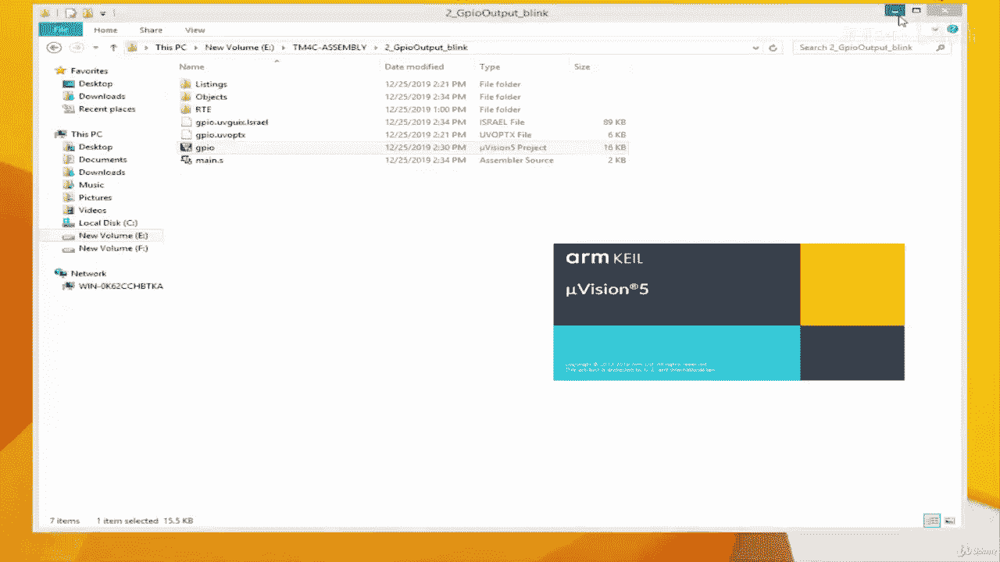
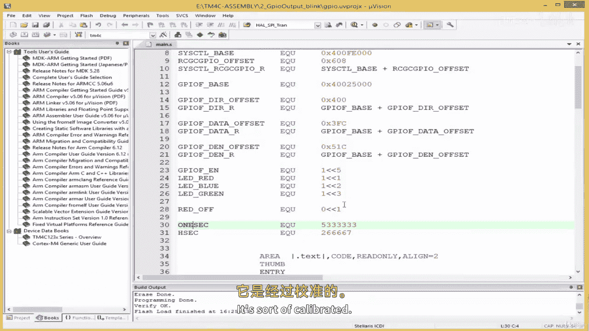

# 035：控制 GPIO 输出 🔄



在本节课中，我们将学习如何通过编写汇编代码，让连接到 GPIO 引脚上的 LED 灯实现闪烁效果。我们将创建一个简单的延时函数，并利用它来控制 LED 的亮灭周期。

上一节我们介绍了如何初始化 GPIO 并点亮 LED。本节中我们来看看如何让 LED 闪烁起来，这需要我们在“点亮”和“熄灭”操作之间加入延时。

## 创建延时函数

首先，我们需要创建一个延时函数。需要说明的是，本节创建的延时函数并非高精度延时，其延时长度取决于特定的微控制器配置和编译器。后续在定时器章节，我们将学习如何创建精确的延时。

以下是创建延时符号常量的步骤：
*   `ONE_SEC EQU 0x003D0900`：定义一个名为 `ONE_SEC` 的常量，其值约为1秒的循环计数（此值针对特定时钟频率和编译器校准）。
*   `HALF_SEC EQU 0x001E8480`：定义半个秒的常量，其值为 `ONE_SEC` 的一半。

接下来，我们编写延时子程序 `delay`。该子程序通过递减寄存器 `R3` 中的值来实现延时。

```assembly
delay:
    SUBS R3, R3, #1   ; 将R3的值减1，并设置状态标志位
    BNE delay         ; 如果结果不为零（Z标志未置位），则跳回`delay`标签继续循环
    BX LR             ; 返回调用处
```

## 实现 LED 闪烁功能

现在，我们可以利用 GPIO 驱动和延时函数来编写 LED 闪烁的主逻辑。

以下是 `led_blink` 子程序的具体步骤：
1.  **点亮 LED**：将对应 LED 引脚（例如引脚1）的数据寄存器位置位。
2.  **延时**：将 `ONE_SEC` 常量加载到 `R3` 寄存器，然后调用 `delay` 函数。
3.  **熄灭 LED**：清除对应 LED 引脚的数据寄存器位。
4.  **再次延时**：重复步骤2的延时操作。
5.  **循环**：跳回步骤1，形成无限循环，使 LED 持续闪烁。

核心操作对应的代码逻辑如下：
*   **点亮LED**：`LDR R1, =GPIOA_ODR` 后执行 `ORR R0, R0, #(1<<1)`。
*   **熄灭LED**：`LDR R1, =GPIOA_ODR` 后执行 `BIC R0, R0, #(1<<1)`。
*   **调用延时**：`LDR R3, =ONE_SEC` 后执行 `BL delay`。

将代码编译并下载到开发板后，即可观察到 LED 以大约1秒的间隔规律闪烁。



## 总结

本节课中我们一起学习了如何通过汇编语言控制 GPIO 输出实现 LED 闪烁。我们创建了一个基础的延时函数，并组织了“点亮-延时-熄灭-延时”的循环逻辑。虽然当前的延时方法不够精确，但它很好地演示了硬件控制的基本流程。在后续关于定时器的课程中，我们将探索更精准的定时方法。