# 043：为相关UART寄存器分配符号名 🧩

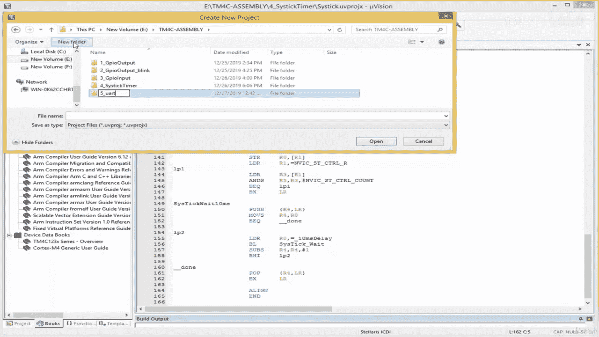

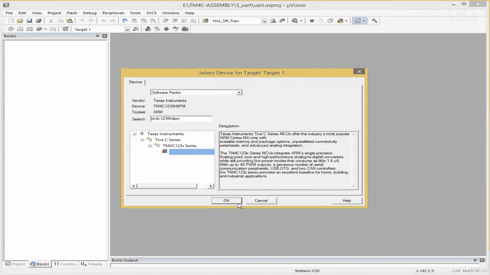

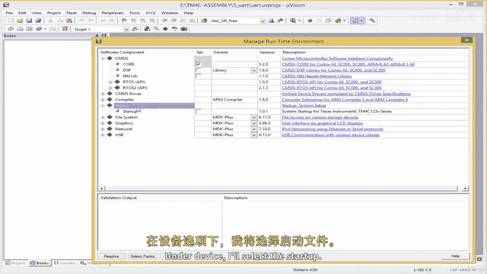

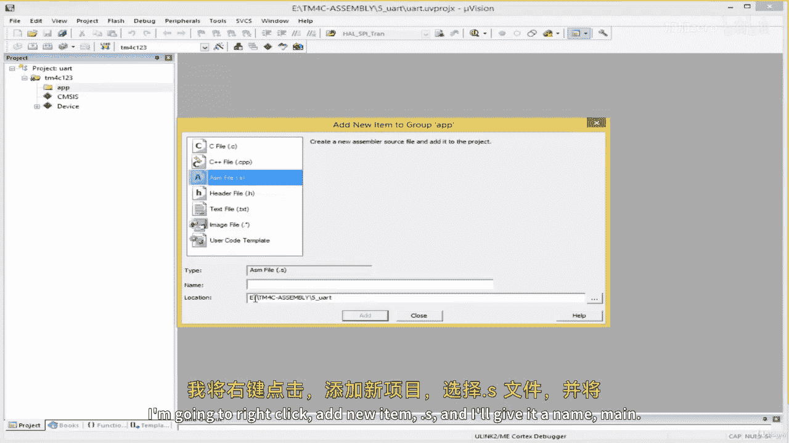

在本节课中，我们将学习如何为TM4C123微控制器开发UART驱动程序。我们将从创建一个新项目开始，并逐步为所有相关的GPIO和UART寄存器分配符号名，为后续编写驱动代码打下基础。

## 创建新项目与文件

首先，我们需要在Keil uVision中创建一个新项目。

1.  选择“New uVision Project”。
2.  为项目创建一个新文件夹，命名为 `uart`。
3.  将项目命名为 `uart`。
4.  在设备选择中，找到并选择 `TM4C123GH6PM`。
5.  在CMSIS管理界面，选择 `Core` 和 `Startup` 文件。
6.  将默认的源文件组重命名为 `APP`。
7.  右键点击 `APP` 组，选择“Add New Item”，创建一个名为 `main.s` 的汇编源文件。

至此，项目框架搭建完成。我们将使用UART0，其RX和TX线分别连接到PA0和PA1引脚。要使用UART功能，必须先将这些GPIO引脚配置为复用功能（Alternate Function）。

## 查找并定义寄存器基地址

要配置外设，首先需要从数据手册中查找相关寄存器的地址。以下是需要定义的关键基地址：

*   **GPIOA基地址**：这是配置PA0和PA1引脚（UART0的RX/TX）的起点。
*   **系统控制基地址**：用于启用GPIOA和UART0的时钟。

我们在之前的课程中已经定义了系统控制的基地址，可以直接复用。现在，我们从数据手册中复制GPIOA的基地址，并在代码中为其创建符号名。

```assembly
; 定义 GPIO Port A 的基地址
GPIOA_BASE EQU 0x40004000

; 定义系统控制基地址 (已在之前课程中定义)
SYSCTL_BASE EQU 0x400FE000
```

## 定义GPIO相关寄存器符号名

配置GPIO引脚需要操作几个关键寄存器。我们将为每个寄存器定义两个符号名：一个是偏移量，另一个是完整的寄存器地址。

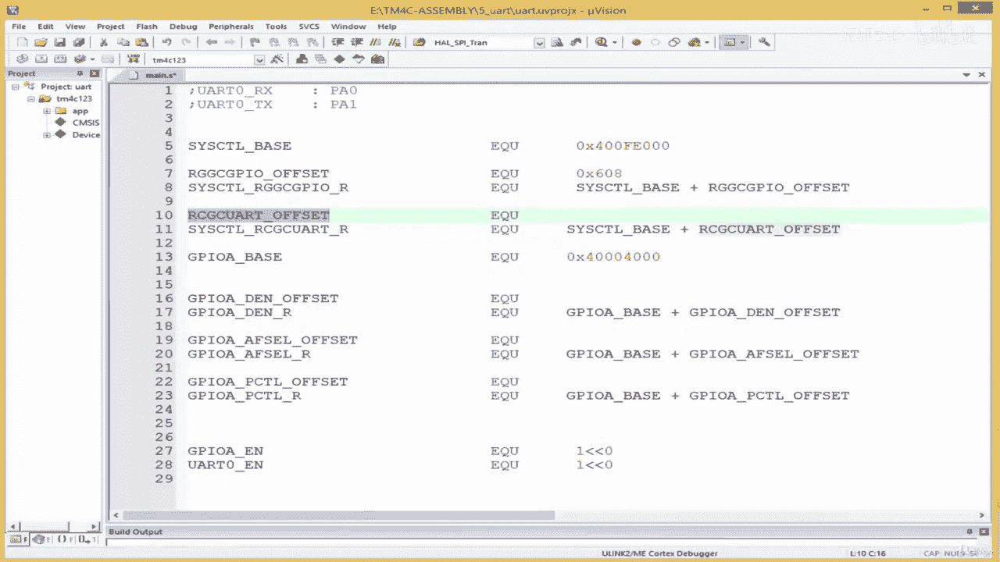

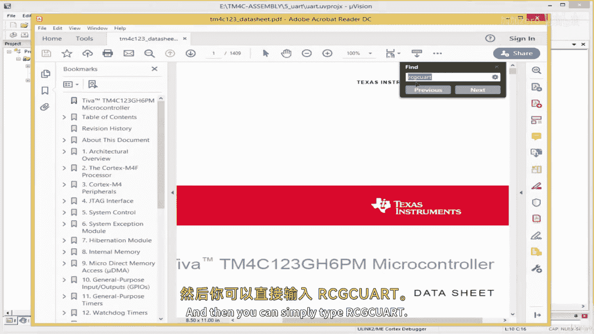

以下是需要为GPIOA定义的寄存器：

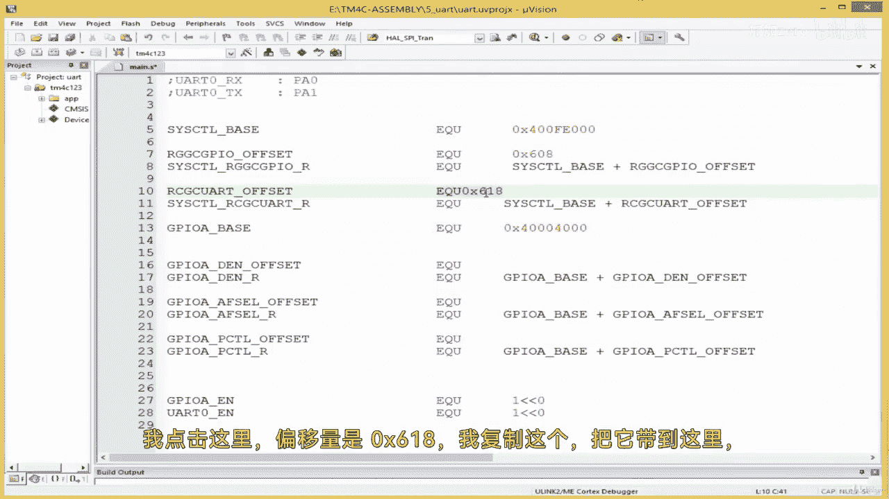

*   **数字使能寄存器 (GPIOA_DEN_R)**：用于启用引脚的数字功能。
*   **复用功能选择寄存器 (GPIOA_AFSEL_R)**：用于将引脚功能切换到UART。
*   **端口控制寄存器 (GPIOA_PCTL_R)**：用于为引脚选择具体的复用功能编号（例如，UART0）。

我们首先为这些寄存器定义偏移量占位符和寄存器地址符号名。

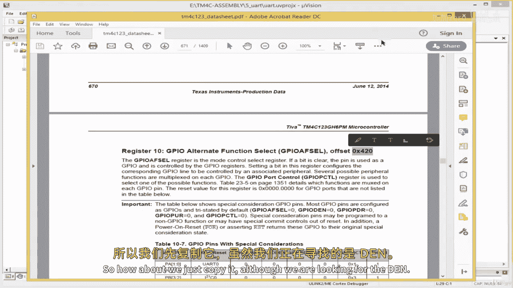

```assembly
; GPIOA 寄存器偏移量 (稍后从数据手册填充)
GPIOA_DEN_OFFSET   EQU
GPIOA_AFSEL_OFFSET EQU
GPIOA_PCTL_OFFSET  EQU

; GPIOA 寄存器地址
GPIOA_DEN_R   EQU GPIOA_BASE + GPIOA_DEN_OFFSET
GPIOA_AFSEL_R EQU GPIOA_BASE + GPIOA_AFSEL_OFFSET
GPIOA_PCTL_R  EQU GPIOA_BASE + GPIOA_PCTL_OFFSET
```

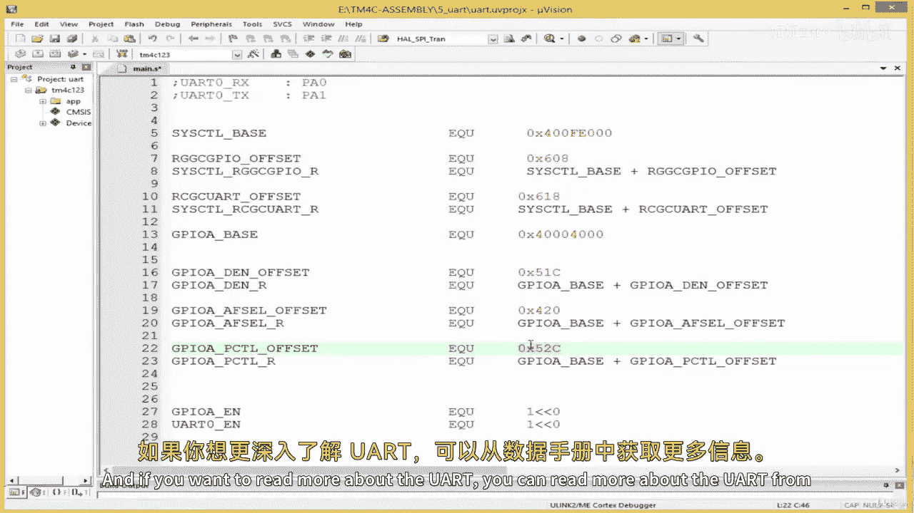

## 定义时钟使能控制位

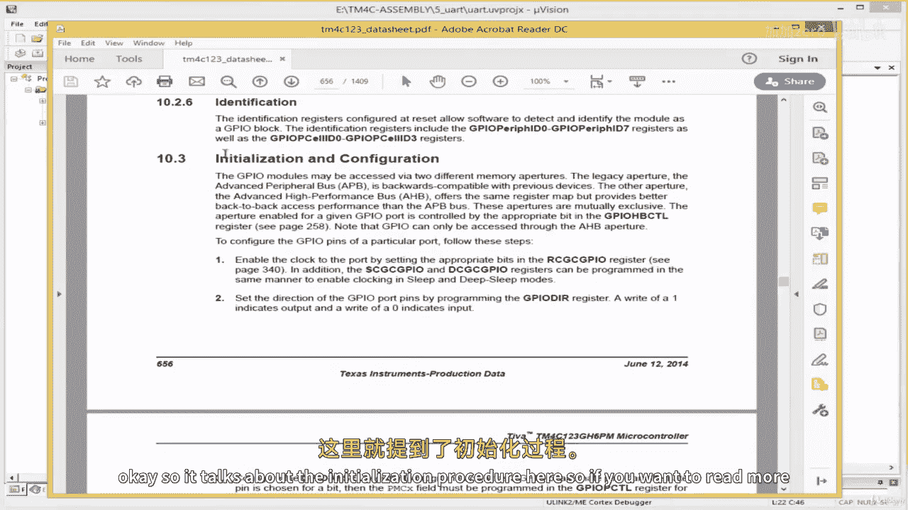

在访问任何外设前，必须通过系统控制模块启用其时钟。我们需要为GPIOA和UART0定义时钟门控使能位。

*   **GPIOA时钟使能**：位于 `RCGCGPIO` 寄存器的位0。
*   **UART0时钟使能**：位于 `RCGCUART` 寄存器的位0。

我们为它们定义易于理解的常量。

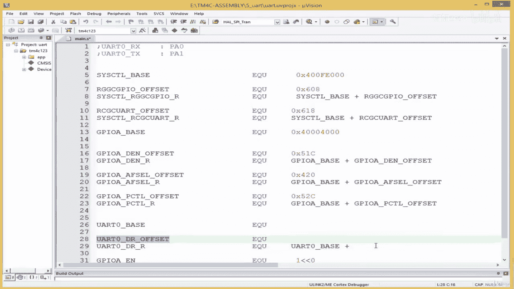

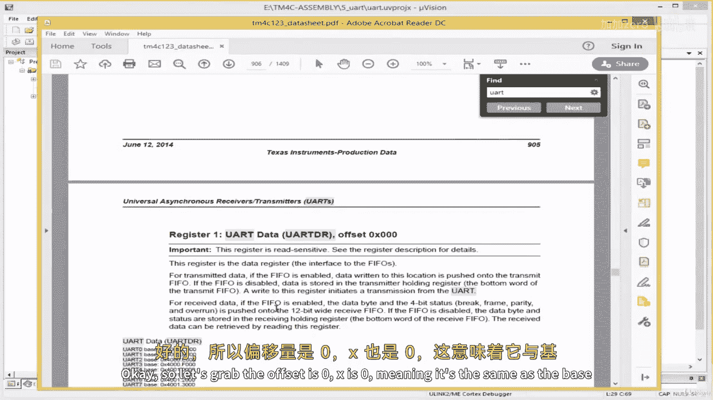

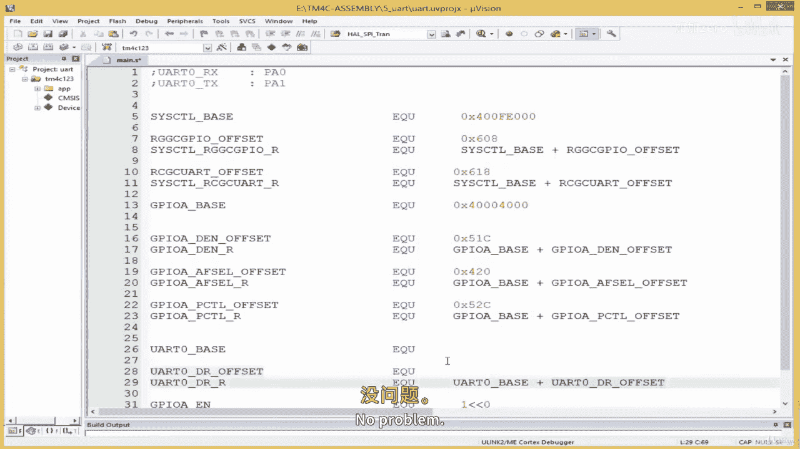

```assembly
; 时钟使能控制位
GPIOA_EN EQU (1 << 0) ; 置位 RCGCGPIO 寄存器的位0以启用 GPIOA 时钟
UART0_EN EQU (1 << 0) ; 置位 RCGCUART 寄存器的位0以启用 UART0 时钟
```

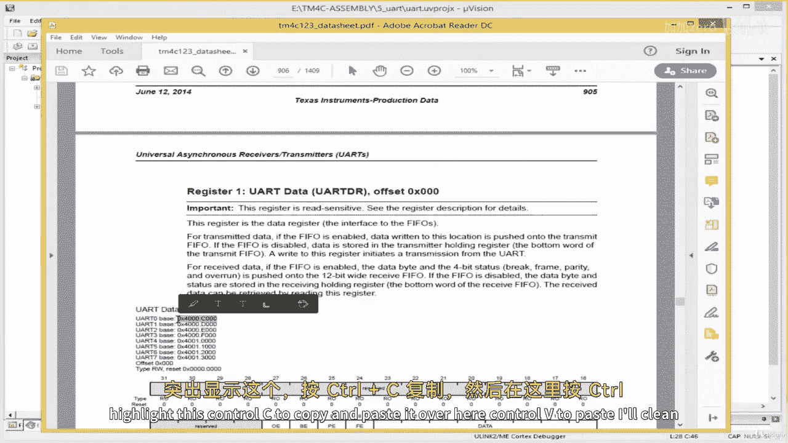

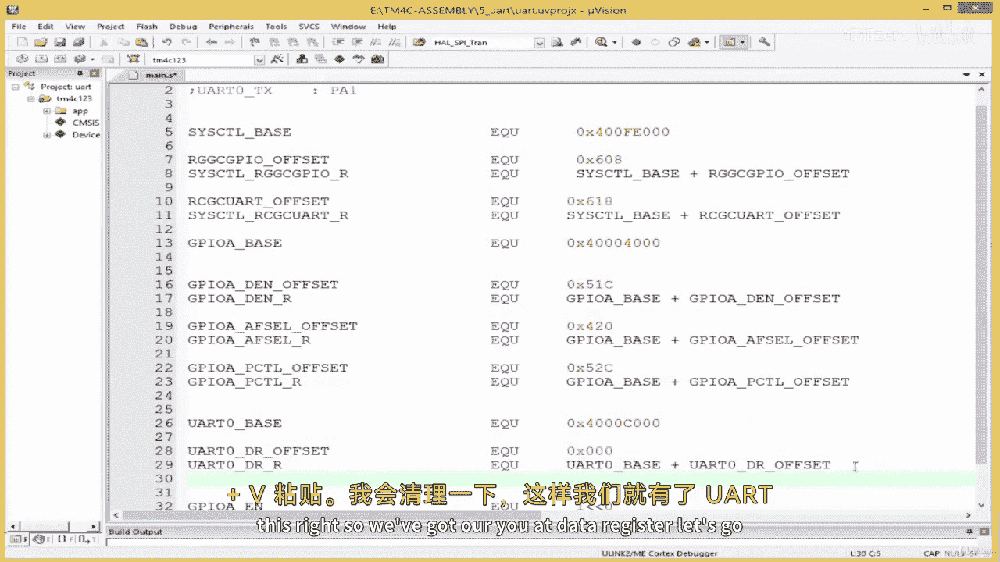

接下来，需要找到 `RCGCUART` 寄存器的地址。从数据手册中查得其偏移量为 `0x618`。然后定义其寄存器地址。

```assembly
; 系统控制中 UART 时钟门控寄存器的偏移量
SYSCTL_RCGCUART_OFFSET EQU 0x618

; UART 时钟门控寄存器地址
SYSCTL_RCGCUART_R EQU SYSCTL_BASE + SYSCTL_RCGCUART_OFFSET
```

## 填充GPIO寄存器偏移量

现在，我们从数据手册中查找并填充GPIOA相关寄存器的具体偏移量。

*   `GPIOA_AFSEL_R` 偏移量：`0x420`
*   `GPIOA_PCTL_R` 偏移量：`0x52C`
*   `GPIOA_DEN_R` 偏移量：`0x51C`

更新代码中的定义：

```assembly
; GPIOA 寄存器偏移量 (从数据手册获取)
GPIOA_DEN_OFFSET   EQU 0x51C
GPIOA_AFSEL_OFFSET EQU 0x420
GPIOA_PCTL_OFFSET  EQU 0x52C
```

## 定义UART0寄存器符号名

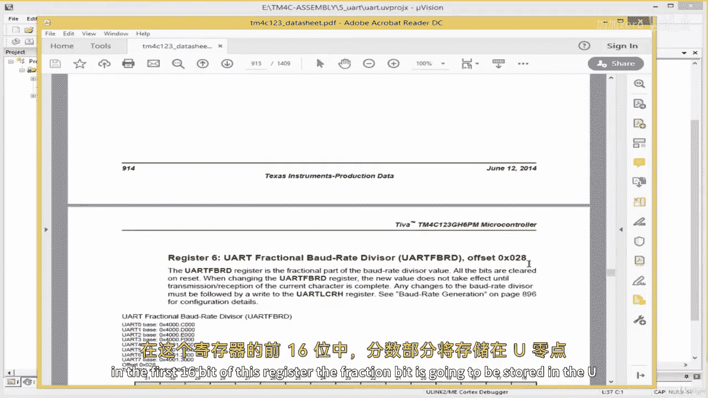

配置UART0本身需要操作其内部的一系列寄存器。我们首先需要UART0的基地址。从数据手册中查得 `UART0_BASE` 为 `0x4000C000`。

以下是UART0的关键寄存器，我们将为它们定义符号名：

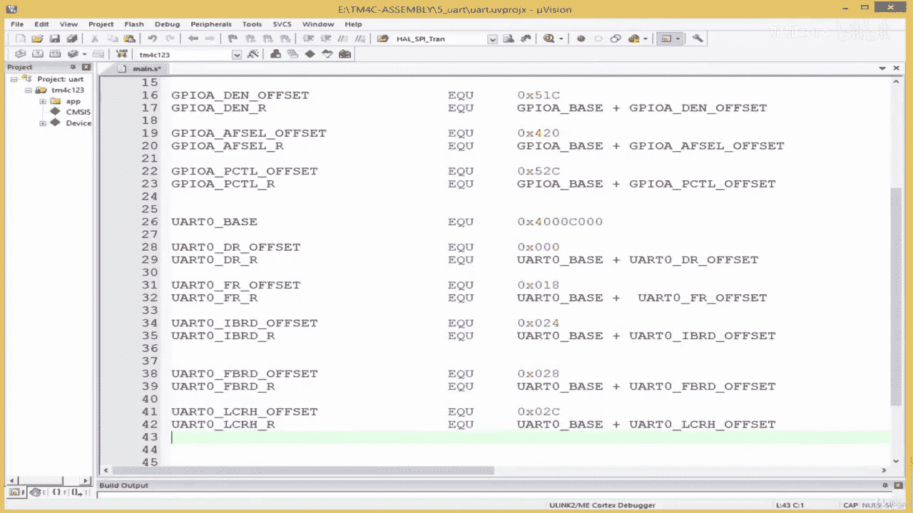

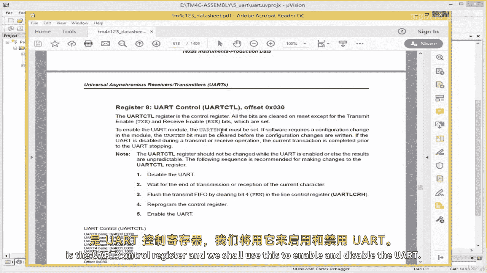

*   **数据寄存器 (UART0_DR_R)**：用于发送和接收数据。
*   **标志寄存器 (UART0_FR_R)**：用于检查发送/接收缓冲区状态（如是否为空或满）。
*   **整数波特率分频器 (UART0_IBRD_R)**：用于设置波特率的整数部分。
*   **小数波特率分频器 (UART0_FBRD_R)**：用于设置波特率的小数部分。
*   **线控制寄存器 (UART0_LCRH_R)**：用于配置数据位长度、停止位等。
*   **控制寄存器 (UART0_CTL_R)**：用于启用或禁用UART模块。
*   **中断相关寄存器**：如中断掩码 `(UART0_IM_R)`、原始中断状态 `(UART0_RIS_R)` 和中断清除 `(UART0_ICR_R)`。

我们从数据手册中获取每个寄存器的偏移量，并定义相应的符号名。

```assembly
; UART0 基地址
UART0_BASE EQU 0x4000C000

; UART0 寄存器偏移量
UART0_DR_OFFSET   EQU 0x000 ; 数据寄存器
UART0_FR_OFFSET   EQU 0x018 ; 标志寄存器
UART0_IBRD_OFFSET EQU 0x024 ; 整数波特率分频器
UART0_FBRD_OFFSET EQU 0x028 ; 小数波特率分频器
UART0_LCRH_OFFSET EQU 0x02C ; 线控制寄存器
UART0_CTL_OFFSET  EQU 0x030 ; 控制寄存器
UART0_IM_OFFSET   EQU 0x038 ; 中断掩码寄存器
UART0_RIS_OFFSET  EQU 0x03C ; 原始中断状态寄存器
UART0_ICR_OFFSET  EQU 0x044 ; 中断清除寄存器

; UART0 寄存器地址
UART0_DR_R   EQU UART0_BASE + UART0_DR_OFFSET
UART0_FR_R   EQU UART0_BASE + UART0_FR_OFFSET
UART0_IBRD_R EQU UART0_BASE + UART0_IBRD_OFFSET
UART0_FBRD_R EQU UART0_BASE + UART0_FBRD_OFFSET
UART0_LCRH_R EQU UART0_BASE + UART0_LCRH_OFFSET
UART0_CTL_R  EQU UART0_BASE + UART0_CTL_OFFSET
UART0_IM_R   EQU UART0_BASE + UART0_IM_OFFSET
UART0_RIS_R  EQU UART0_BASE + UART0_RIS_OFFSET
UART0_ICR_R  EQU UART0_BASE + UART0_ICR_OFFSET
```

## 定义常用配置常量

最后，为了提升代码的可读性，我们为一些常用的配置值定义常量。这些常量将在后续对寄存器进行读写操作时使用。

```assembly
; 常用配置常量
UART_FR_RXFE EQU (1 << 4) ; 接收缓冲区空标志位掩码 (检查位4)
UART_LCRH_WLEN_8 EQU 0x60 ; 设置数据长度为8位 (位6和位5)
UART_LCRH_FEN EQU (1 << 4) ; 启用FIFO缓冲区 (位4)
UART_CTL_UARTEN EQU (1 << 0) ; 启用UART模块 (位0)
UART_IM_RTIM EQU (1 << 6) ; 接收超时中断掩码 (位6)
```

## 总结

本节课中，我们一起为TM4C123的UART0驱动程序开发做好了准备。我们完成了以下工作：

1.  创建了新的Keil项目并添加了汇编源文件。
2.  查找并定义了 **GPIOA** 和 **系统控制** 模块的基地址。
3.  为配置UART引脚所需的GPIO寄存器（`DEN`， `AFSEL`， `PCTL`）分配了符号名。
4.  定义了启用 **GPIOA** 和 **UART0** 时钟的常量，并找到了 `RCGCUART` 寄存器的地址。
5.  查找了 **UART0** 的基地址，并为其所有关键寄存器（数据、标志、波特率、控制、中断等）创建了完整的符号名定义。
6.  定义了一系列常量，用于后续配置数据位长度、启用FIFO、启用UART模块等操作。

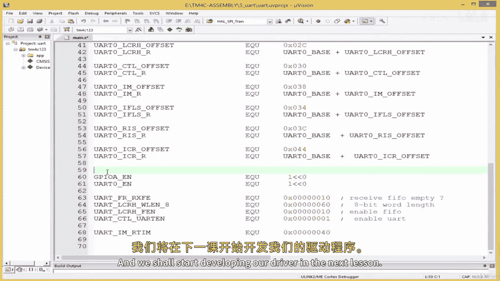

现在，所有必要的寄存器地址和常用值都已通过符号名定义完毕，代码的可读性和可维护性得到了极大提升。在下一节课中，我们将利用这些定义，开始编写UART初始化和数据收发的具体驱动代码。