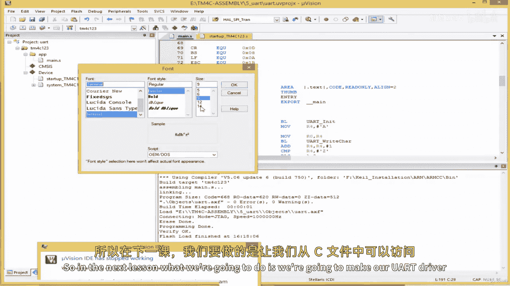
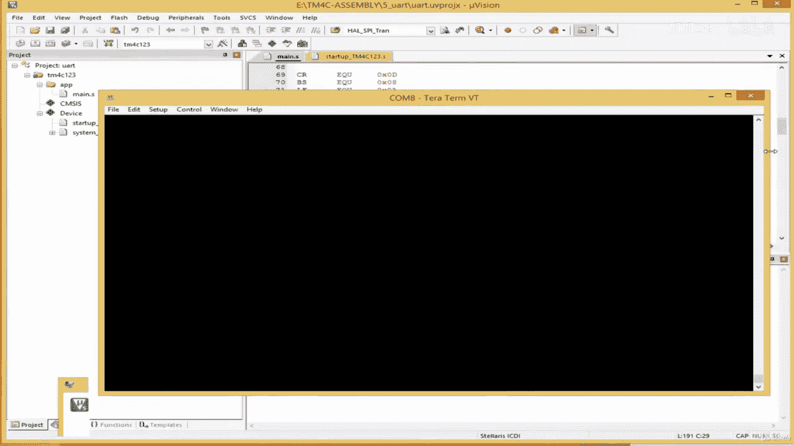

# 045：测试UART驱动程序 🧪

在本节课中，我们将学习如何测试上一节中编写的UART驱动程序。我们将通过编写一个简单的汇编程序来发送字符，验证驱动程序是否正常工作。

---

## 概述

上一节我们完成了UART驱动程序的初始化、读取和写入字符功能。本节中，我们将编写一个测试程序，通过UART发送一系列字符（从A到Z）和一个感叹号，来验证驱动程序的正确性。

---

## 定义常用键的符号

为了方便代码编写和阅读，我们首先为一些常用的控制字符定义符号名称。这些不是字母键，而是如回车、退格等特殊键。

以下是这些符号的定义：

*   `CR` 代表回车，其ASCII码为 `0x0D`。
*   `BS` 代表退格，其ASCII码为 `0x08`。
*   `LF` 代表换行，其ASCII码为 `0x0A`。
*   `ESC` 代表退出，其ASCII码为 `0x1B`。
*   `SPACE` 代表空格，其ASCII码为 `0x20`。
*   `DEL` 代表删除，其ASCII码为 `0x7F`。

---

## 创建发送新行的子程序

在串口通信中，要开始新的一行，通常需要发送两个字符：回车和换行。因此，我们创建一个名为 `new_line` 的子程序来封装这个操作。

以下是 `new_line` 子程序的代码：

```assembly
new_line:
    PUSH    {lr}            // 保存链接寄存器
    MOV     r0, #CR         // 将回车字符加载到r0
    BL      uart_write_char // 调用写字符子程序
    MOV     r0, #LF         // 将换行字符加载到r0
    BL      uart_write_char // 调用写字符子程序
    POP     {pc}            // 恢复程序计数器，返回调用处
```

**代码解释**：
1.  `PUSH {lr}` 保存返回地址。
2.  将回车符送入 `r0` 并调用 `uart_write_char`。
3.  将换行符送入 `r0` 并再次调用 `uart_write_char`。
4.  `POP {pc}` 用于返回到调用该子程序的位置。

---

## 编写主测试程序

现在，我们来编写主程序逻辑。目标是初始化UART，然后依次发送字符A到Z，最后发送一个感叹号并换行。

以下是主测试程序的逻辑：

```assembly
    BL      uart_init       // 初始化UART

    MOV     r4, #'A'        // 将字符'A'的ASCII码存入r4，作为起始字符
lp0:
    MOV     r0, r4          // 将当前字符从r4移到r0（参数寄存器）
    BL      uart_write_char // 发送字符

    ADD     r4, r4, #1      // r4加1，指向下一个字母
    CMP     r4, #'Z'        // 比较当前字符是否超过'Z'
    BLS     lp0             // 如果小于或等于'Z'，则跳回lp0继续循环

    BL      new_line        // 发送回车换行，开始新行
    MOV     r0, #'!'        // 将感叹号字符加载到r0
    BL      uart_write_char // 发送感叹号
    B       .               // 无限循环，程序结束
```

**代码解释**：
1.  首先调用 `uart_init` 初始化UART。
2.  将起始字符 `'A'` 存入寄存器 `r4`。
3.  在标签 `lp0` 处开始循环：
    *   将 `r4` 中的字符移到 `r0`。
    *   调用 `uart_write_char` 发送该字符。
    *   将 `r4` 加1以指向下一个字母。
    *   比较 `r4` 是否大于 `'Z'`，如果不是则跳回 `lp0` 继续循环。
4.  循环结束后，调用 `new_line` 子程序换行。
5.  发送一个感叹号字符。
6.  最后进入无限循环 `B .`，程序挂起。

---

## 代码修正与验证

在构建和测试之前，需要检查并修正代码中可能存在的错误。根据常见问题，请确保以下几点：

1.  **启动文件**：在 `startup.s` 文件的复位处理程序中，注释掉可能干扰UART初始化的两行系统初始化代码。
2.  **寄存器名**：检查所有寄存器名称（如 `RCGCGPIO`）的拼写是否正确。
3.  **指令修正**：
    *   在加载线路控制寄存器时，确保使用的是 `LDR` 指令，而不是误写的 `ADD`。
    *   在配置寄存器后，确保有对应的 `STR` 指令将值存回寄存器。
    *   在 `uart_read_char` 和 `uart_write_char` 子程序中，检查 `ANDS` 指令的书写是否正确。
4.  **符号定义**：确保所有用到的符号（如 `CR`, `LF`）都已正确定义。

完成上述检查后，重新构建项目。

---

## 硬件测试

项目构建成功后，将其下载到开发板上进行测试。

1.  打开串口调试工具（如Putty、Tera Term等）。
2.  选择正确的COM端口（例如COM8）。
3.  设置波特率为115200（与代码中配置的一致）。
4.  复位开发板。



如果一切正常，你将在串口终端中看到如下输出：
```
ABCDEFGHIJKLMNOPQRSTUVWXYZ
!
```
这表明UART驱动程序工作正常，成功发送了A到Z的字母以及一个感叹号。

---

## 总结

本节课中，我们一起学习了如何测试UART驱动程序。我们定义了常用控制字符的符号，创建了发送新行的子程序，并编写了一个循环发送字母的主测试程序。通过修正代码中的常见错误并在硬件上验证，我们确认了驱动程序功能完整，可以正确地进行串口通信。



在下一节课中，我们将学习如何从C语言文件中调用这些用汇编编写的UART驱动函数，实现更实用的双向通信功能（如`printf`和`scanf`），这将使我们的开发更加便捷。