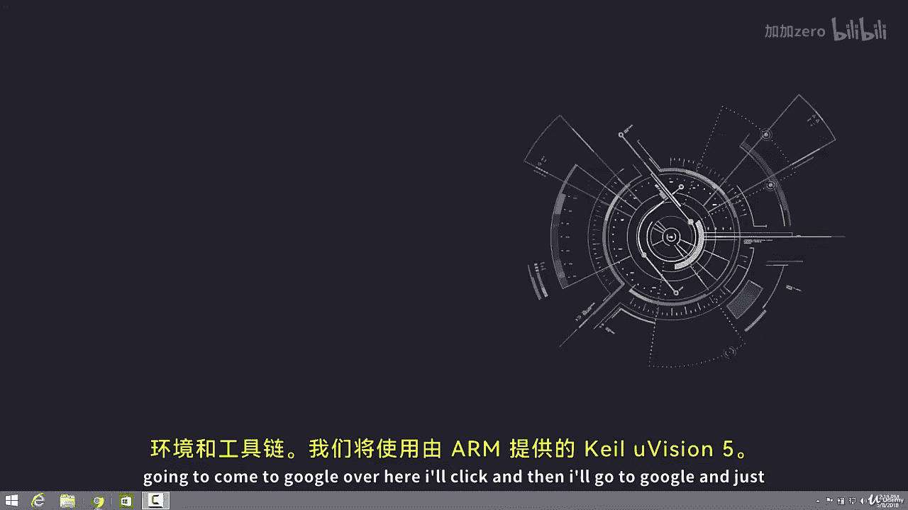
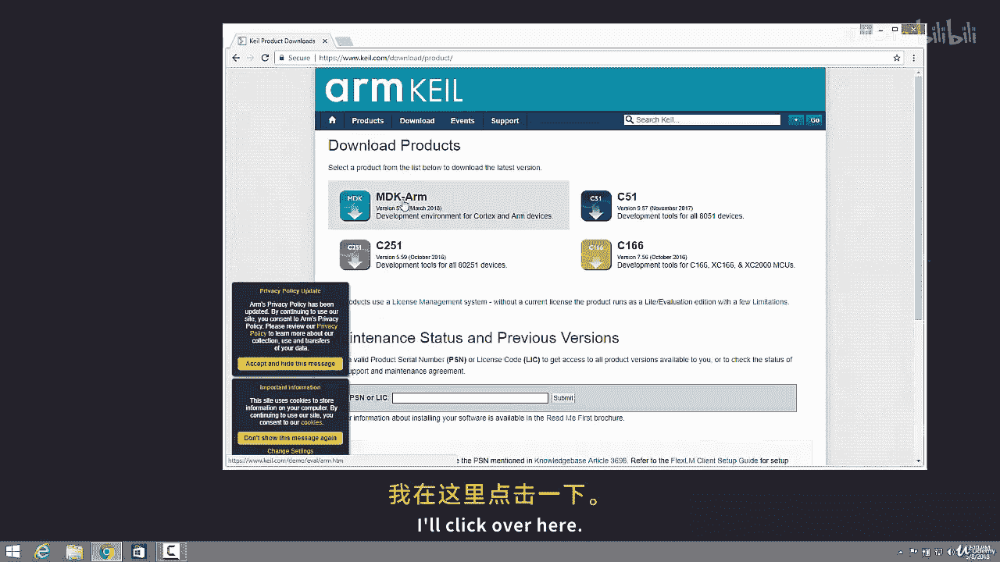
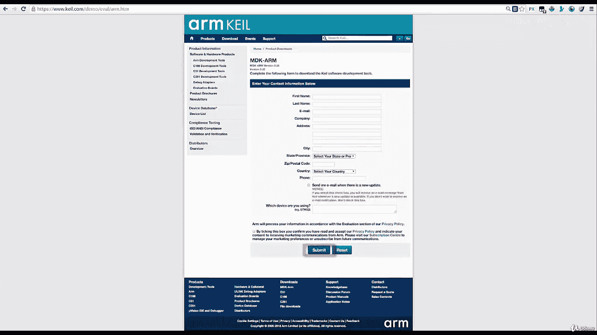
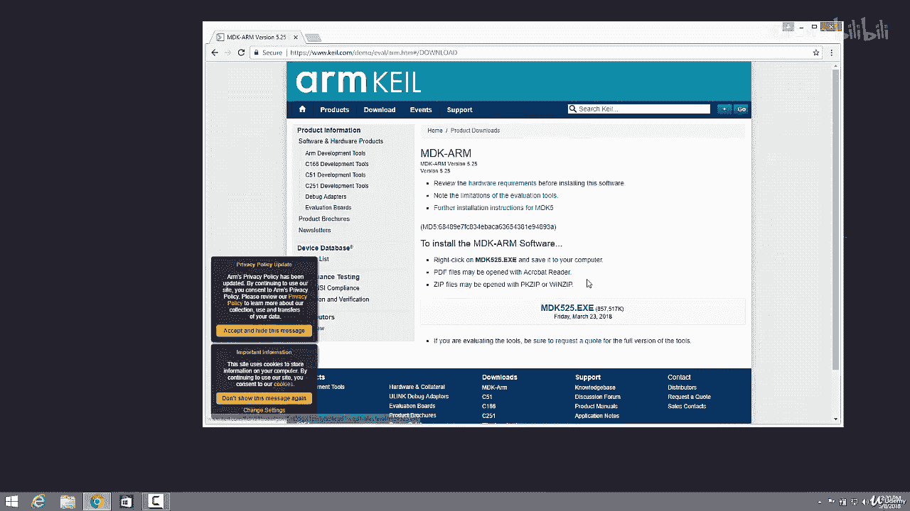

# 046：安装Keil uVision 5开发环境 🛠️

在本节课中，我们将学习如何下载和安装ARM汇编语言开发所需的集成开发环境（IDE）和工具链。我们将使用由ARM官方提供的Keil uVision 5软件。

## 下载Keil uVision 5

上一节我们介绍了课程的整体安排，本节中我们来看看如何获取开发工具。以下是下载Keil uVision 5的具体步骤。

1.  打开浏览器，访问Google搜索引擎。
2.  在搜索框中输入关键词 **Keil uVision 5** 或 **MDK version 5**，然后按回车键进行搜索。
3.  在搜索结果中，找到并点击指向ARM公司官方网站的链接。
4.  进入ARM官网后，找到并点击页面上的 **Downloads**（下载）选项。
5.  在下载页面中，选择 **Product Downloads**（产品下载）。
6.  在列出的产品中，找到名为 **MDK-ARM** 的工具链，并点击它。
7.  系统会跳转到一个需要填写个人信息的表单页面。请按要求填写您的详细信息。
8.  填写完毕后，点击表单下方的 **Submit**（提交）按钮。
9.  提交成功后，页面会提供软件的下载链接。点击该链接即可开始下载Keil uVision 5的安装程序。

我已经提前完成了下载，因此不再重复点击下载按钮。当你点击下载后，等待下载完成即可。

## 安装准备

我们已经成功下载了Keil uVision 5的安装文件。接下来，关闭浏览器，准备进行软件的安装。

本节课中我们一起学习了如何从ARM官方网站下载Keil uVision 5开发环境。这是开始ARM汇编语言编程的第一步。在下一节中，我们将继续讲解如何安装和配置这个软件。