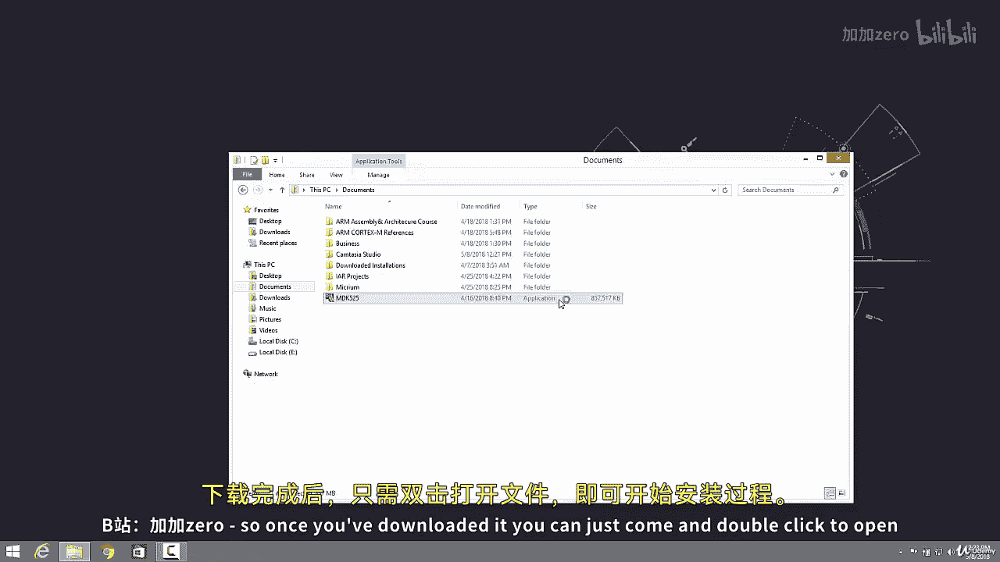
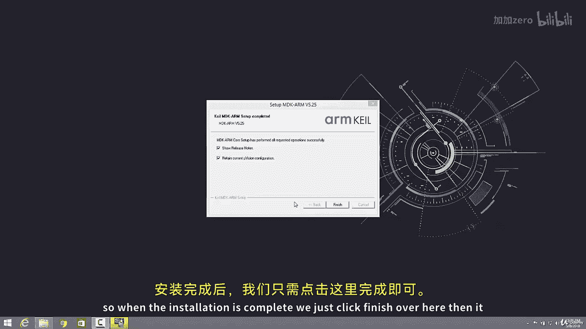
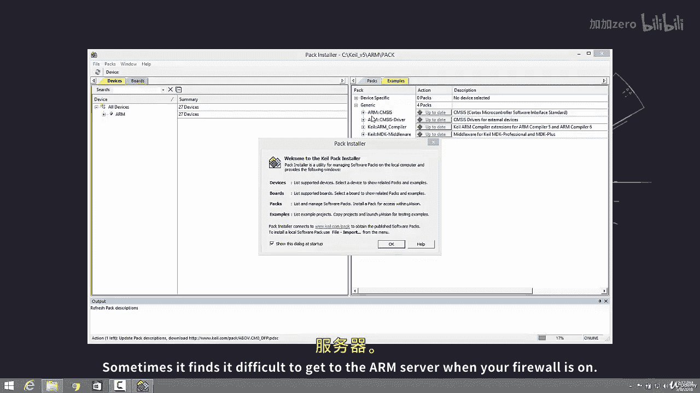

# 047：安装Keil uVision 5 🛠️

在本节课中，我们将学习如何安装ARM汇编开发环境的核心工具——Keil uVision 5集成开发环境（IDE）。这是编写和调试ARM汇编程序的第一步。

## 启动安装程序

上一节我们介绍了如何获取Keil uVision 5的安装包。本节中，我们来看看具体的安装步骤。

下载完成后，找到安装文件并双击打开。

随后将开始安装过程。按照安装向导的提示，点击“Next”继续。

## 同意许可协议与选择安装路径

阅读许可协议后，需要同意条款才能继续安装。

点击此处表示同意协议，然后点击“Next”。

接下来需要决定软件的安装位置。

默认安装路径是C盘的`Keil_v5`文件夹。如果你想保持默认设置，直接点击“Next”即可。

## 填写用户信息与开始安装

在此处输入你的姓名，然后点击“Next”。

之后，安装程序将正式开始复制文件。这个过程可能需要一些时间。

为了节省时间，视频将暂停，并在安装接近结束时继续播放。

## 完成安装与启动包管理器

当安装进度完成后，点击此处的“Finish”按钮。

安装程序会自动打开“Pack Installer”（包管理器）。这个工具的作用是安装针对不同ARM开发板所需的各种启动文件和软件包。

ARM公司本身不生产硬件，而是由聪明的工程师设计处理器架构。这些设计被授权给像德州仪器（TI）、苹果、高通等硅芯片制造商。因此，我们需要通过包管理器来安装对应芯片厂商所需的支持文件。

安装完成后，系统会自动跳转到这个界面。

## 关于防火墙的注意事项

如果你的杀毒软件或防火墙处于开启状态，有时可能会阻碍软件连接到ARM的服务器。

以下是可能遇到的问题及建议：
*   如果安装或更新包管理器内容时遇到问题，很可能是因为防火墙的阻挡。
*   建议在安装和配置过程中暂时禁用防火墙，以确保连接顺畅。

## 总结

本节课中我们一起学习了Keil uVision 5 IDE的完整安装流程。我们完成了从启动安装程序、同意协议、选择路径，到最终安装完成并启动包管理器的所有步骤。同时，我们也了解了包管理器的作用以及可能遇到的防火墙问题。现在，你的基础开发环境已经准备就绪。