# 【从零开始学习 ARM 汇编语言II Udemy】 p02 p1 02.1. Coding   Assigning Symbolic Names to Relevant GPIO Registers -BV1RJU6YwEM8_p2-

Hello， welcome back in this lesson we are going to see how to build GP your Drivever using assembly language。

So I'm going to create a new project by coming over here new project。😔。

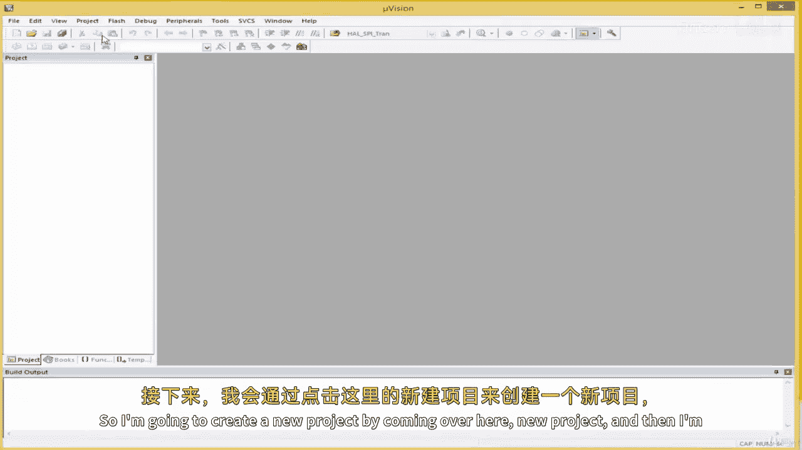

And then I'm storing it in this folder， I'll call this。😔，GPRU output in this first lesson。

 well take a look at the output。

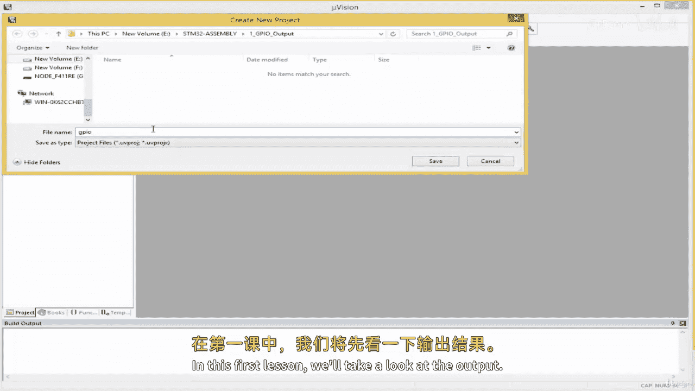

And I'll select my bold as the SDM 32 F411 VET。

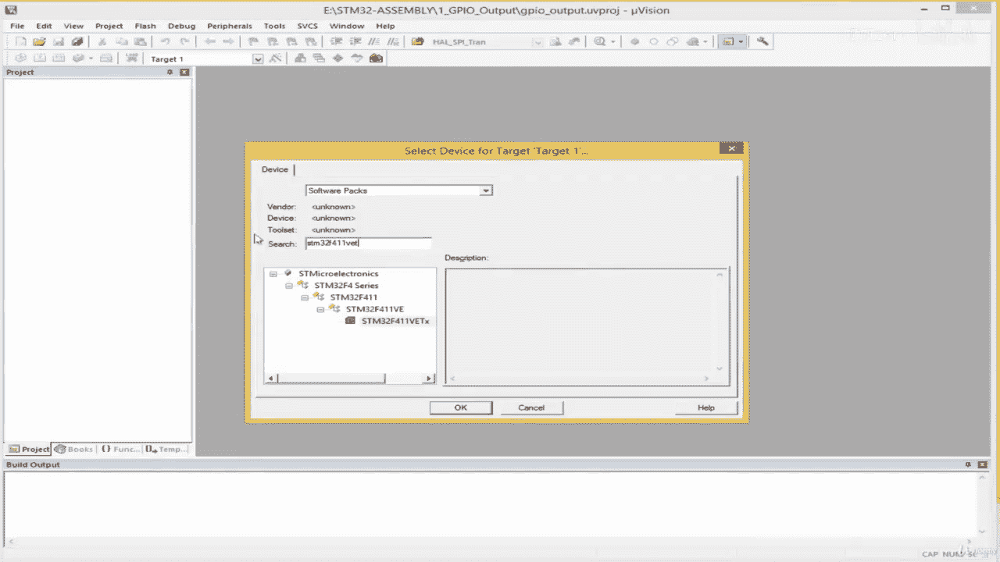

Okay。I'll select over here and then I'll say okay。And the cm os select the core。

And the device I select the start。

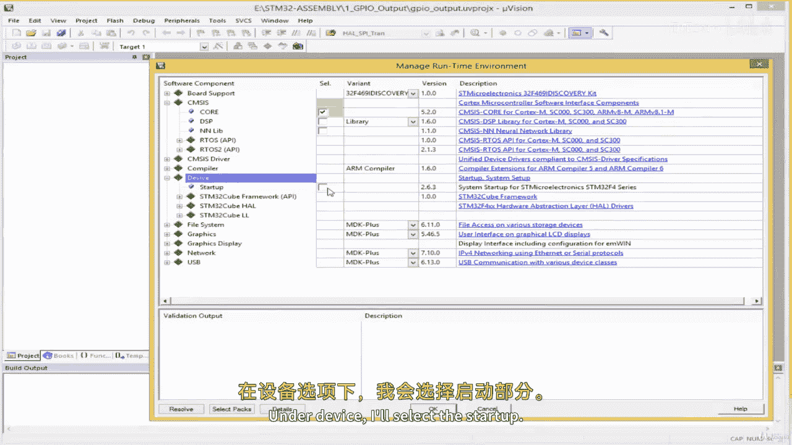

And then okay， and then I'll come over here to target options。😔，My ex toll is 16。

Didbug oscillate this delarrious ICDI。Over here， I'll come to settings。😔，Oh， sorry。

 I should select the ST link debugger because this the STM32 cause。 So the ST link debugger。Okay。

 so we select the S still， we select the SD link debuer， I'll click settings here。

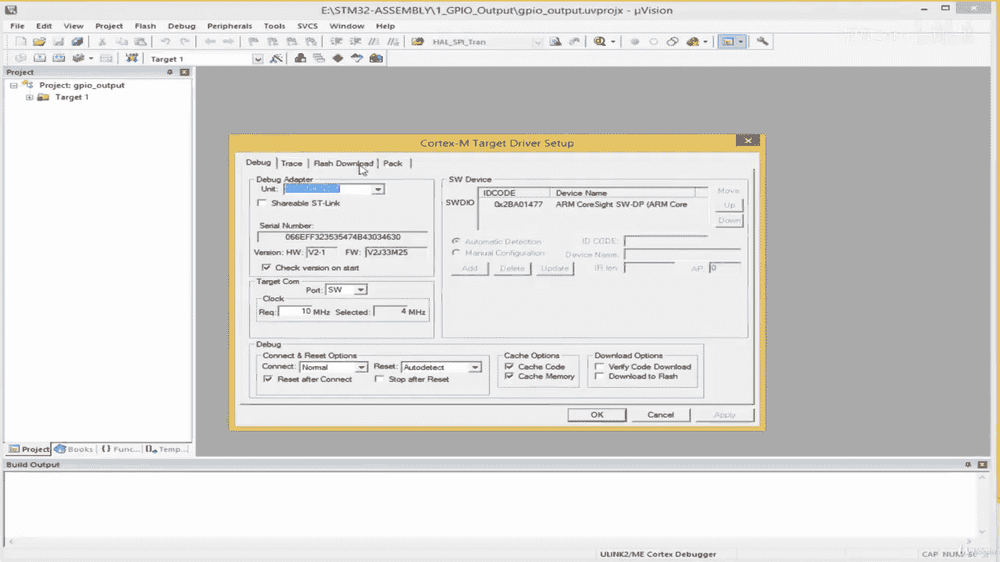

Flulash download， I'll click reset and run and then O， and then O。

And then target over here is the SDM32 board。And then。I'm going to click here， source group APP。

And then right click， add new item。 I'm going to select。

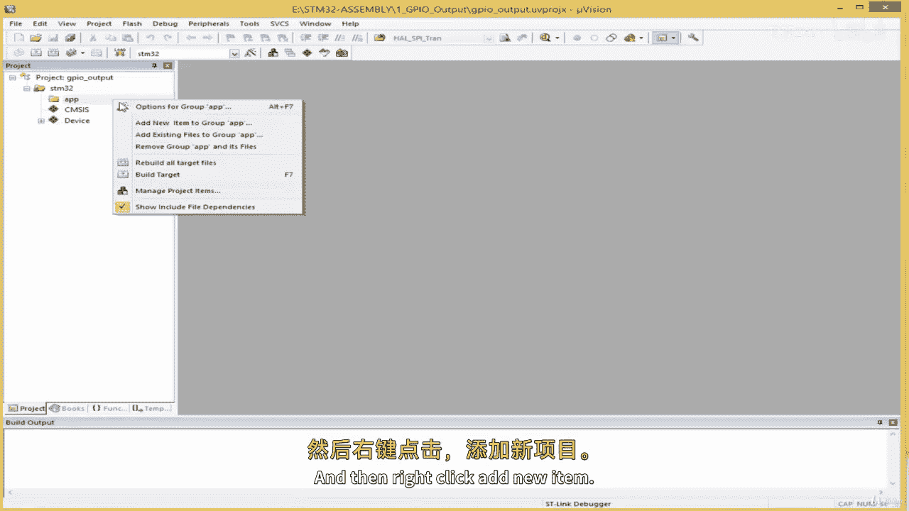

S over here for assembly。 And then I'll give it a name， main。

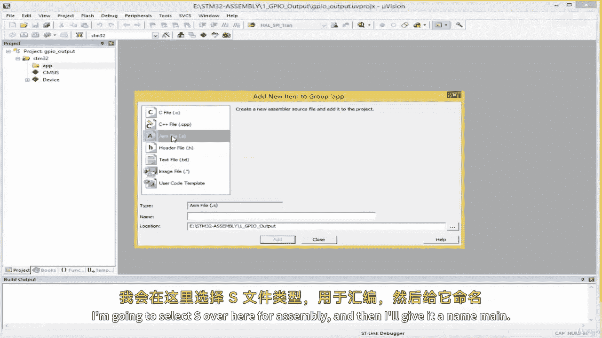

Right， so for those of you who have taken some of my other courses。

That relate to peripheral development， such as the。The bare metal course。 we， we already saw。

 We already saw how to。Enable or configure peripherals for different boards。

And some of you would already know how to do this in C language。And we know the basic steps。

On modern day microcontroller to enable peripheralflow or to use a peripheral。

 let's take our GPIU output as an example， we first need to enable clock access。To the peripheral。

Right， this is for all peripheral flows。 Okay， and then dealing with GPI U After we've enabled clock access to the GPU port。

 we need to set the pin。To output mode for this example。

 cause we say we wanna make it into a GPU output。And once we've set it to output mode。

 then we can write。To the pin。Right。So we need to enable clock， set a pin to output and write a pin。

 So before we go on， I'll just give a bit of history as to why these are the three compulsory steps。

So for the first step， which says enable clock to peripheral for。

Is because of something known as clock gateating mechanism。And what this means is that。

The the clock access to each peripheral flow is gated。 There is a gate there。

 You need to open the gate before clock is allowed to get to the peripheral。

And this exists in modern microcontrollers。Regardless of the manufacturer or the architecture。

 whether you are using A VR arm， et cetera， all of them should have a bit of clockcate in there。

 This is employed to to help the microcontroller consume less power。 and what this means is。

You only allow clock access to a peripheral when you need it。 So over here by default。

 all peripherals have no clock access because we're going to use the GPRu。

 We're going to use a particular GPU， actually。Which is GPIU A。

 we allow clock access only to GPIU A so that that's the only part that a clock is connected。

So that is why we need a step and the second step set pin to output。Okay。

So any microcontroller at all， regardless of its architecture or manufacturer。

 when dealing with GPI O peripheral， you have at least two registers。

You have the data register and the direction register。These two registers come with different names。

For instance， the direction register in the SDM32 documentation is given the name mode register。

But in the Texas I documentation， this register is called a direction register。

And in some other microcontroller， their data sheet would give other names to the same register。

And the direction register is used to set the GPIU either to an input or an output。

And then the data register is where we write the data or read the data。

Depending on whether we've set that GPR U pin to an input or an output。

So these are the three compory steps。Right， so what we have to do is find the addresses for these things。

We've got to go to our reference manual in our data sheet。

And then find the address for the GPIU peripheral that we are going to work on。

We are going to be connect blinking the LED at P 5。minin。Pt E。Pin number 5。 So we need to。

We need to first。Allow clock。Sorry about that。We need to face a clock。To port a。And then。Set P 5。

To output。And then。Right output。To P 5。And this corresponds to。The same steps that we listed up here。

 And we have to do this in assembly。So for the Texas Instru board， we have。

We have two important documents that we need。 We need a data sheet， and we need a reference manual。

And then， we can find those。Document over here for the SDM 32， I should say， for the SDM 32 board。

We have it here。😔，If I mention Texas instrument by mistaking this course。

 please do pardon me because there's a Texas instrument version of the same course。

So you just click books here and you would find。The books。

We need the reference manual and the data sheet。Let's start off with the arm。With a reference manual。

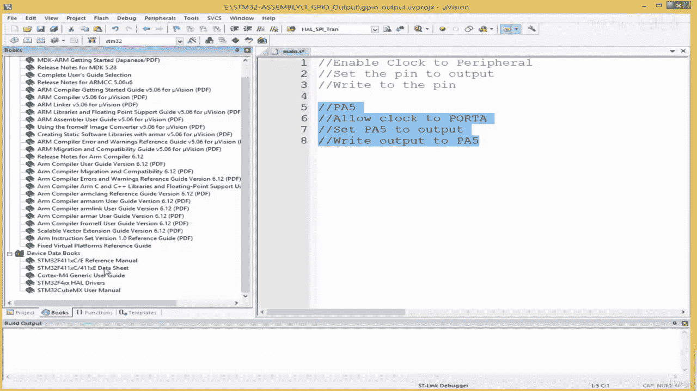

Now， let's start off with a data sheet。Okay， I'll click here。

 The reason we want to start here is we want to see the block diagram。 we want to see the buzz。

The vast connections of the microcontroller。 So I'm going to scroll down。

 There should be a block diagram somewhere。 Okay， this is what I'm looking for。O。

 this plot diagram shows us how things are connected internally to a macrocontroller。

 how things are connected， how components， or should rather see how peripherals or modules are connected to buses。

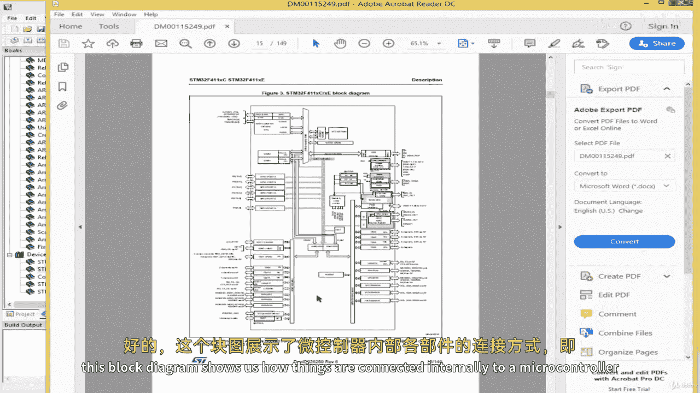

So over here， if you look carefully， if you open yours and you look， we have AHB。And AP P B。

 and we have A， H， B1， AP B1， AP B2， A H B2。In arm。Architecture。There are two types of passeses。

 generally， for the arm cortex M architecture。The cortex A and the cortex R may have other buses。

 but for cortex M， generally we have two bus architectures。 We have the A H P and the AP PB。

The A PB stands for Advanced Perful Ba。The A H B stands for Advance high performance pass。

And a differences。The A H P is faster。Than the APB。

 the AHB allows for faster access compared to the APB。

 So if you take a look at what we have opened over here。

You realize that the maximum speed for AP PB is 50 MHz。I'summ in a bit more。You find that over here。

 it says 50 MHz max。 But if you take a look at A H B， it's 100 MgaHz。 So， for instance， with A AB。

 the the peripherals are accessed。Slower， you cannot， you know。

 go beyond 50 meHtz and AHB allows that。 So that's the difference。

 So we have to see where our module is connected。And as we can see over here。

 the GPIU A that we are looking for is connected to the AHB bus。A HB bus。 So if we want to。

 if we want to enable clock access for GPU A， we've got to do it through the AHB1 bus。

 as you can see over here， if we start dealing with timers and we want to enable clock access to timer 2。

 we see this arrow connecting to A PB1。 So we would have to go through the AB bus。

 But for now were dealing with GPU port A。 So we enable the clock through a through A H B1。

That is point number one。Right。So one other thing or not one other thing。 There are more things。

 The next thing is to find the address， the base address of GPI U A。Ca we have to know where it is。

In our microcontrolls memory so that we can write new data to that location in order to control the hardware the way we want to control it。

So let's go to page 54 of the same document。 I'll click over here，54 hit enter。

And this one here says register boundary addresses。

 And this gives the the register addresses of all the parts， all the components。

 or I should say the peripherals and modules of our microcontroller port。

 It gives the boundary that starts address in the end address。 and in a peripheral you need。

 you can look over here over here， it says。The GIU。Start from。0 x 4，0，0，2，0，0，0， and it ends here。

 This is GPU E。 So we take this as the GPI U base address because this is where it starts。

So I'm going to copy this。😔。

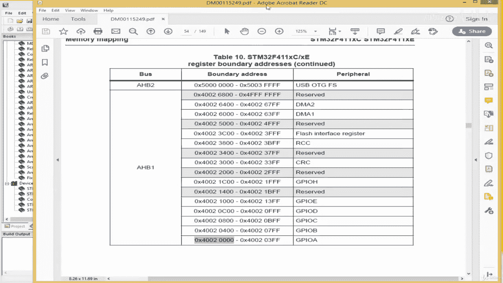

GPIUA。Bease。Ill just put this here so that we can retype it later。 This is just for taking notes。

Right。

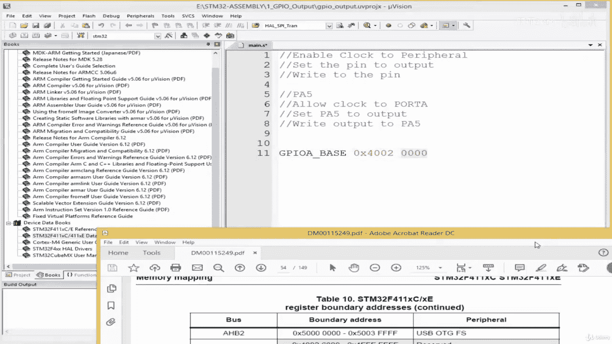

So one other thing in order to。To， in order to access the A H B。

The AHP that we just spoke about will need to access something known as the AHB1 enable register。

In order to be able to enable the clock access to port a to do that。

 to have access to the A H B1 enable register， we have to go through the RCC。

So I'm going to get the RCC base address as well， and when we go to the data sheet。

 we can read on RCC。Right， when we go to the reference manual。

 I should say this one is called a data sheet。 It's got 1，49 pages。

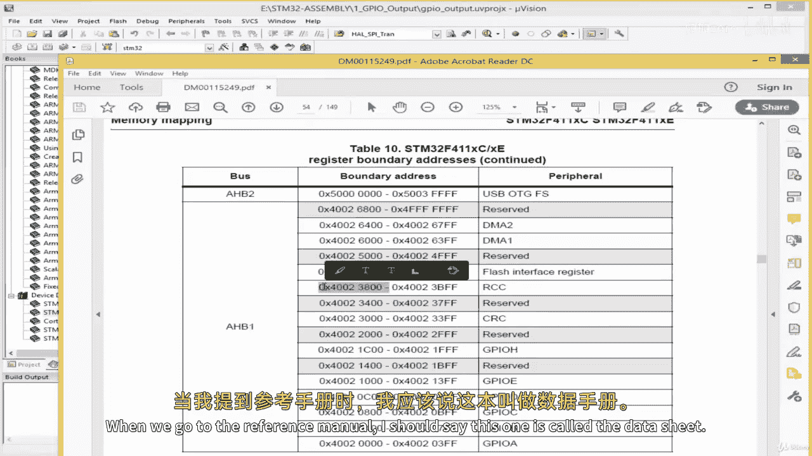

So over herell say RCC base。And for those of you who have seen the the bare metal course。

 you realize as we write the addresses and the names。

 you realize that it follows the same order as the code we wrote in the bare metal course。

And I'll explain what I mean by that。

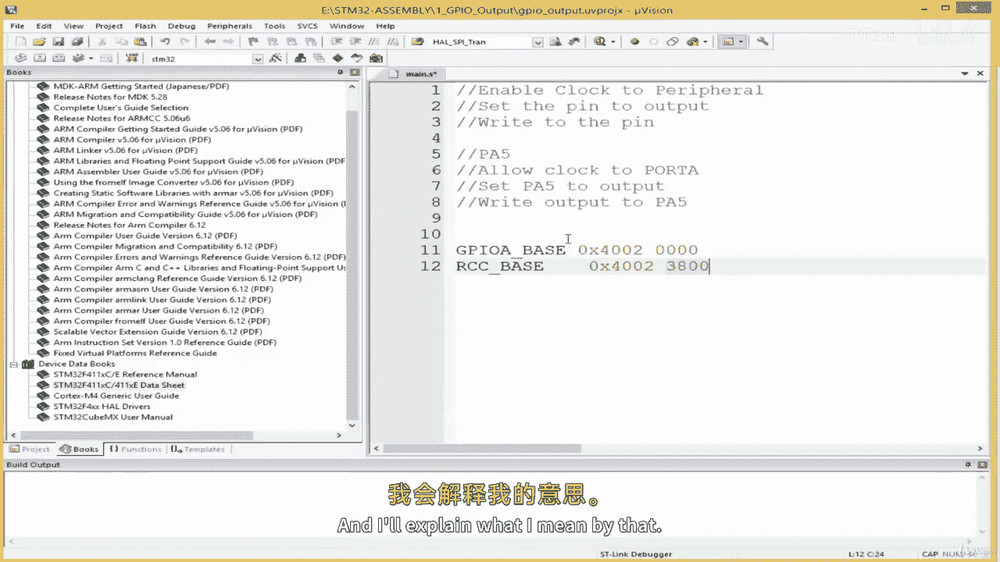

Yeah， I'll explain when we start when we start seeing it looks similar to actual sea bear metal code。

Okay， so we've got a base address for the RCC and the GPI report A。

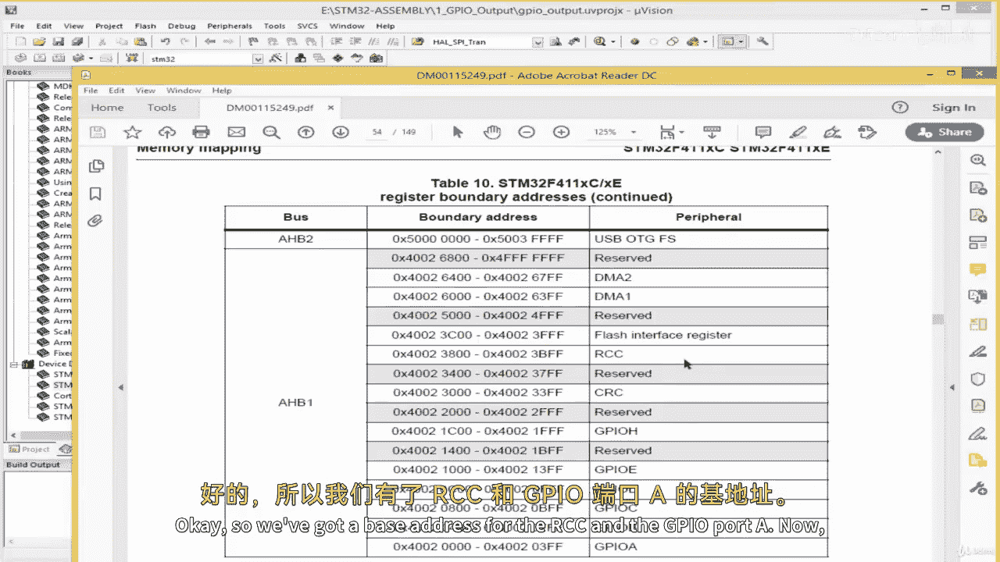

No。Like I mentioned， these are three compulsory things that we have to do。

 and they all have registers that we do。We access and modify。So。In the SDM 32 language。

 the direction register is known as the mode register。

So we need to find the address of this mode register。And then the data register is known as the ODR。

 There are two data registers in SDM 32。 We have the ODR， which stands for output data register。

 and we have the IDR， which stands for input data register。 We need the ODR。

 That's where we're going to write our output。And the way the the addresses。

Of these registers are arranged， is that if you are dealing with GI， you port a。

All the registers related to GPR U a。An offset from this base address。

So if we go to find the mode register， the mode register is simply going to be an offset from this base address。

 If we go and we find the output data register of the same GPI a。

 that also is going to be an offset from this address。

 So it's just like adding a constant to this address guess the。

Gues as the address of the other registers。Right。And you can think of this as for those of you familiar with C data types。

 you can think of this as structure。With different members。

 you can think of the structure name as GPI report A and a member in the structure。

 the first member known as mode to register， the second member known as。

I want to put data register in a whole list of。Members in this structure。

And when you take this structure of you， you know that。

The debate address of the structure would correspond。correspon to the structure name。

 and then each member in the structure would be an offset from the base address。And yeah。

 that is the same way that it is arranged。 Actually， I have another course known as。

Known as object oriented。Embbedded systems programming。

 And we write the drivers from scratch using structures and using the same base member relationship。

 And we write the same code in C language， and then we write it in C plus plus as well。

 So for those of you interested in that， you can take a look at it and in that course， we write。

The the code that we write looks exactly the same as the type of code that you find in the I would say the manufacturer provided files。

 And what I mean by this is the type of code you find in the main dots S and the main dot C file that comes already made。

Yeah， we let's see what I can show you an example。In way， that's a different story。

 But let's focus on this。 If you have any questions， just send me a message。 I shouldn't divert。

Or shouldn didn't， yeah。It just stick to the point。So we have the base addresses。

We have to go to the the the reference manual。 I keep。You know。

 using the words interchangeably is because the text is because the S M 32 guys decided to give different names to the document。

 If we are dealing with Texas instrument， there's just one document known as the data sheet and all information is in there。

 Over here， we have reference module and data sheet and。You know， they have different informations。

We've been taking a look at the the the。The data sheet。

 now we're going to open the reference manual to get the the particular register informations。

 So let's do that now。Okay， we open the reference manual by coming over here and then reference manual。

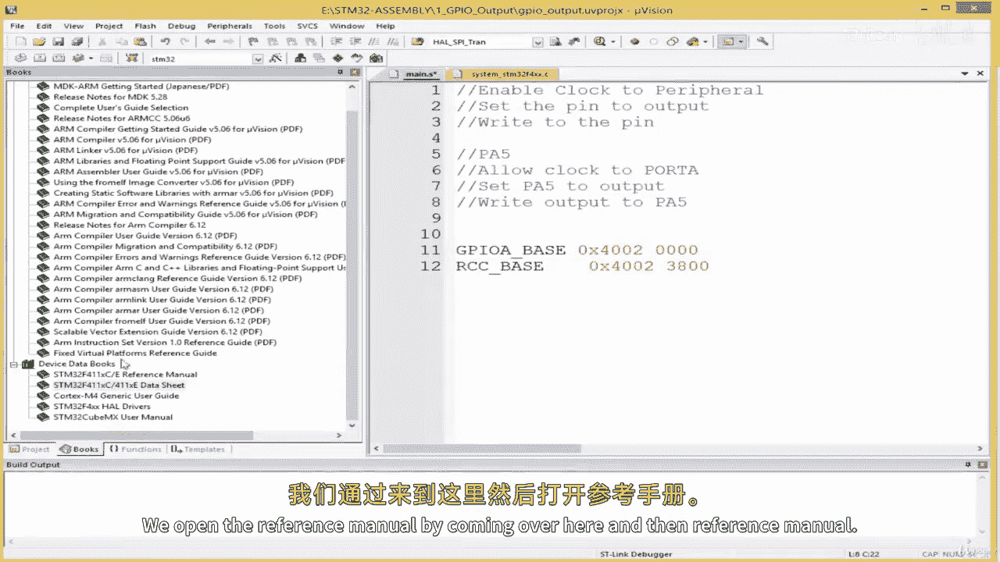

So we said we have to enable clock access and what we need in order to be able to do that is the。

A H P1 enable register， as we saw in the data sheet our GPIO A is connected to A H P1。

 So we need to access the A H P1 enable register。 You can search by doing control F。

And then search A H。AH B1， E N R。And then it will bring us here。 You can just click to jump。

 and as you can see。

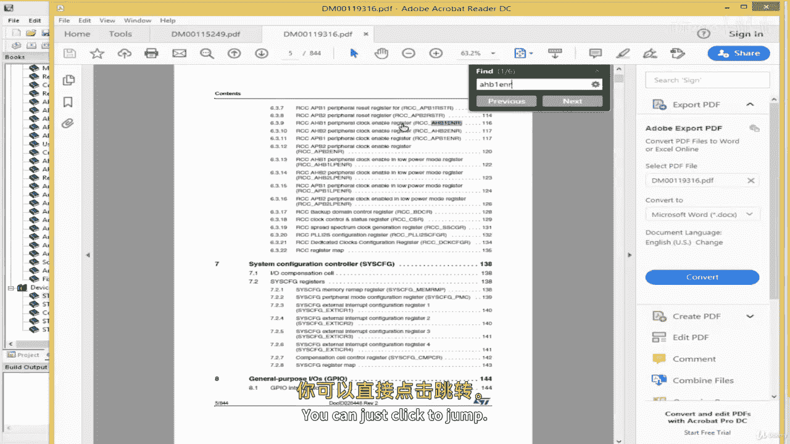

The full name of the register is RCC underscore A H P。 So that is why。

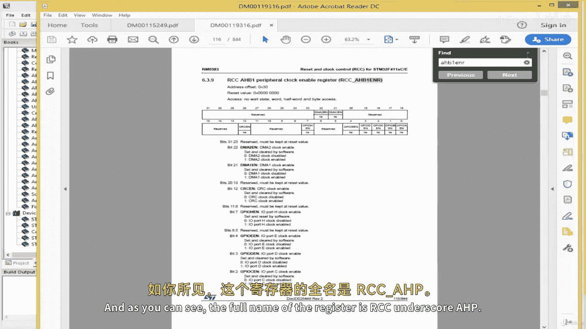

We got the base address of ourcc from our data sheet。 and over here。

You can see that it just gives the offset。Is given the offset because it is tellingnes that it base addresses RCC。

 So RCC address plus this plus 0 x 3，0 gets says the A H B1 enable register。

 So we simply need to copy this。And you can call it A H P1 E and R offset。Right。

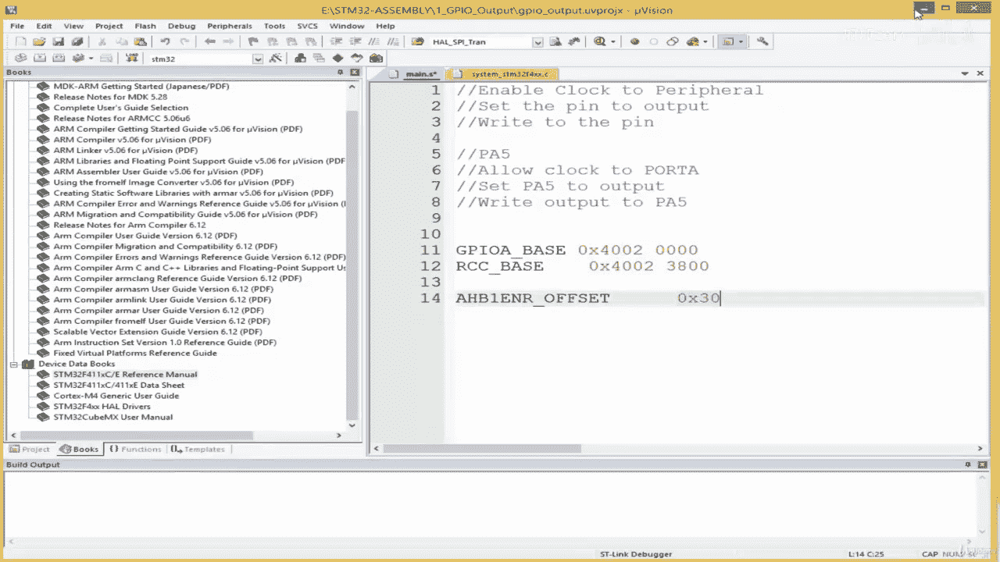

And let's read what it says over here。It says。The。The A H B1 is used to enable clock access。

 Does it say this， Let's see where this is written。Okay。Set and cleared by software。Okay， its。

 it doesn't say it's used to enable clock access here， but it should say it。

 that is what it is useful。 It's used to enable A HB1。

 The A HB1 bus is used to enable that as suppose to the document。

Thinks it is implied in its name there， the name of the register。

Tells us it should be used to enable the A H P1。 So that's what it does。

 But what we looking for is what the various bits represent。 As you can see over here。

 bit 0 is called GPI U A E N。 bit 1 is called GPI U， B， E， N。 bit 2 is called GI U C， E， N。

 So let's go to bit number 0 and see what it means。You see， the bits are listed here。

 I'm looking for bits number 0。So I can simply come over here bit number 0。 It's called GPI U A E N。

 and it says I O port a clock enable and it gives the meaning。 it says if we set it to 0。

 then I O I O port a clock is disabled。 If we set it to1， then I O port a clock is enabled。

 So in order to enable port a clock， we've got to come to this register called this and then set bit number 0 to1。

So because of that， I'm gonna create a constant in our。

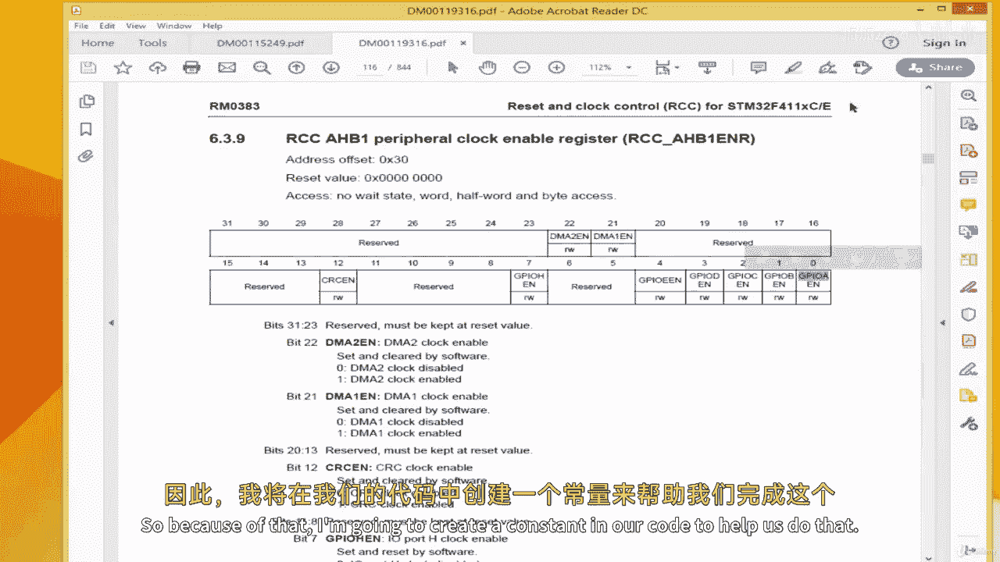

In our code to， to help us do that。I'm gonna sayGPIO。A underscore E and for enable。

 And I'm simply going to。Shift。1。2 bit number 0 by writing this。 what I'm doing is。

I'm taking a 32 B number。Which is sir sir， sir sir。32 of them。 And I'm saying。

Put this number one at pit number 0。 So it becomes something like this。Sorry bother that。

 it becomes something like this。And。This means we've got 31 out zeros， right。

 So thiss what this line means， okay。Right， so now we are done with the A H P。

 Let's go to the other registers that we need。 We need the mode register。

 The mode is what is going to allow us to set P A 5 to an output pin。

 We can find the information in the same reference manual。So come over here。

And then I'll do I control F。And then， mood are。The R stands for register。 I'll hit enter。

 and it brings me over here， and I'll click this。And over here， you can see。That we have mode 0，1，2。

3，4，5， all the way to mode number 15。 The register size is 32。Is a 32 B register。

 but we are able to configure the mode of only 15 pins。

 And why is this because each pin requires 2 B。 As you can see。

 mode 0 is for mode mode number 0 is configured using bit number 0 and 1。

 mode number 1 is configured using bit number 2 and 3， and so on and so forth。

And the reason why H bit， the reason why H pin。 And you can think of mode number 0 mode number one representing pins what it basically means mode number 0 means pin one of the port。

 mode number。Sorry， what it basically means mode number 0 means。As pin 0 of the port。

 mode number one means pin one of the port， mode number two means pin two of the port， etc cetera。

 whether you are dealing with port， A， B， C， D， E， F， etc ceter。

So mode number 0 here corresponds to pin number 0 of。Whichever port you are working on。

And the reason we need two bits is because we have four options。If we set both boat bit to 0，0。

 it means we are setting  one。 If we are dealing with mode number 0。

And we set bit number 0 and bit number one in this mode register to 0，0。

 It means we are setting pin 0 to output to input， as it is said over here。

If we set bit number 0 over here to one。And bit number  one to 0。 As you can see here， there is 1，0。

 It means we are setting pin number 0 to input general purpose input。Right。

If we are still configuring pin number 0 and this time。

 if we set bit number 0 to 0 and bit number 1 to1， it means we are setting pin 0 to its alternate function and an alternate function is a function such as U art。

 PWM， Dak， etc cetera。If we set both one， bit number 0 and bit number 1 to 1 and 1。

 as you can see over here， we are setting。Pin 0 to an analog pin。

 And this applies to all other modes here。 And like I said， mode 15 should imply pin number 15。

 mode 10 should imply pin number 10， and they all have two bits。

 And these are the meanings based on how you apply the two bit。

 You configure the pin to a particular mode。 right， If you don't understand what I just said。

 just send me a message。 So what we want to do is we want to set P A 5。

Where our green LED on our nuclear board is connected， we wan to set P5 to output。

 So what it means is we w to set。D A 5， D A 5 should be mode number 5， like I said， because I said。

 the mode number represents the pin number。 So we want to set mode number 5 to output。

 meaning we want to set mode number 5。 meaning what we have to do is we have to set the2 Bs of mode number 5 to 1 and 0。

 So let's see mode number 5。Modern number 5 is off here。 Where is it。Okay， this is mode number 5。

 Don't confuse the bits number F with the mode number。 This is mode。5。So mode 5 cavevez。

 bit 10 and 11。 So we have to set bit 10 to 1。And bit 11 to 0 in order to set pin 5。

 which is mode number 5 here as output。 So in other words。

 all we have to do is to set pin 5 to output。We have to just pass one， the number one。

To bit number 10 over here， because the default， the default。The default state is。Well。

 this is the reset value of the register。 I was about to say the default status all bits are 0。

 but this is for other port， but for port a。This is the reset state。

 meaning this is the default state。 We have 0，0，0 everywhere。 And then at the upper side。

 we have this， so。What we are concerned with is bit number 10。 We simply need to pass one over here。

 If we pass one over here to bit number 10， we would have our pin 5 configured as output。

 So what I'm going do is。Create another。You know， symbolic name for us to do that。

 I'm going call this Mo 5 out。And like I said， if you have any questions along the way。

 just hit me up with a message。 So mode 5 out。 What I'm going to do is I'm going to shift the number one。

2。😔，Position 10， bits number 10。 and it follows the same explanation I gave you。

I'm saying that we have a 32 B number。 And at position number 10， I wanna。Place one over here。

This is what is been shifted。 This is the position， the shift amount， right。

Maybe this doesn't correspond to 10， but I'm just using this an as an example for those of you。

Who counts 1，2，3，4，5，6，7，8，9。Okay， I'll probably set it like this， so that's position 10。And， yeah。

You have 32 zeros， and then you put one at position number 10。

 That is what this means is essentially。 And when we。

 if when we take this and we write it to our mode register。

 we're going to have P A 5 set to set as an output pin for us。

The next thing we have to take a look at St。The next register will be interested。

 and that is the output data register。We can get the offset of that， as well。

And as you can see over here too， for mode register， the name is G P I U X underscore mode register。

 And they've given just the offset here， the offset is 0， x 0，0。 So I copy it the offset。

That's the offset。And the reason I'm pointing out the name is。

They've given just the offset because they know the the base address implied here。

 They are trying to tell us the base address this bit。 So whichever GPR you are using。

 then the base address is for this。 and then。To get the the， the full address of the mode register。

 you add the offset to that base address。 So in our case， were using GPI U A。

 the X here represents AB，C， D， E， F。All the way to H as it's written here。 So we're using GP U A。

 and then we add 0 X to the base to the base address。

 and we get the full address of the mode register。Okay， once we've covered this。

 let's take a look at the output data register。It's called the ODR。So come over here and then click。

Right， and output data register。 This is where we write our output。 So what we want is O D R 5。

 because we are dealing with pin number 5。But before we take a look at ODR 5。

 let's take our base address， our offset here。 So this the offset of this register， I'll copy this。

Itll put it here。

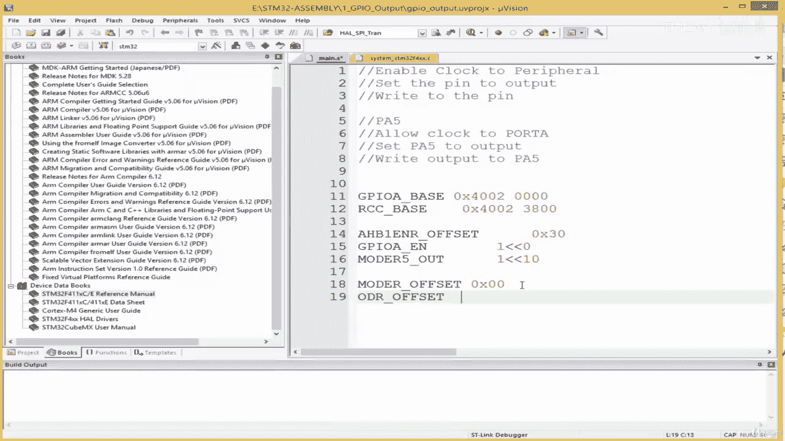

Right。受。Because our LED is connected to P A5， when we write one here。

 when we write one here and our LED is connected here。

 the LED is going to be set on at position number 5。 So what I'm going do is I'm going shift。

1 to position 5。

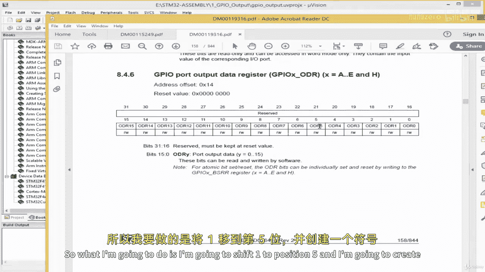

And I'm going create a symbolic name to holdda for us。 I'll say LED on。

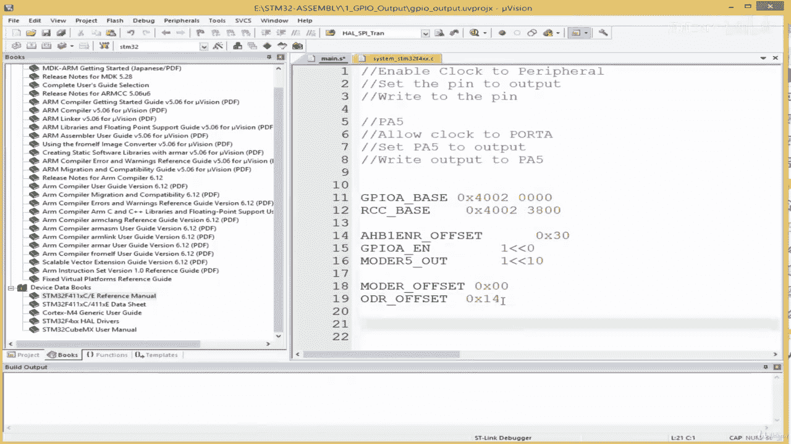

LED on， we're going to achieve LED on by shifting one to position 5 like this。Right。

So now we have everything we need to start coding a wire。

To start quo our assembly driver for the GPIU output so。This video is taken a bit long。

 How about we continue in the next lesson as we start writing the code to implement this。

