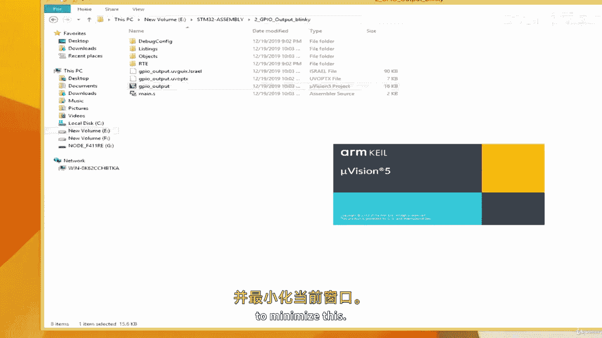
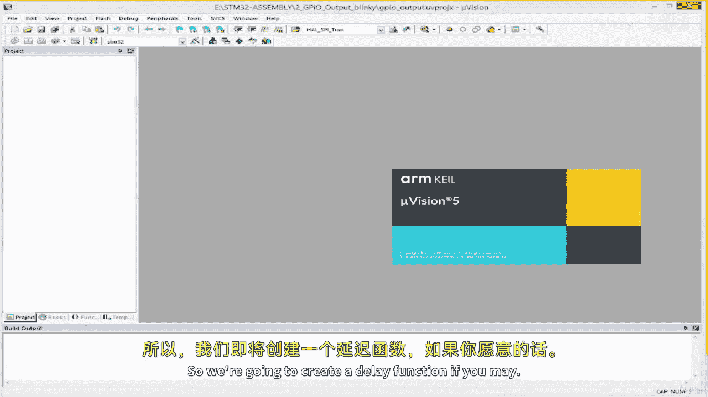
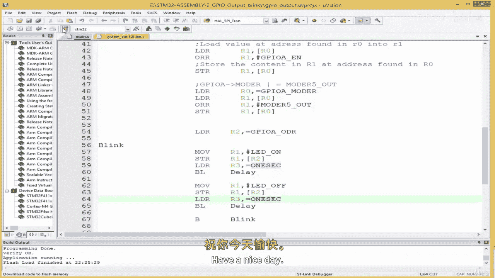

# ARM汇编语言入门：02.3：控制GPIO输出 🔄





在本节课中，我们将学习如何编写ARM汇编代码，使连接到微控制器的LED灯闪烁。我们将创建一个简单的延时函数，并利用循环结构来控制LED的亮灭周期。

---

上一节我们介绍了如何初始化GPIO并点亮LED。本节中我们来看看如何通过编程让LED闪烁起来。

首先，创建一个新项目。我们将复制上一节的项目，并在此基础上添加闪烁功能。

以下是创建新项目并准备代码的步骤：
1.  复制上一个项目，并将其命名为“blinky2”。
2.  打开新项目，并准备编写代码。

接下来，我们需要创建一个延时函数。这个函数将帮助我们控制LED亮和灭的时间间隔。

```assembly
.equ ONE_SEC, 0x00F42400  // 基于16MHz时钟频率估算的1秒延时常数
.equ HALF_SEC, 0x007A1200 // 半秒延时常数
```

现在，我们编写延时子程序。该程序通过递减一个寄存器的值来实现循环延时。

```assembly
delay:
    SUBS R3, R3, #1  // R3 = R3 - 1，并更新状态标志
    BNE delay        // 如果结果不为零（Z标志为0），则跳回‘delay’标签处循环
    BX LR            // 返回调用处
```

这个子程序的核心是一个循环。它将传入`R3`寄存器的常数不断减1，直到结果为0（此时Z标志置1），循环才结束，从而模拟了一段延时。

有了延时函数，我们就可以编写控制LED闪烁的主逻辑了。首先，我们需要定义LED打开和关闭对应的位模式。

```assembly
.equ LED_ON,  (1 << 5)  // 将1左移5位，对应GPIO的第5个引脚置高
.equ LED_OFF, (0 << 5)  // 将0左移5位，对应GPIO的第5个引脚置低
```

以下是实现LED闪烁的完整子程序步骤：
1.  将`LED_ON`的值加载到寄存器，并写入GPIO输出数据寄存器以点亮LED。
2.  调用延时函数，等待半秒。
3.  将`LED_OFF`的值加载到寄存器，并写入GPIO输出数据寄存器以熄灭LED。
4.  再次调用延时函数，等待半秒。
5.  使用分支指令跳回步骤1，形成无限循环。

```assembly
blink:
    LDR R2, =GPIOA_ODR_ADDR  // 将GPIOA输出数据寄存器的地址加载到R2

    MOV R1, #LED_ON          // 步骤1：准备点亮LED的值
    STR R1, [R2]             // 点亮LED

    LDR R3, =HALF_SEC        // 步骤2：设置延时半秒
    BL delay                 // 调用延时函数

    MOV R1, #LED_OFF         // 步骤3：准备熄灭LED的值
    STR R1, [R2]             // 熄灭LED

    LDR R3, =HALF_SEC        // 步骤4：再次设置延时半秒
    BL delay                 // 调用延时函数

    B blink                  // 步骤5：跳回开头，形成循环
```

将代码编译并下载到开发板后，可以观察到LED以大约1秒的周期（亮半秒、灭半秒）进行闪烁。当前的延时是基于时钟频率的估算值。在后续课程中，我们将学习如何使用硬件定时器来获得更精确的延时。

---



本节课中我们一起学习了如何用ARM汇编语言实现GPIO输出控制，并创建了一个让LED闪烁的程序。我们掌握了通过软件循环实现延时的方法，并利用分支指令构建了循环逻辑。在下一课，我们将探索如何使用STM32的BSRR寄存器来更高效地控制GPIO输出。