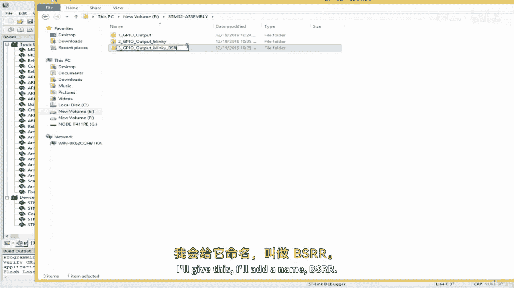
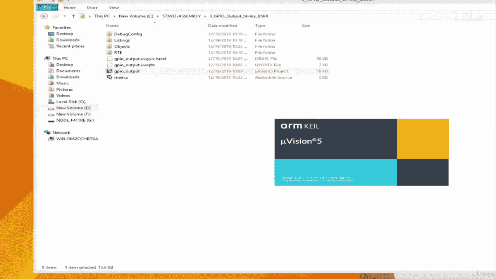
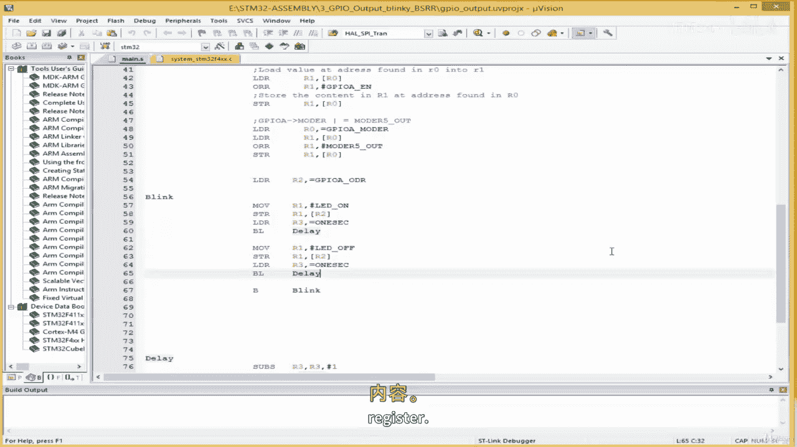
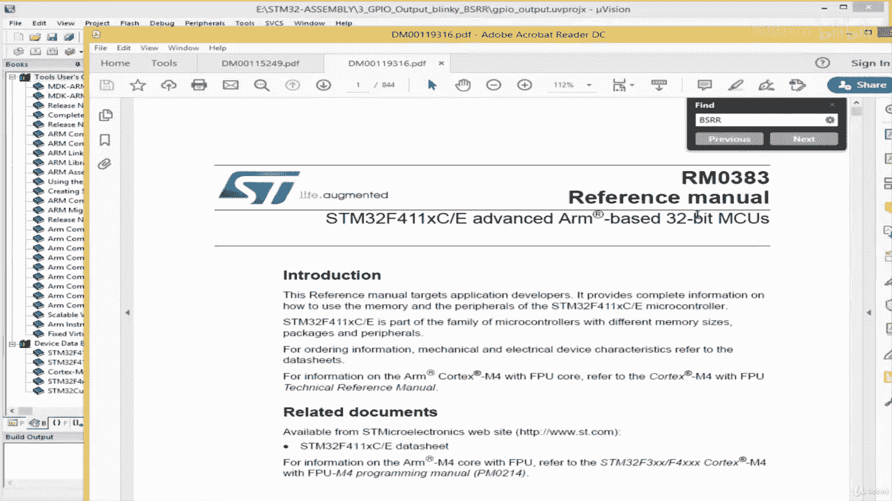
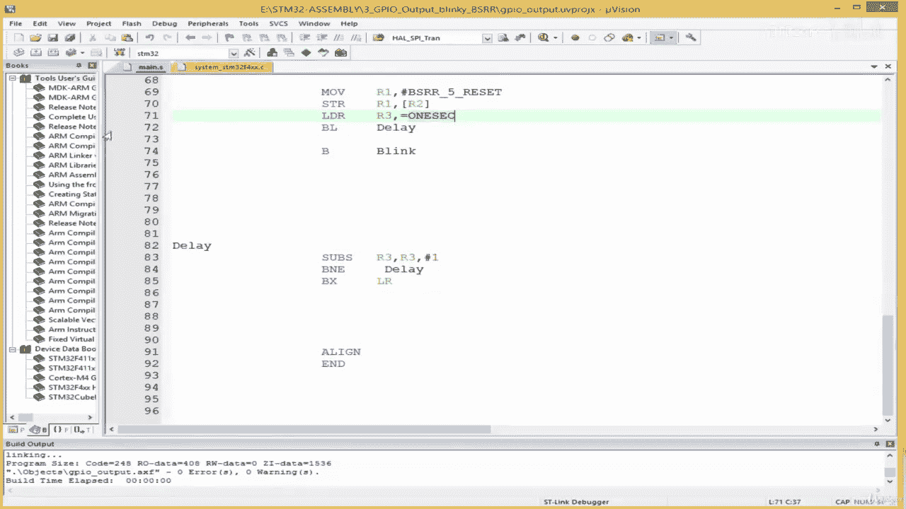
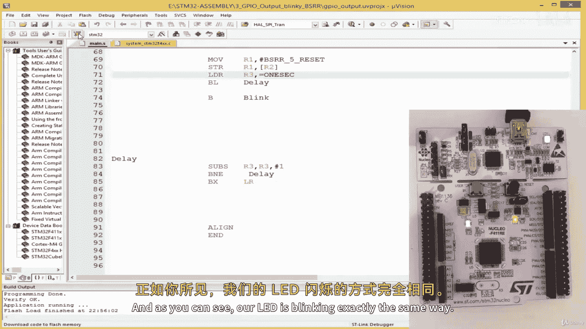
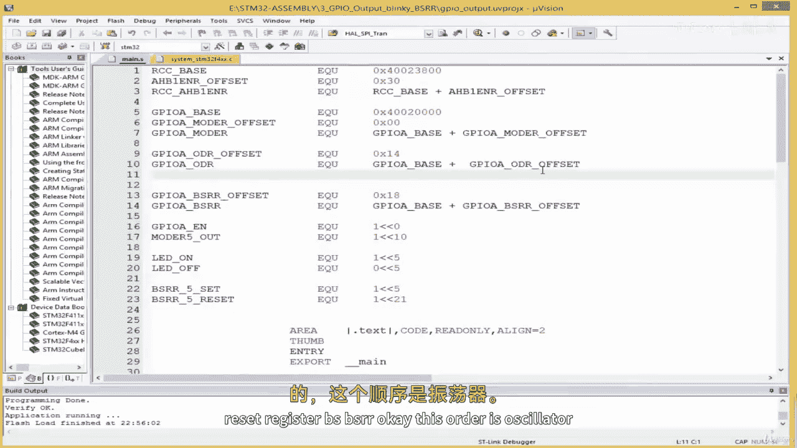

# 【从零开始学习 ARM 汇编语言II Udemy】 p05 p4 02.4. Coding  Toggling GPIO Outputs with the BSRR Register -BV1RJU6YwEM8_p5-

Hello， welcome back in this lesson， we shall see how to toggle the GPIU output using the BSRR register。

It's another register in the SDM 32 board that allows us to turn on and off a pin。

 We're going to see how to access that using our assembly code。

 So I'm going to make a copy of the last project I'll give this our other name BSS BSR R。

 does the name of the register。

I double click here to in a project。Minize this。

Right， so that's why we left off， this is our Blinky project and what we going to do。Let's go to our。

Go to our reference module to take a look at the PRR register。

So I'm going come down here。

And I'm gonna go to the reference manual， search B， SR，R。And it brings me here。

 I'm going to click here。 and the B， S R R is a single register。

 This register allows us to set and reset。A pin reset means to turn something off， so。Dam。

The lower 15， the lower 16 B are used for setting a pin。

 and the upper 16 bit are used for resettin or turning off the same pin。So0， if we pass。

 if we write 0 to， if we write one to bit number 0。We turn on pin 1。 We turn on pin  zero， sorry。

If we write one to bit number 16。We will turn0 off pin 0。 I'll repeat that。Over here。

 we simply write one。 we don't write0。And this is what it means when we write 1。

2 bit number 0 over here。We are going to turn on。Pin 0。When we write one to bit number 16。

 we are going to turn off。Pin 0。So，李 low啊。16 bits are for the set part of the B SR R and the upper 16 bits are for the reset part。

 so you can see that we have B S 0 here and then B R 0。B R 1 here， B S1。

 So our LED is connected to pin 5。 So B S 5 to turn on the LED using the B SR R register。

 We have to write1 to B S 5 over here。To turn off the LED using the BSRR register。

 we have to write1 to bit number 21 over here。 So that's what we're going to do。

So let's get the offset。 the offset is 0 x1，8。 Okay， so let's create this register。

I'm going to come over here and I'm going to say。😔，GPIUA。PSR，R offset。And this EQU。😔。

And as we saw it S0 x。1，8。And then we can create the register GP U A。比异。PS22。Then IQU here。

 and then what we want to do as GPI you base。Plus。PS SR， are offset。Like this。 Okay。

 so now we have our register。I'm gonna create some constant here。 I'll say B， S，R， R。Pin 5 set。

 and this is the same as。Movingve in one to bit number5。

we'll see move one to bids number five and then。I'll create another one， BSRR。5。Reset。

And this is the same as。Moving one to bit number 21， just like we saw in the reference manual， okay。

So， we are set。And we're going to replace our output data register here to B SR R。

 So over here is going to be G GPIO A， B SR R， right， And over here， we're simply going to pass。

BSR R。five。😔，And of course， set。And then， over here。Wupas， P SR R。5 reset。Okay， good。

 So that's the only thing we need to do。 Let's build it and see what we have。It compiled。

 let's download onto our board。

It's downloaded successfully。And as you can see， our LED is blinking exactly the same way。

 So this is how to use the B SRR register the B SRR stands for。

I think。Bit set reset。 Let's see。 I， It stands for GI report bit set reset register。

So bit said reset register B S BSR， R。Okay， this order is osate。

