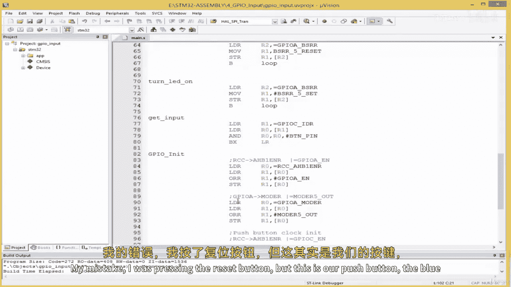
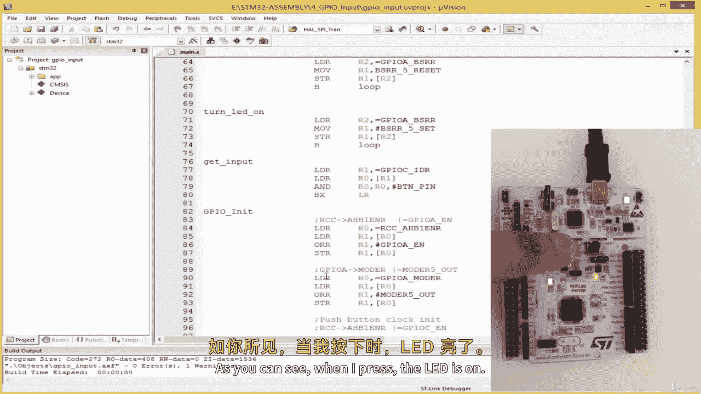
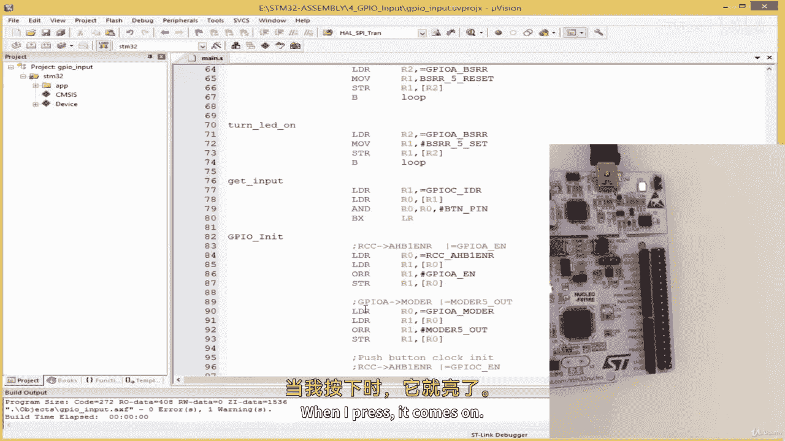
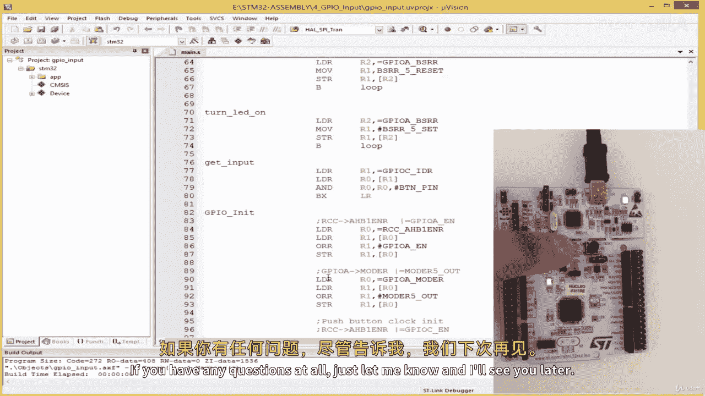

# ARM汇编语言：II：02.6. 编写GPIO输入驱动程序（第二部分） 🔌

在本节课中，我们将继续开发GPIO输入驱动程序。我们将编写一个简单的汇编程序，实现当按下按钮时点亮LED的功能。我们将创建读取输入、点亮LED和关闭LED的子程序，并在主循环中整合这些功能。

---

## 程序结构概述

我们将编写三个核心子程序和一个主循环：
1.  `get_input`：读取按钮输入状态。
2.  `LED_on`：点亮LED。
3.  `LED_off`：关闭LED。
4.  主循环：不断检查输入并控制LED。

主程序流程是：初始化GPIO后，进入一个无限循环。在循环中，程序不断读取按钮状态，并根据状态决定点亮或关闭LED。

---

## 编写LED控制子程序

上一节我们设置了GPIO引脚。本节中，我们来看看如何通过操作寄存器来控制LED的亮灭。

控制LED需要操作GPIO的输出置位寄存器（`GPSETR`）和输出清除寄存器（`GPCLRR`）。点亮LED是置位操作，关闭LED是清除操作。

以下是`LED_on`和`LED_off`子程序的基本代码框架：

```assembly
LED_on:
    LDR R2, =GPIOA_BSRR  @ 加载BSRR寄存器地址
    MOV R1, #LED_PIN      @ 将LED引脚对应的位模式加载到R1
    STR R1, [R2]          @ 将值写入BSRR寄存器以点亮LED
    BX LR                 @ 返回调用处

LED_off:
    LDR R2, =GPIOA_BSRR   @ 加载BSRR寄存器地址
    MOV R1, #LED_PIN      @ 将LED引脚对应的位模式加载到R1
    STR R1, [R2]          @ 将值写入BSRR寄存器以关闭LED
    BX LR                 @ 返回调用处
```

**代码解释**：
*   `LDR R2, =GPIOA_BSRR`：将特定GPIO端口（如A）的置位/复位寄存器地址加载到寄存器`R2`。
*   `MOV R1, #LED_PIN`：将控制LED的特定引脚位（例如，第5位）的常量值移动到寄存器`R1`。
*   `STR R1, [R2]`：将`R1`中的值存储到`R2`所指向的地址。对于`BSRR`寄存器，写入`1`到某位会设置（置高）对应的输出引脚；写入`1`到高位字段则会复位（置低）引脚。

---

## 编写输入读取子程序

接下来，我们需要读取按钮的状态。这需要读取GPIO的输入数据寄存器（`GPIOA_IDR`）。

以下是`get_input`子程序的代码：

```assembly
get_input:
    LDR R2, =GPIOA_IDR    @ 加载输入数据寄存器地址
    LDR R0, [R2]          @ 读取寄存器值到R0
    AND R0, R0, #BUTTON_PIN_MASK @ 使用AND操作屏蔽无关位
    BX LR                 @ 返回，结果在R0中
```

**代码解释**：
*   程序读取整个`IDR`寄存器的值。
*   使用`AND`指令和位掩码（`BUTTON_PIN_MASK`）来隔离我们关心的按钮引脚位。
*   结果存储在`R0`寄存器中并返回。如果按钮被按下（假设低电平有效），则`R0`中对应的位为`0`，否则为非零值。

---

## 整合主循环逻辑

现在，我们将所有部分整合到主程序中。主循环将不断调用`get_input`，然后根据返回值决定调用`LED_on`还是`LED_off`。

以下是主循环的逻辑结构：

```assembly
loop:
    BL get_input          @ 调用子程序获取输入状态，结果在R0
    CMP R0, #0            @ 比较R0是否等于0（按钮是否按下）
    BEQ button_pressed    @ 如果相等（按下），跳转到button_pressed标签
    B LED_off             @ 否则，调用LED_off
    B loop                @ 跳回循环开始

button_pressed:
    BL LED_on             @ 调用LED_on
    B loop                @ 跳回循环开始
```

**逻辑流程**：
1.  调用`get_input`获取按钮状态。
2.  使用`CMP`指令比较结果。
3.  根据比较结果，使用`BEQ`（相等则跳转）或`B`（无条件跳转）指令决定执行路径。
4.  形成一个无限循环，持续检测。

---

## 调试与运行

编写完代码后，需要编译并下载到开发板进行测试。

常见的错误包括：
*   **标签拼写错误**：确保所有`BL`指令调用的标签名与子程序定义处的标签完全一致。
*   **常量定义缺失**：确保`LED_PIN`、`BUTTON_PIN_MASK`等常量已在代码前部正确定义。
*   **语法错误**：注意指令格式，例如`LDR`加载地址时应使用`=`号（如`LDR R2, =GPIOA_BSRR`）。

成功编译并下载程序后，按下开发板上的按钮，应能观察到LED随之亮起和熄灭。

---

## 总结





本节课中我们一起学习了如何完成一个完整的GPIO输入控制程序。
我们掌握了：
1.  如何编写**点亮**（`LED_on`）和**关闭**（`LED_off`）LED的子程序，其核心是操作`BSRR`寄存器。
2.  如何编写**读取按钮输入**（`get_input`）的子程序，其核心是读取`IDR`寄存器并使用`AND`指令进行位掩码操作。
3.  如何通过**主循环**和**条件分支**指令（`CMP`, `BEQ`）将输入检测与输出控制逻辑整合起来，形成一个响应按钮按下事件的完整程序。





通过这个实践，我们理解了ARM汇编中函数调用、寄存器操作和硬件控制的基本配合方式。