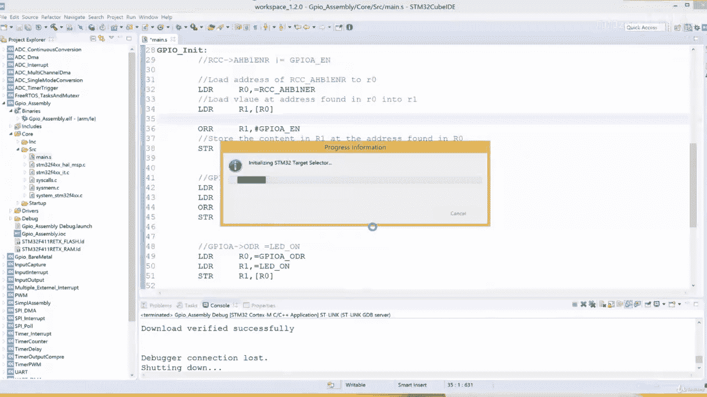
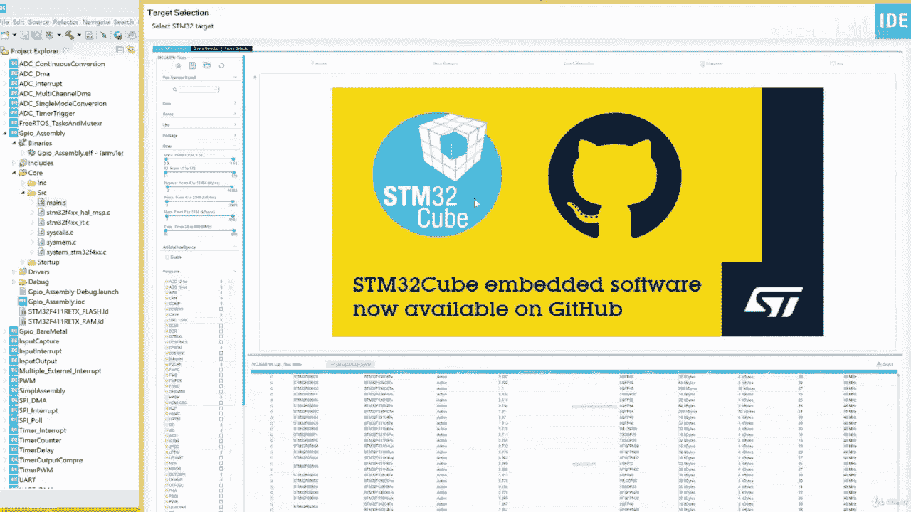
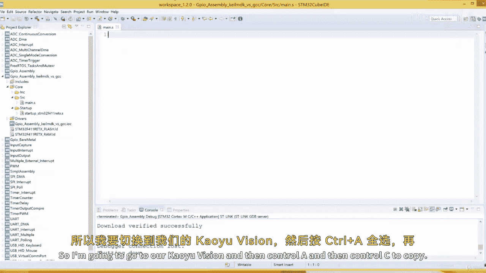
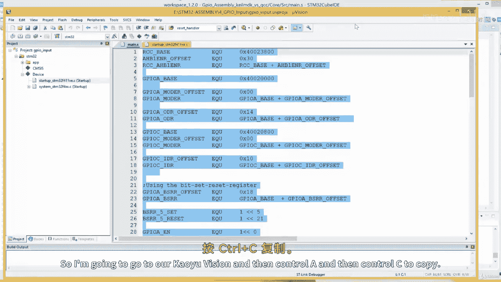
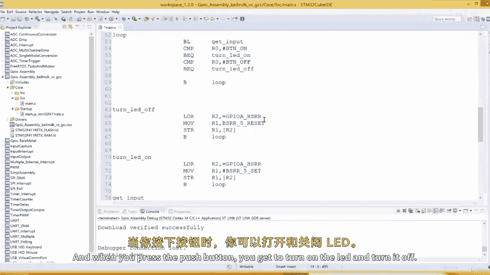
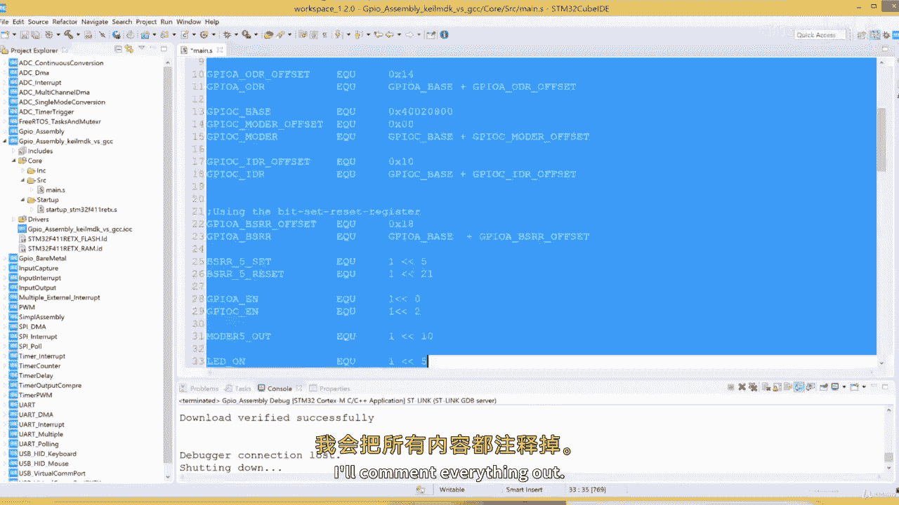
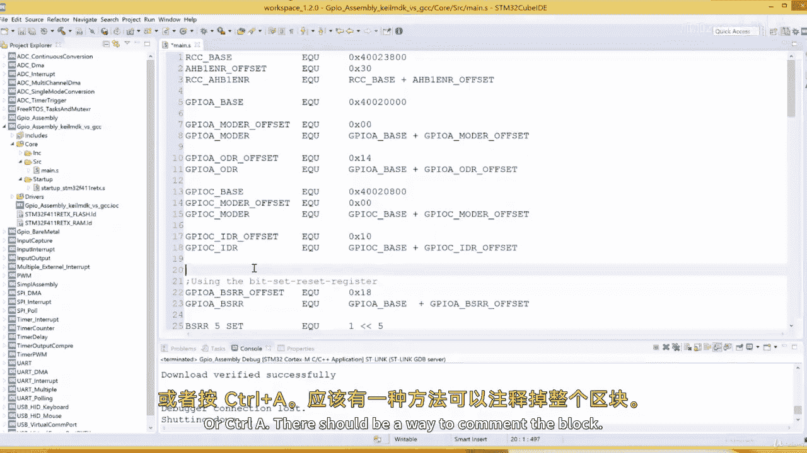
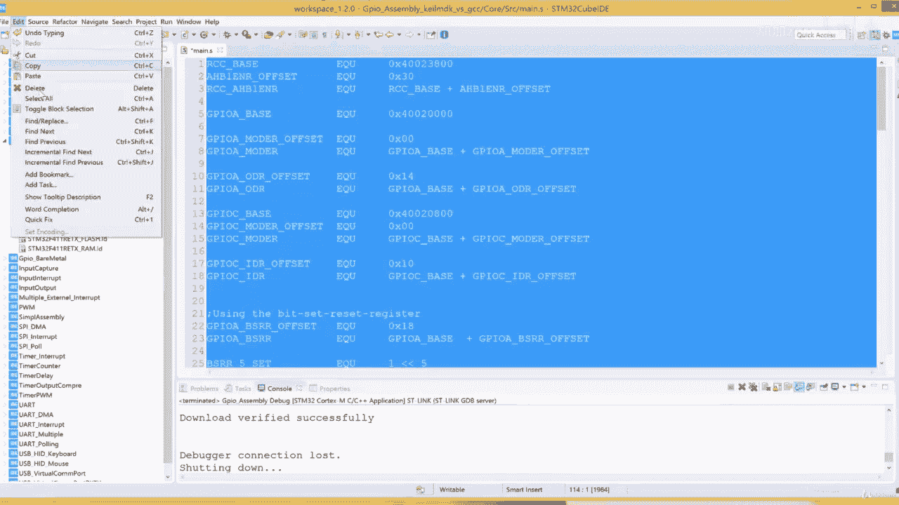
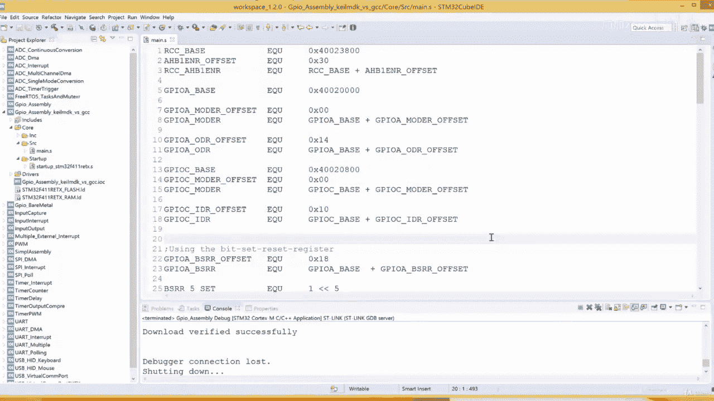
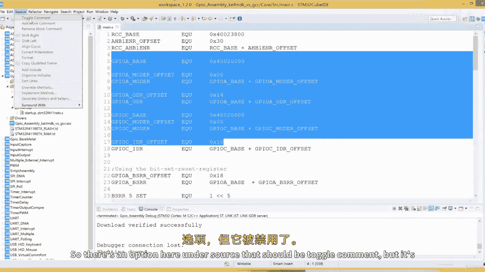

# ARM汇编语言：II：03.5 将Keil uVision汇编项目转换为CubeIDE GCC汇编项目

## 概述
在本节课中，我们将学习如何将一个在Keil MDK5/uVision5环境中创建的ARM汇编项目，转换到STM32CubeIDE（使用GCC汇编器）环境中。我们将通过实际操作，逐步修改汇编代码的语法、符号定义和伪指令，使其兼容GCC汇编器。

## 项目背景与差异分析
上一节我们介绍了STM32CubeIDE中汇编项目的基本结构。本节中我们来看看Keil uVision项目与它的主要区别。

首先，两者使用的汇编器不同。Keil使用其自家的ARM汇编器，而STM32CubeIDE使用GNU GCC汇编器。这导致了语法和伪指令的差异。





一个关键区别在于程序的入口点。在Keil项目中，复位处理程序（Reset Handler）会跳转到 `__main` 标签。而在STM32CubeIDE的GCC项目中，入口点标签是 `main`，没有下划线。

## 创建新项目与准备
以下是创建新STM32CubeIDE汇编项目的步骤。

1.  打开STM32CubeIDE，创建一个新的STM32项目。
2.  在目标选择器中，选择你的微控制器型号（例如STM32F411）。
3.  为项目命名，例如“MDK_vs_GCC”。
4.  完成项目创建向导。
5.  项目创建后，在`Core/Src`文件夹中，删除所有自动生成的C语言源文件，因为我们只需要汇编文件。
6.  在`Core/Src`文件夹中，右键新建一个文件，命名为 `main.s`。

现在，我们有了一个干净的项目，可以开始移植代码。





## 转换过程详解
我们将Keil项目中的汇编代码复制到新建的`main.s`文件中，然后逐项进行转换。



### 1. 转换符号定义（EQU）
在Keil汇编器中，使用 `EQU` 伪指令定义符号常量，且符号名在行首。







**Keil格式示例：**
```
GPIOA_EN    EQU 0x40023830
```



在GCC汇编器中，我们同样使用 `.equ` 伪指令，但语法格式不同。



**GCC格式应为：**
```
.equ GPIOA_EN, 0x40023830
```

以下是需要转换的步骤列表。
*   将 `EQU` 替换为 `.equ`。
*   在符号名和数值之间添加逗号 `,`。

### 2. 添加CPU与语法指令
GCC汇编器需要明确指定CPU架构和语法。在文件顶部添加以下两行。

```
.cpu cortex-m4
.syntax unified
```

*   `.cpu cortex-m4` 指定目标CPU为Cortex-M4。
*   `.syntax unified` 指定使用统一的ARM/Thumb语法。

### 3. 转换段定义与全局标签
在Keil中，使用 `AREA` 来定义代码段，使用 `EXPORT` 来声明全局标签。

**Keil格式示例：**
```
    AREA |.text|, CODE, READONLY, ALIGN=2
    EXPORT __main
```

在GCC中，我们使用 `.section` 定义段，使用 `.global` 声明全局标签。此外，入口点标签应为 `main`。

**GCC格式应为：**
```
.section .text
.global main
```

以下是具体的修改点。
*   将 `AREA |.text|, CODE, READONLY, ALIGN=2` 替换为 `.section .text`。
*   将 `EXPORT __main` 替换为 `.global main`。
*   确保代码入口的标签是 `main:` 而不是 `__main`。

### 4. 修改标签格式与注释
GCC汇编器在标签后需要冒号 `:`，而Keil中不需要。同时，注释符号从分号 `;` 改为 `@` 或 `//`（对于行注释）。

**Keil格式示例：**
```
__main
    ; 这里是注释
    LDR R0, =GPIOA_EN
```

**GCC格式应为：**
```
main:
    @ 这里是注释
    LDR R0, =GPIOA_EN
```

请检查所有标签（如函数名、循环跳转点）并确保它们以冒号结尾。

### 5. 处理结束指令与系统文件
Keil使用 `END` 作为程序结束指令，GCC中使用 `.end`。

**修改为：**
```
.end
```

此外，Keil项目可能依赖一些内置的初始化函数（如 `SystemInit`），这些函数在STM32CubeIDE的标准外设库或HAL库文件中。如果链接时报告未定义错误（例如 `loop_fill_zero_bss` 相关的错误），需要将必要的系统文件（如 `system_stm32f4xx.c`）从其他CubeIDE项目或固件包复制到当前项目的源文件夹中。

## 构建与调试
完成所有语法转换后，点击STM32CubeIDE的构建按钮。如果一切正确，项目应该能成功编译，没有错误。

接下来可以进行调试。
1.  点击调试按钮进入调试模式。
2.  在调试视图中，可以运行程序。
3.  本例程的功能是按下开发板上的按键点亮LED，松开则熄灭。你可以在调试时操作硬件进行验证。


## 总结
本节课中我们一起学习了将Keil uVision汇编项目迁移到STM32CubeIDE GCC环境中的完整流程。核心在于理解并转换两者在符号定义、伪指令、标签格式和入口点命名上的差异。关键修改包括将 `EQU` 改为 `.equ`，`AREA` 改为 `.section`，`EXPORT` 改为 `.global`，并将入口点从 `__main` 改为 `main`。掌握这些转换技巧后，你就能让为Keil编写的汇编代码在基于GCC的工具链中运行。