# ARM汇编语言：04.2：为相关UART寄存器分配符号名

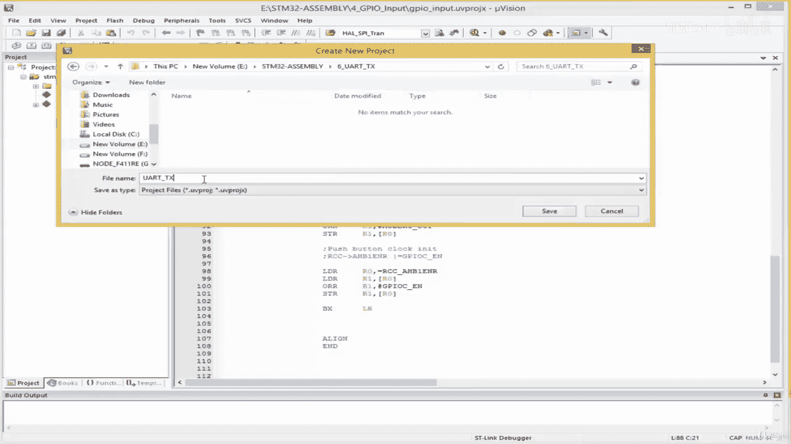

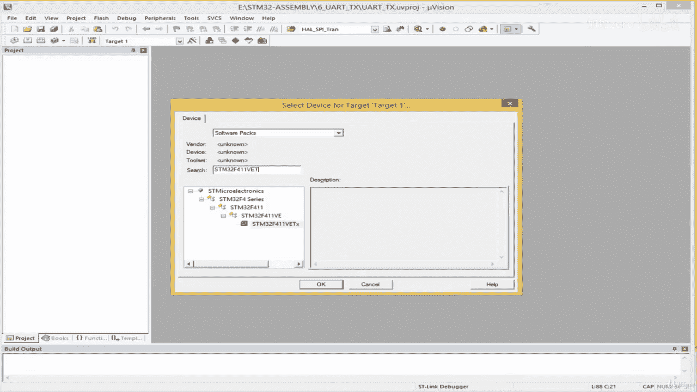

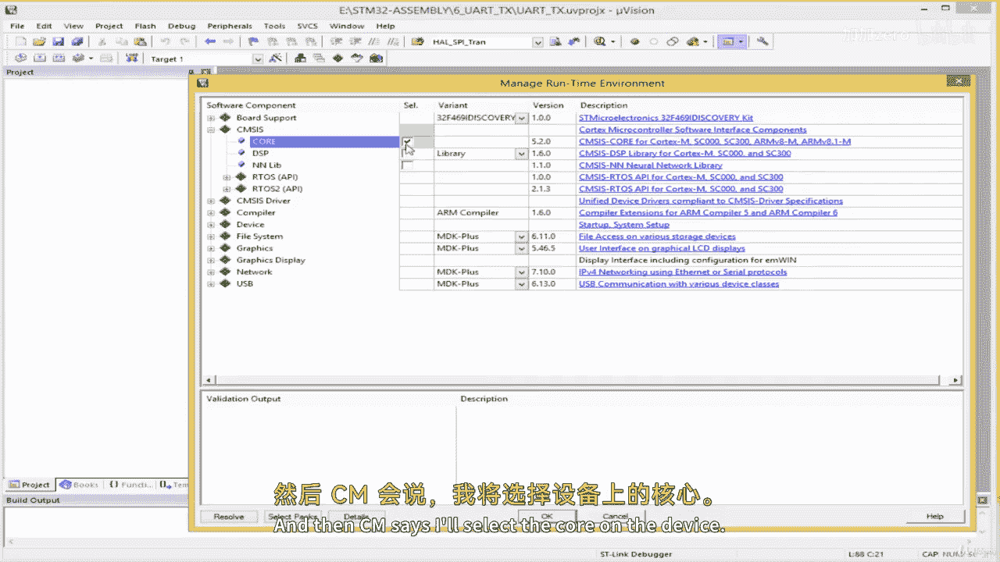

在本节课中，我们将学习如何为STM32微控制器的UART（通用异步收发器）模块开发驱动程序。我们将从配置UART的发送（TX）部分开始，实现从微控制器通过UART向计算机上的串口程序发送数据。首先，我们需要为相关的UART寄存器分配易于理解的符号名称，这是编写底层驱动代码的基础。

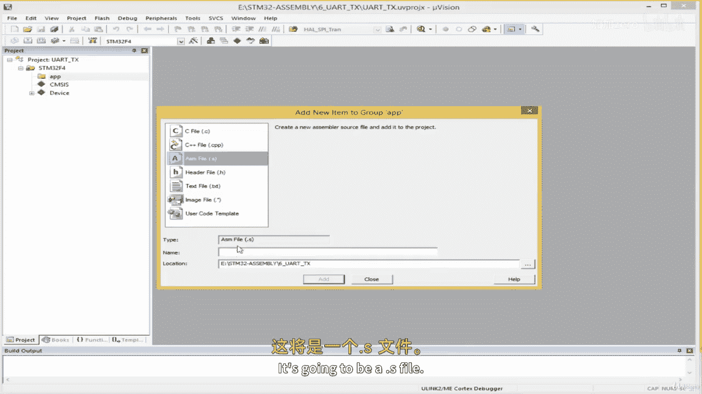

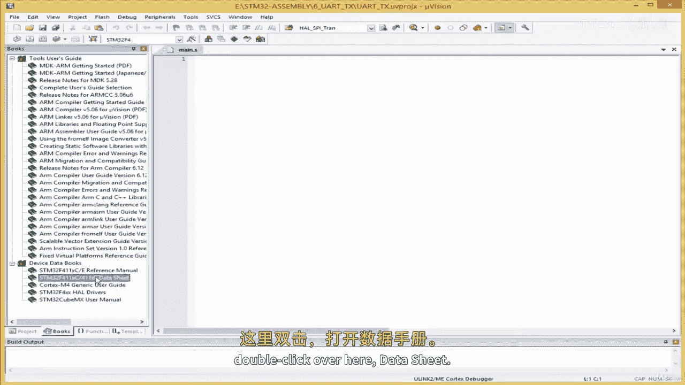

## 项目创建与回顾

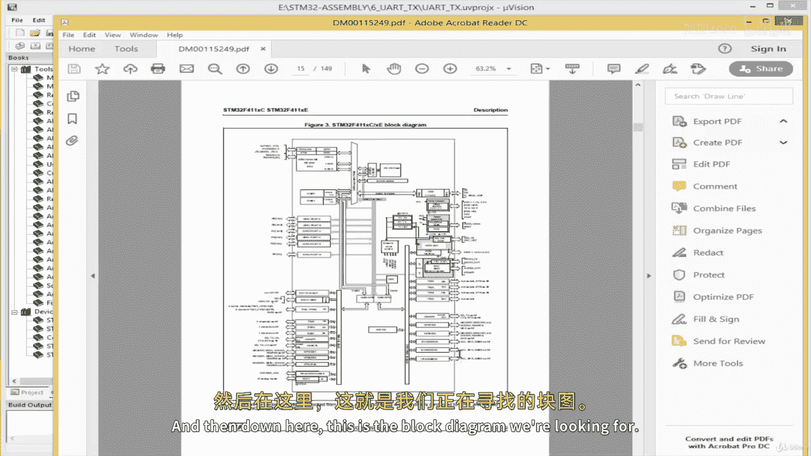

上一节我们介绍了GPIO输入项目。现在，我们将创建一个新的UART TX项目。

以下是创建新项目的步骤：
1.  在Keil uVision中创建新项目。
2.  选择目标设备为STM32F411VETx。
3.  添加必要的启动文件和核心支持。
4.  将目标命名为 `STM32F4`。
5.  在 `APP` 源组中添加一个新的汇编文件 `main.s`。

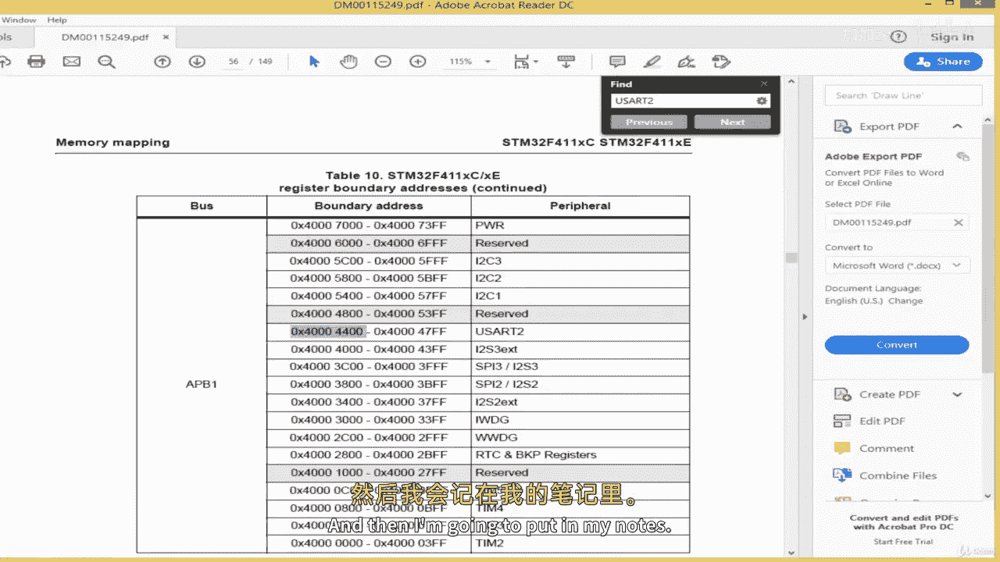

在开始配置UART之前，需要回顾一下GPIO的初始化。在之前的GPIO输入项目中，我们初始化了LED（输出模式），但没有显式初始化输入引脚的模式。这是因为GPIO引脚默认为输入模式（模式寄存器的对应位为 `00`），所以我们无需额外操作。

## 启用UART时钟与查找基地址

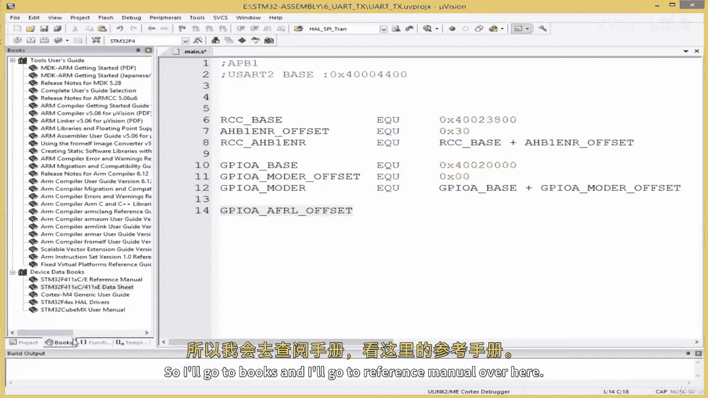

UART模块挂载在特定的总线（APB1）上，使用前必须启用其时钟。

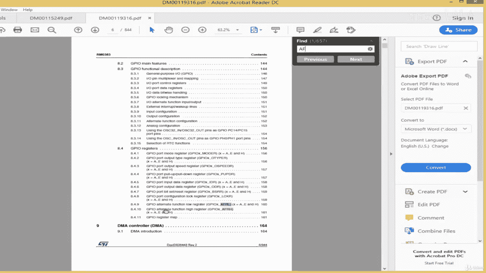

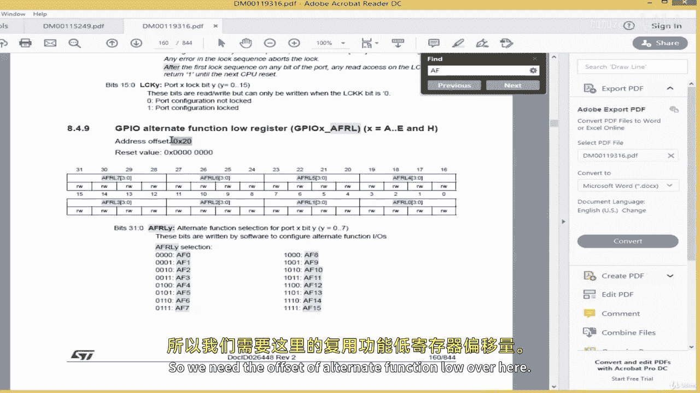

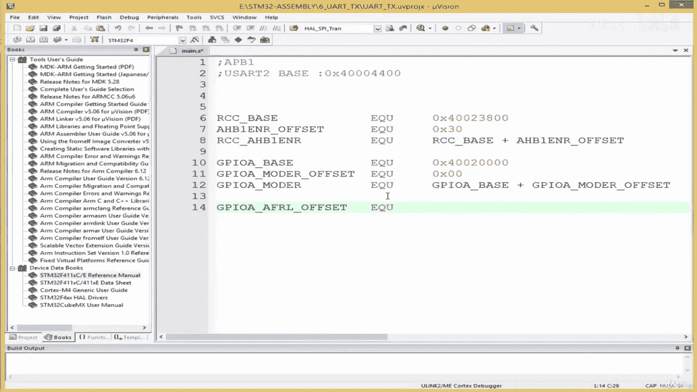

首先，我们需要在数据手册中找到系统框图，确认UART2连接在APB1总线上。因此，要启用UART2的时钟，我们需要在 `RCC_APB1ENR` 寄存器中设置对应的位（第17位）。

接下来，我们需要找到UART2模块的基地址。在数据手册的存储器映射章节，可以找到 `USART2` 的基地址为 `0x40004400`。虽然模块名称为USART（同步/异步），但我们将其配置为UART（异步）模式使用。

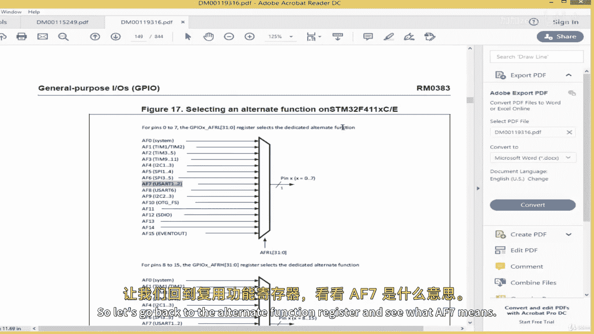

我们定义相关常量如下：
```assembly
; RCC 寄存器基地址
RCC_BASE        EQU     0x40023800

; APB1 外设时钟使能寄存器 (RCC_APB1ENR) 偏移量
RCC_APB1ENR_OFFSET EQU  0x40
RCC_APB1ENR     EQU     RCC_BASE + RCC_APB1ENR_OFFSET

; UART2 基地址
UART2_BASE      EQU     0x40004400

; 时钟使能位定义
GPIOA_EN        EQU     (1 << 0)    ; 使能 GPIOA 时钟 (在 AHB1ENR 中)
UART2_EN        EQU     (1 << 17)   ; 使能 UART2 时钟 (在 APB1ENR 中)
```

## 配置GPIO引脚为UART功能

UART2的发送（TX）和接收（RX）线分别对应GPIOA的引脚PA2和PA3。我们需要将PA2配置为复用功能模式，并选择正确的复用功能类型（UART2_TX）。

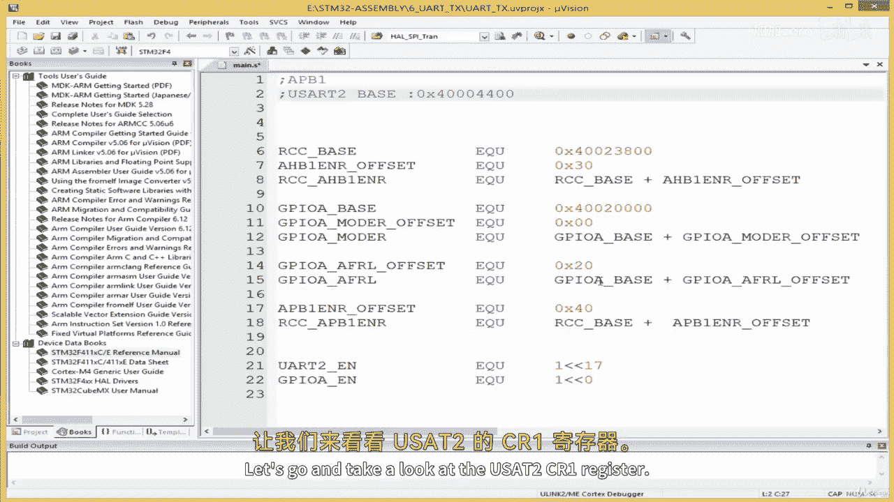

配置一个GPIO引脚为复用功能需要两步：
1.  在GPIO模式寄存器中，将对应引脚的2个模式位设置为 `10`（复用功能模式）。
2.  在GPIO复用功能寄存器中，为对应引脚选择具体的复用功能编号。

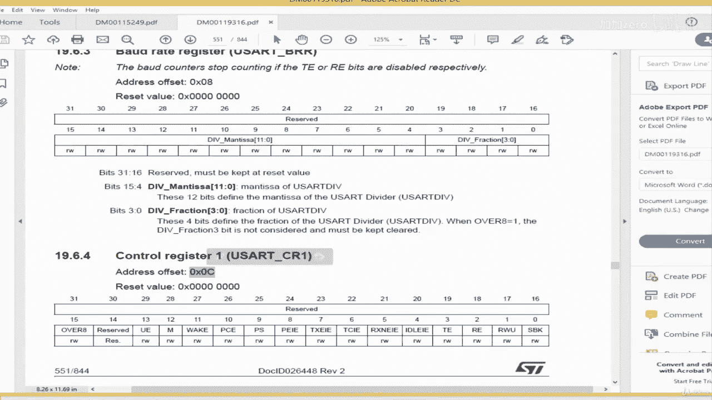

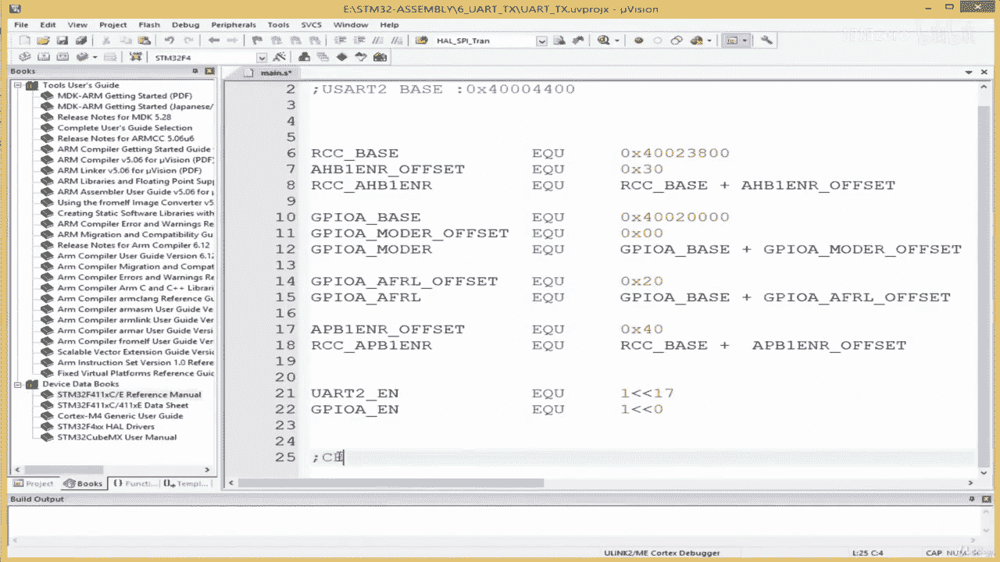

对于PA2，我们需要：
*   在 `GPIOA_MODER` 寄存器中，设置 `MODER2[1:0] = 10`。
*   在 `GPIOA_AFRL` 寄存器中，设置 `AFRL2[3:0] = 0111`（即AF7，对应USART2功能）。

我们定义相关GPIO寄存器偏移量和配置值：
```assembly
; GPIOA 寄存器基地址
GPIOA_BASE      EQU     0x40020000

; 寄存器偏移量
GPIOx_MODER_OFFSET  EQU 0x00
GPIOx_AFRL_OFFSET   EQU 0x20

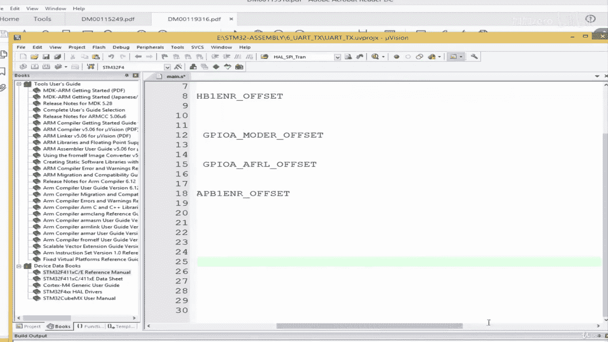

; GPIOA 寄存器地址
GPIOA_MODER     EQU     GPIOA_BASE + GPIOx_MODER_OFFSET
GPIOA_AFRL      EQU     GPIOA_BASE + GPIOx_AFRL_OFFSET

; 配置值定义
; 设置 PA2 为复用功能模式 (MODER2 = 10)
PA2_ALT_MODE    EQU     (1 << 5)    ; 等价于 0b0100 0000， 即 0x40
; 设置 PA2 的复用功能为 AF7 (USART2_TX)
PA2_AF7_SEL     EQU     (0x7 << 8)  ; AFRL2 位于位 [11:8]， 写入 0x7
```

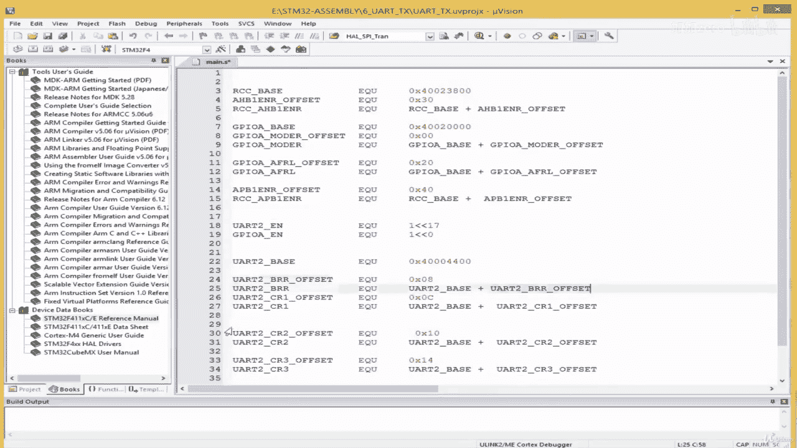

## 定义UART寄存器与配置参数

现在，我们来定义UART2模块本身的关键寄存器。根据参考手册，我们需要配置以下几个寄存器：
*   `CR1`：控制寄存器1，用于使能UART、选择数据位宽、使能发送器等。
*   `BRR`：波特率寄存器，用于设置通信波特率。
*   `CR2`：控制寄存器2，用于设置停止位。
*   `CR3`：控制寄存器3，用于设置硬件流控制。
*   `SR`：状态寄存器，用于查询发送缓冲区状态（是否为空）。

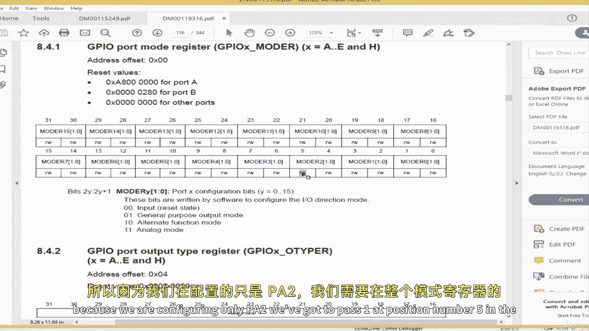

我们首先定义这些寄存器的偏移量，然后计算出它们的绝对地址。
```assembly
; UART2 寄存器偏移量
UARTx_CR1_OFFSET    EQU 0x00
UARTx_BRR_OFFSET    EQU 0x0C
UARTx_CR2_OFFSET    EQU 0x04
UARTx_CR3_OFFSET    EQU 0x08
UARTx_SR_OFFSET     EQU 0x1C

; UART2 寄存器地址
UART2_CR1   EQU     UART2_BASE + UARTx_CR1_OFFSET
UART2_BRR   EQU     UART2_BASE + UARTx_BRR_OFFSET
UART2_CR2   EQU     UART2_BASE + UARTx_CR2_OFFSET
UART2_CR3   EQU     UART2_BASE + UARTx_CR3_OFFSET
UART2_SR    EQU     UART2_BASE + UARTx_SR_OFFSET
```

接下来，我们为计划写入这些寄存器的具体配置值定义符号名，以提高代码可读性。我们计划进行如下配置：
*   波特率：9600（基于16MHz系统时钟计算出的值 `0x683`）。
*   使能发送器（TX），数据位宽8位：`CR1` 写入 `0x200C`。
*   1个停止位：`CR2` 写入 `0x0000`（默认值）。
*   无硬件流控制：`CR3` 写入 `0x0000`（默认值）。
*   最后使能UART模块：`CR1` 的 `UE` 位写入 `1`。
*   发送缓冲区空标志：`SR` 寄存器的 `TXE` 位（第7位）为 `0x80`。

定义配置值如下：
```assembly
; UART 配置参数
UART_BRR_CFG_VAL    EQU     0x683   ; 波特率 9600 @ 16MHz
UART_CR1_CFG_VAL    EQU     0x200C  ; 使能 TX, 8位数据位
UART_CR2_CFG_VAL    EQU     0x0000  ; 1个停止位
UART_CR3_CFG_VAL    EQU     0x0000  ; 无硬件流控制
UART_CR1_UE_ENABLE  EQU     0x2000  ; 使能 UART (UE 位)
UART_SR_TXE_FLAG    EQU     0x80    ; 发送数据寄存器空标志位
```

## 总结

本节课中，我们一起学习了为STM32的UART2模块开发驱动程序的第一步：为所有相关的寄存器分配符号名称。我们完成了以下工作：
1.  回顾了项目创建流程。
2.  确定了启用UART2时钟所需的总线和寄存器位。
3.  找到了UART2的基地址。
4.  定义了配置GPIO引脚PA2为UART发送功能所需的寄存器和配置值。
5.  定义了UART2模块自身的所有关键寄存器地址。
6.  为即将进行的UART参数配置（波特率、数据位、停止位等）定义了具体的数值常量。

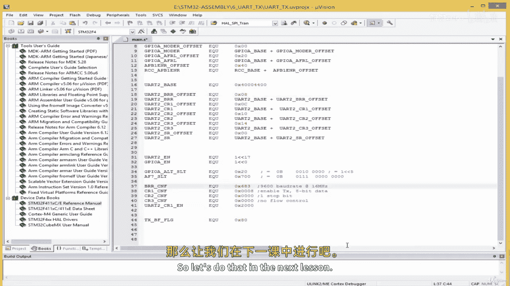

通过将这些硬编码的地址和数值转化为有意义的符号名，我们的代码变得更容易编写、阅读和维护。在下一节课中，我们将利用这些定义好的符号，开始编写具体的汇编代码来初始化UART并实现数据发送功能。