# 【从零开始学习 ARM 汇编语言II Udemy】 p14 p13 04.3. Coding  Writing the UART Initialization Subroutine -BV1RJU6YwEM8_p14-

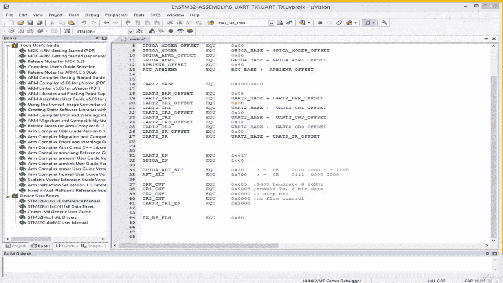

Right， welcome back， so let that right to know where you at driver。Okay， I'll come down here。

St with my directives。just。😔，You know， move this up here。😔，Okay， and then。Area。Text。Lin。

We're in the code area。Does this read only？And were aligned to over here。😔。

We use in thumb instruction。😔，The entry。And I'm going to。Export my main label here like this。😔，And。😔。

start off like this。And once our assembly code runs， we going in， we want a branch to。

A subroutine that we shall write known us。You art in it。Okay， so let's implement this now。😔。

Put this over here。😔。

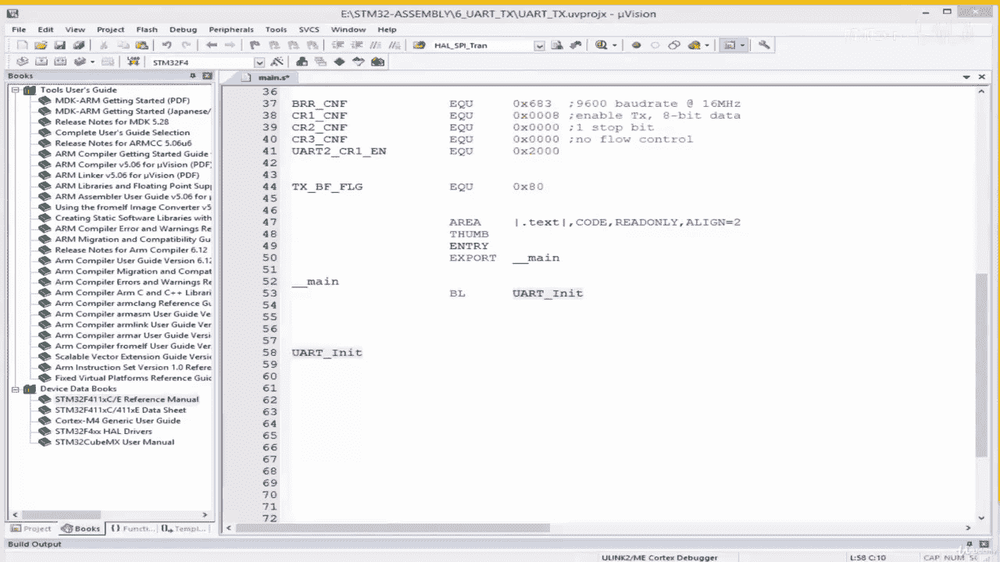

And to initialize this first， we need to enable。 we need to initialize GI port A and set P A2 as an alternate function pin。

 Once we've done that， we go on and enable the U at module。 So I'm going to start off by doing load。

Load。Ihiro。With the address of。RRC A H P1。And they will register。😔，And then once that is done。

 I'm going to do load。😔，Into R1， the content found at the address stored in r0ro。Once I stand。

 I'm going to perform。A logic。I' going to perform logical or operation or。😔，R1。And then GPIU A。

Enable and then store the result back into R1。😔，Once that is done。

 we're going to take what is in our1。😔，Starttor it at the address found in R0 by doing this。😔，Right。

And if you're interested in knowing what this looks like in C language， this is going to be。RRC。

 A H P1， E， N R。And then this。This is what weve。Donown over here。Right， once this is done。Okay。

 since we are dealing with clocks， we can enable the UL clock as well while we are here。So。

 what I'm gonna do now is。Okay， I'm going do ourcc。😔，A PB1， we know that U are disconnect to APB1。

 so AP PB1。And they will register。And we're gonna do。You at2 E。

This is what we're going to write in assembly。 So we implement that by doing r0。

then well point this to RCC。Undersco APb1。And they will register。And then， we do。Load。😔，R 1。

 the content of r0。And then once that is done， we perform our logic or again R1。😔。

You add two and then start the result back into R1。Forgot a one over here。😔，Once that stand。

 store r1， store the content of R1。😔。

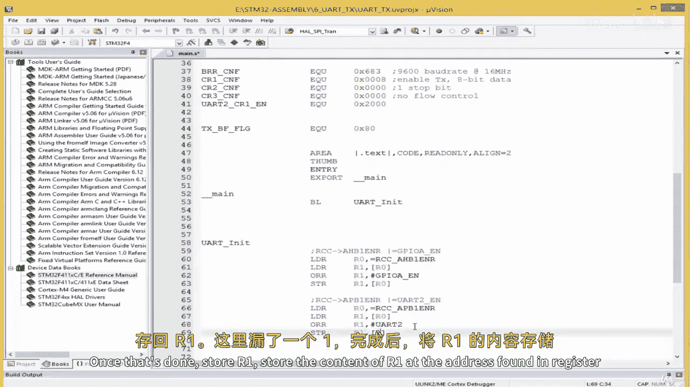

好，第一。😔，A dress found in Reg Irish Europe。😔，Okay， so this will enable the U out for us。 Next。

 we have to set up。We can set our alternate function register。I'm going to come over here。😔，And do。

GPIU。Okay， I'll just put a C language GI U A。Alternate function register index0。

This is what you write and see。 and then we're going to pass0 x 7，0，0。

We already have a symbolic name for this， do we know。😔，Okay， old7， we this。😔，So， essentially。

This is what we're going to do here。😔，To do this in assembly。I'm going to do load r0。😔，And GIU A。

Alternate function， Reg Lu。😔，And then， load。😔，I one I。T before my or operation or。Then R1。😔，A F7。

 select。And then store。Aron。😔，20。Right。Once this is done， we are going to set the mode register。😔。

And in C language， this is gonna be GIU A。Moode register。😔。

And we created a symbolic name for the code。😔，Of the mode register， we called this。😔，GPIU A。

Old select。Ot SLT， let's see if it exists， it's over here。😔，Right。So in assembly。We start off load。I。

And then we want to load。😔，The GI U A mode register address。And then。Load。😔，A one。R0。

And then we perform all。A one。With this。Whi is the code。😔。

The bits that we want to set and it would register that。Once that is done。

 the result is going to be stored in our1， we take what is in our1。

 store it the address found in ourze like this。😔。

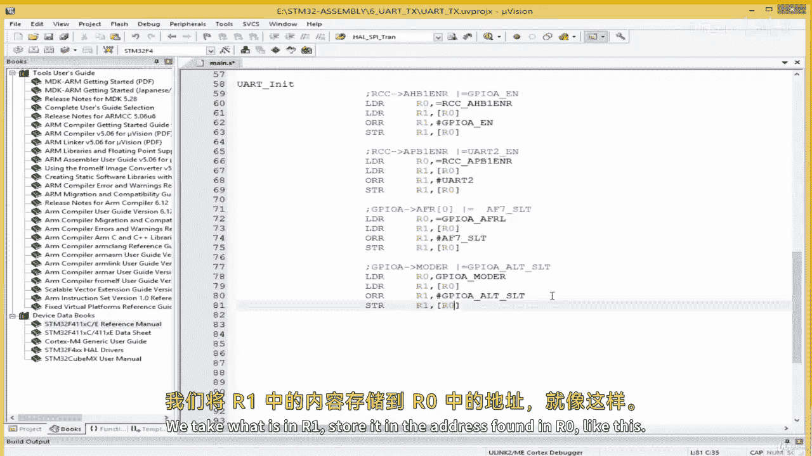

Okay。So then this will set the mode register for us。 Next。

 we've got our configure the board rate reset the board rate register。

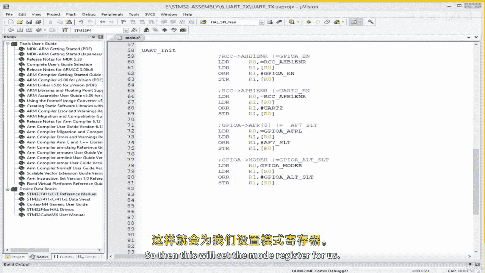

Right， so you C language， this is going to be U at 2 B R R。And then what we want to do here。😔。

Is equals we created a code for this， known as the。

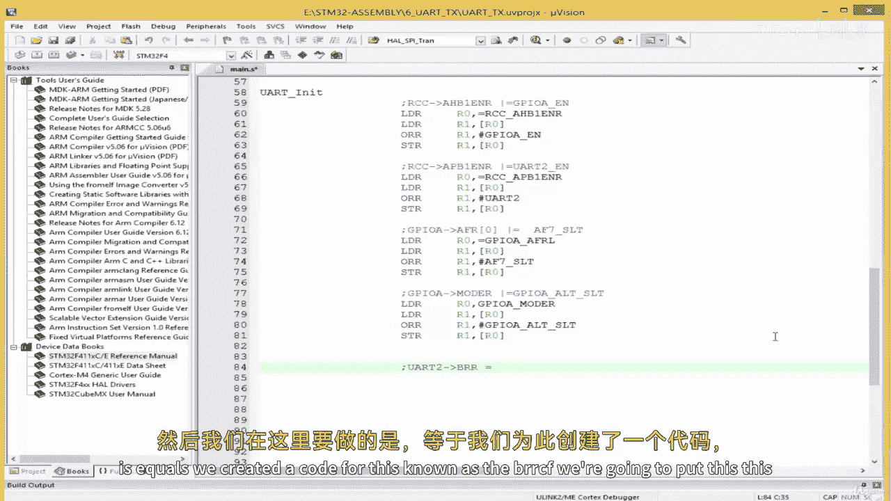

B， R， R C andF， we're going to put this， this symbolic name that we created。

 We're going to put it in the bargerary to register。Right， this is what we do in。

If we were to write and see language， like I've stated it， so I'll do Lord。😔，A Siro。

You add load R0 equals。You add to but rate to register， and then what I'm going to do is move up U。

 I' use the moved up U。😔，Instruction， and then I'm going to move our constant。Into R1。

Because the constant is larger than8 bit， that's why I'm using the moved of U。Right。

 the Mo of W allows us to move。😔，16 bit。 so because this here is bigger on 8 bit。

And how do I know it's bigger than8 bit because it's called 3E？3 digits here。

 Remember each digit equals 4 B。 So this is 12 of B。 right。 So if I use simple move， it won't work。

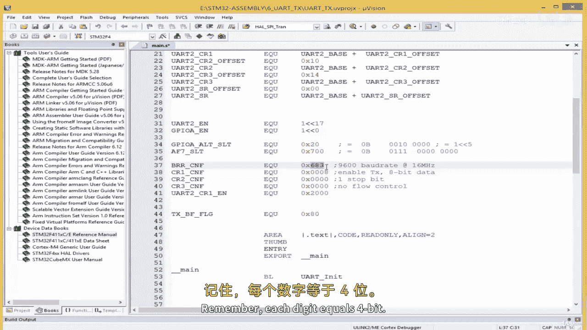

I've got to use something that can。Curry things， pick at an8 bit。 if you may。

 So once we've put this in R1， we can take what is in R1 and put it at the address。

Sttored in register Arraciro。And we do SDR。or1。20。Once this is done。

 we can configure the control register。I'm gonna say you at2。

Although it is advisable to often or to always disable the U add before you configure the rate and other things。

 So ordinarily， we， we are required to sort of go to the control register one and disable the U add before running this。

 But they should be fine。 I'm just pointing that out there。As is a good practice， I should say。

 so you ought to。What we are going to do now is you are to control register one and we created a constant for what we want to put in Con register  one is this one here。

And over here， we're not using the all operator， we're not applying friendly programming。

 we're writing we replacing the entire content of the register with this new constant that we created。

The CRf， the CR1 cF。And we had the PRR CF as well， right。

 that is why you don't see the vertical line here， and because you don't see this vertical line。

 that is why you don't see us perform the or operator。

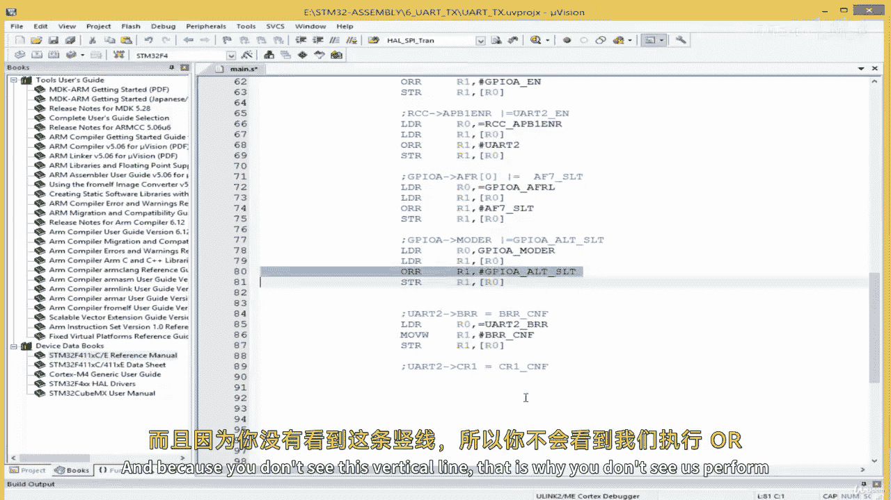

The operation， I should say。Right， so in assembly language， we do load。R0 equals。You ought to。😔。

Controrl Reg 1。Ca we have the address of this already created for us。 and over here， we can do move。

R1。

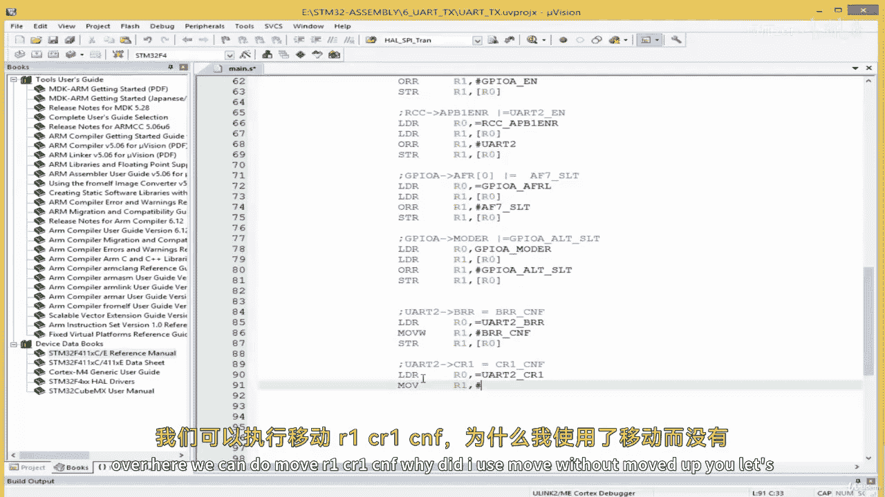

C， R 1， CF， Why did I use Mo without Mo W， Let's look at C， R1。

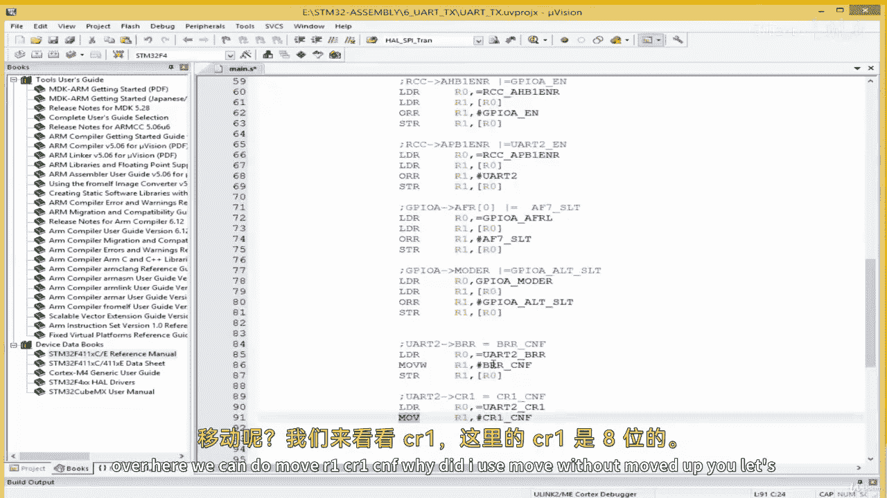

See our one here。😔，Its 8 bit。How do I know it8 bit this number here？😔，What we have here is the same。

 This exodademo code is the same as write in this。Oh， sorry， it's the the maximum number of zeros。

 This is the same as 1，2，3，4，5，6，7。This is the same as this。In the same way。

 this is still8 bits equal stress 0。Is the same as this as well。 So we can keep this。

 The only relevant information is this。 Anything before the ya， this digits can be cleaned away。

 right， But if we had zeros here， this is a different story。 This is bigger than 8 bit。

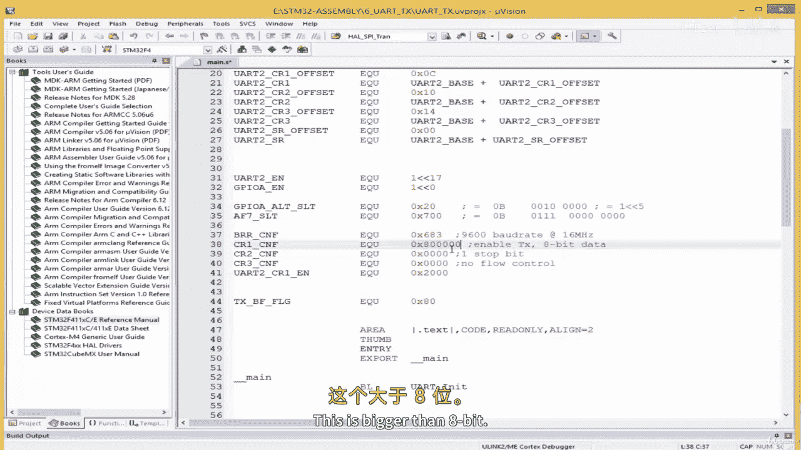

Right， but this is8 bit。And is the same as this or this。Or this。 or this。Right， still a gate bit。

 So that's why I can use the move instruction here and I don't need to use the move W。 Okay。

 so once that is done。シスト？Avo。二 you。Okay。Once we are done with this。

 we can go on to the control register too。And what are we going to do next。Is your at。Issue up two。

C R2， and we're going to write C R2 CNF that we've created。

' write we're going to write it into this register。So see load。😔，Arahiru。You add to。Xiao。😔。

And then move。Everyone。C2区。CNF。And then， store。Everyone。20。Right。Okay， so once we are done with this。

We go on to configure the CR3。You ought to。This is。You add to。See R3。And then she R three。😔，CF。

Start off by doing load。Arahiu。You ought to。Under the course are3。Forgot the equal sign here。😔，Yeah。

 as well。😔。

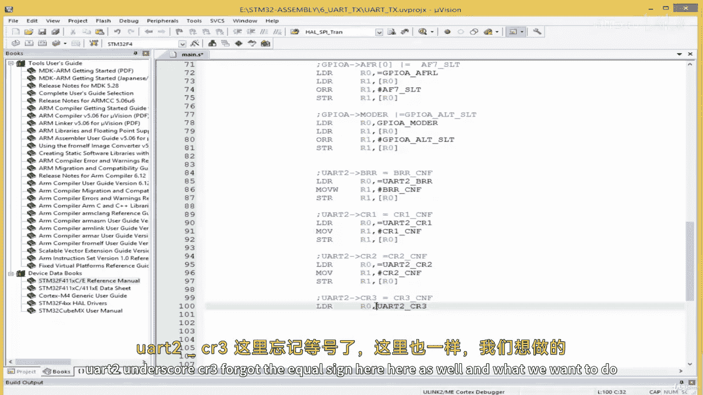

And what we want to do is let's see the size of CR3。It's just zero。Okay。

 so we can just write CR3 using the move operation。😔。

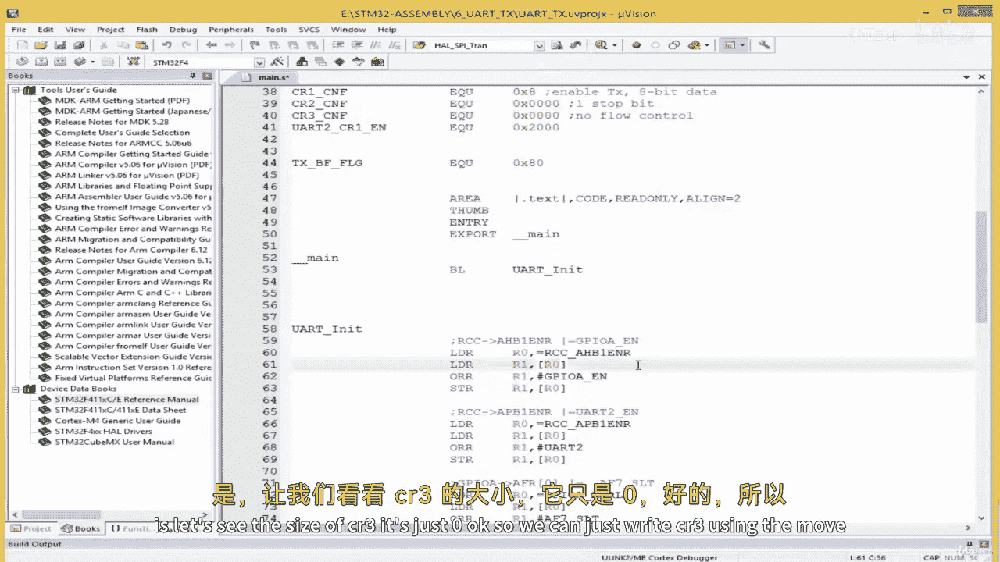

So would see。All the move instruction， I should say， move our one。😔，She R3。😔，C and F。しtop。I run。

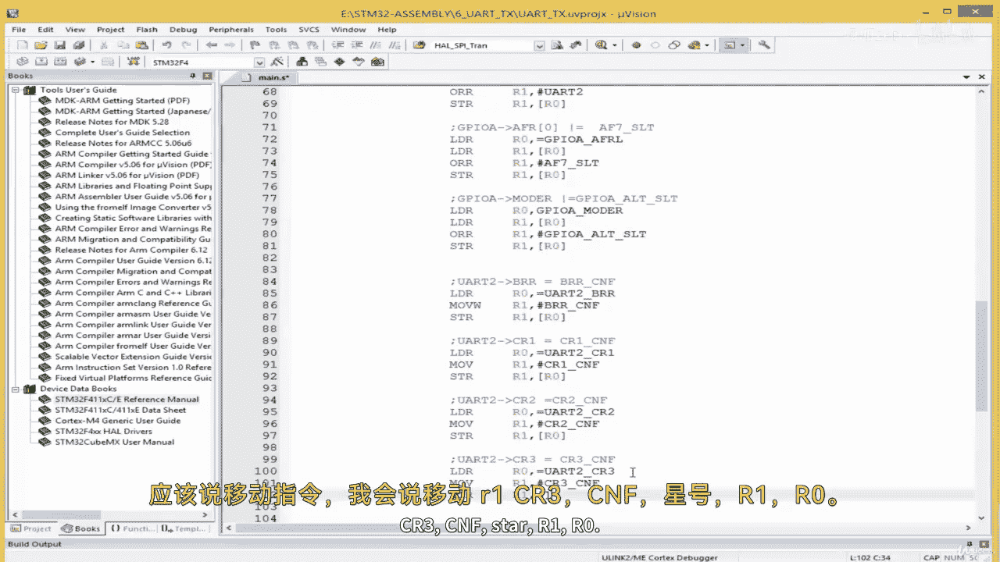

20。Right， so once this is done， we've got to enable the U at。😔。

And what we're going to do is you add2。C， R1。Because。You add to。C， R1 E， N。

We created this constant already， I'm going to fetch it from here。😔，This is bigger than 8 bit。

 in fact， this is 16 bit。

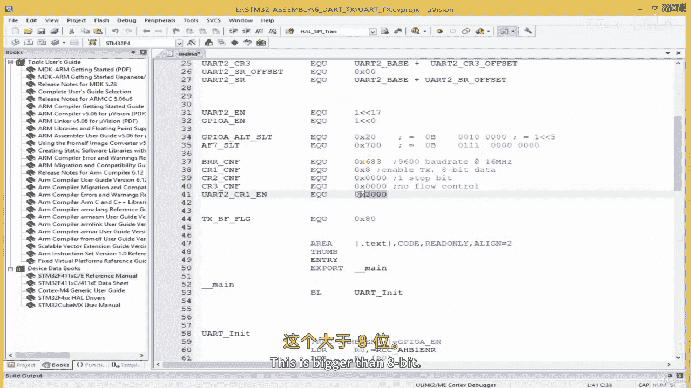

So we wouldn't be able to use the move operation。And also， we can apply our all operation here。嗯。

Right， so I'm going to load the address load。😔，I。U at2 CR1。And I'm simply gonna do。😔。

One thing we have to be careful about this is you see， we can't simply write our new code this。

 we can simply write this to this Reg CR1。 Why， because we've already configured CR1。

 We've configured CR1 over here。 If we just write it with a new value。

 It's going to disable what we configured here。 It's going to clean away this。

 So we' going we need to apply friendly program in here we need to perform an all operation so we need to put a vertical line here and by this we need to do all so that we change only the bit we want to change right。

So I'm going to do load。A1。20。And then I'm gonna do oh。R1。See you at 2 CR1 enable。

After this or operation， the result is going to be put in our， and then I'm going to do star。R1， R0。

And then this is the end of it。 I can do Px Lr to return from the subroutine。😔，Right。Okay。

 so this is it。

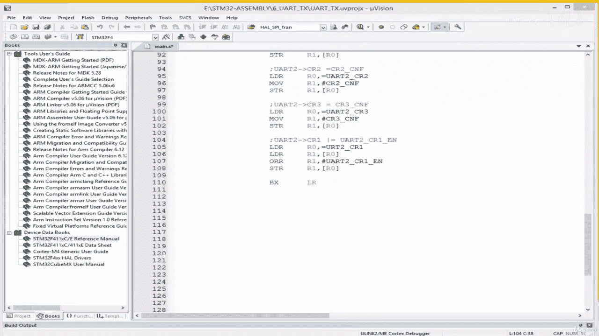

Right， so we've created the U at in it subrout， how about we conclude this lesson here and continue in the next lesson in the next lesson we're going to write the subrout to。

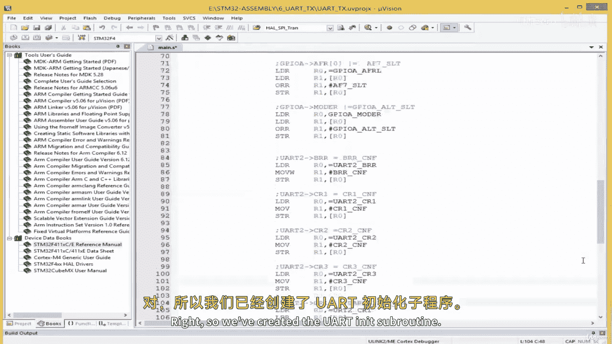

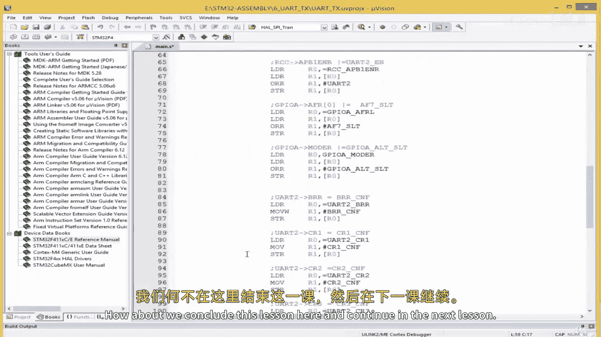

To help us send data through the UU， we're going to call this one UU outputput character。

 this will allow us to send a character， so this this is all there is for this lesson and I'll see you in the next lesson。

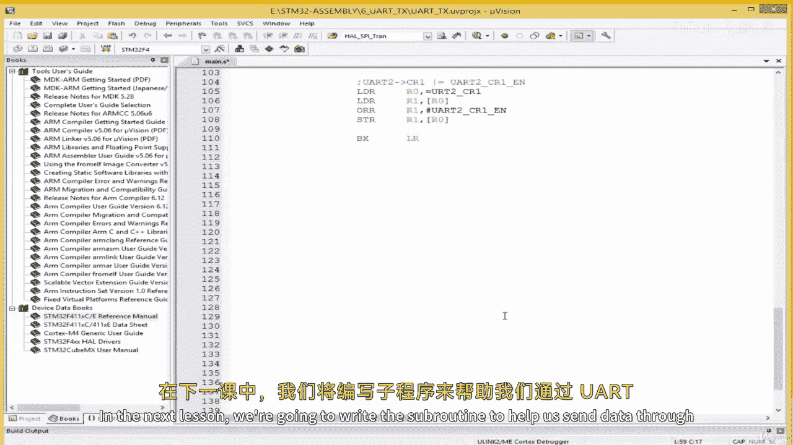

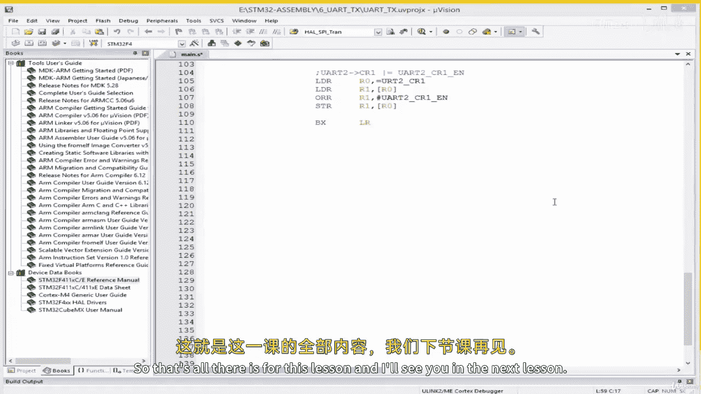