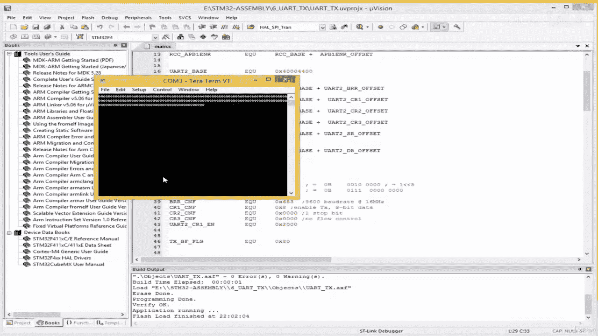
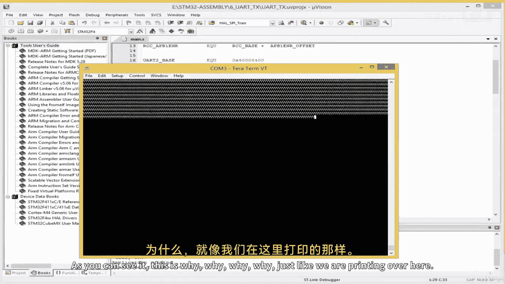
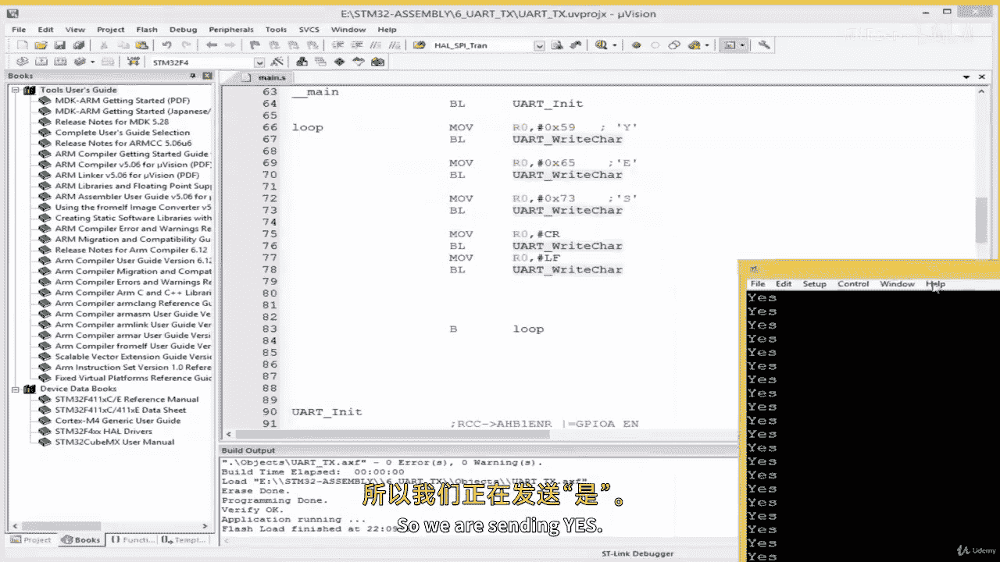
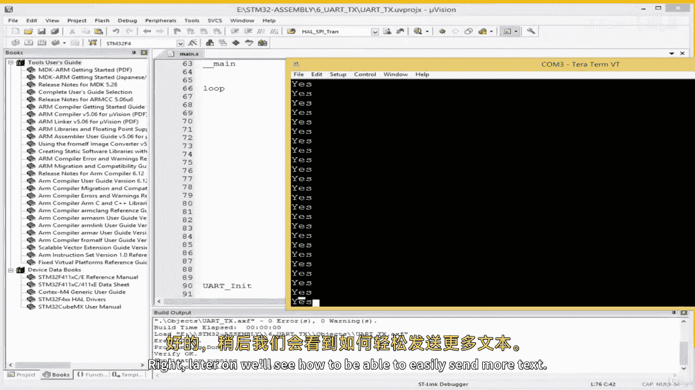
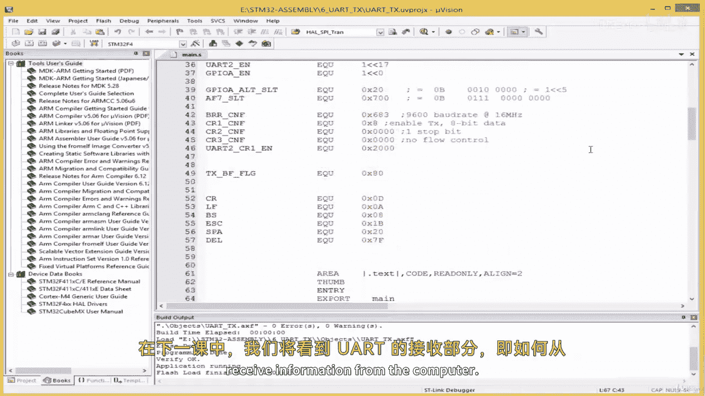

# ARM汇编语言编程：04.5：测试UART发送(TX)子程序 📡

在本节课中，我们将学习如何测试之前编写的UART发送子程序。我们将通过编写一个简单的循环，向串口终端发送特定的字符和字符串，来验证UART初始化及发送功能是否正常工作。

## 概述

上一节我们完成了UART的初始化配置。本节中，我们将编写主程序来调用发送子程序，并通过串口调试工具观察输出结果，以此测试我们的代码。

## 测试主程序

以下是测试UART发送功能的主程序代码框架。程序首先跳转到初始化子程序，然后进入一个无限循环，持续发送字符。

```assembly
    .global main
main:
    // 跳转至UART初始化子程序
    BL uart_init

    // 测试循环标签
test_loop:
    // 将要发送的字符加载到寄存器R0中
    MOV R0, #0x59  // 字符‘y’的ASCII码（十六进制）
    // 调用UART发送字符子程序
    BL uart_write_char

    // 跳转回循环开始，形成无限循环
    B test_loop
```

## 定义常用符号

为了方便代码编写和提高可读性，我们定义一些常用的ASCII控制字符符号。

```assembly
// 定义常用ASCII控制字符的十六进制值
CR      EQU 0x0D    // 回车 (Carriage Return)
LF      EQU 0x0A    // 换行 (Line Feed)
BS      EQU 0x08    // 退格 (Backspace)
ESC     EQU 0x1B    // 退出键 (Escape)
SPACE   EQU 0x20    // 空格 (Space)
DEL     EQU 0x7F    // 删除 (Delete)
```

## 发送字符串“YES”

为了进行更复杂的测试，我们修改循环，使其发送完整的单词“YES”并换行。

以下是更新后的循环代码，它依次发送字符‘Y’、‘E’、‘S’，然后发送回车和换行符。

```assembly
test_loop:
    // 发送字符 ‘Y’
    MOV R0, #0x59
    BL uart_write_char

    // 发送字符 ‘E’
    MOV R0, #0x65
    BL uart_write_char

    // 发送字符 ‘S’
    MOV R0, #0x73
    BL uart_write_char

    // 发送回车符(CR)
    MOV R0, #CR
    BL uart_write_char

    // 发送换行符(LF)
    MOV R0, #LF
    BL uart_write_char

    // 跳转回循环开始
    B test_loop
```



## 调试与纠错



在初次构建和下载程序时，可能会遇到错误。常见的错误包括符号拼写错误或寄存器地址偏移量设置不正确。

例如，UART数据寄存器(DR)的偏移地址应为`0x04`。确保在数据段中正确定义：

```assembly
uart_base   EQU 0x40011000
uart_dr     EQU uart_base + 0x04  // 数据寄存器偏移地址
```

使用调试器（如ST-Link）下载程序到开发板，并配置为“Reset and Run”模式。

## 使用串口终端验证输出

需要使用一个串口终端程序（如Tera Term）来接收开发板发送的数据。

以下是连接步骤：
1.  打开Tera Term，选择“Serial”连接。
2.  选择对应的STM32虚拟串口端口。
3.  配置波特率等参数（需与代码中初始化设置一致）。
4.  复位开发板，观察终端接收窗口。

如果一切正常，终端窗口将重复显示“YES”并换行。

## 总结





本节课中我们一起学习了如何测试UART的发送功能。我们编写了主程序循环，定义了常用的控制字符，并通过串口终端成功输出了“YES”字符串，验证了UART初始化及字符发送子程序的正确性。



在下一课中，我们将学习UART的接收(RX)功能，了解如何从计算机接收信息。