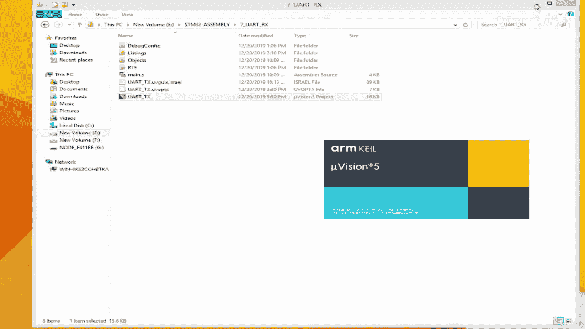
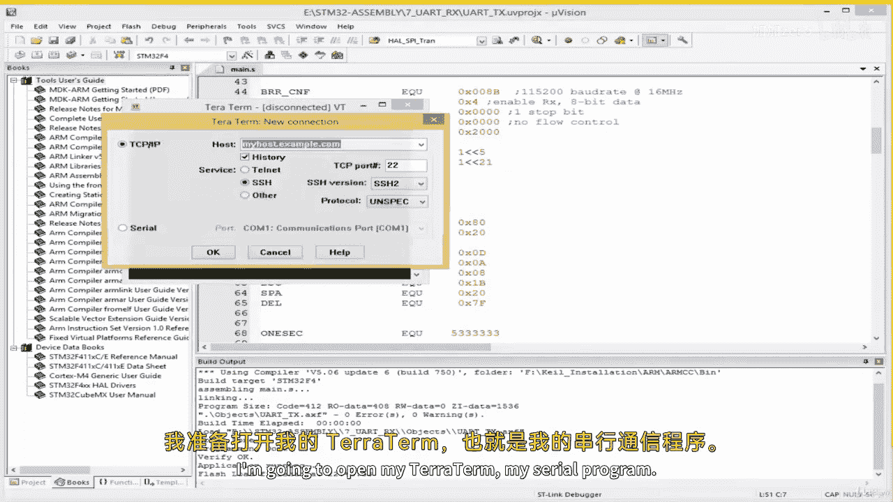
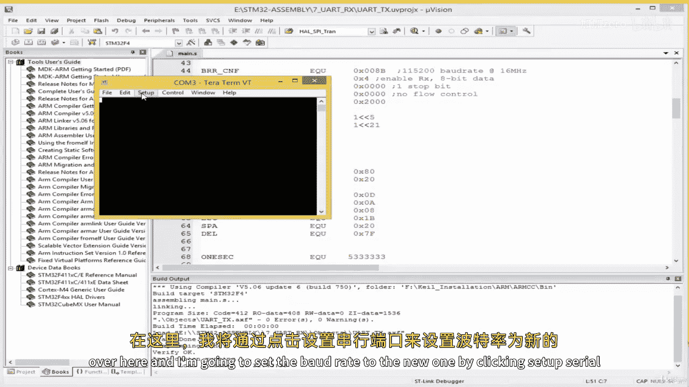
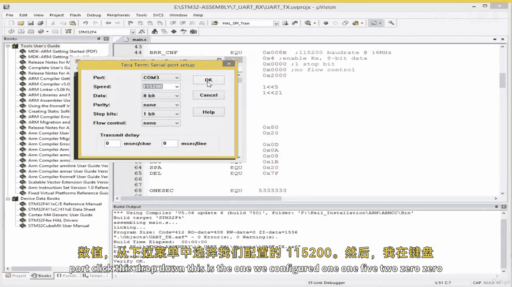
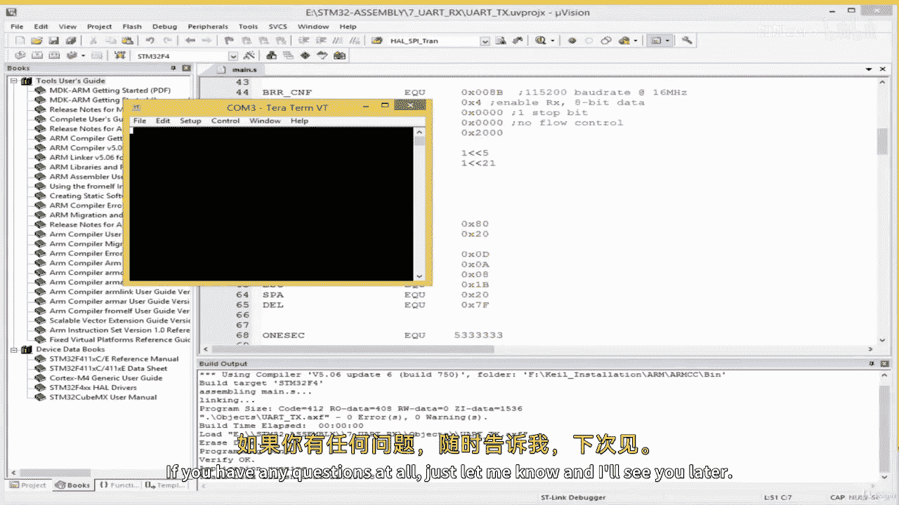

# ARM汇编语言：04.6：编写UART接收(RX)驱动



在本节课中，我们将学习如何配置UART接口以接收数据。我们将基于上一节学习的发送功能，添加接收功能，并实现一个简单的实验：当从键盘接收到字符‘1’时，点亮开发板上的LED灯。

上一节我们介绍了如何通过UART发送字符，本节中我们来看看如何接收来自另一端的字符。

## 项目初始化

首先，我们复制上一节的项目，并命名为新的项目（例如项目7）。打开项目后，我们需要在现有代码基础上添加接收功能。

## 配置接收标志与引脚

为了接收数据，我们需要一个标志位来检查接收缓冲区是否已满。这与发送标志类似。

以下是需要添加的接收缓冲区标志：
```assembly
RX_BF_FLAG EQU 0x20
```
这个值`0x20`来自数据手册中状态寄存器的定义，其对应的二进制位用于指示接收缓冲区状态。

接下来，我们需要配置PA3引脚作为UART的接收(RX)引脚。之前我们已经将PA2配置为发送(TX)引脚。

以下是配置PA3为UART RX引脚的步骤：
1.  在模式寄存器中，将PA3设置为复用功能模式。
2.  在复用功能低位寄存器中，将PA3选择为UART功能。

对于复用功能选择寄存器，每个引脚由4个比特位控制。PA3对应第3组（从0开始计数）4比特位。

以下是配置PA3为UART的代码示例：
```assembly
; 假设AFRL是复用功能低位寄存器的地址
MOV R0, #0x7000 ; 将PA2和PA3的复用功能位清零，为PA3设置UART功能(0111)
STR R0, [AFRL]  ; 写入复用功能低位寄存器
```
同时，需要在模式寄存器中将PA3配置为复用功能模式：
```assembly
; 配置PA3为复用功能模式 (模式值可能为0x2000或0x0800，具体取决于寄存器位布局)
MOV R1, #0x0800
STR R1, [GPIOA_MODER]
```

## 更新UART配置参数

我们需要更新UART的初始化配置，以启用接收功能并设置新的波特率。

以下是更新后的UART配置常量示例：
```assembly
; 设置波特率为115200
UART_BRR_VAL EQU 0x08B
; 控制寄存器1 (CR1): 使能接收器 (RXEN位)
UART_CR1_VAL EQU 0x04
```

## 添加LED控制代码

为了可视化接收效果，我们将配置一个LED（例如连接到PA5的绿色LED），当接收到特定字符时点亮它。

首先，定义LED控制相关的符号和寄存器地址：
```assembly
; GPIOA 基地址
GPIOA_BASE EQU 0x40020000
; 模式寄存器偏移量
MODER_OFFSET EQU 0x00
; 位设置/复位寄存器(BSRR)偏移量
BSRR_OFFSET EQU 0x18
; 计算BSRR寄存器地址
GPIOA_BSRR EQU GPIOA_BASE + BSRR_OFFSET
; 引脚定义
LED_PIN EQU 5
; BSRR操作值: 设置引脚 (位5为1)，复位引脚 (位21为1)
BSRR_SET EQU (1 << LED_PIN)
BSRR_RESET EQU (1 << (LED_PIN + 16))
```

接着，在初始化代码中配置LED引脚为输出模式：
```assembly
; 配置PA5为输出模式
LDR R0, =GPIOA_BASE
LDR R1, [R0, #MODER_OFFSET]
ORR R1, R1, #(0b01 << (LED_PIN * 2)) ; 01代表输出模式
STR R1, [R0, #MODER_OFFSET]
```

## 编写UART接收子程序

现在，我们编写一个从UART读取字符的子程序。该程序会轮询状态寄存器，直到接收缓冲区满，然后从数据寄存器中读取字符。

以下是`UART_ReadChar`子程序的实现：
```assembly
UART_ReadChar
    PUSH {LR}            ; 保存返回地址
    LDR R1, =UART_SR     ; 加载状态寄存器地址
ReadLoop
    LDR R2, [R1]         ; 读取状态寄存器值
    ANDS R2, R2, #RX_BF_FLAG ; 检查接收缓冲区满标志
    BEQ ReadLoop         ; 如果未满，则继续轮询
    ; 缓冲区已满，读取数据
    LDR R3, =UART_DR     ; 加载数据寄存器地址
    LDR R0, [R3]         ; 读取接收到的字符到R0
    POP {PC}             ; 返回，字符在R0中
```

## 编写LED闪烁与控制逻辑

我们将创建一个`LED_Blink`子程序。当从`UART_ReadChar`返回的字符是‘1’（ASCII码为0x31）时，该子程序会点亮LED一段时间，然后熄灭。

以下是`LED_Blink`子程序的逻辑：
```assembly
LED_Blink
    PUSH {LR}
    ; 检查接收到的字符是否为 '1'
    CMP R0, #0x31
    BNE ExitBlink        ; 如果不是'1'，则退出
    ; 点亮LED
    LDR R1, =GPIOA_BSRR
    MOV R2, #BSRR_SET
    STR R2, [R1]
    ; 延时约1秒
    LDR R3, =DELAY_1_SEC
    BL Delay
    ; 熄灭LED
    MOV R2, #BSRR_RESET
    STR R2, [R1]
    ; 再次延时
    LDR R3, =DELAY_1_SEC
    BL Delay
ExitBlink
    POP {PC}
```

其中，`Delay`是一个简单的软件延时子程序：
```assembly
Delay
    SUBS R3, R3, #1      ; 计数器减1
    BNE Delay            ; 如果计数器不为0，则继续循环
    BX LR                ; 返回
; 延时常数 (根据主频调整)
DELAY_1_SEC EQU 0x003D0900
```

## 整合主程序逻辑

最后，我们在主程序中整合初始化、读取字符和响应逻辑。

以下是主程序循环的示例：
```assembly
Main
    BL IO_Init           ; 初始化UART和LED
MainLoop
    BL UART_ReadChar     ; 读取一个字符
    BL LED_Blink         ; 根据字符控制LED
    B MainLoop           ; 无限循环
```

## 测试与验证



1.  构建并下载程序到开发板。
2.  打开串口终端（如Tera Term），设置波特率为115200。
3.  在键盘上按下字符‘1’。此时，应观察到开发板上的LED点亮约一秒后熄灭。
4.  按下其他键，LED应无反应。





这验证了UART接收功能已正确配置，并且能够根据接收到的特定数据执行相应操作。



本节课中我们一起学习了如何为ARM微控制器编写UART接收驱动。我们配置了RX引脚和寄存器，实现了字符接收轮询，并创建了一个将接收数据与硬件控制（LED）联系起来的简单应用。通过本节，你掌握了UART双向通信的基本构建模块。