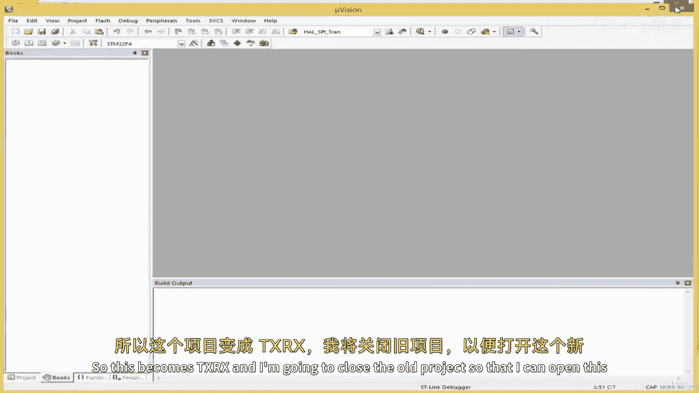
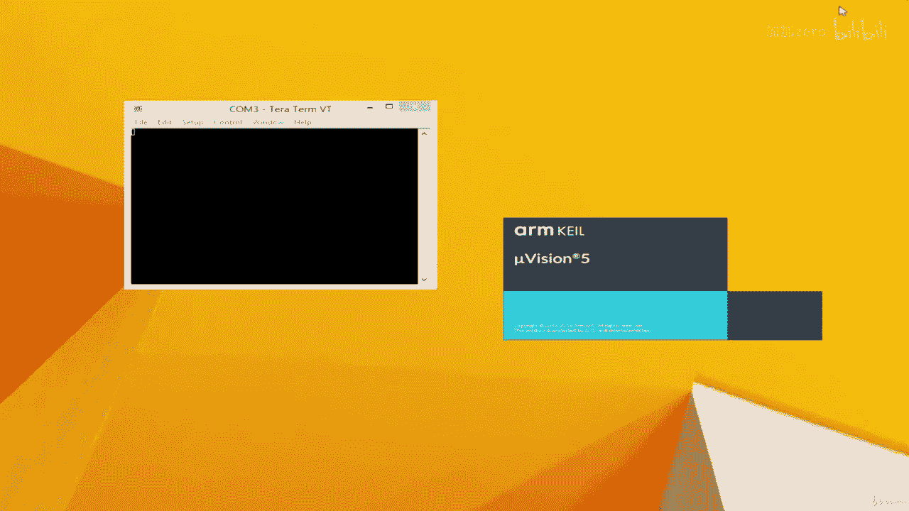
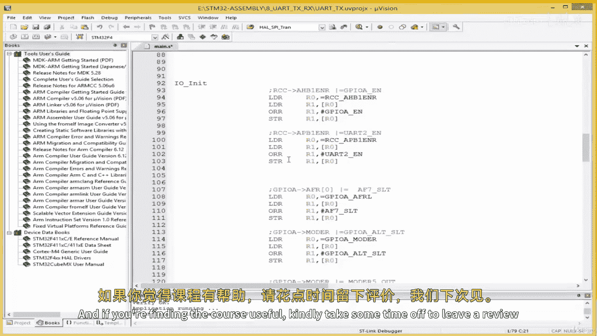

# ARM 汇编语言：04.7：结合 UART 接收与发送 📡

在本节课中，我们将学习如何将 UART 的接收（RX）和发送（TX）功能整合到一个项目中，实现双向通信。我们将基于上一节的项目进行修改，配置 GPIO 引脚和 UART 控制寄存器，以同时启用发送和接收功能。

---

## 项目准备与重命名

首先，我们需要复制上一节的项目作为起点，并将其重命名为新项目。

以下是具体步骤：
*   复制上一节的项目文件夹。
*   将新项目文件夹重命名为 `08_TxRx`。
*   关闭旧项目，在开发环境中打开新项目。

---

## 配置 GPIO 引脚模式

上一节我们仅配置了接收引脚 PA3。为了实现双向通信，发送引脚 PA2 也需要配置为复用功能模式。

我们需要修改 GPIOA 模式寄存器（MODER）的设置。之前仅设置了 PA3，现在需要同时设置 PA2 和 PA3 为复用模式。对应的配置值需要更新。

在代码中，这体现为将设置 `MODER` 的数值从 `0x2000` 修改为 `0x2A00`。这个值确保了 PA2 和 PA3 的引脚模式位都被设置为 `10`，即复用功能模式。

---

## 配置 GPIO 复用功能

设置好引脚模式后，我们需要指定 PA2 和 PA3 具体复用为 UART 功能。

这通过配置 GPIO 复用功能低位寄存器（AFRL）实现。我们需要将 PA2 和 PA3 对应的字段都设置为 `0111`（即 AF7，代表 USART2 功能）。

在代码中，这体现为将写入 `AFRL` 的数值从 `0x7000` 修改为 `0x7700`。

---

## 启用 UART 发送与接收功能

最后，我们需要在 UART 控制寄存器 1（CR1）中同时启用发送器和接收器。

之前我们仅设置了 `RE`（接收使能）位。现在需要同时设置 `TE`（发送使能）位和 `RE` 位。

在代码中，这体现为将写入 `CR1` 的数值从 `0x0004` 修改为 `0x000C`（二进制 `1100`，即 `TE=1`, `RE=1`）。

---

## 功能测试

完成上述配置修改后，我们可以对整合后的功能进行测试。

以下是测试步骤：
1.  编译项目并下载到开发板。
2.  打开串口终端。
3.  **接收测试**：在终端中输入字符 `1`，观察开发板上的 LED 是否点亮，以验证接收功能正常。
4.  **发送测试**：在汇编代码中，添加指令将一个字符（例如 `Y`，ASCII 码为 `0x59`）写入 UART 数据寄存器（DR），然后调用发送子程序。
5.  再次编译下载程序，观察串口终端是否收到了发送的字符 `Y`。

通过以上测试，可以确认 UART 的接收和发送功能均已正常工作。

---

## 总结与展望

本节课中，我们一起学习了如何将 UART 的接收和发送功能整合到一个项目中。关键步骤包括配置 GPIO 引脚为复用模式、指定 UART 复用功能，以及在控制寄存器中同时启用发送和接收。

我们成功实现了通过串口控制 LED 以及从开发板发送字符到电脑终端。

在下一节课中，我们将探索如何在 C 语言文件中调用这些汇编编写的 UART 子程序，并进一步集成像 `printf` 这样的高级函数，以便更灵活地处理字符串的发送与接收。