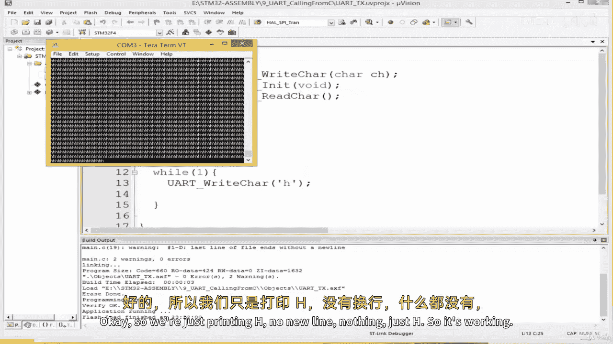
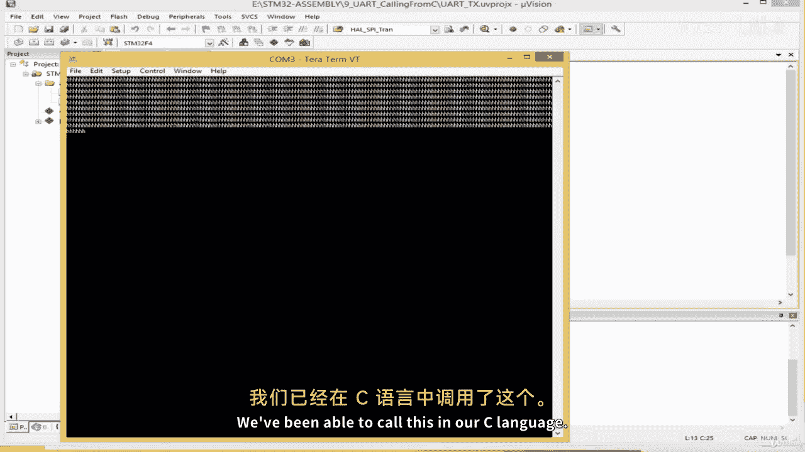
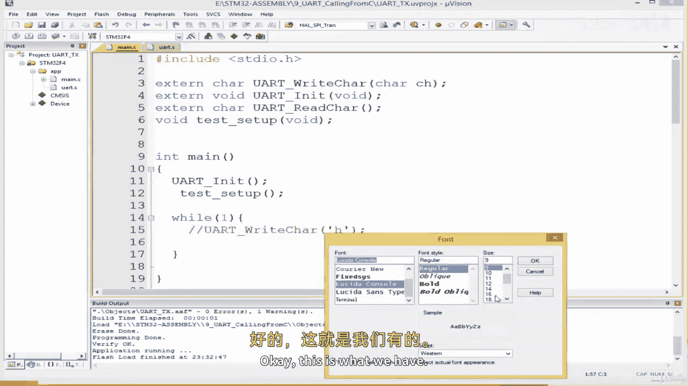
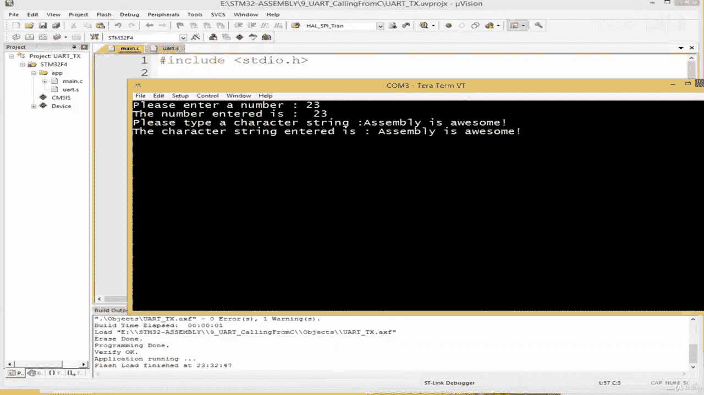
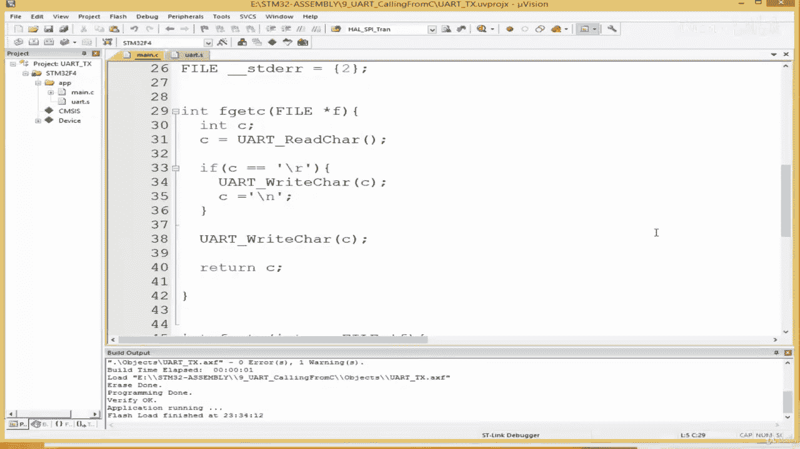

# 【从零开始学习 ARM 汇编语言II Udemy】 p19 p18 04.8. Coding  Calling UART Subroutines from C code -BV1RJU6YwEM8_p19-

Hello， welcome back。 And this lesson we are going to see how to call our U art subroutines from Ccode。

 So I'm going to make a copy of the last project we worked on。

I'm going to paste this over here and I'll rename this to number 9。😔。

And a this you at call in from sea。😔，To bit。A bit long from C okay。And。😔。

I'll click this through open。Yeah， I mean， the project is called U at T expert。It's more than T X。

 I should have given it a generic name from start。Okay。

All we're going to do is create a number of files。 I'm going to come to the project tab over here and in app I'm going to right click add new item or select C over here and I'm going to create a main Car。

Like this。I'm going to create another file over here。

 right click add new item this time an assembly file I'm going to call this U at such that we end up with a U at。

 S file。Right， and I'm going to open our old main dot S file over here and copy everything Cr A and then controlrl C to copy As select or by pressing controltrl and A and then press controll and C to copy。

 then I come to U at dot S and then control V。To paste what happened。 Okay， hit paste that。😔，Yeah。

 goodness， so many。😔，I've got to eliminate these new lines， this is not good。😔，Okay。Right。

So what I'm going to do is now remove this。 I'm going to remove our main dot S from our project。😔。

Remove file main dot S， yes。 and in fact， I'm going to delete it。 I don't need it any。

 So I've still got main dot S here， I'm going to come over here and delete it。😔。

The main dots S may look different。 The dots S file may look different on your computer。

 My has this icon because I have Viual Studio installed and Vi Studio can open dots S extensions as well。

 dot S extensions。 That is why it looks like that， but it would look different on your computer and it's fine。

 So okay， so this is our。Od main dot S file。 Now it's called the U U dot S。

 And what we want to do is export our functions。 The subroutines that we wrote。 we need。

 we no longer need to export main。In fact， we don't need main because we're not going to be running this。

 this is no longer the entry point of our project or of our application。I'm going to export。😔。

We use the export keyword to make our subroutines accessible from other files。

So I simply write export？😔，Okay， so I'm going to export。I O in it。And。

Well I'm just going to rename IO in it to U art in it， no problem。

 I know it initializes the LED as well， you can delete that part。

 the parts that initializes the LED if you want。Yeah。Parts that initializes the LED。Is this bit here。

 is the bit that sets the LED pin pin 5 to mode， so I'm going to sort of， let me just delete it。

 I'll comment it out。 How bother that。Okay， so this sets P A 5 to mode to output mode of disable that part。

 I'm going to export。You are to read as well so that we can use it。嗯。

We don't need a loop too all of this can be eliminated since we no longer run in here。😔，Export。

And our last one is U at right。😔，I'm going to explore this as well。😔，Export like this。Okay。

So now we can go to our main dots。Ill may may not seafall， and then implement this。

I'm going to start off by。😔，Importing our functions。

 I'm going to use the extend keyword because the functions exist in an external file。

 So say extend and then。We have you at right character。

And this takes us argument to the the character to be written。Somem cool on here。😔。

And we're gonna have another one。Extend。This should be void， sorry。😔，X， then。Vd。You are。

This void void。😔，And extend。😔，This is going to return a character type。You art read character。Right。

 so we've imported our subrouts。 Okay， and I'm going open my main function。Ent main， open close。😔。

And。😔，Can huff my infinite loop in here like this。😔，Open and close。Right。

 so we start off by initializing our UU。Simply say you are in it。Okay， once that is done。😔。

We can send a character。😔，I can simply send the letter H， so I'll come over here and see。😔。

You are right character。And I'll pass H over here over this。

 let's try this out and see what we've got。😔，I'll click over here to build。😔，Its pulled successfully。

Look here to download onto my board， it's downloaded。😔，I'll open my serial program。😔，Okay。

 and we've got it H H H I'm gonna reset my port just to show。 Okay， so we just print an H。

 no new line， nothing just H。 So it's working。 We've been able to call this in our C language。

 So now we're going to bind it with print F and we're going to interface this to the C language I O library so that we can use print F and Scf。

Okay， so what I'm going to do is I'm going to import STDo。t H。From stand to C library。I include。

SDD I O dot H。Right， and I'm going come over here and。I'm going to start off by sayingstruct。😔。

Unders， underscore foul。😔，And then int。Hlo。😔，And then。Said fog。And score STD。S the the in。

She will here。😔，T保的。And then。😔，f。😔，話こ。Eshtiti out。So you're here as well。😔，And then STD error left。😔。

F。😔，Stリ。E。For error。It true。😔，Just's actually。Should be one。Right， and then no。😔。

We can write the F get character， F get C。And I'm going do end。😔，Fge。Fa。😔。

It takes a point out to a file or argument。It if gets C， let's call it F get C like this。

Open and then close。And what we're going to do is simply in C。😔，And we're going to use our。

You utterread character。Function， so we say you atread Cha， when we read a character。

 we want to store it in C。And then。We can put a simple condition here that checks if。You know。

 if a line feed is， if the character is a line feed。

 then we should automatically write it and append a new line to it。So I'll see if。FC。Eals。2。

If that's the case。Then。I'm gonna see。You are right character C。And then。She， equal。And like this。

Once that is done， we can come out of this condition and do you atright。😔。

That's why the character see。and。😔，We return C like this。O。So， now。

We're going to write the Fput function Fput。So I'll say int F put C。😔，Then， and C。

We're gonna take the the character。We're gonna take， yeah， the character by of type int。 and then。

The file over here， a to the file。😔，した。If you don't understand this。

 you need no worry this is not part of the assembly course。 this is just to bind the。The C console。

 the I O console so that we can use， we can use print。 You need to understand this。

 So I'm going to simply do。Return。😔，You ought if have any questions。 Certainly。

 you can always send me a message or leave in the Q& A session。Yeah， the Q section。

 I should say no session。 Okay， so we do this and this should be able to。Returning void。

From a function which is incompatible with it。😔，Okay。Interesting。Okay。

 I'm gonna make our right character here。 Re it cha。Okay， problem solved。😔，Let's see。 Okay。

 everyone disappears。 Okay， so now let's test this out。Now， this， this piece。

 this cryptic code of written here would bind the printer and scanly functions。

To our code such that we can now freely use print， F and Scf。So let's test it out。

So I'm going to come over here and see end N。😔，And then。

I say try SDR for character strength of size 80， unless it is an array of you know characters。

It takes 80 of them， and I'm going to write a simple test function here。😔，L see test set。

 that's the name of the function。😔，Vvoid。And what I'm going to do is I'm going to call Pri。

 say printf。😔，And then。😔，Please enter a number。😔，They're classic， isn't it？😔。

And then once the numbers entered， we're going to do canniff。😔，She kindiff。Percentage D。

And then restore store it。😔，In the variable we created here。😔，Okay。And then。

We're going to print out the number print F。😔，回 say。The number entered。 The number entered this。想 hD。

😔，And we can go to the new line here。😔，什么子。😔，Why okay。No problem。We simply pass n over here。

We should be fine。Okay。Then we can test correct string as we're going to do printf。

The code is so polite， keeps saying， please， you know， please type。A character string。And。😔。

We're gonna use the gis。And then STR storage to STR， and then we can print。😔，Printf。Simplicically的。

Corr a string entered。I。😔，And then we use puts。😔，Put S， if you may。STR like this。And。😔，We can。

Preitive。New line over here。😔，Okay。So that is what we have。

 so I'm just going to take this prototype to the top of our here。😔，And I'm going to。

I'm going to call this， I can I'll comment this out and then call this new function here。😔。

So we initialize all U add and then we simply run our test setup up code。Okay。

Let's build and see what we have。Deeared successfully， no error。

Click here to download onto the board， it's download it。Let's see to return。😔，I've selected my comp。

😔，A said the board。Why do we still have H？😔，How we print an nature from somewhere。屎。😔，啊。

Think we've got a clutter buffer。Okay， I'll come over here。😔，Claire Ber resets my board， okay。😔，Nice。

I'm going to increase my font。😔，Okay， this is what we have。 please enter a number。

 I'm going to enter 23 enter。

The number enter is 23， please enter type a string。😔，Please type a character string， it says。😔。

Assembly is。Awesome。De carta string into it。 This assembly is awesome。 right， This the end。Okay。

 so that's how we are we pin， weve pin it Prince Evankneiff， and you can test it here。

 You can simply write your own。

Print F over here， and simply see。Hello world。😔，Let's see。Download onto the board。😔。

Why did I close this， I should have kept it open。😔，I reset my board。😔，As can see hello world， right。

 So in this lesson， we've seen how to call our assembly subrouts in sea language。

 and we've added a bit of flavour to it by binding the arm。

 the sea console livery to it so that we can， you know。

 type sentences rather than send character by character。If you have any questions at all。

 just send me a message or leave in the questions area till then I'll see you later and have a nice day。

