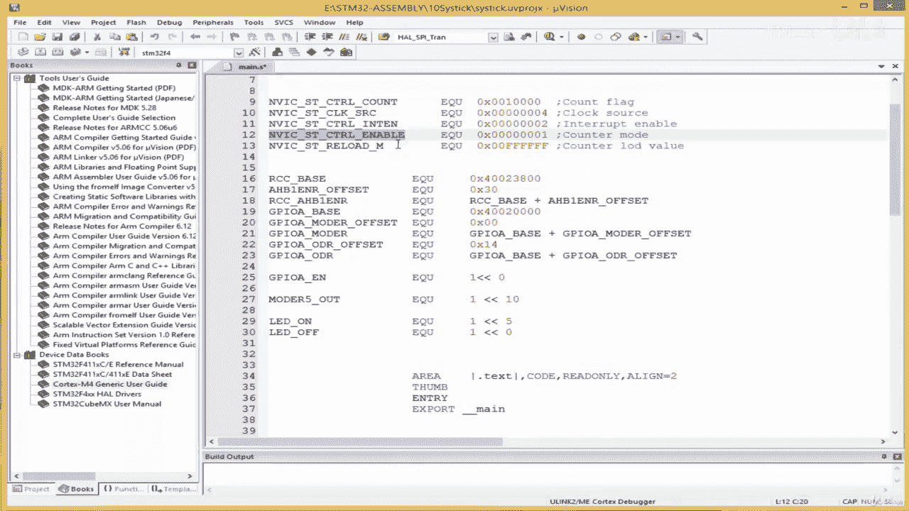
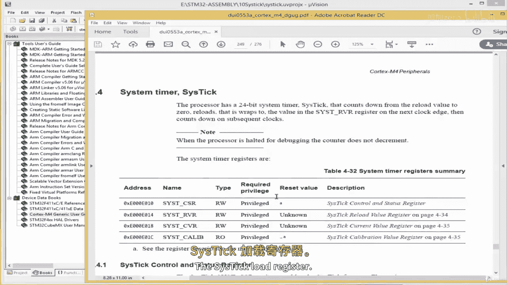
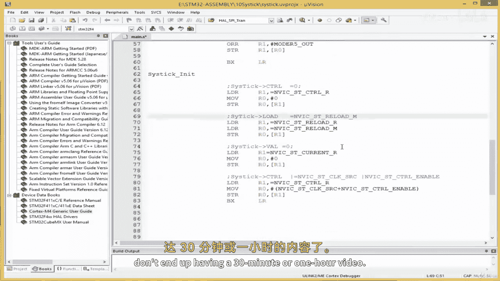

# ARM汇编语言从零开始II：05.3：编写Systick初始化子程序 🛠️

在本节课中，我们将学习如何为ARM Cortex-M微控制器编写Systick定时器的初始化子程序。我们将从设置必要的汇编指令开始，逐步实现GPIO和Systick的初始化代码，并理解其背后的硬件操作原理。

## 汇编指令与程序入口

首先，我们为代码段创建空间并定义程序入口。本课程假定您已完成我的另一门课程“ARM汇编编程从零开始”，因此熟悉这些基础概念。

```assembly
Area
```

我们处于代码区域。首先指定使用Thumb指令集，因为我们的目标平台使用Thumb模式。

```assembly
Thumb
Export _main
```

接下来，我们定义主程序入口 `_main`。程序将从 `GPIO_Init` 开始执行，然后跳转到 `Systick_Init`。

```assembly
_main
    BL GPIO_Init
    BL Systick_Init
    B .
```

## 实现GPIO初始化子程序





上一节我们设置了程序流程，本节中我们来看看 `GPIO_Init` 子程序的具体实现。建议您暂停视频，尝试自己编写此子程序，因为我们已经多次练习过。

以下是实现步骤：

1.  **启用GPIOA的时钟访问**：通过配置相应的寄存器来开启GPIO端口A的时钟。
2.  **设置引脚模式**：将GPIOA的引脚5（PA5）配置为输出模式。
3.  **返回主程序**：使用 `BX LR` 指令从子程序返回。

```assembly
GPIO_Init
    ; 启用GPIOA时钟访问的代码
    LDR R1, =RCC_AHB2ENR   ; 加载时钟使能寄存器地址
    LDR R0, [R1]
    ORR R0, R0, #0x01      ; 设置位0以启用GPIOA时钟
    STR R0, [R1]

    ; 设置PA5为输出模式
    LDR R1, =GPIOA_MODER   ; 加载模式寄存器地址
    LDR R0, [R1]
    BIC R0, R0, #(3<<10)   ; 清除PA5的模式位（位10和11）
    ORR R0, R0, #(1<<10)   ; 设置PA5为通用输出模式（01）
    STR R0, [R1]

    BX LR                  ; 返回
```

完成上述步骤后，我们就启用了GPIO端口A并将引脚5设置为输出引脚。

## 实现Systick初始化子程序

在GPIO初始化之后，我们需要配置Systick定时器。Systick是ARM Cortex-M内核的一个简单定时器，常用于产生延时。

以下是配置Systick的步骤：

1.  **禁用Systick定时器**：在配置任何定时器之前，先禁用它是一个好习惯。
2.  **设置重载值**：向Systick的重载寄存器（LOAD）写入一个24位的最大值，这决定了定时器溢出的时间。
3.  **清除当前值寄存器**：通过向当前值寄存器（VAL）写入任何值（例如0）来清除它。
4.  **启用Systick**：配置控制寄存器（CTRL），选择核心时钟源并同时启用定时器。

```assembly
Systick_Init
    ; 1. 禁用Systick定时器
    LDR R1, =SysTick_CTRL   ; 加载控制寄存器地址
    MOV R0, #0x0
    STR R0, [R1]            ; 写入0以禁用

    ; 2. 设置重载值 (24位最大值示例)
    LDR R1, =SysTick_LOAD
    LDR R0, =0x00FFFFFF     ; 24位最大值
    STR R0, [R1]

    ; 3. 清除当前值寄存器
    LDR R1, =SysTick_VAL
    MOV R0, #0x0
    STR R0, [R1]

    ; 4. 启用Systick，使用核心时钟
    LDR R1, =SysTick_CTRL
    ; 设置位2选择核心时钟，位0启用定时器
    MOV R0, #(1<<2 | 1<<0)
    STR R0, [R1]

    BX LR                   ; 返回
```

在C语言中，遵循CMSIS标准，上述操作通常这样表示：
```c
SysTick->CTRL = 0;                    // 禁用
SysTick->LOAD = 0x00FFFFFF;           // 设置重载值
SysTick->VAL = 0;                     // 清除当前值
SysTick->CTRL = SysTick_CTRL_CLKSOURCE_Msk | SysTick_CTRL_ENABLE_Msk; // 启用
```
CMSIS（Cortex Microcontroller Software Interface Standard）为所有ARM Cortex微控制器提供统一的编程接口，简化了跨平台开发。

## 总结与下节预告

本节课中我们一起学习了如何编写ARM汇编的GPIO和Systick初始化子程序。我们掌握了从设置指令、启用外设时钟到配置定时器重载值和控制寄存器的完整流程。



在下一节课中，我们将实现 `Systick_Wait` 子程序，该程序将利用已初始化的Systick定时器来创建精确的延时功能，从而避免编写冗长的循环代码。这将是我们实现非阻塞延时的关键一步。