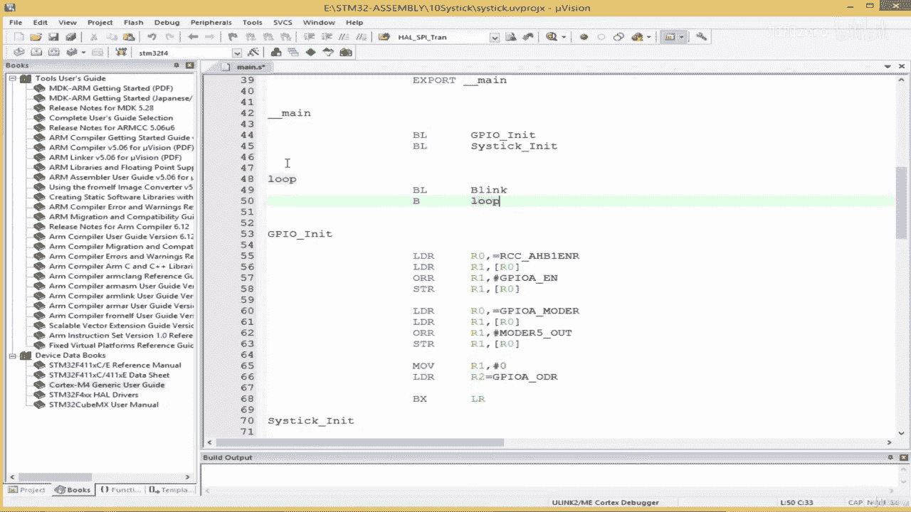
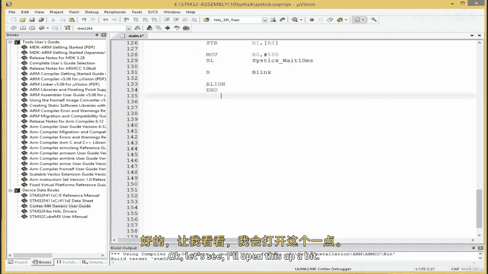
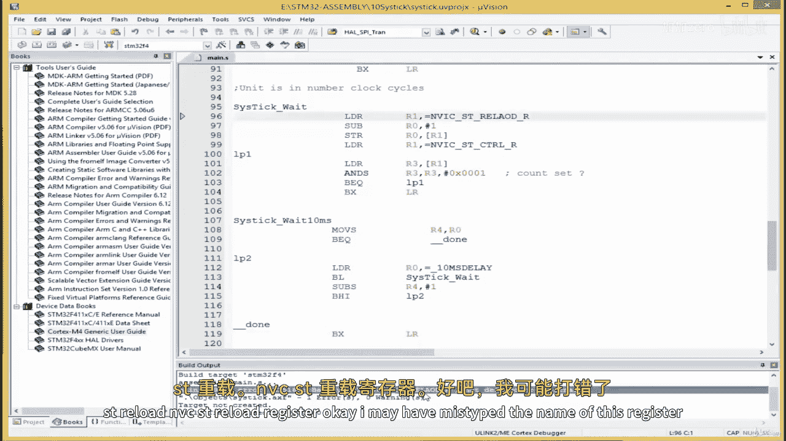
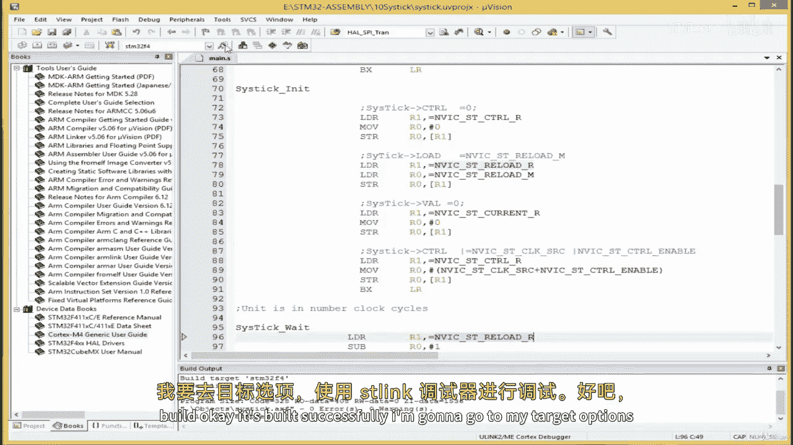
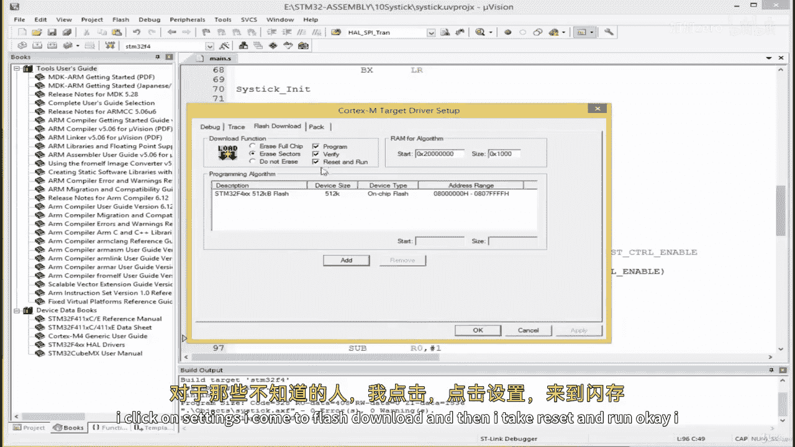
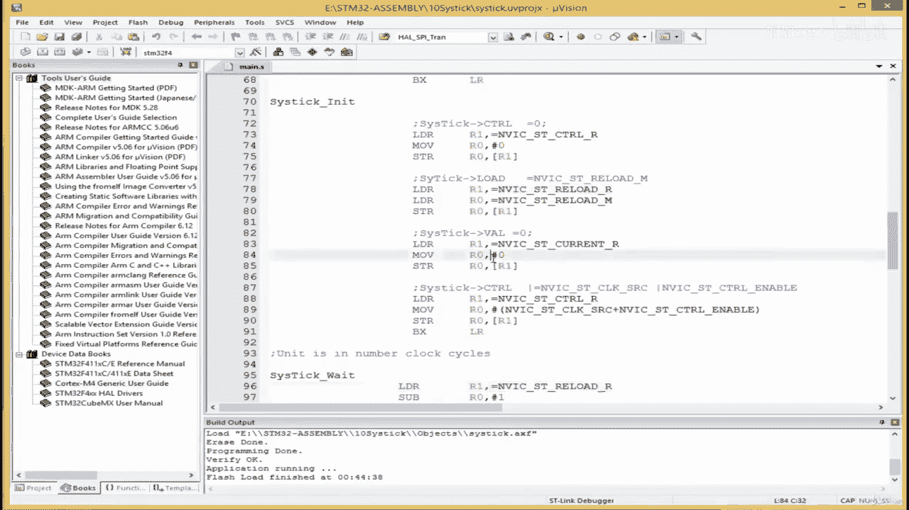
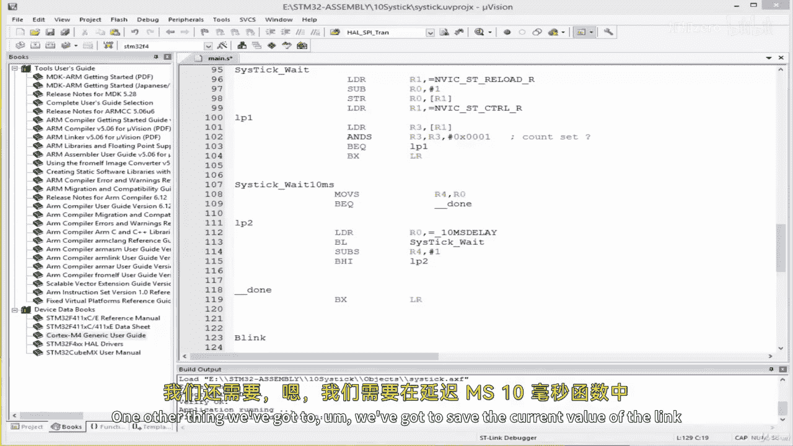
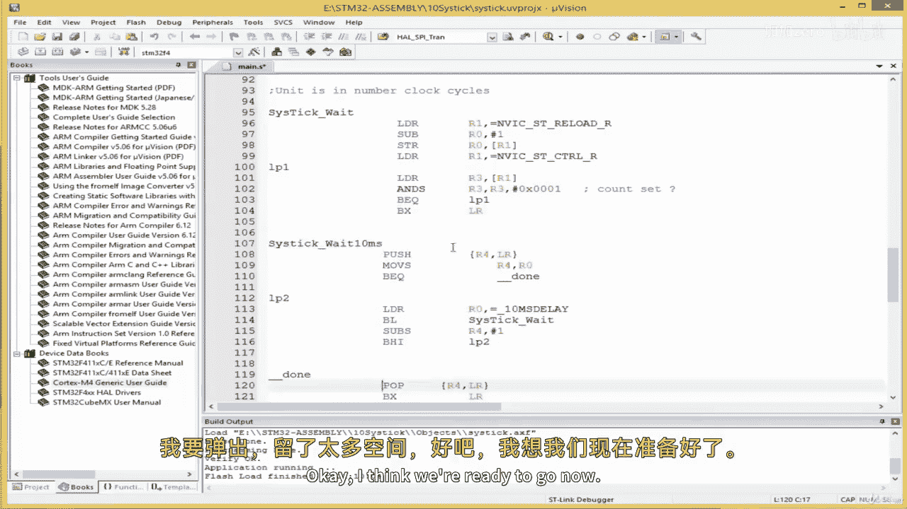
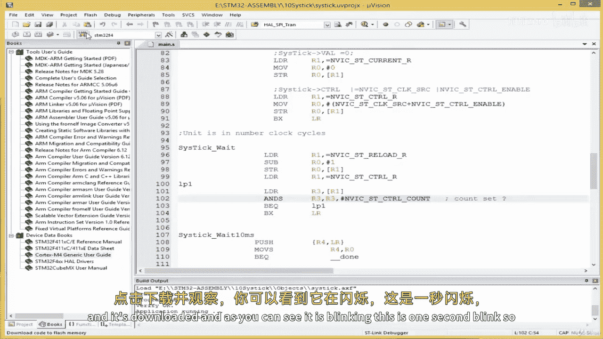
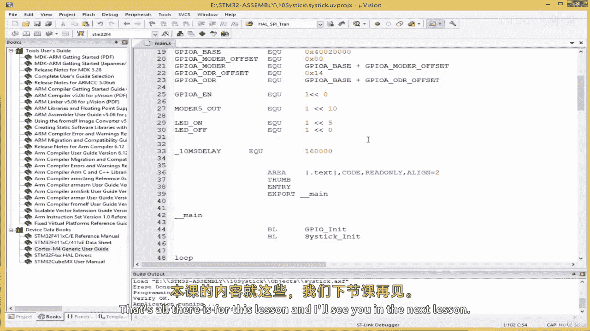

# 【从零开始学习 ARM 汇编语言II Udemy】 p23 p22 05.4. Coding   Testing the SysTick Driver -BV1RJU6YwEM8_p23-

Hello， welcome back。 So we're going to implement the the cystic weight subroutine。

 You can think of it as the delay subroutine and。We're going to pass。 basically。

 it's going to take an argument of the amount of amount。

 amount of clock cycles to delay the unity as the clock cycle and。My board， which is the the SM 32。

F 41，1 V E nuclear board， the default clock frequency is。Is 16 MHz。嗯。

This means it's able to execute 16 million psychos per second。And。

This can be computed to derive that。Each single cycle takes 62。5 nanoseconds to complete。

So the units over here for clock cycle。Is 62。5 nanoseds。

 I don't know if you understand that since the unit for this simple subbri we're going to write is in cycles。

 So if I pass an argument such as 1000， it means okay， wait for 1000 cycles。

 spend 1000 cycles Do nothing。 delaylay for 1000 cycles。 But a single cycle is equal to 62。

5 nanoseconds。 So it's the same as wait for 62。5 nanoseconds times 1000， So the unit is in cycles。

 or if you want it in time， is how much time it takes to compute a single cycle。

 which is one divided by 16 million， which is equal to。62。5 nanoseconds。Right。Okay。

 so I'm going to create the label here。Cool this system wait。And。Start off by， you know。

So by the time we enter this label， R0 is already going to be loaded with the amount of cycles to delay for。

 So I'll say R1 R1 is going to get us the cystistic load load or reload register as it is called。

 So this is， we gave it a name NVic。SD。Reload。A like this。

 And then what we're going to do is our1 has the amount of time we want to delay， right。

 so we can just do sub。 ourcero has the amount of time we pass the argument into register our0。

 So this assumes ourro already has the time that we want a delay。

 So we simply want to subtract that by one delays always about subtraction as you would。

 you you may have noticed。So far， so once that is done， we store that。Into the reload。And then。😔。

And then we we check if the dec is set。And to do this。

 we' are going to load the system control register again。I'll see R1。We load the Nviic。St。😔，CTRL。

 register。😔，Like this。And then what we're going to do is。We take it content and put it into。

 we take the content of the system control register because if it is set。

 we're going to find there's a particular bit in the control register that will tell us。

If the counter is set or not， so we wan to see what is in the register。

 So we take the content of this put into register R 3。 I'm going to say load。A three。

With the content。At the address found in register R1。And then I'm going to perform the end。

Operation to compare。And as here means， when you perform the end operation， sets the arm， the a。

APSR flag。R 3。And then I'm going to。The bit is 0 x。0，0，0，1。 This will check。Is the con set？Right。

If it is set。If it is set， we want to come back here， branch to the top here and keep checking if it。

 if it is still set。If it's not set， I would say not yeah B EQ， and then I'll say LP1 here。Brunch。

B Q here stands for branch。 if the zero flag is set。

And the zero flag is a flag in a register known as the AR register。After this computation。

 if the result is 0， the0 flag will be set。 and we are saying branch to this label L P1。

 if the0 flag is set， and we're gonna put。The label here。

 and the reason why I say end the logical end。 but I've， I've added S over here。

 and what this means is that if you perform the S， I want you to update。

The flags in the APSR register。 So whenever you see end with S or subtraction S U B with S。

 it means we want to update the flags such as the0 flag， the negative flag， the carry flag。

 the overflow flag。 We want to update those flags。 That is why we add S at the end of the operation。

Right。So， okay。Right， so where were we， so we branch up here and then that's all we can end the subroutin BxLR。

We returned from it。Right， so this， the unit here is。I'll put a comment here。

Unit is a number of clock cycles。Okay， and this depends on the default clock of your MC U。

 So I'm going to create another one where the unit is in 10 milliseconds。

 such that if you want100 millisecond delay， you just call the function and pass 10 as argument。

 Since if you pass one one equals 10 M S。 and with this weekends， see some practical examples。

 I'm going to come down here and。I'm going to， I'm gonna create a constant。Or see underscore tinnius。

😔，10MS delay， and then I'll say EQ U。Tina delay。On my microcontroller， I will be equal to。

My microcontrol lights are 16 MHz。 So 10 m S will be equal to。1，60000。

 I'm gonna cut this and put it out of top。Right。So。

What I'm going to do is create a new sub routine known asistic。Wait，10 em。10 M S，10 milliseconds。

Ill say it is thick。Under the score， wait， 10。M S。And then。I'm gonna start by。Remember。

 r0 is going to have the the argument for this subrout。 So if we want to wait for 100 milliseconds。

 we're going to pass the number to register r0。 so we start off assuming r0 has the data。

 I'm going to move it from r0 to r 4。And then。What I'm going to do is， I'm going to。I'm gonna。O。

A trick we can perform us。We can create a condition for 0。 What if the person passes 0。

 If the person passes 0， meaning no delays required， so we can use move with an S here。 And remember。

 whenever we use an instruction and we end with S means we want to sets the flags in the A P SR register。

 these flags include the the0 flag the curry flag。The negative flag。And as the overflow flag。

 So whenever we set as meaning。If you perform this。

 if you execute this instruction and the zero flag， or yeah。Well。

 what would mean the0 flag is the instruction that comes after this， And this instruction is B， E Q。

 meaningan this B， E Q allow us to check if the0 flag is set。 If the0 flag is set， we can。We can。

 we can jump to。The end simply we can jump to delay。Complete， or we can just say。

Under underscore done， we're going to create a label called done。Such that。If。

 if the use are passes zero as argument。Then we simply complete the subrout。

 We don't need to delay because if you pass 0， you want 0 dealer。 Well， there's no delay done。

 And how do we know this。 We just take， We just compute this instruction。

 move the content of r 0 into r 4。After the instruction， because we have S here。

 we're going to check whether this last instruction we computed was able to set our 0 flag If we was able to set our 0 flag。

 then done。Right。O。So， yeah， so if， so that is， if0 is passed， we want to jump straight to done。

 and we're going to put a label for done somewhere。But if that is not the case。

We could put a label for done here before we forget， or see underscore the done。

And then is simply going to return us from the subroutine BxLR。Right， so Dan is simply going return。

 Okay， so this， if0， jump straight to Dan， meaning return from the subroutine。

 What if this is not the case， What if an actual number is put in here。So。Right。

 so we can say if an actual number， I can simply say load R 0。

And those of you paying keen attention would would ask。Why am I loading a new value into r 0。

 Did't I say the argument was passed into r 0。 O， the reason I'm able to do that is that we've already moved a copy of the of this。

 No， not this， we've already moved a copy of the argument passed the subrout into register R4。

 So if we want what a user surpat， it， it's an r4。 So we can， we can use r0 for something else now。

 So I've loadeded the constant for 10 M S into R 0。

And I know R4 has what a use passed because of this operation here。So， I'm gonna。

I'm going to first wait 10 MS by doing BL。And then I'll call my cystic weight over here。

And then I'm going to do sub S， meaning I want to update the APSR flags。Remember。

 we said r4 has the argument passed the passed by the user。 So I'm gonna say r4。-1。Right。

And we can say， after the subtraction。Keep branching to the top of the loop。 if it is。

 if the result is greater than0， and we can use branch if higher。And by doing on B， H I。And then。😔。

We can put LP2 somewhere， we can put a label here， LP2。L P2， and this L P2 can be over here。

So it would keep subtracting from the argument that user surpasses。 and then。Yeah。

 it would keep branching onto the resort is no longer greater than zero， right。

 So this is our subroutine for cystic weight turnm。Sistic in it。

 And then we have6 cyst weights at the end of this lesson， the the。

 the exercise is going to be that you， you call these functions in C code。 I'm going to implement。

All in assembly here。 And I would advise that you try it on your own crater sea。

A new project with amend dot C file and cysttic dot S file and keep all of our assembly code in the cysttic dot S file and then import them in C and test them out and make sure it works。

 I'll leave that up to you。 It could practice。 so we can try。 We can try what we've done。

I'm gonna create。Blanlink over here。 And this is gonna to blink our LED。Let's just try。

 I'm going say move。Register r1。LED on。The reason why I'm simply writing move without dealing with a data register。

It's because in our GPI unit， I can just read the data register here。😔，I would come over here。

 and do move。Our want， just declare it。😔，Number 0， and then I'm going to load the data register load。

Or two。L R to a GPI U aid output data register like this。Right， so then。I can come down here。

It can come down here and do move R1 LED on and then。I install this into R2， so R1。

Start this in store this。 Yeah， not into R 2， but you know。

 the address found in register R 2 and then。We can start off with a simple test。

I'm going to simply do move。😔，I'm given too much space here。

 How about we start off with a one second delay？Why am I saying one second。

 I'm going to pass 100 into r 0 and 100 multiply by 10 milliseconds equals 1000 milliseconds。

 which equals which equals one second。 So I'm going to do B L for branch。sorryrry about that。

And then the name of a wassistic 10MS subrine is this。Piss this over here like this。

And then I'll branchn。To blink here。Right。We can build our project and see what we have。

Before we build our project， we've got to。I'm gonna call our blink。Blink over here。I'm simply gonna。

 I'm simply gonna create our infinite loop over here。And then。I'm gonna call Bill。😔，Okay。

 let's go and see what we have。

I'm going to， I'm gonna click here to build。of course。This's a rookie mistake。

 I forgot the the final operators。I forgot to align and end。Okay， let's see。Open this up a bit。

Misingcom somewhere。Over here， there's another mission comma。Over here。Bd register name S Paul。Yeah。

 look at the mix。The reason I keep having issues with the caps lock is that when I'm running。

 I'm running a MacBook， when in my Windows operating system。

 sometimes when the caps lock light is on， it means it's actually in lower case。

 And when the light is off。 It means， you know， it's in upper case， it's not always the same。

 So I always have to try which case it is。 Just bear with me yeah。I'll click here to build。

S T reload and Vic S T reload register。

Okay， I may have mistyped the name of this register。😔，Envig S D reload register。Yeah。

 there should be a type in the word somewhere。Okay， yeah。Buildd， okay， it's build successfully。

 I'm going to go to my target options。

And debug， use an SD link debugger。😔，Okay。Click here to download Wait。 I'm gonna do reset and run。

Flash download， come to resett and run for those of you who don't know that I click I click on settings。

 I come to flashlash download and then I take resett and run okay。

I' download onto my board。And it's downloaded。Okay， the light is on， it's not blinking。

 let's see what's wrong。

Hello， welcome back， so let's inspect our code to see where the error lies。So over here。

 we said we are attempting to blink the LED， but what we did over here is。😔。

We simply turn the LED on， and then we delayed for 100 multiply by 10 m。

 which equal a one as a single second or one second。 So in order that to achieve a blink。

 you turn on， you delay， you turn off and then you delay， So I'm going to copy。

And paste this over here， as well。And then， I'm gonna do。On。😔，And then， delay， and then。😔。

Off and then delay， so this is fine here。😔，One other thing。

 we've got to we've got to save the current value of the link register and register R for in our delay M S 10 millisecond function。

This sub routine here， so what I'm going to do is when I come here。😔，I'm gonna push。R 4， and then。😔。

The link register， I'm going to save them。And then。Once this sub routine is done over here at T。

 I'm going to pop。😔，I'm leaving too much space。😔，Okay， I think。We are ready to go now。

 let's see what we have over here。 Okay， this an arrow， for instance， this count flag。

 If you check the data sheet， the count flag position is this。 we wrote this initially。

 there has to be another0 here。😔。

And I'm going to use the symbolic name at where we are checking for the count。

I'm going to replace this with a symbolic name here like this。 Now。

 let's build and see if this fixes our problem。 Click over here。 It's built。

 Click here to download onto the board。And it's downloaded。 And as can see， it is blinking。

 and this is one second blink。 So it's blinking at a rate of 1 Hz， which is equal to a single second。

 So your exercise for this lesson is to implement a C file and have your main not C in there and import our import our cystic weight 10 M and then call it and make the LED blink using C code。

😔。

But using the drivers that we've developed in assembly。If you face any questions。

 just send me a message。 And this order is for this lesson。

 and I'll see you in the next lesson of a nice day。

