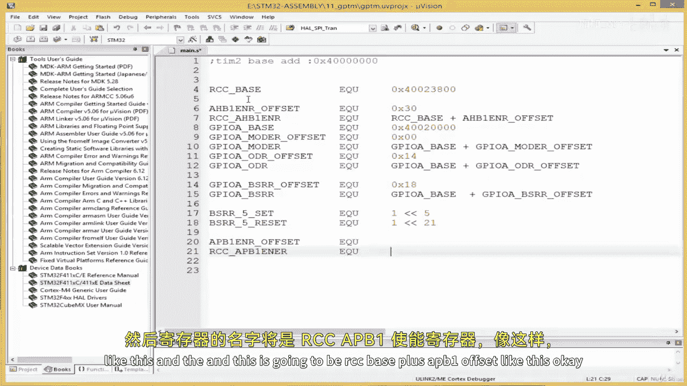
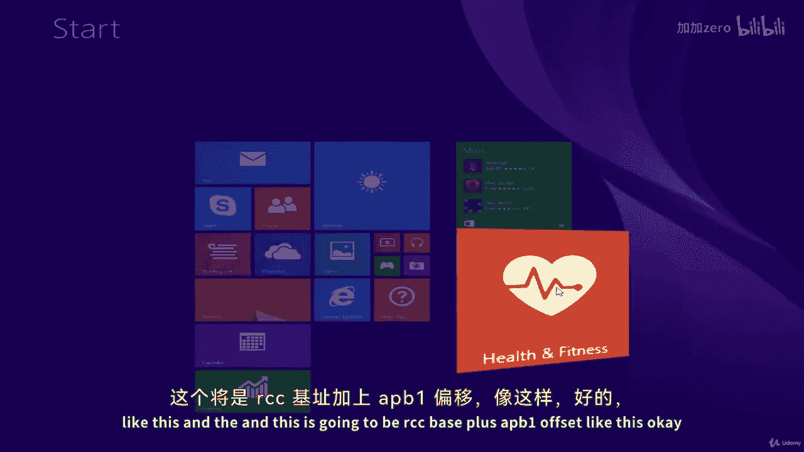
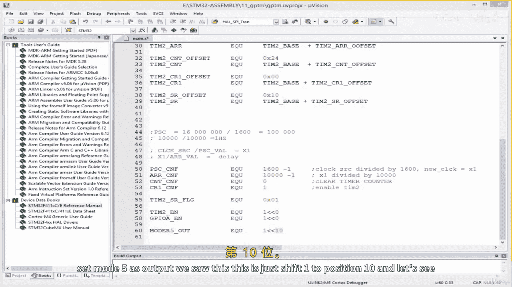

# 【从零开始学习 ARM 汇编语言II Udemy】 p25 p24 06.2. Coding  Assigning Symbolic Names to Relevant GPTM Registers -BV1RJU6YwEM8_p25-

Hello， welcome back。 And this lesson， we' are going to see how to develop a driver for the the general purpose timer。

 So I'm going to create a new project by coming over here。New U Vision project。

 I'm going to create a folder for it。😔，And I'm going to call this general purpose timer。😔。

And then the project is going to be called general purpose timer。😔，My board is SDM 32， F4，1，1， V E。

Okay。😔，Then， I'll select。Call over here。And then， on a device， start。And then， okay。

And then we're going to come over here。😔，ST 32。I'm going to rename this to up。

Then I'm going to add my assembly to S file our main do S file over here。😔，Right。

 so were going to configure one of our general purpose timers。 We're going to use timer 2。

 We're going to， we're going to configure it to create a one Hertz delay。

And what we have to do here is configure certain registers。

When dealing with the timers configuring the timers for delay there。

3 important registers we have to deal with the prescaleer register， the auto reload register。

 And then there's the control register， which we shall use to to sort of。

To sort of enable and disable the timer， and then there's the status register。

 which we would monitor a flag in that register to see whether the timeout has okay or not。

So whenever we are dealing with a new peripheral we've got to find the base address of that peripheral and when we working with STM 32。

 the base address is found in the data sheet once we found the base address of the peripheral。

 then we go to the reference the reference manual to find the offset of the various registers associated with that particular peripheral。

So what I'm going to do over here is open a data sheet。And I'm going to go to page 54 for that table。

And I said， we're gonna to work with timer2。So let's find timer 2。Should be down here somewhere。😔。

This is timer 1， okay， let's scroll down further。😔，And we have timer2 here。 That's the base address。

So I'm gonna copy this。And then I'm gonna put it here， us。I'm gonna create some note here。

And this is it。Also， we need to find out where timer 2 is connected。 Remember， remember。

 we know GI report a is connected to the A HB bus。 We want to find out which bus timer 2 is connected so that we can sort of go to the appropriate enable register to enable clock access for timer 2。

 So let's go to the block diagram still in the data sheet。Should be down here somewhere。😔，Come on。

<|OTHER|>Here we go， Okay， let's see。 it's page 15。

 so we should remember this next time I'm going to zoom in a bit。Timer2 over here。

 it is connected to the APB1 bus。It is connected to the A P B1 bus。

 and we know the A PB1 bus everything to enable clock access for an A P B1 peripheral。

 We need to go to the A P B1 enable register and select the appropriate。

bit for the peripheral we are dealing with。Right。So we've got this。So what I'm gonna do is。

I'm going to bring in what we already have， the registers we already have with regards to our LED。So。

I'll bring， I'll just copy it from our previous project。 This is what we have for the LED。Right。

 we've got this and then。Right here okay， we've got PRR， we can use PRR to toggle our pin。

In this experiment， so there's the set， this one would turn on the LED reset would turn it off。Right。

Okay。So， no。We've gotta find the。In order to sort of enable clock access for our timer2。

 we need to access the A PB1 bus。 We need to access the A PB1 enable register。

 and we don't have that register here。 so we need to create it。所以我'们 gonna。Create the APb1。

And you know， all the APB， AHB， and so on they are offset from our C base。

Thou goes without say and cause with use them。So I'll say APB1 enable register。Offset。

This EQ U will fetch this from the the reference manual。

 and then the name of the register is going to be RCC AP P B1。En theyable register。Like this。And the。

And this is going to be RCC base。Plus， AP PB1 offset。Like this。

Okay， plus this， okay。Right， so。This is it， and then let's create the register for timer 2。

Timer two bays。 we already have that time two bay。BQU。We got this over here。😔。

Paste this over here and we're going to have a number of timer2 registers。

 We're going to have timer 2 prescalealar register。We do PSC for prescalealar。And then。

The prescalealer and the auto reload are registers in which we shall load the values to give us the delay amount that we want the time out amount。

 So we would access this prescalealer register。 So the offset we don't have it now。

 but we just creating the symbolic names so that we can just grab。The offset。

 the name of the re is timer 2。PSC。And this equals。Timer two bays。😔，Plus。The offset。Right。

 and the next register is going to be the auto reload register timer 2 A R， R。For auto reload。Offset。

We do not have it yet， so timer2。AR R。And this。Of course。Timer two days。Plus。The offset。

The next after this is the timer 2 control register 1。 So I'm going to say timer 2， C R 1。

I've got a typo here。😔，Right。Time a 2 CR1。Offset E Q U。We do not have it yet， so I'll say timer two。

C1。And EQ U， this equals the base。Over here。Plus。This offset here。I'll copy this， paste it over here。

The next after this is the count register。I'm gonna put it in between here。 I'll say timer 2。

 C and T。Offpset。😔，EQU， we do not have this yet， so timer 2。😔，Xianq。AndThen we know the EQ U。

Will be equal to the time or two base。Over here。Plus。C N T offset。Sorry bother like this。 Okay。

 so these are the registers we shall require。Right， so let's go to our。

Let's go to our reference manual for this， we go to Book reference manual， double will click this。

And。😔，We can go to the table of content and find timer2。<|OTHER|>I'm going to scroll down here。

Perhaps I should search or do control F， and then。T， I M2。Okay， so general purpose time is2 to5。

 So whatever about we write in this lesson。For timer 2 applies to time as 2 through 5。

 If we want to do it for timer 1， is's a different type of timer， so we may need to change something。

Right， so this is the timer 2 timer。X CR1， where x is a number from 2 through 5。 So I click here。And。

It gives us the register， CR1 is control Reg 1， the offset is 00。

 so I'm simply going to copy the offset from here。C R1 offset set。Pasteted over here。

 I like this and。We can。We can see what it means。 So C， E N here， bit number 0 of control register。

 Let's see what bit number 0 does。 counter enable counter disable。 So this one here we use。

If you pass zero here， counter is disabled， if you pass one， counter as enable。Right。

 so we we're going to use this to essentially enable and disable the arm。The the timer。Right。

 let's take a look at the other registers。 We've got the preki register。That is of interest as well。

Let's scroll down。😔，Okay。Yeah， we failed。 we didn't create。

The symbolic name for the status register this is required。 So I'm going to。Come over here and see。

Timer 2。😔，Starts register。Offset。一Q you。And then I'll say timer two start register。Icuu andan。

 And then this is simply the， the timema two bay。Plus， the offset。

I've said that over five times to this， to， something plus the offset， something plus the offset。

 Okay， but I'm sure now assembly programming is becoming so easy because we've done this over and over again。

 given symbolic names and then basically load store， load store， load store。

 that is it and your program is working as simple as that。

But if you don't go through this process and you see someone's assembly code， you'd be like， wow。

 what is this， It would look cryptic， but it very， very easy as you can see。

 So this the status register， this is the offset I'll just double click here to copy it。

 and then I'm going to paste it over here。Like this。Okay， and。The status register， the status flag。

 let's see U IF because we're going to use UIF so we can read up on it。

 and whenever there is something that you're not so clear on with regards to any of the peripherals。

 we can always come to the reference manual to read more about it。

 the reason of design the course this way， taking you through the reference manual。

Ass because I wanted to become second nature to you。 I could have just told you that， oh。

 you go to the reference manual， You find the registers， and then you put them here。

 and then I could continue the course with me having found all the registers and given symbolic names。

 And then we just type。 I don't think that is very useful， what differentiates mediocre， you know。

 developers from。From， you know。Those above mediocrity or those above average is the ability to read documentations。

And reference manuals like this。It's a good habit to develop。So I said。

 let's take a look at UIF so we can come down here。 UIF is known as the update interrupt flag。

 This bit is set by hardware on an update event that is cleared by software0 means no update or。

1 means update interrupt pending in this bit is set by hardware when the registers are updated at overflow or underflow for timer 2 to timer 5。

And if you D， okay， we don't need this， as's all we need to know。

 the update0 means no update 1 means update。Okay。Okay。Right。

 so we're going to monitor this flag to see if there is an update or not， yeah。

So we've done control register status status register。 the next one is CT and then。AR R。Thexi。

Let's scroll down here。😔，EGR， we're not using this， we're not using this。C and T。

 this is the counter register this the offset。Copy this。Put it over here。😔，Right， lists the offset。

For CNT， so let's take a look at the CNT。Where is my。So we use this to clear the counter。

So we can simply rise 0 to clear a counter。High counter value on timer 2 to 5。 Okay， right。

 this is P S C。 This is the prescalear。 Let's copy this。And is the。The priest killer。And。

You can read up on the prescalear over here， the counter clock frequency C K CNT is equal to。

F C clock prescale are divided by this。PSC contains the value to be loaded in the active prescalear register at each update event。

Okay。The next register is this over here， A R R。I'll explain further in the course。 Well， you know。

 I'm sure you don't understand this。 So when we code it， I'll explain further。

So ARR register is the auto reload register。And this's the offset。 So I'll copy this。And then。

I'll put it over here。😔，And let's see what the data sheet says of all this。

The auto reload register A R， R is the value to be loaded in the actual auto reload register。

 Ref to time base unit for more details about A R R update and behavior， right。

 one could refer if one wants to read more about it。Okay， so there's one last one。

 APB1 enable register， we've not sorted that out。 I're going to search this。Goodness。Okay。

 here we are。 So that's the offset for A T B1。Okay。那 see。😔，What corresponds to timer two？Okay。

 so bit number 0 here is for timer2 enable， so we simply need to write 0 x。

1 to to the A P B1 enable register in order to be able to enable clock access for our timer two。

 we're gonna create a symbolic name for that。Right， so let's create those symbolic names。So。

 I'm going to。我们关去。Create PE。The value we're going to pass in the prescale register called this PSC CNF for config。

Yeah， conf for config。 Yeah， perhaps config should have a G in the in its abbreviation。

 but it's fine。 I'll say E Q U here。 And I'm going to pass。I'm going to pass 160，0。

And then so basically， the the clock， the time I is going to be configured with。

The preki at the timer2。How do I？So the value that you pass into the。

Prescale value is going to be the value that。That is going to divide the system clock。 right。

 So currently， my microcontroller have now enabled P L L， known as the face lock loop。

And we often enable PLL to change the clock frequency from its default frequency。

I've not enabled something like that。 It's just， it's default frequency。 I've not change anything。

 And my boards default frequency，16 MHz。 So this means 16 million。Like this。Right。

 so I'm going to pass and this is still， this also is going to be the clock。

 the clock source of my timer。So if I pass this value。1600 into the into the preski I register。

 What is going to happen is this 160 million is going to。

We're going to take the 16 million and divide it by this。1600。And then what we end up with。

As you can see， these two zeros who console these two zeros， and then 16 will console 16。

 so we end up with 10000。So we end up with 10，000 like this， right？Now。

 this is going to be my preskier。 This is what。This is for the prekier register in my other register。

 the auto reload register。I'm going to pass 10000。And what the auto reload register does is the value you pass into the auto reload register is there wrap around value。

 meaning the counter is going to count up to that value and wrap around it。

So another way of thinking of that is that。In order to get desired your desired time out。

 or in our case， your desired delay。You have to configure。

 you have to choose carefully the values you place in the the prescalear register and the auto reload register。

 Okay， and what do I mean by this， I started by telling you this is my clock frequency。

 And then I'm going to pass this value into the prescalear register， meaning。

Then the my clock source is going to be divided by the value I passed。

 This is what is going to be left as my clock for the timer。 So now I'm going to pass 10000。Okay。

 that's the value left， the value left is 10，000。Right。10000， okay。I'm going to pass 10。

000 into my ARR register， so I'm going to pass another10 I'm going to pass 10。

000 and what happens is this add of value that I pass into the ARR， the autoreload register。

Devisise what is left from the division of my clocks。Of the prescalear value。

 So what would happen is I'll end up with one。And this is one hurttz。And1 hertz equals one second。

 So if I want a one second clock， this is what I've done essentially， I take my。嗯。

Let's generalize this， I'll see。I'll say clock source。

 and my clock source is the default frequency of my of my microchn curler。 Ill say clock source。

Divided by PE value。Please scale our value。Equals x1。And then。This will give us x1。And then。

X1 divided by A R R， the value we pass into A R R。E course。Timeout。And time out。Is our delay i。

e delay。So this is how I've configured for what you call it。For1 Hz。

 let's say I wanted a 10 Hz time out。If I reduce this by 0， when I perform this division。

The answer is going to be hundred000。Ca now I'm divided， I'm divided by 1，60。

 So it's going to be this hundred000 here。0und000 is written like this。 this hundred000 here。

And then it becomes。Hundred000 divided by。Less say， I'm still passing 10000 into my ARR register。

 so the result becomes 10。Hence，10 heads。 And if you convert 10 heads to it。

 it's millisecond or second equivalent， you get the time in seconds。You what I'm saying， well。

 you cannot respond， but yeah。 so basically， this is how we are， we are computing this。

I'll leave this here and if you have any questions， do not hesitate to send me a message。

But I'm going to create a 1 headtz delay， so keep this here。Let's see， okay。

10000 and then 10000 here。😔，Right， right， okay。Okay， since I've kept this at the top。

 I'm going to cut this。B this down here。Okay， so this is the value we're going to be passing。

Into our。Into our prescalear register， But because we count from 0， we have to say minus1。

Counting always starts from  zero。If we are saying 1600， we would end up with 1601。

 so we've got a2 minus-1。And this， I can even put further comment here。Meaning。Oh'， see。Clock sauce。

Divided。By 1600。Okay， so then I'm going to say。The next thing I'm going to say is ARR configurationration。

 AR R， CNF。And this EQU。And this， I said， is going to be 10000。And minus1 because we come from0。

And this means， well， how do I phrase this？😔，Oh， I'll put a comma here。

 since you are listening to this， you understand the comment。I'll say you。

 I'm just trying to put this for revision。 I'll say newclock。Near clock。New clock equals， I'll say。

X1。New clock equals x1， meaning when we do clock source divided by。61600。

 I wanna call the result X 1。 I just， I wanna， yeah， so X1。 So then I'll say。X1。Divided by。10000。

Right， that's what this means， so。Whatever your system clock sources， is 16 MHz。

 That's why to get1 hertz I'm using these values。Okay， so that's good。And。

We're going to to another one。This is going to be CN NT counter this the。The count register。

 count register， config。So we pass zero here。And zero simplyies。Clre time counter。

And then CR R1 just the control register one config。And we're going to pass here one here。

 and this means。This means enable timer。And I'm going to have a symbolic name for the status flag。

Cic check was 01，01，0 x，01。And then okay， this is done。 and in our APB1 enable register。

 we saw that bit 0 is for enabling timer 2。 So I'm going to have a symbolic name for that also。Thus。

 basically shift。12 bit position 0。 and to enable our LED。We've got to use GI report a。

And then that is also shift1 to bits number 0。😔，And then。😔。

Or mode register 5 mode 5 to set to set mode 5 as output。We saw this。

 This is just shift 1 to position 10。And。

呃11。Yeah， so I think we are set。So how we continue in the next lesson。

 We've created the symbolic names for the registers in the next lesson。

 we can write our code I'll see in the next lesson。

