# 【从零开始学习 ARM 汇编语言II Udemy】 p28 p27 07.2. Coding  Assigning Symbolic Names to Relevant ADC Registers -BV1RJU6YwEM8_p28-

Hello， welcome back。 And this lesson we going to see how to develop。

ADC driver for our STM 32 board in assemblyly language， I'm going to create a new project。

Or come over here， project。New project。Or create a folder for this。ACall the folder， simply ADC。

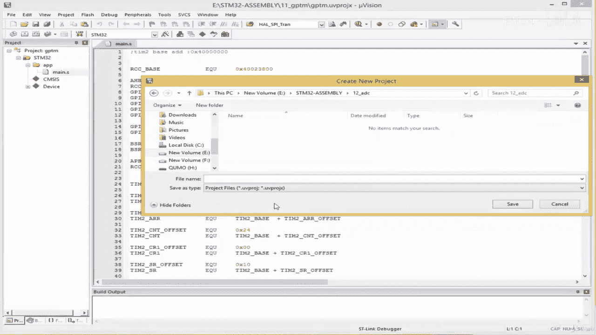

According calld to project ADC as well。And my board is SDM 32， F411 VET。Select over here， okay。

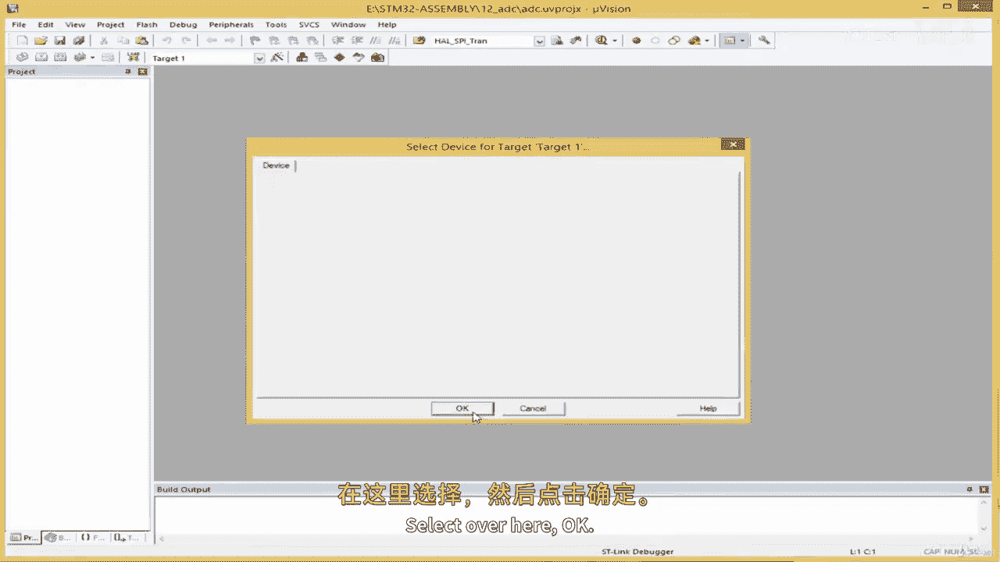

And F CM says I'm going to select the core。

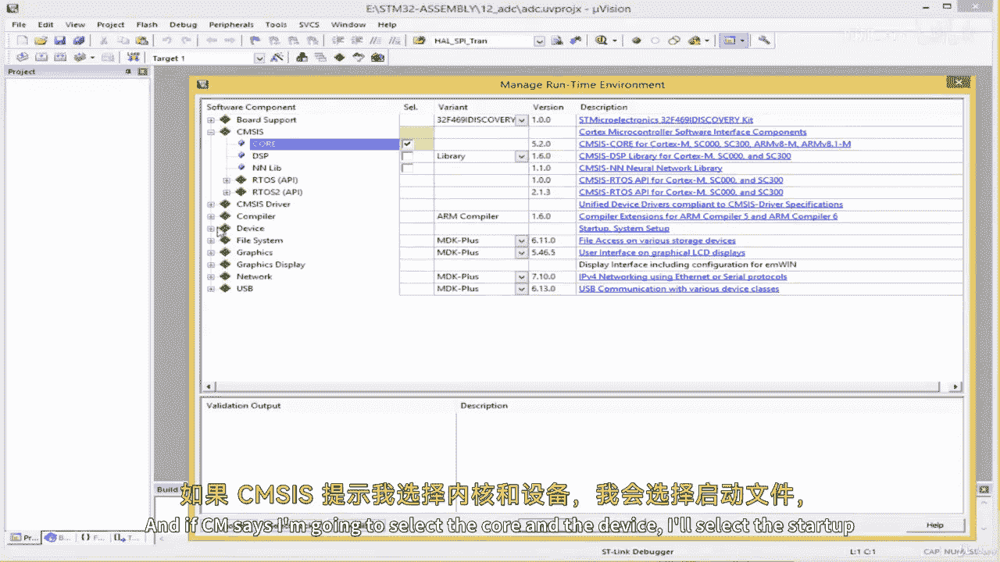

And a device， I' select this startup。And then， okay。

And then my target is my estimate that it's too bold。Then and the source group here。

I'm going to call this app。

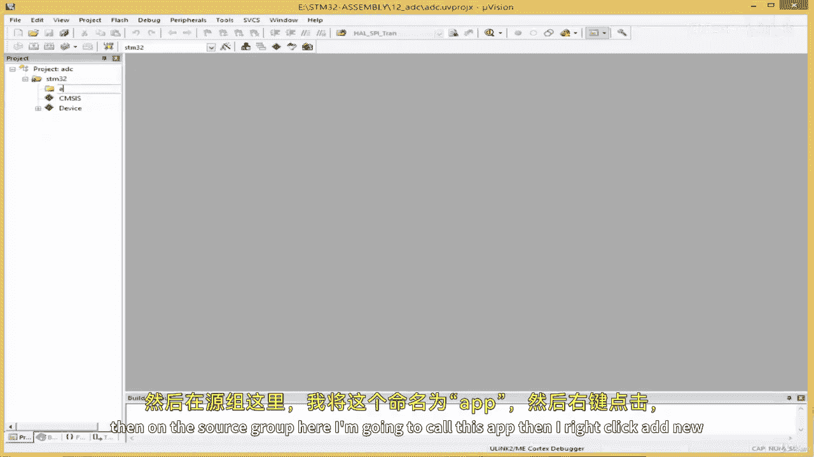

And then I right click add new item， I'll select S for， and then the name of the file is main。

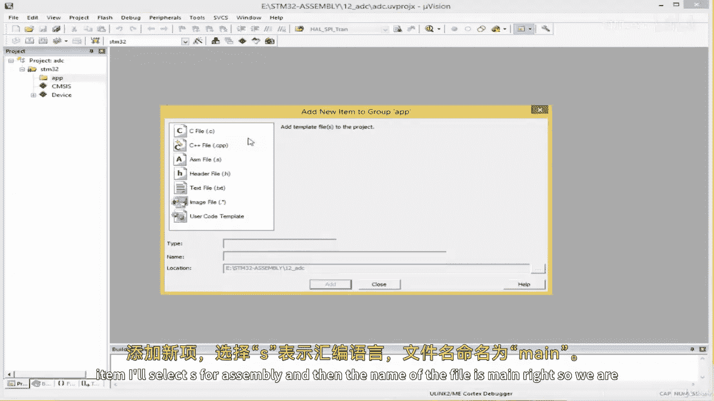

Right， so we are set。 So like always， we start off by getting the relevant registers and assigning symbolic names to them。

Before we do that。I'm going to bring the registers we already have。

 So what we're going to do in this experiment is to use an ADC pin and our LED。

Were going to sort of read the analog value from the ADC pin。

 and we can make it a bit more interesting by using a conditional statement to turn on the L if the analog value is above a particular threshold。

So I'm gonna bring the。Going to bring the re list we already configured with regards to the LED。

 So I just bring their symbolic names here。RCC base， AH P， RCC。

Because the LED is connected to the AHB bus。And， let's see。We have more of it。

GPIU A our LEDE are GIU。诶。Pin 5。Right。And we have some symbolic names。嗯。This over here， we use this。

To sort of enable GPU A， and we use this to set P5 as an output pine in the mode register。

And then we had， we created symbolic names for constant use by the PSR register in case we want to use PSR。

 We use this to turn on the LED， this to1 off。Right。So。In order to use a peripheral， of course。

 we have to see how the peripheral is connected in a block diagram so。

I'm going to go to my data sheet and see the block diagram and see where ADC1 is connected so that I would know whether I have to enable clock access to the peripheral through the AHB B or the APB B。

So in order to find that information， we need to go to the data sheet， so I'll click here to open it。

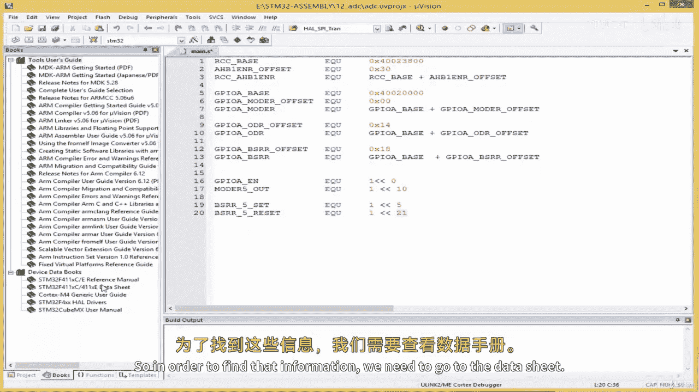

And I'll plug diagram。It should be up here somewhere。

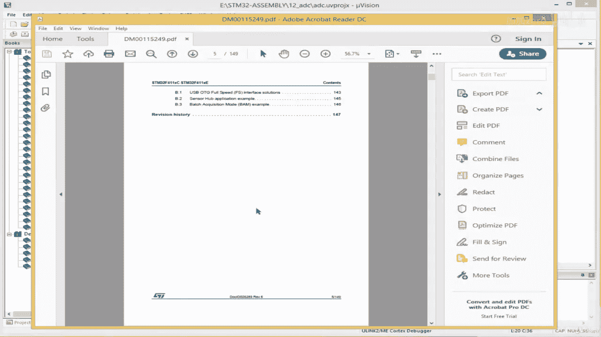

Sorry about there。Okay， here we go。

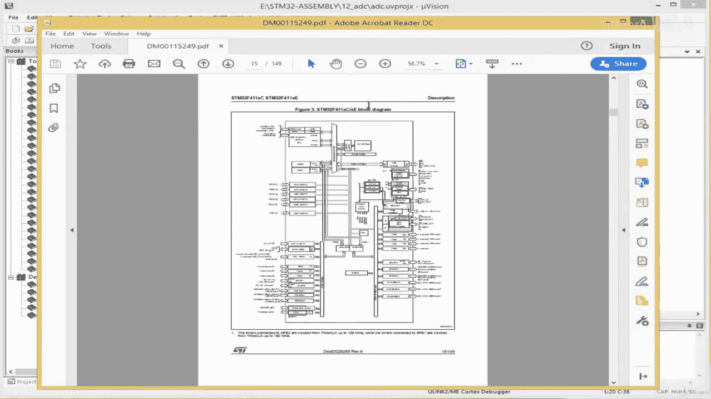

We're going to streamoo in a bit。Right。So we'll be using the ADDC1 and actually this microcontroller has just a single ADDC。

 the ADDC1。Other microcontrollers may have two or three。Okay， so this is  AD0 z1。

It is connected to the APB2 bus。As we can see over here。This ADC1。

 the arrow connects it to the APB2 bus， so in order to enable clock access for the AC1。

 we need to access the APB2 enable register。Right， so I'm just going to create symbolic name to Hoda here。

I'm going to come over here。And see。AP B2。Enable will register。Offset。EQ U， we do not have that yet。

 so I'll leave it blank， then I'll say APB2。And they will register。The register itself。

The registergi itself should be called RCC AP PV2。And they will register like this and then EQU。

This is ourcc base。Plus， the offset。Right。So， we found this。

So let's go to the the reference manual to find the offset for the APB2。

I'm going to come back to books， I'll go to reference Man。

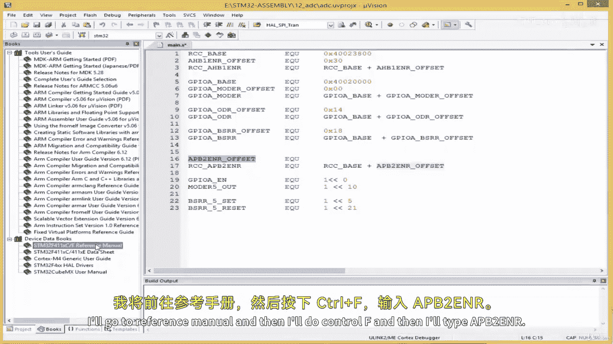

And then I'll do controltr F， and then I'll type A P， B to。EN R。

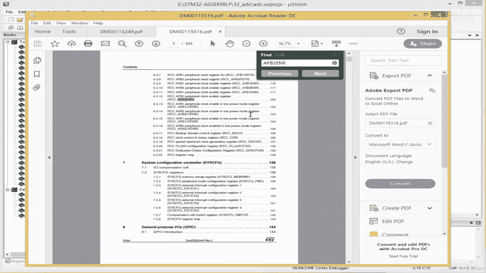

Okay。Going to zoom in。I'm going to click it。And then。This is the offset， I'm going to copy this。

Going to paste it over here。😔，And。We need to take a look at the same register。😔。

To see which one is for our ADC module。Okay， it says bit number 8 over here is for ADC。

 So in order to enable the ADC module， we need to set bit number8 in the AP P to enable register to one。

So I'm going to create a symbolic name for that。Ohll， come down here。😔，And then I'll call this。

 I'll simply call it ADc1。😔，It is1 E N for enable。Q you。I just to。0 x。1，0，0， okay。

 this corresponds to setting bit number8 to1， okay。So we've done that。

 we have the information we need in order to enable clock access for our。ADC peripheral。 Next。

 we need to find the base address of the ADDC peripheral， and then we start getting the arm。

It's other， it's other registers。So to find that information， we go back to the data sheet。

 I think page 54 is where we have that table， indeed。

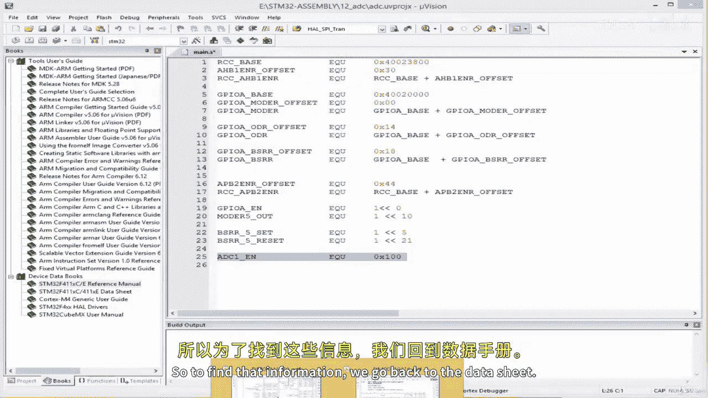

Okay。So we're looking for the ADC1 base。Let's see， let's see this is ADC 1。

 thats the base address of ADC， I'll copy this。

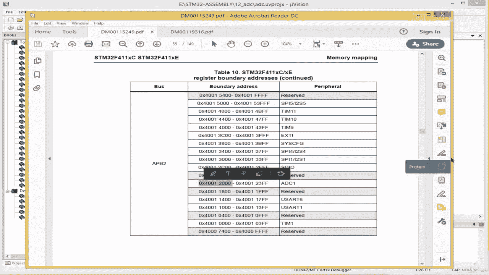

Come over here。Create a symbolic name for it。81， underscore the base， I'll call this。And then EQU。

 this is the base address。Right。Okay。Sue。We will need a number of registers to configure our ADC。

 We need。We need a register to sort of read the value from this is known as the data register。

 We need the status register to check whether the conversion is complete or not。

We need a number of registers to configure the M， the conversion sequence， and of course。

 we need a register to sort of enable and disable the module。

 So let's go to the the reference manual and go to the section on ADC and fetch these relevant registers。

I'll go to my reference manual by coming over here。It's this one。I'll come back up here， and。

I'm going to search ADC， ADC simply， let's see what we get okay。So that's the ADC bit。

It gives a description if you want to read more about the ADC on this microcontroller。

 certainly you can read the side of the reference manual。But I'm interested in the registers。

 so I'm going to come over here and click ADC Regs。And the first one that shows。

As the ADC status register。Right。So I'm going to create a symbolic name for this。And。

This is this is the offset。 The offset is 0，0， so no problem。I'm gonna create this register ch。8C1。

SR offset set。Start with the offset， of course。E Q U equal equals 0 x0，0。Cl some space here and then。

😔，Name of the register is。It is1 SO。IQU， this is81 base。Plus。It is one S our offset。😔，Right， and。

Let's take a look at this register。What we'll be interested in is this bit over here， E O。

 it's known as the end of conversion。So it's bits number one， let's read what bits number one does。

So it says over here regular channel end of conversion does better set by the hardware at the end of the conversion of a regular group of channels。

 it is cleared by software or by reading the ADC data register。

So we'll need to monitor this bit to see whether that conversion is complete or not。

 So I'm going to create a symbolic name for this。I'm going to come down here。😔，I'll call this。8C1。

S our flag。EQU。It is bits number one， so here x2。So x here2 is fine。

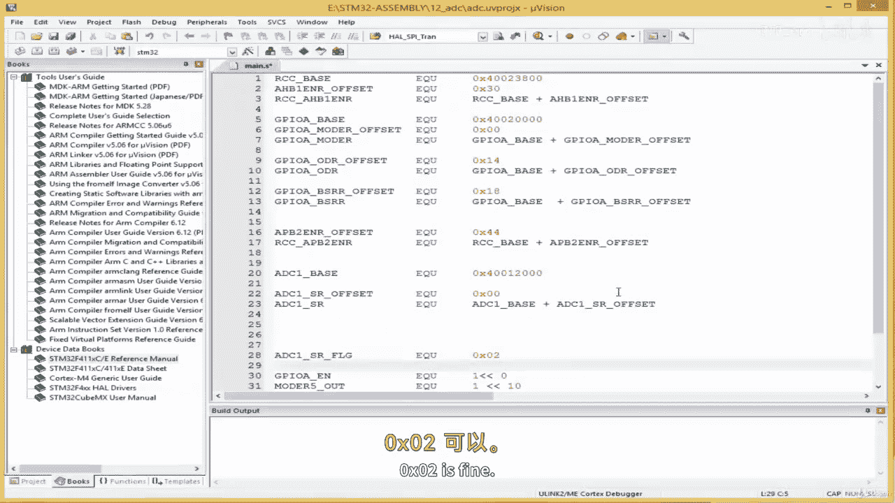

Okay， so。Moving on。

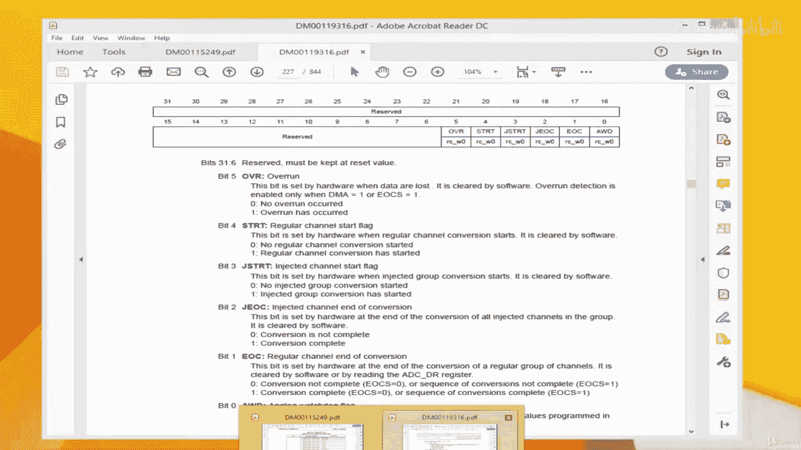

I'm gonna go。We have the ADDC control register 1。We don't need anything with regards to this register。

For this particular lesson， so moving on。😔，We have the ADDC control register。2 and this one here。

 bits number0 is going to be used to enable and disable the ADC module。

Let's see what bit number0 does。ADC converter on and off。 So bit number 0。 Indeed。

 it's an important register。 We need to fetch its offset。 I'm going copy this。

And I'm going to come over here。😔，It is1， CR R1。😔，Offset。UQU is this。A1， seat at1。

E QU is the ADC1 base。Plus， the offset like this。Right。

And we have to create a symbolic name for enable and enabling and disabling the ADC。

I'm simply going to put this here。😔，I'll say CR 2， the name of the registers， actually CR2， no CR1。

 sorry about that。So Ill call this constant C R 2。C and F for configuration。

 and we know bit 0 is what we said。 So I just say E Q U 0 x 01。And。I'll put a comment。This means。

Enable AC1。Like this， okay。Moving on。This scroll down。😔，Okay， we don't need this one， not this one。

 too。Okay， there's another register we need。 this S Q R1 register。 We shall use it to。

To sort of configure the conversion sequence。 So I'm going to copy its offset over here。

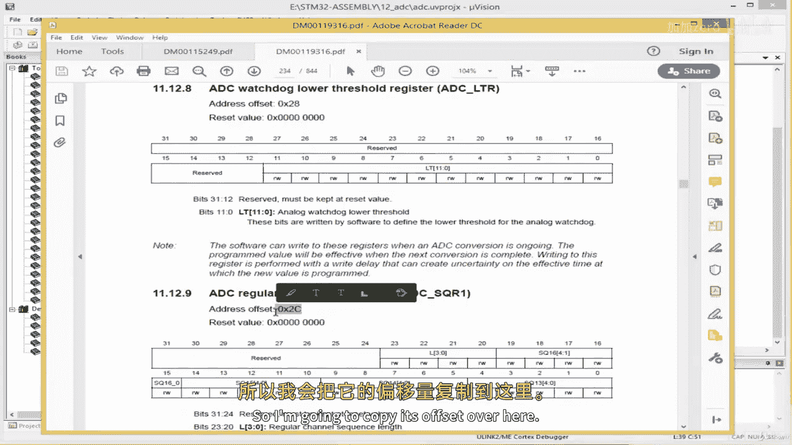

And then， I'm gonna。Come here and create it register。😔，I would say 8C1。It is called S Q R 1。

 and then ourll other word offset over here。😔，And then EQU。Pe this over here。😔，And then ADC1。S Q R1。

And then。EQU。Is the base。Plus the offset this over here。😔，Paste it hair like this。Right。

 and then I'm going to create a symbolic name for its， its configuration。O say SQR1 over here。

And then underscore CF for config and EQ U。We're gonna pass。We're going to pass 0 here。

 And what this means is the conversion sequence length is， is going to be one。Right。

 so this is we use this register to decide the conversion sequence length。Put a comment here。😔。

Confeession sequence lens。Okay， right。Moving on。Where is our reference manual。Okay。

 this is another register。 we need the S Q R 3。 This is also for。Configuring the conversion sequence。

So we create a symbolic name for it， say8C1。S QR3。😔，Opsset。And this， of course。😔，AQU， this over here。

😔，And then ADC1。S QR3。And then this is simply the base from here。Plus， the offset from here。Right。

 and we're going to create a symbolic name for what we're going to be putting in this register。

 We're gonna create a constant for it like we've done for the other registers。

 So come over here and say S Q R。SQ R3， CNF， Foconfig。And this EQU， I'm going to pass one over here。

😔，And this means our conversion sequence is gonna start at channel number one。

Ca the ADC has a lot of channels because we are using PA1。We started a channel number one， yeah。

Often in in SD M 32， they have made the channel number the same as the pin number。

 such that if you happen to find an ADC on a pin such as。Let's say P B15。

 it's going to be called Cha number 15。Right。So we'll be using pi1， so conversion。

Conversion sequence。Starts。At C H1。 So the reason why we've got a show where start。

 and we have to say where it starts， I should say， is because we can have multiple multiple channels that we are using。

 you can be sampling from 10 different ADDC channels one by one。

 and you've got to indicate where it starts。Okay， moving on。So， we've got these。嗯。Yeah。

 we've got enough relevant registers。 We simply need to include two more constant here。

 one for starting conversion， which we shall write to D M。

 the CR R2 register and another one for deciding the trigger of our conversion。

 whether it's a software trigger or not。So， I'm gonna give。A constant here。

 this is for register CR R 2。 and I'll call this S T。R T for start and CV for conversion。

And this E Q U。This exationmoco。 And this means。Start。Conversion， something like that。Okay。

 and then the next one is also for CR R 2， CR R 2。And SW trick meaning software trigger。Icu you， Sir。

Like this， okay。So let's see， do we have the flag？😔，I suspect we do。 We have the ADC flag here。

 I'm gonna bring it。Don't here with the rest。And one other thing we have to do is。We have to。St of。

We have to set the P A1 in our mode register to analog mode。 Remember。

 we can decide the mode of a pin。 We can set it， though We can set it as either。Input， we can set it。

You can set a pinis input。As output， as alternate function， as analog mode。 Remember， we have these。

 We have four， we have two bits to decide the mode of a pin。

 and these two bits give us two to the powerful options。2 to the power 2 options。 sorry。

 which are which is 4， because we have two bit。 And another mode is analog mode。

 and we use this mode when we confi in the pin to act as an AC。

 So I'm going to create a symbolic name here for what we shall be placing in。In the mo register。

I'll call this Mo1。A A N L G S L T for select and EQ U over here。And if you go to the data sheet。

 you realize that we need to pass 0 x C。In the mode register to select Ana mode。

So I'll just passed this here。😔，not important， actually， the most important itC register。

 with included editor the data register。 This is where we get our data。

 So let's create a symbolic name for that。Just scroll down here。😔，Here we go， this is it。

 this is the offset， I'll copy this。And I'll come over here。😔，It is1 DR。Opsset。

HeQ you this over here。And then ADC1。Under the go DR。EQU。Is the base address over here。

Plus the offsets from over here。😔，Right， so weve got the we've got the data register as well。Okay。

 we looking good。Okay。Right， so I think we have finished right in the symbolic names。

 We finish assigning symbolic names to our relevant ADDC registers。

So we will continue in the next lesson as we write out to the driver。

 I'll see you in the next lesson if you have any questions。

 just send me a message and if you're finding the course useful。

 kindly take some time off to leave a review。 I'll see you later。

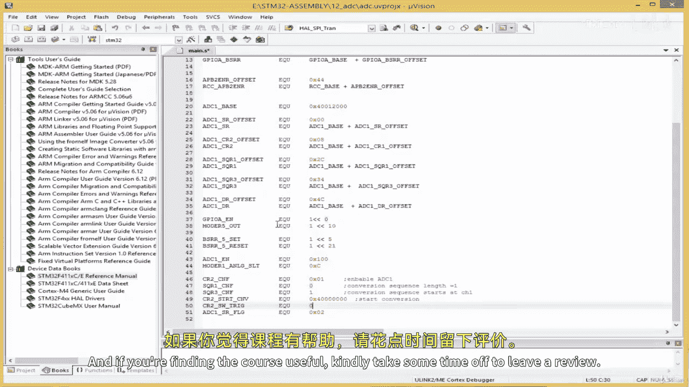