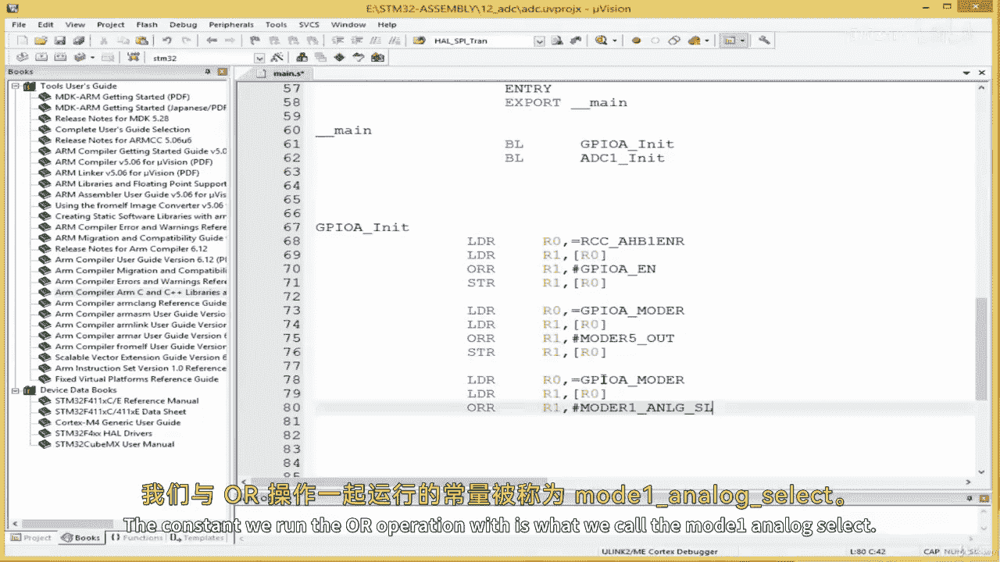
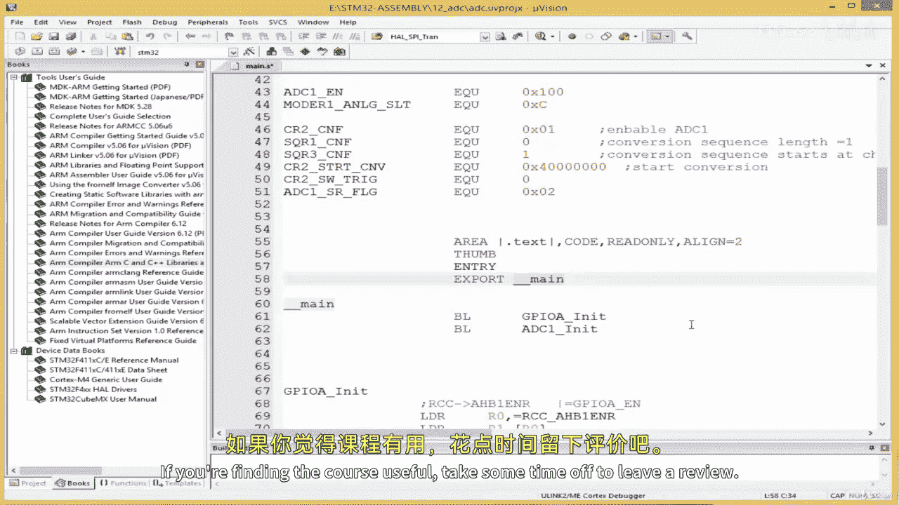

# ARM汇编语言编程：07.3：编写ADC驱动程序 🚀

在本节课中，我们将学习如何为ARM微控制器编写一个ADC（模数转换器）驱动程序。我们将从设置必要的汇编指令开始，逐步实现GPIO和ADC的初始化，最后完成一个读取ADC数据的子程序。通过这个过程，你将掌握在汇编语言中操作外设寄存器的基本模式。

## 汇编指令与程序结构

首先，我们定义程序的基本结构。这包括设置代码段、指定指令集和定义入口点。

```assembly
.syntax unified
.cpu cortex-m4
.thumb

.section .text
.align 2
.global main
```

*   `.syntax unified`: 指定使用统一的汇编语法。
*   `.cpu cortex-m4`: 指明目标CPU为Cortex-M4。
*   `.thumb`: 指示使用Thumb指令集。
*   `.section .text`: 定义代码段。
*   `.align 2`: 确保代码按字（4字节）对齐。
*   `.global main`: 将`main`标签声明为全局符号，作为程序入口。




程序从`main`标签开始执行。在`main`子程序中，我们将依次调用初始化GPIO和ADC的子程序。

```assembly
main:
    BL gpio_init
    BL adc1_init
```

## GPIO初始化子程序

上一节我们介绍了程序框架，本节中我们来看看如何初始化GPIO端口。`gpio_init`子程序负责启用GPIOA端口的时钟，并配置特定引脚的模式。

以下是实现`gpio_init`子程序的步骤：

1.  **启用GPIOA时钟**：通过设置`RCC_AHB1ENR`寄存器的对应位来启用GPIOA的时钟。
    ```assembly
    LDR R0, =RCC_AHB1ENR
    LDR R1, [R0]
    ORR R1, R1, #GPIOA_EN
    STR R1, [R0]
    ```
    *   `LDR R0, =RCC_AHB1ENR`: 将`RCC_AHB1ENR`寄存器的地址加载到R0。
    *   `LDR R1, [R0]`: 读取该寄存器的当前值到R1。
    *   `ORR R1, R1, #GPIOA_EN`: 将R1的值与常量`GPIOA_EN`（代表GPIOA使能位）进行按位或操作，结果存回R1。
    *   `STR R1, [R0]`: 将R1的新值写回`RCC_AHB1ENR`寄存器。

2.  **配置引脚模式**：配置PA5为输出模式（连接LED），PA1为模拟模式（连接ADC传感器）。
    ```assembly
    LDR R0, =GPIOA_MODER
    LDR R1, [R0]
    ORR R1, R1, #MODER5_OUTPUT
    STR R1, [R0]

    LDR R0, =GPIOA_MODER
    LDR R1, [R0]
    ORR R1, R1, #MODER1_ANALOG
    STR R1, [R0]
    ```
    *   操作模式与启用时钟类似，只是操作的寄存器和常量不同。`MODER5_OUTPUT`和`MODER1_ANALOG`是预先定义好的常量，对应GPIO模式寄存器中设置特定引脚模式的位域。

3.  **子程序返回**：使用`BX LR`指令从子程序返回。

## ADC1初始化子程序

完成了GPIO的配置后，接下来我们需要初始化ADC模块。`adc1_init`子程序将启用ADC1的时钟，并配置其工作参数。

以下是配置ADC1的详细步骤：

1.  **启用ADC1时钟**：通过`RCC_APB2ENR`寄存器启用ADC1的时钟。
    ```assembly
    LDR R0, =RCC_APB2ENR
    LDR R1, [R0]
    ORR R1, R1, #ADC1_EN
    STR R1, [R0]
    ```

2.  **选择软件触发**：在ADC控制寄存器2（`ADC1_CR2`）中设置使用软件触发转换。
    ```assembly
    LDR R0, =ADC1_CR2
    LDR R1, [R0]
    ORR R1, R1, #CR2_SWTRIG
    STR R1, [R0]
    ```

3.  **设置转换序列**：配置序列寄存器（`ADC1_SQR3`），指定转换从哪个通道开始（例如通道1）。
    ```assembly
    LDR R0, =ADC1_SQR3
    MOV R1, #SQR3_CH1
    STR R1, [R0]
    ```
    *   注意这里使用了`MOV`指令直接赋值，因为我们通常需要覆盖整个寄存器值来设置通道号。

4.  **配置采样时间**：通过序列寄存器1（`ADC1_SQR1`）配置通道的采样时间。
    ```assembly
    LDR R0, =ADC1_SQR1
    MOV R1, #SQR1_CFG
    STR R1, [R0]
    ```

5.  **使能ADC**：最后，再次操作控制寄存器2以启用ADC模块本身。
    ```assembly
    LDR R0, =ADC1_CR2
    LDR R1, [R0]
    ORR R1, R1, #CR2_ADON
    STR R1, [R0]
    ```

## ADC数据读取子程序

初始化工作完成后，我们就可以读取ADC转换的数据了。`adc1_read`子程序负责启动一次转换，等待转换完成，然后读取结果。

以下是`adc1_read`子程序的实现逻辑：

1.  **启动转换**：通过设置`ADC1_CR2`寄存器中的相应位来启动一次软件转换。
    ```assembly
    LDR R0, =ADC1_CR2
    LDR R1, [R0]
    ORR R1, R1, #CR2_SWSTART
    STR R1, [R0]
    ```

2.  **等待转换完成**：循环检查状态寄存器（`ADC1_SR`）中的转换完成标志位（EOC）。
    ```assembly
    wait:
        LDR R0, =ADC1_SR
        LDR R1, [R0]
        ANDS R1, R1, #SR_EOC
        CMP R1, #0
        BEQ wait
    ```
    *   `ANDS`指令执行按位与操作并更新状态标志。
    *   `CMP R1, #0`和`BEQ wait`：如果结果为零（标志位未置位），则跳回`wait`标签继续等待。

3.  **读取数据**：转换完成后，从数据寄存器（`ADC1_DR`）中读取转换结果。
    ```assembly
    LDR R0, =ADC1_DR
    LDR R0, [R0]
    BX LR
    ```
    *   读取的值存放在R0寄存器中，作为子程序的返回值。

## 与C语言代码对比

为了帮助你理解，以下展示了关键汇编操作对应的C语言代码片段：

*   **启用GPIOA时钟**
    ```c
    RCC->AHB1ENR |= GPIOA_EN;
    ```
*   **配置PA5为输出模式**
    ```c
    GPIOA->MODER |= MODER5_OUTPUT;
    ```
*   **启用ADC1时钟**
    ```c
    RCC->APB2ENR |= ADC1_EN;
    ```
*   **设置软件触发和使能ADC**
    ```c
    ADC1->CR2 |= CR2_SWTRIG | CR2_ADON;
    ```
*   **设置转换通道**
    ```c
    ADC1->SQR3 = SQR3_CH1;
    ```
*   **启动转换并等待完成**
    ```c
    ADC1->CR2 |= CR2_SWSTART;
    while(!(ADC1->SR & SR_EOC)) {
        // 等待
    }
    value = ADC1->DR;
    ```
    可以看到，汇编语言中的“加载-计算-存储”模式，在C语言中通常被简化为一句直接操作寄存器的语句。

## 总结与展望

本节课中我们一起学习了如何为ARM Cortex-M4微控制器编写一个完整的ADC驱动程序。我们从设置汇编环境开始，逐步实现了：
1.  GPIO端口的初始化，包括时钟启用和引脚模式配置。
2.  ADC模块的初始化，涵盖时钟、触发方式、转换序列和使能模块。
3.  一个用于启动转换、等待完成并读取数据的子程序。

整个流程的核心是 **“加载-计算-存储”** 范式：将寄存器地址加载到寄存器，读取其值并进行位操作（如OR、AND），最后将结果存回寄存器。这是底层硬件编程的基础。



在下一节课中，我们将利用这个ADC驱动程序，编写一个控制LED的子程序。我们将设定一个模拟传感器数据的阈值，当采集到的数据超过该阈值时点亮LED，否则熄灭LED，从而创建一个简单的响应系统。