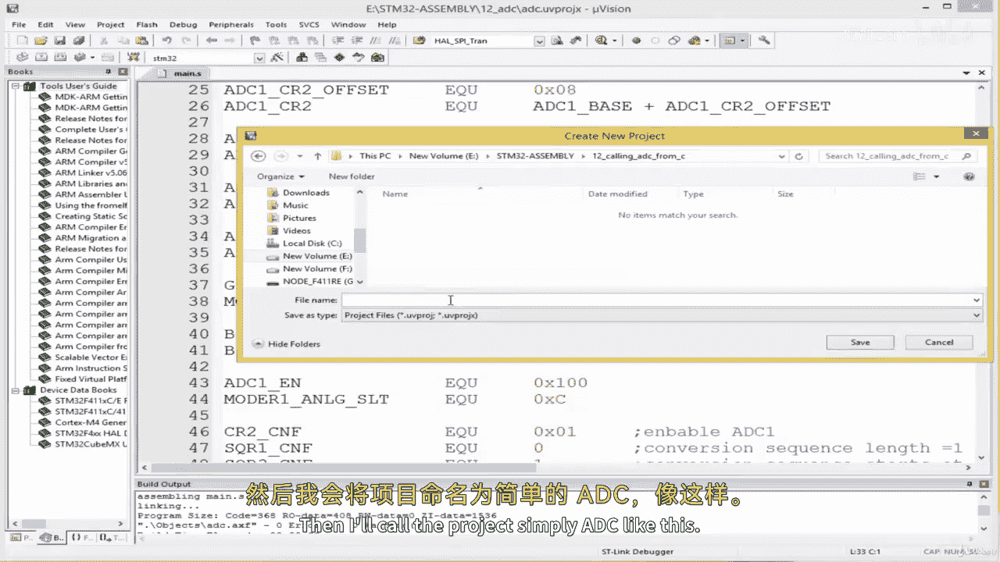
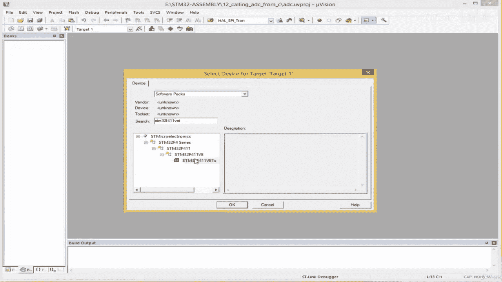
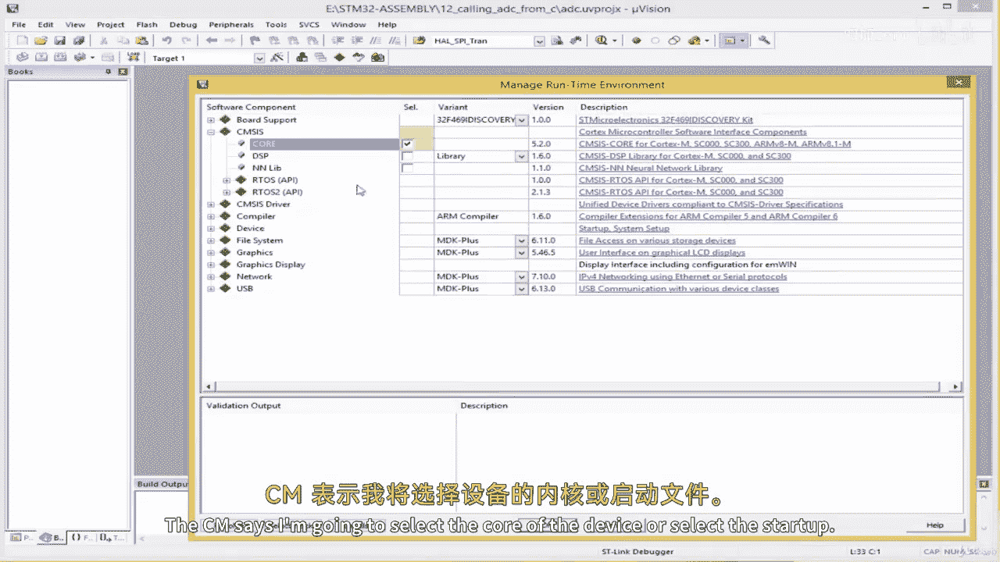
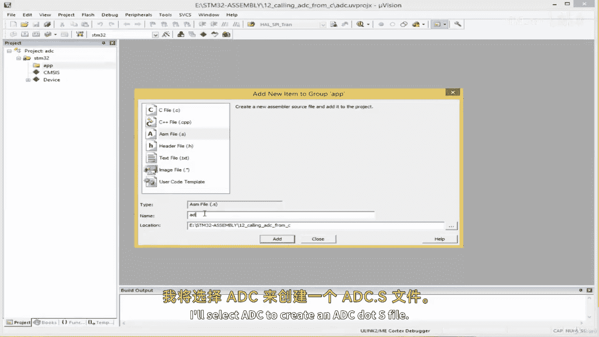
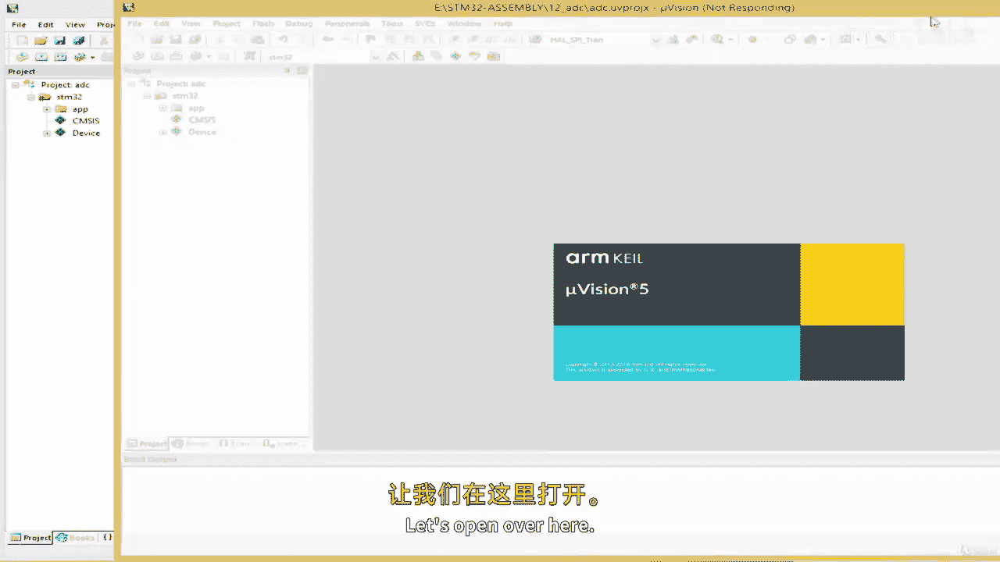
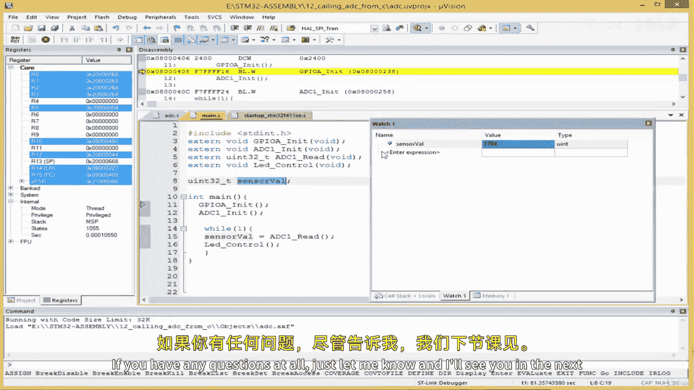

# ARM汇编语言入门II：07.5：从C代码调用ADC子程序 📞

在本节课中，我们将学习如何从一个C语言程序中调用我们之前编写的ADC（模数转换器）汇编子程序。我们将创建一个新的项目，整合C语言和汇编代码，并最终在开发板上运行和调试。





上一节我们介绍了如何用纯汇编语言编写ADC驱动程序。本节中我们来看看如何让C语言主程序来调用这些汇编函数。



## 创建新项目与文件

首先，我们需要在Keil uVision中创建一个新的项目。



1.  选择 `Project` -> `New uVision Project`。
2.  为项目创建一个新文件夹，例如命名为 `CallFromC`。
3.  将项目命名为 `ADC`。
4.  在设备选择界面，选择你的开发板型号（例如 STM32F411VE）。
5.  在管理运行时环境的对话框中，选择核心和启动文件，然后点击确定。

项目创建完成后，我们需要添加两个源文件。



以下是需要添加的文件列表：
*   **ADC.S**：用于存放我们的汇编语言ADC驱动函数。
*   **main.c**：用于编写调用汇编函数的C语言主程序。

## 移植汇编代码

接下来，我们需要从上一课的纯汇编项目中将驱动程序代码复制过来。

1.  打开上一课的ADC项目，找到主要的汇编源文件（例如 `main.S`）。
2.  复制该文件中的所有内容。
3.  在新项目的 `ADC.S` 文件中粘贴这些代码。
4.  由于本次C语言项目将负责程序入口和主循环，我们需要删除原汇编代码中用于测试的循环和入口点。
5.  确保使用 `.global`（或 `EXPORT`）指令，将需要被C语言调用的函数声明为全局符号。需要导出的函数通常包括：
    *   `ADC_Init`
    *   `ADC_Read`
    *   `LED_Control` （用于指示ADC状态的函数）

修改后的 `ADC.S` 文件核心部分应类似于以下结构：
```assembly
    .global ADC_Init
    .global ADC_Read
    .global LED_Control

ADC_Init:
    ; 初始化代码...
    BX LR

ADC_Read:
    ; 读取ADC值的代码...
    BX LR

LED_Control:
    ; 控制LED的代码...
    BX LR
```

## 在C代码中声明外部函数

现在，切换到 `main.c` 文件。为了让C编译器知道这些汇编函数的存在，我们需要使用 `extern` 关键字来声明它们。

C语言中的函数声明需要指定返回类型和参数。对于我们的汇编函数：
*   `ADC_Init` 和 `LED_Control` 不返回任何值，也没有参数。
*   `ADC_Read` 返回一个32位的无符号整数值，没有参数。

因此，在 `main.c` 文件顶部，我们可以这样声明：
```c
#include <stdint.h> // 用于 uint32_t 类型

// 声明外部汇编函数
extern void ADC_Init(void);
extern uint32_t ADC_Read(void);
extern void LED_Control(void);
```

## 编写C语言主程序

声明好函数后，我们就可以在 `main` 函数中调用它们了。程序逻辑通常如下：
1.  初始化系统（如GPIO）。
2.  调用 `ADC_Init()` 初始化ADC模块。
3.  进入一个无限循环。
    *   在循环内调用 `ADC_Read()` 获取传感器值。
    *   根据读取的值，可以调用 `LED_Control()` 或其他逻辑进行处理（例如点亮或熄灭LED）。

一个简单的 `main` 函数示例如下：
```c
int main(void) {
    uint32_t sensor_value; // 用于存储ADC读取值的变量

    // 初始化（假设系统时钟等已由启动文件配置好）
    ADC_Init();

    while(1) {
        sensor_value = ADC_Read(); // 读取ADC值
        LED_Control();             // 根据ADC值控制LED（逻辑在汇编函数内）
        // 可以在此添加延时或其他处理
    }
}
```

## 构建、下载与调试

代码编写完成后，即可进行构建和下载。

1.  点击 `Build` 按钮编译项目。确保没有错误。
2.  在 `Options for Target` -> `Debug` 中配置调试器（如ST-Link）。
3.  在 `Flash Download` 选项卡中勾选 `Reset and Run`，以便下载后自动运行。
4.  点击 `Download` 按钮将程序烧录到开发板。

程序运行后，我们可以进入调试模式来观察变量值。

以下是调试步骤：
*   启动调试会话。
*   在 `Watch` 窗口中添加 `sensor_value` 变量进行监视。
*   运行程序。当你旋转连接在ADC通道上的电位器时，可以在 `Watch` 窗口中实时看到 `sensor_value` 数值的变化。
*   同时，开发板上的LED也会根据ADC值的变化而改变状态（例如，电位器转到一端时LED亮，另一端时LED灭）。

## 实验扩展

本实验以电位器作为ADC输入源。你可以轻松地将其替换为其他模拟传感器，如光敏电阻或温度传感器，连接方式和代码调用方法完全相同。只需确保传感器输出在开发板ADC的输入电压范围（通常是0-3.3V）内即可。

---



本节课中我们一起学习了如何搭建一个混合编程的项目，从C语言主程序中调用ARM汇编语言编写的硬件驱动子程序。我们完成了新项目的创建、汇编代码的移植、C语言对外部函数的声明与调用，以及最终的调试验证。掌握这种方法，可以在保持C语言开发效率的同时，利用汇编代码实现对硬件的精确、高效控制。