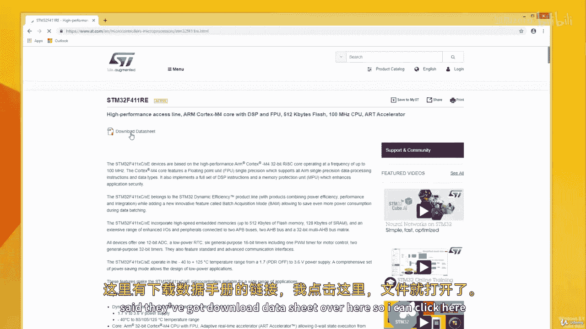
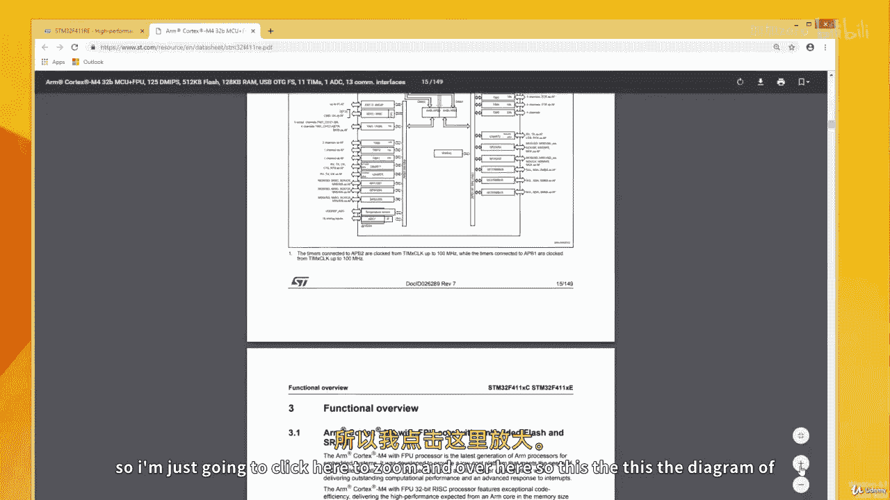
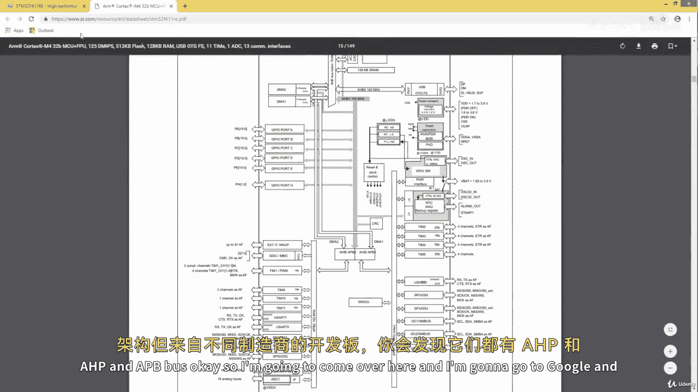
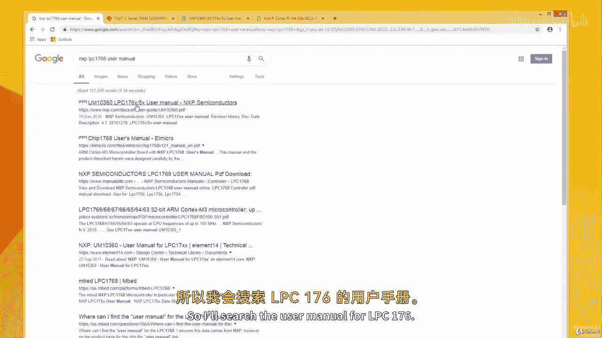
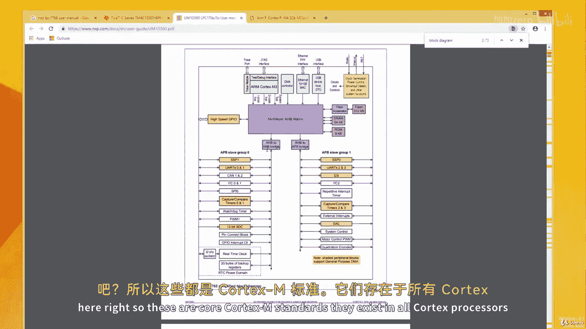

# 【从零开始学习 ARM 汇编语言II Udemy】 p32 p31 08.1. Overview of ARM Cortex-M General Purpose InputOutput Module -BV1RJU6YwEM8_p32-

Hello welcome back， as you may know， memory holds code and data for the CPU to process and the input output ports are used by the CPU to access input and output devices。

In the microcontroller we have two types of input output。

 they are the general purpose input output also known as GPIO and the special purpose input output。

The GI O or the general purpose input output are used for interfacefacing devices such as LED。

 switches， LCD， keypa， D C motors， etc cetera。 Special purpose input outputs have designated functions。

 functions such as。Analog to digital conversion， digital to analog conversion。

 timer usage and universal asynchronous receiver transmitter or the U art。

 so we're going to find on our microcontroller the same pin being configured as either a GPIO or a special purpose IO and would have to tell the microcontroller that we want to use this pin for a special purpose or we want to use it for its normal general purpose。

Right。In a microcontroller， pins are grouped into ports such that we have port A， port， B， port， C。

 etc， so each port has a number of pins。For instance。

Pin A 1 stands for Ping 1 of port a in the same way， if you see a pin such as this one。

 P E3 stands for。Pin3 of port E。 So when we accessing these pins。

 we've got to tell the development environment， the ports and the pin number as well。

 So all microcontrollers have this name and convention， they've got the pins grouped in ports， right。

 But when you are using when you are using platforms like Arduino and and embed。

 you wouldn't need to indicate the ports of all the pin。

The areino Rapper and the embed wrappper has taken care of all of that and they've renamed these pins into simple names such as P1 through P30。

 P1 through P30 without indicating whether。P1 through P54 underer port A and then P5 through P104 underer port B。

 when you code in an embed or addunal， you need not worry about all of that Now when you are doing bare metal coding。

 you need to know the port as well as the pin number of the particular pin you want to access Now let's talk about buses So more the cortex microcontrollers have two types of buses they've got the advanced peripheral bass and they've also got the advanced high performance pass the advanced peripheral buses often written as APB and the advanced high performance buses often written as AHB and when using the advanced peripheral bus you require a minimum of two clock cycles to access a peripheral but with the advanced high performance pass。

You can use even one clock cycle to access peripherals and we're going to go into the data sheet of four different armcortex microcontrollers from three different vendors and we'll see that these buses exist in all the microcontrollers。

 whether it's a microcontroller from NXP， whether from Texas instrument or whether it's from ST。

 if all got this， so let's take a look at the data sheet and locate these buses。

Ca one of the purpose of this course is to enable you to be able to go through the data sheet and the user manuals of any microcontroller you're dealing with in order to work with peripheralflows and deal with things on your own as you improve your embedded development skills。

Right。Now let's see how to locate the data sheet of our particular microcontroller and take a look at the bus structure in the microcontroller。

 so I'm just going to go to Google and just search the name of the microcontroller followed by the word data sheet。

I'll come over here。So let's start with the SDM 32， I'll say SDM 32 F411 R。The version of。

F4 microcontroller on my discovery board is this one the4 F411 R。

 but you can search this or search the F40 version。 The information should be the same really。

 so I'll just select data sheet here and I can click here to go to the SD website and。

They said I've got download data sheets over here so I can click here。

And this opens right so that there's the data sheet and there's the reference manual。

 the data sheet gives a summary of the particular MCU， it tells us the number of peripheralflows。

 the power consumption limits and things like the block diagram， you can think of the data sheets as。

 the summary， and the reference manual as。Indeed， the reference manual。

 so the data sheet over here has 149 pages， the reference manual often has over1 thousand00 pages right。

 so I'm going to scroll down here。We should have the block diagram down here somewhere。

The block diagram of the system。Okay， here we go。So I'm just going to click here to zoom and over here。

 so this this is the diagram of our microcontroller。

The block diagram， and as you can see， it's called AHB bus here。

This's the AHP bus and anything you see connected to this shows that we can connect to these peripheral using the AHP bus。

 for instance。We can connect to。For instance， GR you port A can use AHB B。

 port B can use AHP as well， port C， port D port H can use AHB。Right。

 but it's not always the same for all peripherals。This one here is。An A PB bus。As you can see。

 the name indicated here， APB1， we've got APB2 here。

When coding we would keep in mind that we cannot initialize。

 let's say the UU on a Uat2 and try to initialize using the AHP bus because Uat hasn't got AHP bus we work with a Uat using the APB bus right So this the bus structure of the SDM32 F4 and we'll be revisiting the MCU like I mentioned before。

 one aim of this course is to give you the skills that would allow you to navigate the data sheet and the reference manual to solve your own problems as you improve your embedded development skills So this the SDM board right Next we're going to see at a three boards all based on the arm architecture but from different manufacturers and you see that they've all got the AHP and APP B Okay so I'm going to come over here and。

I'm going to go to Google。And I'm going to search。T M4 C，1，2，3。

GH 6 pm and I'm going to say data sheet this the Tvai board from Texas Instrument。

 I'm going to open this。And it's open over here， so over here the data sheet has over  a thousand pages。

 but it's fine we still look at what we're looking for。

Often the block diagram is somewhere below the table of content and the list of figures。

 so you just need to scroll down and sometimes in fact they' they don't call it block diagram。

 they've got different names for this one way of searching quickly is to press control and F together and search the word you're looking for so I'll just say block diagram over here。

So over here it says cortex M4 F processor block diagram。

 so the F here means the cortex M4 has a floating point unit as well。

 not all cortex M4 have floating point units。So this is the CPU block diagram we have over here。

 but we don't want a block diagram of the processor。

 we want the block diagram of the entire microcontroller。

 remember the processor is just one part of the microcontroller。Right。

We can come over here to a C series overview right under the overview there should be a diagram here you go Okay。

 so over here this is the diagram for the Texas Instru board the Tm4C123 as can see we've got the advanced high performance bus the AHB bus here and we've got the advanced peripheral bus here in the same way only those with the arrow connecting to the AHB bus can use the AHB bus。

Those without the arrow connecting to the AHB bus can use the AHB bus。

 so let's see an example of what I mean。This is the AHB bus we've got over here， for instance。

 this peripheral known as SSI cannot use AHB， as you can see its arrow is pointing to the APB。Right。

 and this ADC here， this analog comparator here。Its pointing to APB in the same way the 12 bit A disease pointing to APB。

 and we have the DMA， the DMA is able to use both the AHB bus and the APB bus。Right。

 and we've got a timer here， the watchdog timer using just the。

A PB bus we'll talk about all of these peripherals later。

 so you need not worry this is just to show you the bus structure that exists in the various microcontrollers。

 Okay， so let's see the third microcontroller。 Let's try the one from NXP。 I'm going to search NXP。

The popular LPC 1，7，6，8 microcontroller。And yeah， this is the embed board。Yeah。

 but we won the data sheet。You can see use a manual as well。Okay。

So open the user manual for LPC176 x slash 5 x。So I'll search the user manual for LPC 176 okay。

 and it's open over here， this is it right。

In the same way， we can just do C F and P diagram here。

So this is what it means to be an embedded systems developer you should be able to work with any microcontroller you provided with。

 often people keep themselves in their comfort zone thinking okay because I work with just SD microelectronics。

 it's going to be hard to switch to a different vendor。

 but that's not the case if you know how to use the data sheet and navigate things like the dataheet and the user manual you be equally comfortable working with microcontrollers from different silicon manufacturers。

Right so okay we've got this， it says simplified block diagram and as you can see we've got the buses here and this over here this bus comes here and this in their system they've got the multilay AHB matrix so this bus here is an AB matrix and there's AHB to APB bridge there's a bridge here。

 as can see all of these peripherals use the AB bus hence they are called the AB slave group1。

These peripherals use the APB as well， and there is an AHB to APB bridge over here， right。

 so these are core cortex M standards， they exist in all cortex processors。

