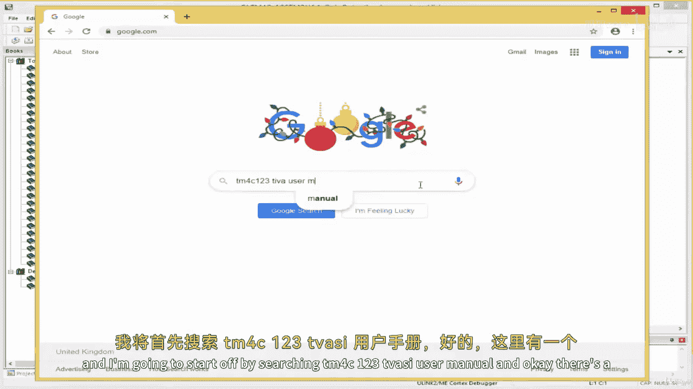
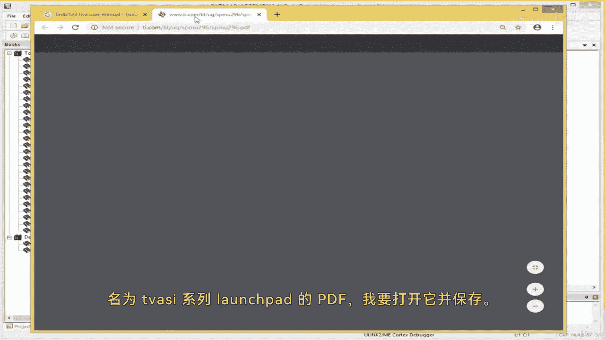
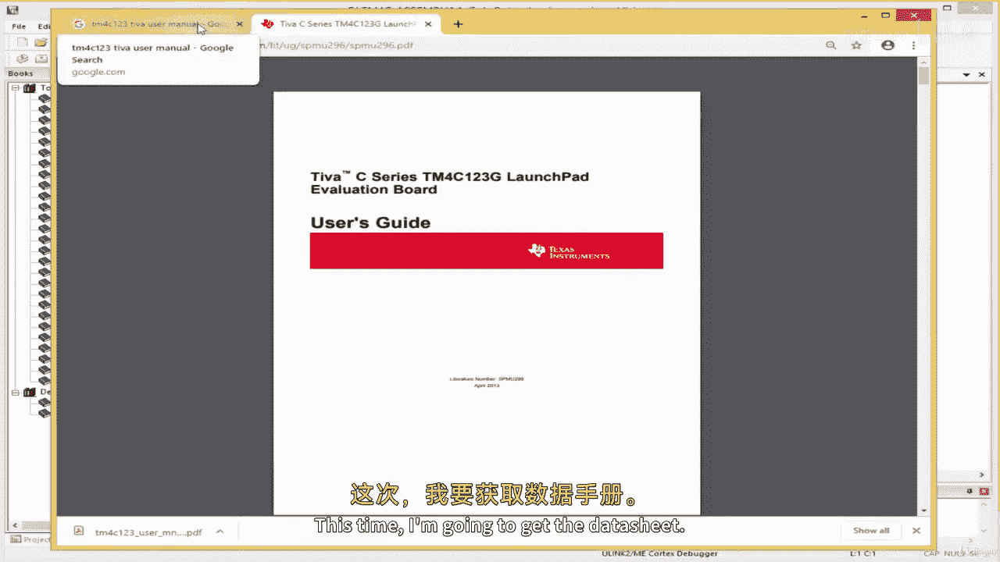
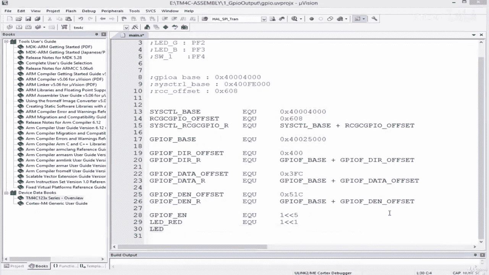

# 【从零开始学习 ARM 汇编语言II Udemy】 p33 p32 08.2. Coding   Assigning Symbolic Names to Relevant GPIO Output Registers -BV1RJU6YwEM8_p33-

Hello， welcome back。 And this lesson， we are going to see how to develop a G P I O output driver for our Texas instrument。

 Tm 4 C 1，2，3 microcontrollerboard。 I'm going to create a new projects by coming over here。

 Project new Uion project。And then I'm going to navigate to the。😔，So a folderer to store my project。

😔，I'm going to keep it over here。😔，A call this GPIO。And then I'll save it， my port is Tm4 C。😔。

Tim 4 C，1，2，3，0， H，6 PM。And then okay。😔，I'll select this， and then I'll click OK。And then under cmis。

 I'll select the core。😔，On a device， I select the start。Then I'll say， okay over here。😔，Right。

 so then there's my project Ta is steam 4 C。 So renamed this steam 4 C。

And then I'll drop down over here， source group I renamed this to app。😔，Then I'll add new file。

 add new item， or say ats S file。😔，I'll give it a name， Ma。Right， so before we。

Before we are able to develop our drivers。We would have to take a look at the data sheet and the the reference manual provided so that we can know the addresses of the various ports and the the other peripherals that we need。

 So if you' are using call U vision， you can come to the bookt over here， and then it provides us。

To provide us device data bookss。We can click this and see if it works。

 The last time I' tried is't work。It brings us to the ST。Melectrons website。

My Windows Explorer has crashed。😔，Anyway， I suspect this doesn't work。

 so what I'm going to do is I'm going to go to Google and find the user manual as well as the data sheet。

For those of you who have seen the SM 32 version of Tscourse。

 you realize that we were able to get access to those documents from this side here。

 It's not the same for Texas instrument。 if not updated it。

 So we have to find that from the Internet。 I'm going to open my。My search。

And I'm going to start off by searching。田课士。😔，1，2，3。自佛师。有什么哦。

And。😔，Okay， there's a PDF here。😔，Known as Tva C series Luchpad。😔，I'm going to open this。😔。

And I'm going to save it。😔，This is the TVC user manual。Or call this。

 You can save it on your computer。Ca if you have the board， you would need this document。Right。Okay。

 I'm going to fetch another document this time I'm going to get the data sheet。

I'll just change this two words user manual here to a single word data sheet。

And we have this other document， Tva C series， T4C。GH 6 pm， okay， this is it。Open in another tab。

And it's got over 1000 pages， there's the data sheet。I'll save this as well。T M4C，1，2，3。Data sheet。

Right。So I'm going to close this now。Right， so let's open the document， we download it。

I've got them here， so I've got the user manual here and then I've got a data sheet。

 Let's take a look at the user manual。I'm going to take a look at this schematic diagram of the TV sea board because I want to know where our LED is connected。

 we are going to use our RGB LED。For our experiment over here under the page number。

And page number 4， we have an overview of the board showing the various components we have on the board。

 We've got the power here。 We've got this microcontroller for de bargain。

 This is our main microcontroller。 We've got our RGB LED over here。And then。

We've got two user switches that we're going to use for our experiment as well。

Then we've got USB here for those of you who want to develop USB devices。Right。

 but what we truly interested in is down here。Page number 40。😔，I， just是。

Go to 40 by searching over here， Sc of 40， says。<|OTHER|>It's going to page number 40， sorry。

 I think it's page number 20。Let's keep okay， yeah， here we go， okay？I'm going to swimming。

And over here， we have our LEDs， we have。We have RGB， so we have red， green， blue L。

And they are connected。 Let's see if we can find their connection。

 We want to see which pins they are connected to on the microcontroller。 Okay。

 this is the bit that talks about that。Okay， so。It seems our user buttons and LEDs are all connected to。

Pot F。P F 0 is connected to the switch。 N two， P F1 is connected to the red LED。

PF2 is connected to the blue LED， Pf3 is connected to the green LED。

P F 4 is connected to the search number one。 So we find this information at page number 20 of the user manual。

 I'm going take note。 I'm going just put some note here。 I'm just taking you step by step。

 as if I just bought this board。 And I hope I know nothing about it。

 This is how I'll go about to write my first assembly driver。

 I'll first go to the user manual to see how the peripherals are connected to see how the。

To see how things like the LEDs and other test test components are connected and then I'll take note。

And I will just take a note by writing a comment， this is what I do in my professional life。

 so I'll see。LED red， as we saw。This is Pf1。We saw the switch one。😔，While switch 2 was Pf0。

 I'll just call this W2。This was Pf0。And then。Eliedy green。😔，Or PF2。LED blue。Was Pf3？

And then we had switch one。Which was P 4。Okay， so these are the components we have。

 we can test both GPU input and output with the LEDs and the switches。Right。

 and we know where to find them。 They are all。Inport F。Right， so we know to write our GPU driver。

To sort of use our LED for our GPIU experiment， we need to access GPIU port F and configure the registers that relate to the particular L we want to we want to to you。

So we need to find those registers before we do that， I have to give you a quick overview of how。

How Mo day microcontrollers are designed and。So modern the microcontrollers are different in in many ways from older microcontrollers。

 one of these ways is in what is known as the implementation of the clock gate and mechanism and what this means is that。

The clock access to various parts or you can call it various modules。

 or you can still call it various peripherals of the board。

Access to these various parts are blocked by default so if I take my microcontroller C access to GPIO A doesn't exist。

 it is closed C access to GPIU B is closed clock access to ADC is closed。

 clock access to U art is closed， etc。This is known as clock g and what this does is this sort of makes the microcontroller consume less power。

And。This is done， because。Because the clock access is close by default。

 you only enable or allow clock access to the part that you want to use。

So that you don't just allow clock access to the entire port。

 you just enable clock access to the parts that you want to use。In this lesson。

 we are going to use port F because our output pin is connected to port F。To use Port F。

 we need to enable clock access to port F。Right。So。Yeah， we need to enable clock access to port F。

 And then once we enable clock access to port F， we can。We can toggle the their respective。嗯。

P F registers。 We can toggle the right registers in order to configure port F as either input or output。

Right。Now， to enable clock access to a particular module。And as I mentioned in this course。

 when I use the word module， parts and peripheral， they mean the same thing。

I'm going to be using them interchangeably。Pphpherra is much more specific as you would know。

 but when I say modulular part， I'm just trying to say a particular unit。Right， and yeah。

So to see how to enable clock access for a particular module。We have to decide on which bus to use。

Generally in Ar cortexM architecture there are two types of buses。

 we have the APB bus and the AHB bus， the APB bus stands for Advanced Para bus。

And the A H P bus stands for advanced high performance pass。

 The difference between the two is that the high performance when the A H P allows faster access to。

Pairroze。So， as I was saying。The the A HB。Im sorry about that I had to replace my my headphones。

 It got broken。 So as I' was saying， we've got A HB and AP PB bus and AHB allows for a faster access to peripherals。

 So for instance， if you are using A HB bus to access a GP you peripheral。It might take。

 let's say just two clock cycles to access it。 But if you wanna access the same。Perfo through A P B。

 you might need。4our。So AHB could give you two and then APB would require four cycles to do that this is just an example it's not specific anyway let's go to the data sheet to see a block diagram of our board and see how the AHB and APP bus connects to the various peripherals of the board。

I'm going to go to the data sheets that we downloaded。It's over here。

 there should be a block diagram somewhere。 All of the data sheets， have them。11。Sorry about that。😔。

So getting familiar with the data sheet is a requirement for anyone who wants to take embedded development seriously。

You would have to get used to the data sheet and try begin to like it essentially。

Once you understand the data sheet， you can sort of rewrite the entire library of a particular board and get it most out of the port。

 if you may right， there's the block diagram we're looking for， you can find this on page number 48。

Is a 48， yes， it is 48 of the data sheet。Okay。So this is the microcontroller high level blocked diagram。

 we have the AB bus here。And then we have the AHB bus when you see this arrow it means the particular peripheral connects to this bus。

 for instance， the ADC connects to the APB bus， the QUE also connects to the APB bus。

 so to use this you need to enable clock access of the A through the APB bus。Right。

General paper time is connects to the APB bus。Watchdog time is connected to the APB bus as well Okay。

 but what process here is the GPIU。We have the GPU for the GPIU。

 they connect to both the AHB and the APB。 that is why we have two arrows here， one for AHB。

 another one for APB， so we can。We can use any bus we want for the GPU。

 but in our experiment we're going to use the default， which is the APB connection。Right。

So that's what we're going to do。Okay， now that we know the buses available for accessing the peripheral floor。

We have to take a look at the registers of the peripheral we are working with。

And then also over here， I have to give a short short explanation。So。Microcontrollers。

 regardless of silicon manufacturer， and regardless of architecture website 16 Bs，32 bit，8。

Microcontrollers or microcontrollers。When you are dealing with the GPIU。

They should have at least two registers， and I know if you've seen the theoreticaleth lesson I may have mentioned this already。

 they should have at least two registers， one is called the direction register。

 and one is the data register， we use the direction register to set the GPU as either input or output。

 the data register is where the data is stored if its output， we write the data to the data register。

 If its input we read the data from the data register。Right。Apart from these two registers。

 you would have optional registers there。Ire use for things like deciding whether the pin should serve as an alternate function pin。

And then digitally enabling the pin or analogly enabling the pin， etc ceter。

 but the two main registers are the data in the direction register。Right。Over here in。

In the arm architecture， registers。Of a peripheral are often arranged us。Offsets from a base address。

So in order to sort of find the register of a particular app。Perel， let's say GIU A， GIU A has。

It's like the registers in GPU A。Of the same type as the registers in GPUB and they are of the same type as registers in GPIUC。

 of the same type as registers in GPRUD， etc。And because of this。

 it's designed such that there is just a single address for GPU A。

 and then the GPIU A register such as GPIU A direction register is an offset from that single base address of GPU A and GPIU A data register is another offset from the base address of GPIU A。

 such that。The offset of the various types of registers。The offsets are the same。

 so wherever you are looking for direction register you can have the offset to be 0 x21。

And then when you are using looking for data register， you can have the offset to be 0 x3，2。

 But how we know that this data register。Belongs to GPU A， not GPU C is that。

To get a complete address of let's say GPU A data register。

 you've got to take the base address of GPU A and you add the offset。

 And because the various peripherals， GPU A B C D， etc cetera， they have different base address。

 they have their own base addresses。 So even if the offset of their various registers are the same because they have different base addresses。

 we can be able to identify that this particular data register belongs to GPU A。

 this particular direction register belongs to GPU A etc ce。 So without talking much。

 let's write this， less continual code and and you understand what I mean。

So I'm going to go back to the data sheet and I'm going to go to a page。

 I'm going to go to page 92 to find what is known as the memory model。

 and this will give me the base address of my paras。So let's go to the data sheet。

I'm going to search 92 over here。😔，Sas memory model here。 And this gives the base address。

 So GP I U A base address is this starts from here。 It ends here。

So the base address that that's what we need， so I'm going to copy this。Sorry。I'm going to copy this。

 and then。I'll keep， I'll take note。Call this GPu Airbase。Ill delete the dot here。Right。

So we have the piece address。Another thing we need is the system control base address system control is what we going to we're going to go through the system control to enable clock access for the entire GPIU。

Perel， so I'm going to fetch the system control base address as well。Let's see。We should have cis。

 somewhere， S， Y， S。Okay。So if we want to， I'll just point this out。

 If we want to access GI U A through the A H P bus， we would have to use this。A be's address。

But because we access in it through the default， which is the AP PB。

 that is why I took the first address。 So there's another address， but it says A HB here。Right。

RightIf we cannot find the address and the table is fine as another way。

So when we go to the page that talks about the particular module， it writes what you call it。

It gives us the address of the module， so let's go to the clockcate and register。

And see the address written at the clock gate in。It's called the RCGC。

CGC so just go to the top of the data sheet and search RCGC。CGC。Okay， so this is an RCGC GPPIO。

 I'll click this。And then， let's see。😔，Okay， so this the base address。

 It gives us the base address to。And this is good in other。

In other documentation such as the that of S microelectronics。

 when you go to the page that talks about a particular peripheral。

 it talks only about the it gives you just the offset it expects you to go to the table we're going to to fetch the base address。

 but over here it gives the base address as well。 So we're going to use this to access to enable enable clock access。

And we can read more about it before I copy this， I'll show you。So， it is called the。Cral papers。

 input， output， run mode， clockation and control。So this is this sort of closest。

 this is the gate clock gate to the GPIU。And we can readable bit number 5 over here。

And you can simply come over here and read about this。 bits number 5。

 It says GI your pos F run mode clock gate control value description。 if 0， GI your po F is disabled。

 if one， enable and provide clock to GI your po F in run mode。 So we would have to write。

We would have to write1 to bit 5 of this register here， so I'm going to copy the register。Right。

 and then。Oh， take note。 this is。The base address actually belongs。

 is for something is for a structure known as C control。

So I'm going to call the S control base because theres there are other。

 there are other members of the S control。So perhaps perhaps I should just show you this。

 So this is how it is written if if if we're going to write let's say the the complete drivers from ground up professionally。

 if we're going to write it to look like the CMmC， the CMC written drivers。

We're going to write it in a structure form。 So in sea language， it would look like something like。

 it would look something like theystruct and then instruct， I might probably have。

I might probably have。I may probably have GPIU RCC。R CGC， right， and then。I might probably have。

GPTM RCC。And then I might probably have component 3 comp。3， and then。Compamp4， something like this。

And then I'll come here and give it a name。Something like ciscon true。Like this。Sorry about that。

Look at the can spell control。 So， so that's the base。

The reason why we keep talking about base address and offset is to get a complete address of this member here in these members。

 they are just， they are just registers。 So as I want to get a complete address of this。

 it has to be the address of the base， which is the structure， the address of the structure。

 plus the address of the member。Right。So。This address that we just fetch R CGC belongs to a structure knowna system control。

 That is why I've given it the name system control base here。 In all of it GPI U， This can be GPIU。

 GPI U A is the same way。 And we're going to have direction register。D enable， register， data。

 register， etc ceter。 this is how it looks。If you want to view it in the form of a data structure。

 so to get the address of direction register， we've got to take the base address plus the offset here to get the address。

 the address of digital enable register。 we've got to take the base address plus the offset， right。

Anyway。So we've got system control base， and then there's the the address of the base， right。

 so let's say the offset for the RCC。It gives us the offset here。 That' the offset of RCC。

Offset ofCGC， keeps saying RCC because in STM， microelectronics it called the RCC。

So I'm going to take this。😔，Sorry about that。😔，Goodness， Sorry to copy。Is zero x6。0，8。Is zero x，6。

0 8， okay， so now let's construct the RCC register。To construct the RCC register。

What I'm going do is to improve readability。 I'm going to do this step by step。

 I'm going first create a symbolic name for the base address， or do ci control。Ands called base。

 and I'll use the EQU directive。And then I'll just assign this hexodademal number here。And then。

 next， I'll see。OC gC。GPI O。Offset。And we not already， that's the offset， the offset for RCGC GPPIU。

So if we take the base and then we add the offset， we get the complete address for this register。So。

This。This， I'll say EQ U。 and then I'll pass the base that we got 0 x 6，0，8 as confirm。

 It's the same，0 x 6，0，8。 So now to get the address。I'm simply going to say， si。

 I'm going to use this name in convention， and I'll explain why that is later。 I says this control。

RCGC。GPI2。Under school R。EQu。And this is simply equals。System control bay。Plus。The offset。

 as simple as this。The reason I've decided to call this， this Reg this。

 I could have used a shorten name。 I could have' called it。

 I' could have called it Regg 1 or Regg 2 or my register。 I could have given it any name。

 in symbolic name。 But the reason I'm using this is if you are to write this code in their metal embedded C。

 you are going to use the same， the same。Name in convention。

 if you are using the Texas Instrument library， you would see that there's a register that is called this If use this name in convention。

 If you are using the CC library provided by arm， you see that the name in convention is like this。

 Let me show you what I mean。Remember when I told you it's a structure and a member relationship with a day' address and the offset。

If I'm to get access to this register in my bare metal programming。

 for those of you who have taken the the bare metal version of this course。

 you'd understand what I mean， But if you haven't， this explanation should suffice。 if I'm to。

 if I want to access this register in C language， I'll simply say says control。

And it's written ci control， I've put anarrow here。M， I think it's gonna hard there。😔。

We can eliminate the R。Yeah， it's written says control。 That's the name they use。

 and then they use thearrow operator to access the R C G C。G， P， I O member。

 And then I can assign my number here。 So say I want to enable clock for port F。 I would write this。

 This is what I'll do in say language to enable clock access for port F。 this bit here。

Gives me this register we've just created。 So that is why I'm using the arrow operator。

 So anywhere you see the arrow， you should just think anywhere you see the underscoreco。

 if you have to convey this to C language， it becomes an arrow。 And for those of you who know。

You know， basic data structures of C seeing this， you know that RCGC。

 GPIU is a member of this Cs control which is a structure like I explained earlier， right。

  moving on so if you don't understand any of what I just said just send me a message。

So we have our RCGC GPIU register， we're going to do the same for GPRU A and its registers。

So we can create GPRU A basease。I'm going to see。😔，GPRUF， sorry， I keep saying a。

 we have our our LEDs and switches on GPRUF。G value F base。But I ended up fetching GPIU Airbase。

This is ridiculous。 Let's go and get GPI U F。GPIOF。Do we have it。Just bear with me e。

I'm just gonna do D E N to get one register。 D， N is the。The digital enable register。 Okay。

 this is the G I use section。And then。Register descriptions， let's see what we have Okay。

 so over here it gives us the complete addresses of the GPIU registers。Okay， I'm on page number。

Let's see。 I'm on page， page number 662。 So I'm looking for the GP P I U F register。

 the G I U F register base address。 And I'm using A P B， which is the default。 I'm not using A H B。

 What do I even mean by default。 I'm deciding which address to use。 There's no default here。

 I'm using A P B， right？ So I'll copy this。Yeah， so GPUF APB base address， I'm going to copy this。

And then。Thank you you。This is it just clean the do and then now。

We are going to look for the various GP registers to do that。

 One thing we we can do is just to behave naive。 If I didn't know how to program this sport。

 the Texas instrument， the guys the guys at the Texas instrument and the ladies who wrote the the reference manual in the data sheet。

 they provide steps。The steps for sort of working with a GPI you， let's see。

 they've given step by step。Okay。This is initialization and configuration。It goes over here。

 the GPIU modules may be access via two different memory Appes， like we mentioned like previously。

 the legacy Appperture， the AB advanced peripheral bus is backwards compatible with previous devices。

 The other appperture， the advanced high performance bus。 A HB offers the same register map。

 but provides better back to back access performance than A PB。 These appches are mutually exclusive。

 meaning we can have just one。 The appperture enabled for a given GPI port is controlled by the appropriate bit in the GPIU H。

GPIU HBC register， O。Note that GPIU can only be accessed Note that GPI you can only be accessed through the A HB Aperture note that there。

GPI can only be access to the A HB Appperture。 This is strange。M。Yeah。Okay。

 you need no worry about this because I have tried this。

 you can access it both through the AHB and APB Appture。

So I wonder why there say note that GPIO can only be accessed through the AHB。Okay， anyway。

 so these are the steps to configure the GPU pins we first enable clock access。

 and then we set a direction using that direction register。

 set the direction of the GPIU port using the direction register and to set a direction means to decide whether it should be input or output。

And then configure the alternate function select if we want to configure it for alternate function。

 And then if we want it to drive something like a D C motor， we can set the arm。We can。

 we can set the drive strength。 This basically means to set the current。 We have2 R，4 R 8 R。

And then after that， we can set some pull up registers， pull down registers or output drain。

Program each part in the port to have either pula pua or open drain， right。And then we can set this。

 But what we're going to do the composory stuff to do is to set a direction register。And then。

To set the digital enable， to digitally enable the pin， there should be a DEN register， okay。

 to digitally enable the pin over here。And then to read and write the data into the data register so you can read more about this if you want to get a complete picture。

Right。So let's go find a direction register。It should be found here。

Of course we are in the GPIU section。Okay， it gives a list of， yeah。

 it gives a summary of the register there various。There are various offsets。

 but I want us to go to where they registers。 Okay， this the direction register。

 the GPIU direction register。Is the data direction register setting a bit in the D IR register configures the corresponding pin to be an output while clearing the pin。

 meaning setting a bit meaning setting it to 0 configures the corresponding pin to be an input。

 So if we want to set P F2 as output， we've got a。You know， write one at bit number2。In a way。

 here the offset of this register is 0 x400。O。So I'm going to create this register。

I'll come here and see。G P I O F。CGPIUF。D IR for direction。Opsset。In EQ U， we said this is 0 x40，0。

 let's confirm that。0 x 4，0，0， right。 So once we've done that。We can create the other and the。

We can create the register itself， GPR U F。D IR and outputll R here for register。

And this is equal to the GPIU F based address。Plus， the GI U F offset。Right， so。

The next register we deal with is the the GPI U F data register。 So I'm gonna say。

Since we have the offset， since we have the base， I simply need to grab the offset and create the register。

 I'm going to write over here。GP U F。Data offset。And then I'm going to say EQU， we don't have it yet。

 so I'll leave it blank and then GPI U F。Data。R， meaning the register itself。

 this equals the GPIU F days。Plus。The offset。Okay， once this is done， we need to sort out the GPIU。

Output the digital enable register， which is the D E N source GI U F。D E， N offset。

And then we say EQU withulator， so GPRU F。D， EN。Are over here， the real。Register。

And we know this to be the days。Plus， the offset。Right。

So let's go locate at the offset of these two registers。Oh'll minimize this a bit。Right。

 so let's find the offset of the data register。I'm going to come back to the data sheet。😔。

So you've got a GP data register， you can read about it from here if you want the offset is 0 x0，0。

So' going to place that over here。S a strange。历屎。The data registers a tricky one。

 this is not the offset。The data register is。It's different from other registers。

 We talk about that later， So I'm going to keep that open。 the GPI or D E N。

 the digital enable register。D we scroll down here for D EN。I should be down here somewhere。😔，嗯。

Where is it？DEN， here it is。So the offsets for this is 0 x51 c。Okay。Right。Okay， so。

Back to the data register in the data sheet， we saw the offset of the data register to be zero x through。

 but。If we use our excor， it wouldn't work the actual offset。Is0 x 3， F。And the reason why this is。

 I think I would have to create a separate lesson to explain how the GPIU data register is configured。

 or it's arranged a bit different from the other registers。

 So for now this is the I want you to accept this offset for the GPIU data register。

I want you to accept this at phase value。 I'm going to add either an article or a video lesson explaining why this is the offset right。

 moving on。So we we saw that in the GPI U， in the in the LCCGC GPI U register。

 we need to set bit number 5 to1 in order to allow clock access for port F。

 I'm going create a symbolic name for that。 I'm gonna say GPI U F enable。And enable。

 I'm going to see E Q U。And I'm going to shift1 to bit number5， shift1 to position number 5。

 and then I'm going to create another symbolic name to turn on the red LED。

We already know the red is connected to Pf1。So I'm going to shift one to position number one。

Shift one to bits number one like this。And then I'm going to do for the green LED。LE green。

Oh。Which is which。Blue is P of2， green is P of3。I think this is blue。😔，And this is green。Right。So。

 a lady blue。EQU。She and then LED green。Qu。Right， so we've got all of this。

I'm going to clean our notes。Right so we've been able to locate and create symbolic names for all the relevant registers we require。

 so let's continue in the next lesson and let's implement a driver in the next lesson。

