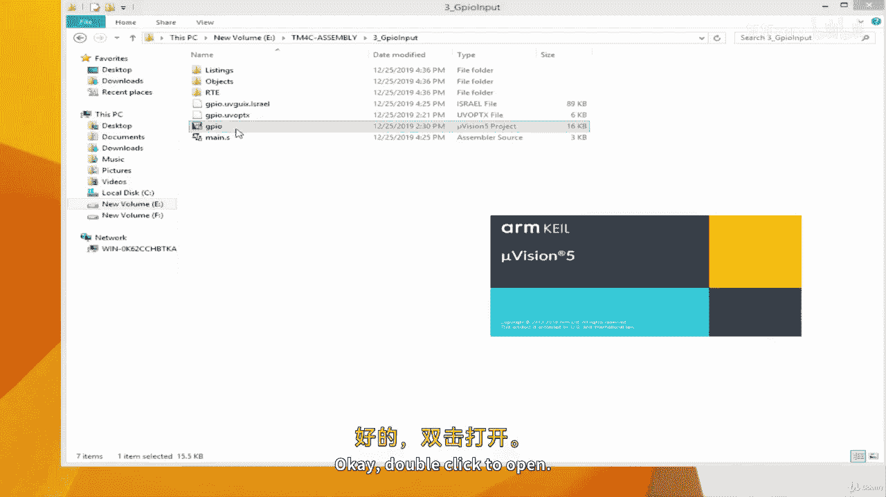
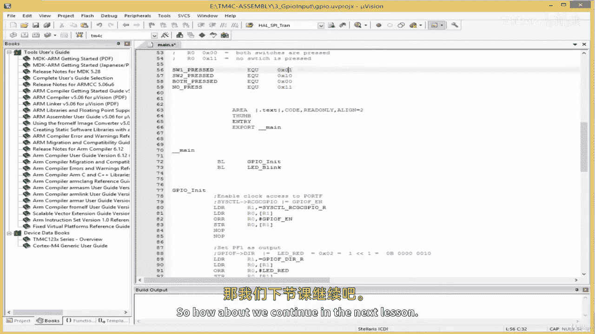

# ARM 汇编语言入门II：08.5：为相关GPIO输入寄存器分配符号名称

在本节课中，我们将学习如何将微控制器的GPIO引脚配置为输入模式，并重点介绍如何为相关的寄存器地址和状态值分配易于理解的符号名称。这是编写清晰、可维护的嵌入式代码的关键一步。



上一节我们介绍了GPIO输出的基本配置。本节中我们来看看如何配置GPIO为输入，并处理开发板上特定的硬件细节。

首先，我们需要复制上一个项目，并在此基础上继续。新项目命名为“GPIO输出输入”。实际上，我们将学习如何将GPIO引脚配置为输入。

将GPIO配置为输入非常简单。我们只需操作方向寄存器，将其相应位设置为输入模式即可。

但对于我们的实验，我们将使用开发板上提供的两个开关：SW1连接在PF4引脚，SW2连接在PF0引脚。这些开关需要启用内部上拉电阻，以确保在未按下时引脚处于确定的高电平状态。为此，我们需要使用上拉寄存器。

我们需要获取上拉寄存器的地址偏移量。根据数据手册，GPIO端口F的上拉寄存器偏移量是 **0x510**。

以下是创建相关寄存器符号地址的步骤：

1.  **定义上拉寄存器偏移量**：
    ```
    GPIOF_PUR_OFFSET    EQU     0x510
    ```

2.  **计算上拉寄存器实际地址**：
    ```
    GPIOF_PUR_R         EQU     GPIOF_BASE + GPIOF_PUR_OFFSET
    ```

接下来，我们需要处理一个特殊情况：PF0引脚（SW2）默认是锁定的。这是因为PF0连接到了非屏蔽中断引脚，为了防止误操作，设计者将其锁定。要使用它，我们必须先通过特定的解锁密钥来解锁，并提交更改。

因此，我们需要访问锁定寄存器和提交寄存器。

以下是创建锁定和提交相关寄存器符号的步骤：

1.  **定义锁定寄存器偏移量**：
    ```
    GPIOF_LOCK_OFFSET   EQU     0x520
    ```

2.  **计算锁定寄存器实际地址**：
    ```
    GPIOF_LOCK_R        EQU     GPIOF_BASE + GPIOF_LOCK_OFFSET
    ```

3.  **定义提交寄存器偏移量**：
    ```
    GPIOF_CR_OFFSET     EQU     0x524
    ```

4.  **计算提交寄存器实际地址**：
    ```
    GPIOF_CR_R          EQU     GPIOF_BASE + GPIOF_CR_OFFSET
    ```

5.  **定义解锁密钥值**（该值可在数据手册中找到）：
    ```
    LOCK_KEY            EQU     0x4C4F434B  ; 密钥 "LOCK" 的十六进制ASCII码
    ```

现在，我们为两个开关对应的引脚位创建符号名称，使代码更具可读性。

以下是开关引脚位定义：

*   `SW1` 对应 **PF4** 引脚。
*   `SW2` 对应 **PF0** 引脚。

需要特别注意的是，开发板上的开关是**低电平有效**的。这意味着：
*   默认状态下（开关未按下），引脚读数为高电平（1）。
*   当开关被按下时，引脚被拉低到低电平（0）。

为了在代码中清晰判断开关状态，我们为不同的读取结果定义有意义的符号名。

以下是开关状态符号定义：

*   `SW1_PRESSED    EQU     0x01` ： 当读取结果R0为0x01时，表示SW1被按下。
*   `SW2_PRESSED    EQU     0x10` ： 当读取结果R0为0x10时，表示SW2被按下。
*   `BOTH_PRESSED   EQU     0x00` ： 当读取结果R0为0x00时，表示两个开关都被按下。
*   `NO_PRESS       EQU     0x11` ： 当读取结果R0为0x11时，表示没有开关被按下。

至此，我们已经为所有必要的寄存器地址和状态值创建了清晰的符号名称。这为下一节课实际编写输入检测代码打下了坚实的基础。



本节课中我们一起学习了如何为GPIO输入配置所需的寄存器分配符号名称，包括数据方向寄存器、上拉寄存器、锁定寄存器和提交寄存器。我们还定义了开关引脚和状态的常量，并理解了低电平有效开关的工作原理。在下一课，我们将利用这些定义来编写具体的代码，读取开关状态并做出响应。