# 【从零开始学习 ARM 汇编语言II Udemy】 p37 p36 08.6. Coding  Writing the GPIO Input Driver -BV1RJU6YwEM8_p37-

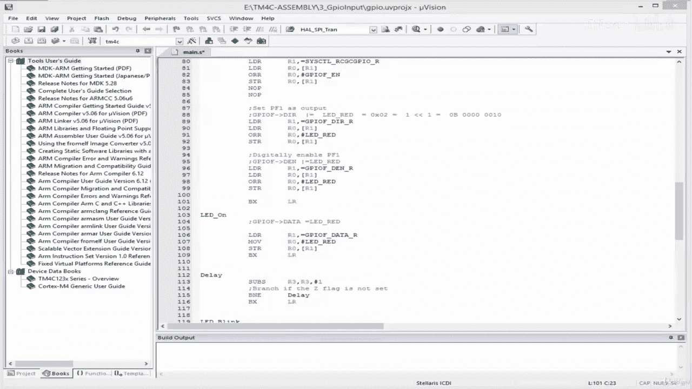

Hello， welcome back。So this is the state of our GPIU in function or subroutine。

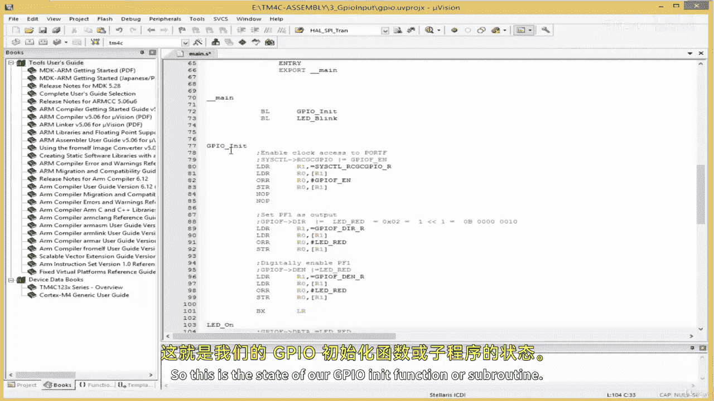

We initialize clock access， and。Over here， we set GPU Pf1 as output。

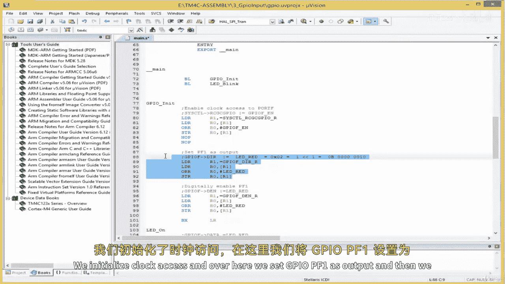

And then we digital enabled PF1。

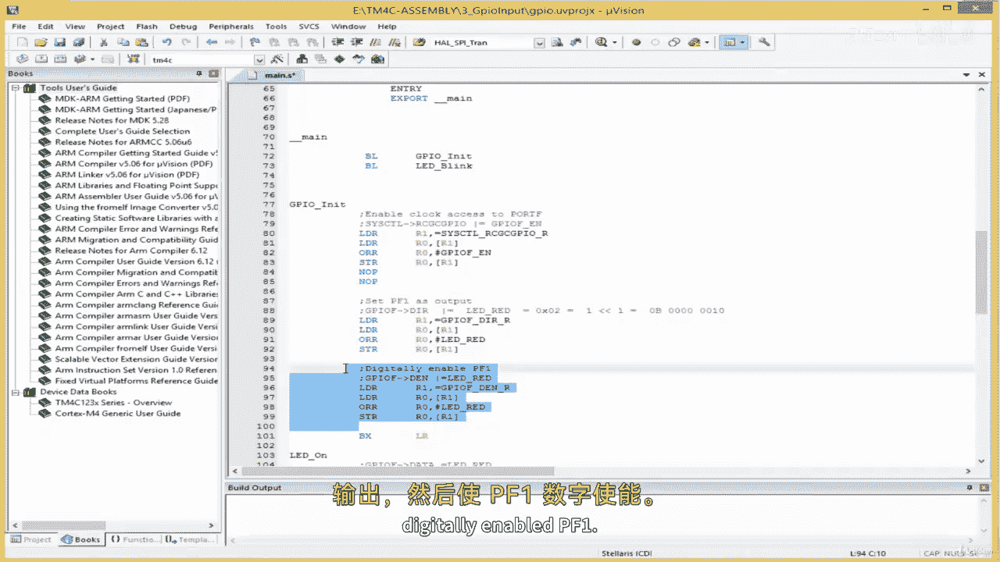

Now， were going to unlock our P F0。And then we can add green as another output and then add the switches。

 So I'm going to come over here。

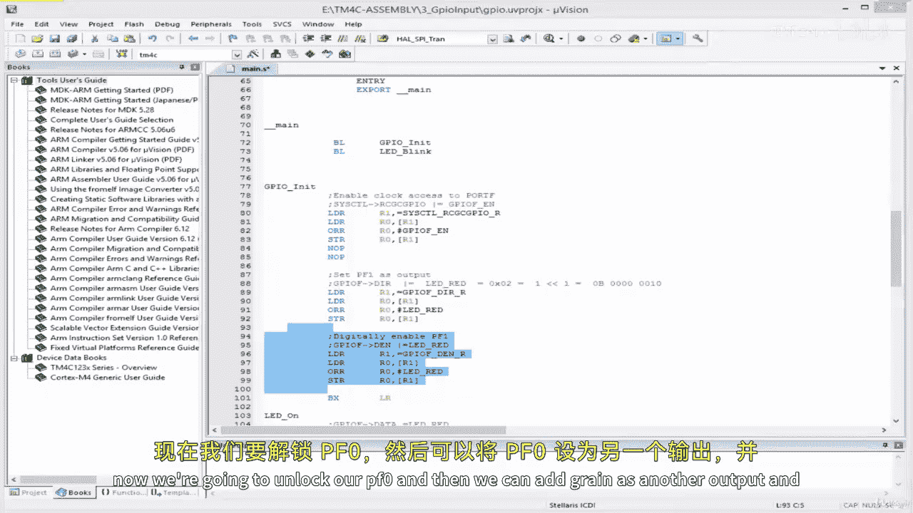

Right after initializing clock， I'm going to。Unlock it， I'll see。

I'm going to unlock P F0 by saying load。R1 with the GI U F。I you can register。And then， load。20u。

With the lock key， which we called lock key， simply lock key。😔，And then， store the lock key。

So this store。😔，Axiu。A1。Right。So this would unlock。This will unlock Pf0 for us。

 so now once we've done that we've got to commit。I'm going to come over here and see。

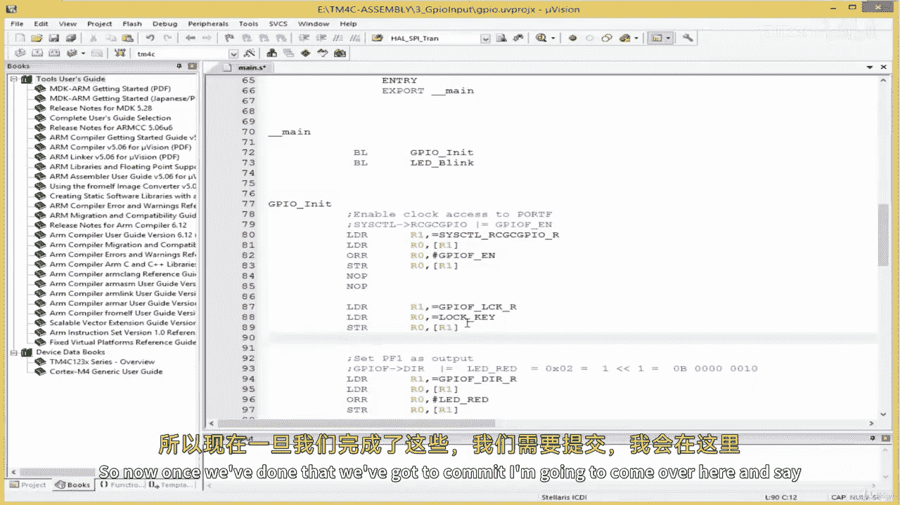

Load， upload the commit register， load R1 equals。GP U F C。And then I'm simply going to move。

I'll simply use。I use your X FF over here。And then， store。😔，I you， everyone。Right。

So we've unlocked and we've committed。

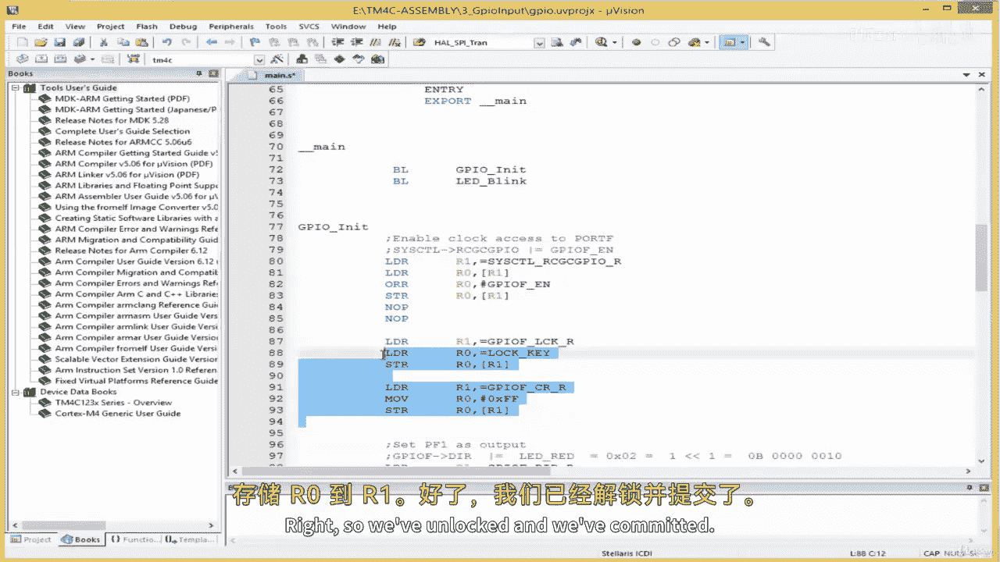

Next， we have our direction register here。Over here， we just set in P F1。As output。

So what I'm going to do is I'm going to add the green LED。And to add that in C language。

 I'll simply add this。And do LED green。And this also will be set over here to add it in assembly。

 I will have to use the R operation。嗯。So。I'm going start off affair。 I awed。

Readed with the current value of our0ro。 Once I stand， I'm going to perform another o。Iu。

Then a green， This would add green to it。Right， as simple as that。So this the direction register。

 Remember to set a pin to to output in the direction register。 You've got to set the bit to one。

 That's why we're doing this to set to input。 You've got to set it to 0。

 But because the default state is 0。 I'm not going to set anything for the switches caused by default。

 They are already input。 That is why I'm only doing it for the arm。 for the output。

 the red and green L。

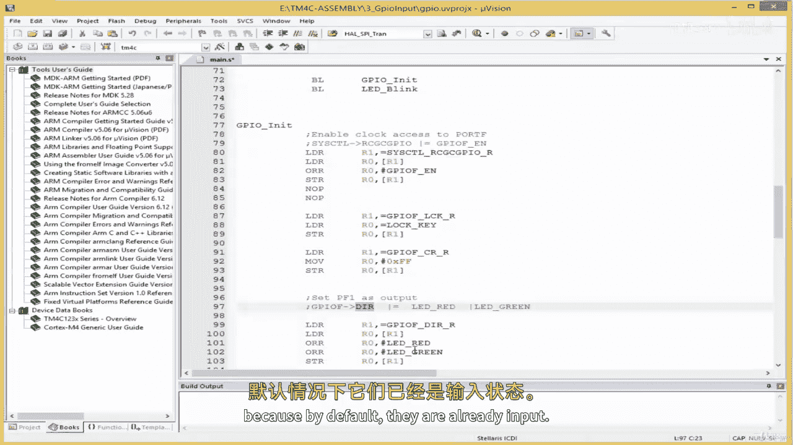

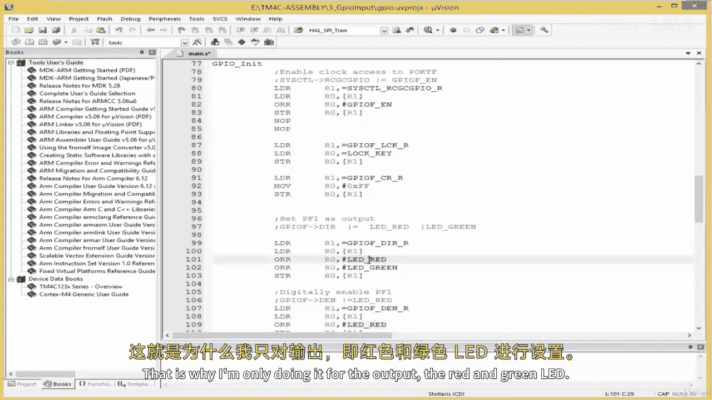

Now digital enable from digital enable to digitally enable a pin。

 you've got to set it bit in the digital enable register to one。

 So we've got to set one for the LED green， one for LED red， one for switch 1， one for switch 2。

So this is going to be。L E red like this。And sea language， LED green。Switch1。Switch2。

 this is going to be like this。Right。So I can either use plus sign LED red plus LED green plus switch1 plus switch2。

 or I can simply use the R operator， the yeah perform an or operation。 So I'm simply going do this。

And then， this becomes。LED green， just becomes。SW1， this becomes。SWT。

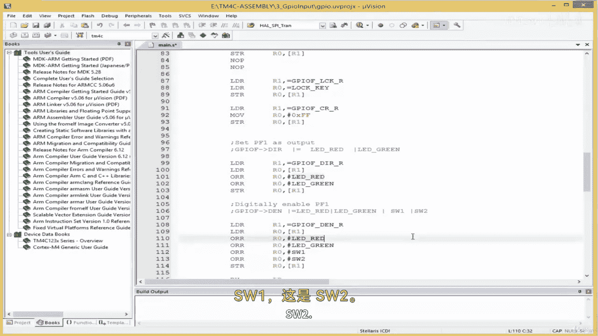

Right。So once that is done， we need to set the pull up。

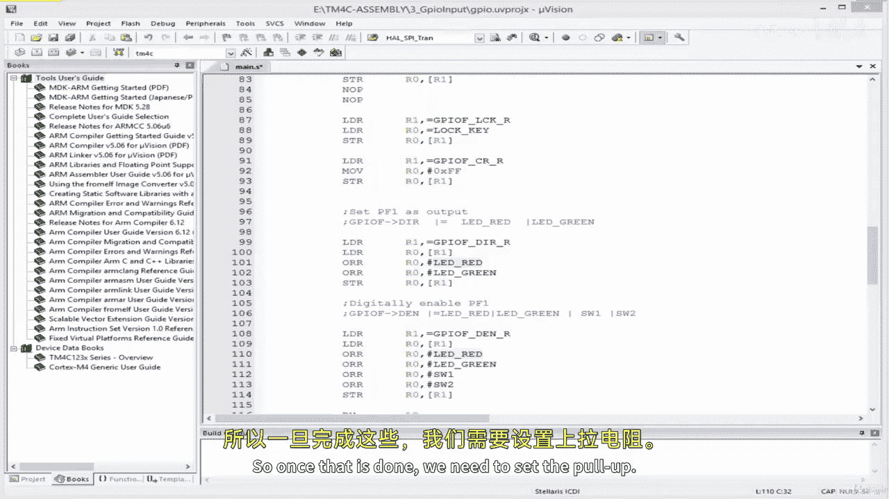

We need to go to the pull up register and set the pull up for our switches。 I'm going come over here。

 Okay， I forgot the sea language of nogannda for a while。 Ill say G U F pull up register。

And I'm going to enable it for switch1。And switch to like this。 So in assembly。Load。😔，R 1。

Eals GPpiI U F。PUR underscore R。And then， load。R0u。R1。And then。We do an all operation， all。R0。

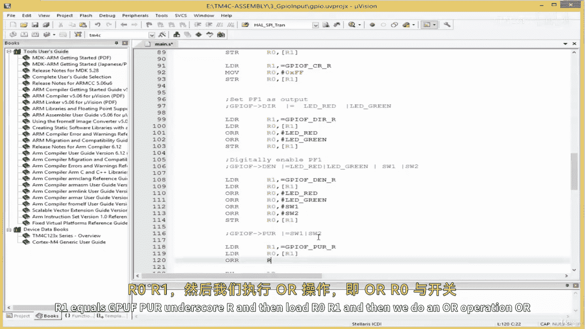

Would switch one。And then oh。Our0。We switch to。😔，And then we can store now STR。20。R1。

And then we return with BXLR like this。Okay。

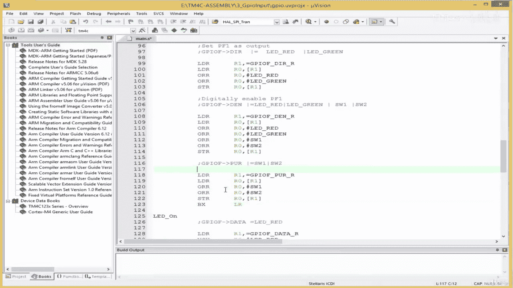

Right， so we're looking good now。Now， we cannot。We have to write a subrin into to read the pin。😔。

To read the buttons， I should say。I'm going to delete our。

I'm going to delete our delay and blank subrouts here we don't need them。

I'm going to write a new sub routine for GPI you'll read。And I'm going to load the data register。

Load。GPIU F。And let's call data， and let's called registerister。And then。Load。I see。Our one here。

And then I'm going to check。I'm going to check。If the switches are pressed。

 and I will do that by cause the content of the data register is going to be an R1。

 So I'm gonna use the end。

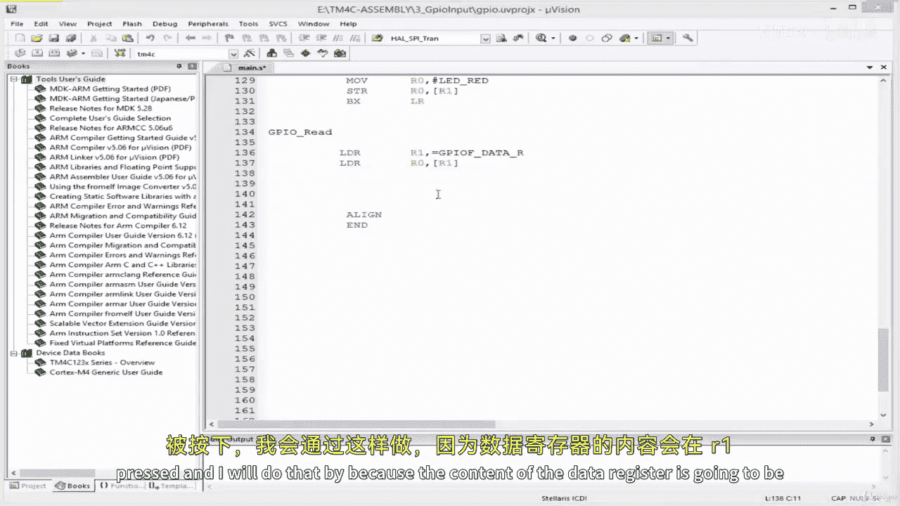

Operation I'll say and R0， the content of R0。Whis I。Check whether they are unpressed or not。

When I use three operas， just think of the third one。Ask the destination， when I do this。

Is the same as doing this， right， do not be confused。

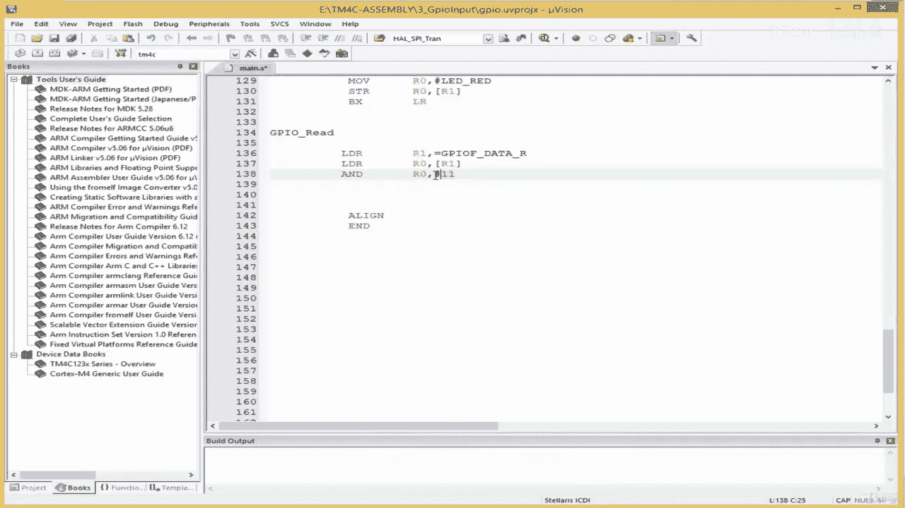

Okay， so I'm going to say。Check P F 0 and P4， whether they are pressed or not。Right。

 and the result is going to be put。 The output of this end operation is going to be in R0。

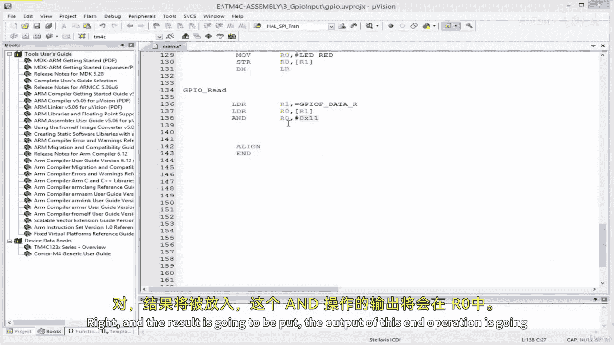

So I'm going to do BXLR to return from the subroutine。

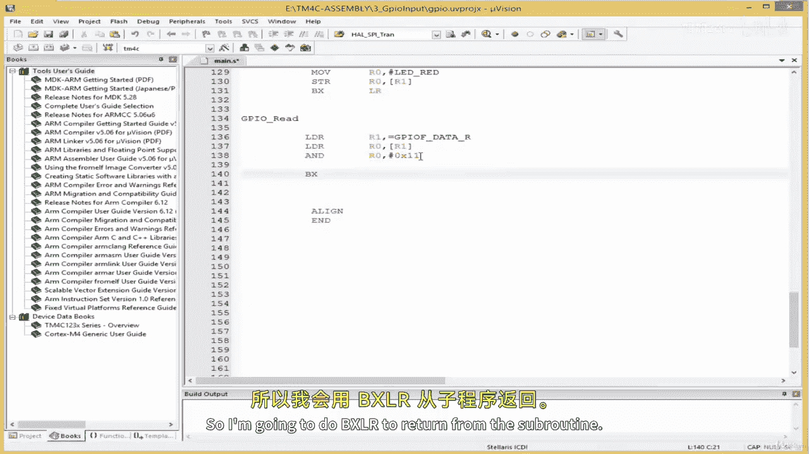

Right。

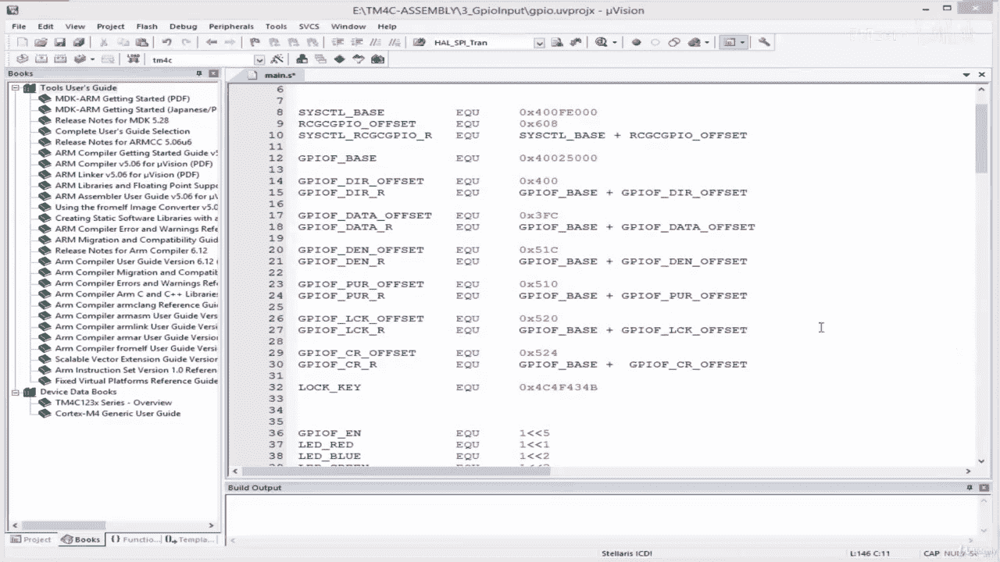

Okay， so let's see what we have。This is our main。We start off by GPIU in it， we no longer have blank。

But what we have is GPI you read。So I'm going to come over here once we've initialize our GPI we will read it by doing branch to GPI you read。

And this will read both this will read what you call it both of the switches and the result is going to be in our0。

 So now let's compare what is in our0ro。So I'm going to use the C instruction， compare。

The content of r 0 width。Sitchwa pressed。And then we say， if so， if it is which1 pressed， then。

We say B EQ here。 If it is switch1 pressed， then we're going to create another subrout for what we want to execute in the case of switch1 pressed。

So I'm going to calm down here。😔，And then。I'll put switch one pressed here， switch one。Here。

 and what we wanna do is turn on the red LED。So sorry we go that。

So I'm simply going to move the red LED。审判告的 say。Move。I0。PushP this into our zero。A lady red。

And I'm going to branch into another subbrioutine that would。That would turn on the LED。

 which we shall call LED on a lot of branch going on here。And then。We can return to DMM。

To loop once we've done this， once we've。Executed and turn on the LED。

 we want to return to the top of the main loop， our Wa1 loop。So see B loop over here。

And I'm going to put loop here， this label here。Right， so we， we have to implement a lady on。

We have LED on over here。😔，This reads the。This reads。I will data register and then。Okay。

 we've got to delete this and yeah， this is our LED on。And I changed the spelling。 I made it in2。

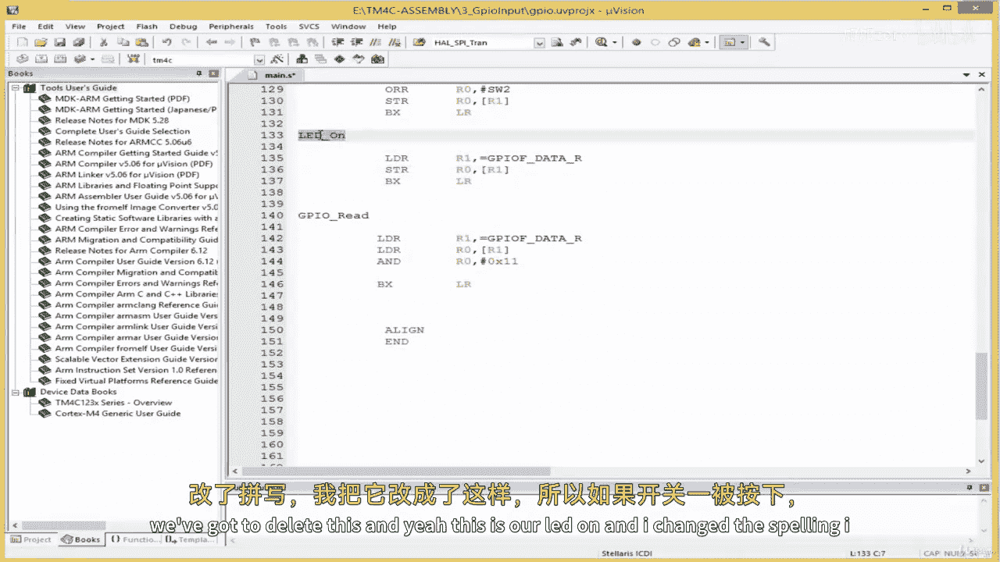

A lady on like this。If which one is pressed， we're going to put LED red into R0ro， right。

 So then ai is going to come to LED on and then we take what is in R0ro and put in the data register and in effect the red LED would turn on。

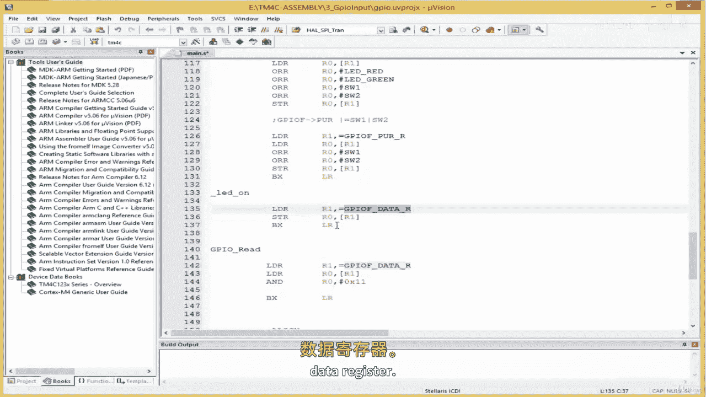

Right， this one we get if switch1 is pressed， okay。

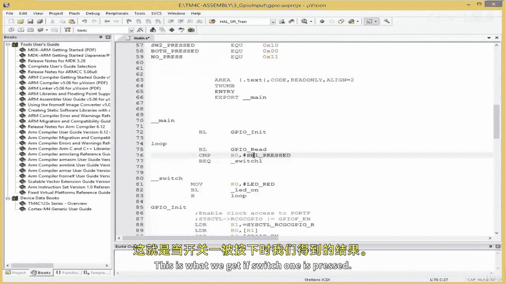

Now， let's do the same for switch 2。

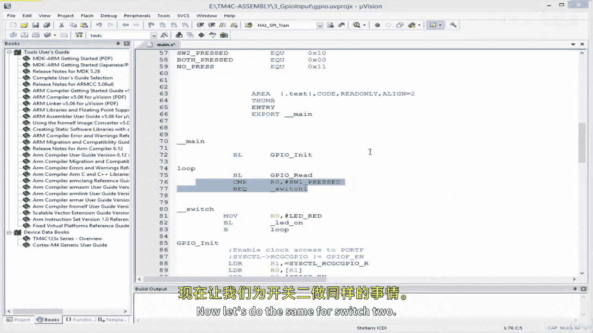

I'm gonna say CMP。20入。水 to。Pressed。BEQ。Un course switch2。So we're going to write switch 2 here。

This should be switch1。😔，This is switch2。And we start off by moving the green LED。Move。

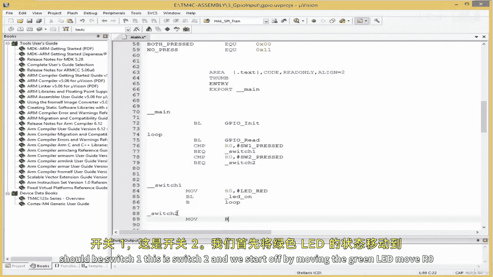

R0。LED green。And then BL。😔，And let's call it LED on。

And then we branch back to the top of the loop to start again。Right， so now let's check。

We've checked switch one， switch two。And then I think I can leave it here。

 I'll leave it for your assignment。 I'll leave an exercise for you to implement。

Both pressed and no press。 What should happen if both of them are pressed or if none of them is pressed。

 that will be your exercise for thisarm lesson。

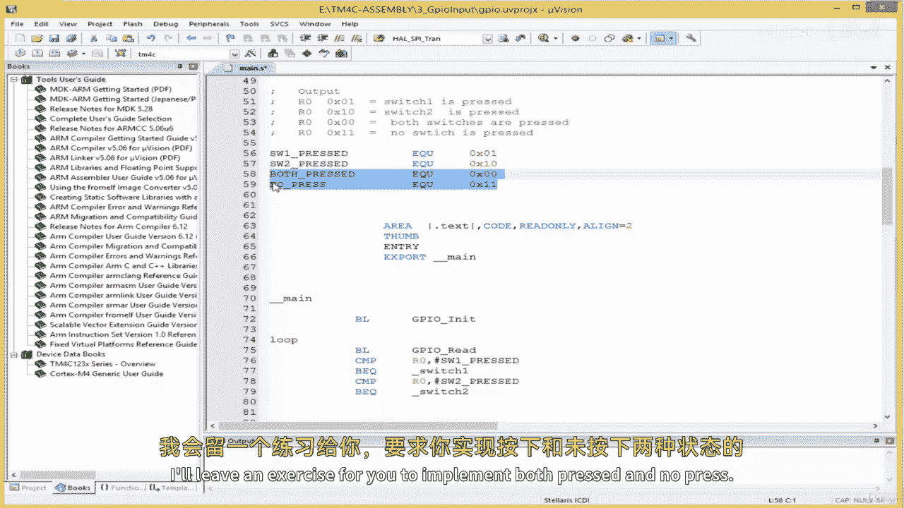

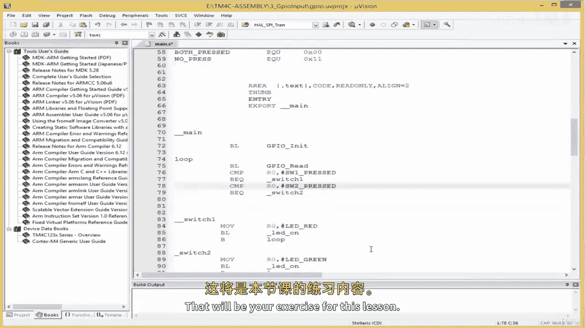

So let's see what we have。Okay， after switch2， I'm going branch back to loop。

 so I'm going to put P here。

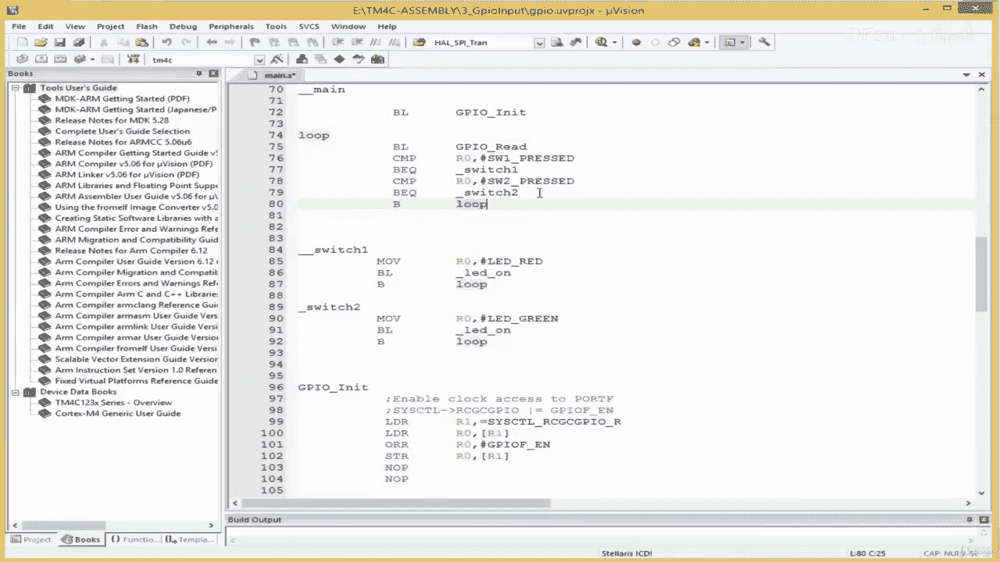

Okay。Let's build and see what we have。Okay， I'll click here to build。I've got one error。

It says switch one， not defined。😔，Yeah， I put two underscores here。😔，Let's build。

To build successfully， let's download on to the board。It's finished downloading。As you can see。

 when I press this， the green LED is on。 When I press this， the red LED is on green， red， green， red。

Creen， red。Like that。 So like I said， for your exercise。

 I would like you to implement what happens when both buttons are pressed and when none of them is pressed。

 when none of them is pressed， I would like for you to turn off the LED。Now。

 you can see that the last LED， the last one that I pressed is still on on the board， so。

If nothing has been pressed， I'd like for you to implement a subroutine that ten of。

 And if both are pressed， I'd like for you to implement， you know。

 to turn0 on the blue LED or turn on both LEDs when they are both pressed at the same time。

 And if you face any questions with regards to the exercise， just let me know。

 And I'll see you in the next lesson。 Have a nice day。

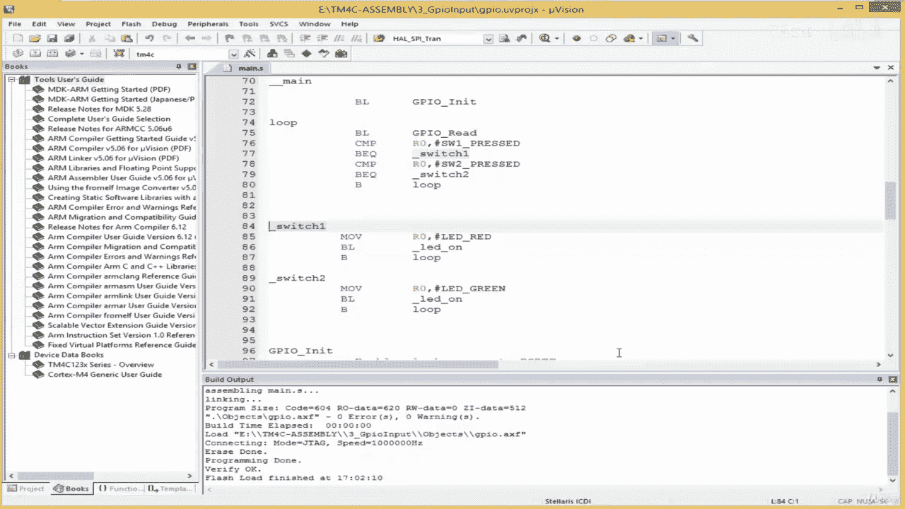