# 【从零开始学习 ARM 汇编语言II Udemy】 p39 p38 09.2. Coding   Assigning Symbolic Names to Relevant SysTick Registers -BV1RJU6YwEM8_p39-

Hello， welcome back In this lesson， we are going to see how to write a driver for our cystic timer。

And then we're going to use the cyststic to create a delay function to create precise delays in this experiment。

 I'm going to create a new project by coming over here。 new Uion project。

A store it in this folder I've created。I'll give you a name。Call cystistic。

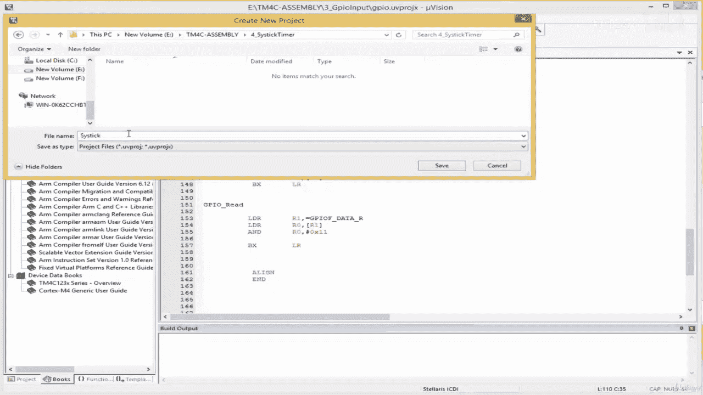

And my board is T 4 C，1，2，3，0，8，6 PM。

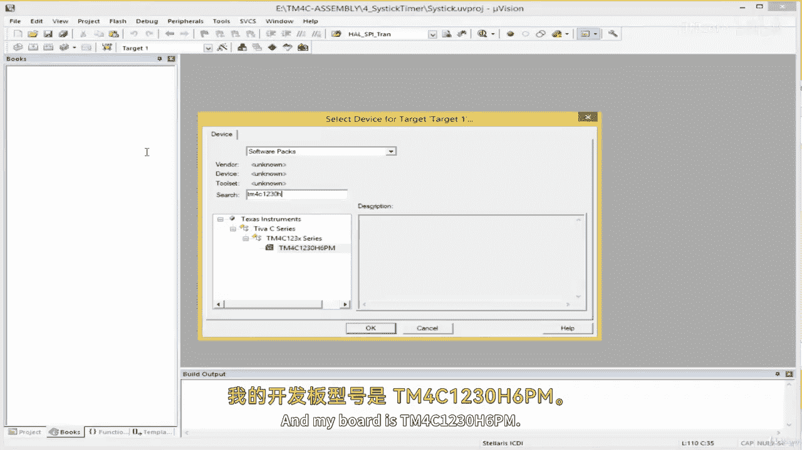

And then under the CMms， I'll select call。😔，On a device I' select start。

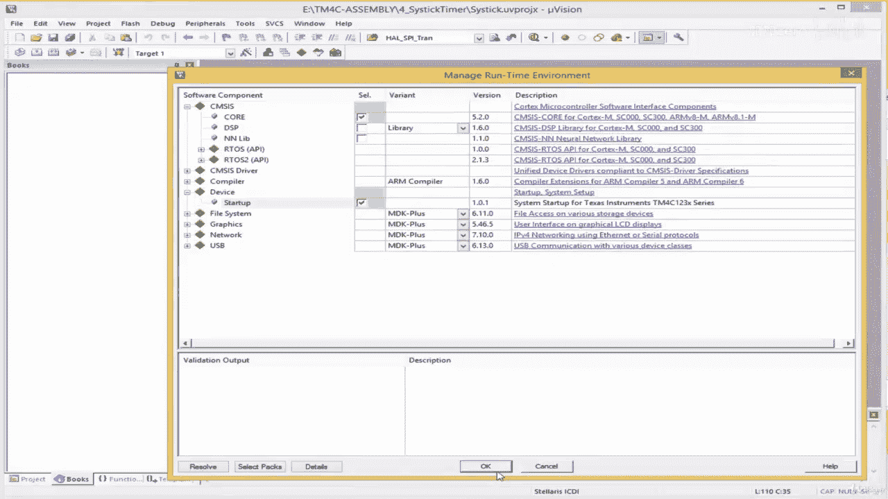

Okay。And I'm going to come over here， my target is the Tm 4 C board， TM 4 c123，0 h。

 I'll just make it to 4 c1，23。😔，And then。Su group here。😔，This is up。

And then I'll create a new fault here。😔，This is a I'll make it main do s， I'll call it main do S。😔。

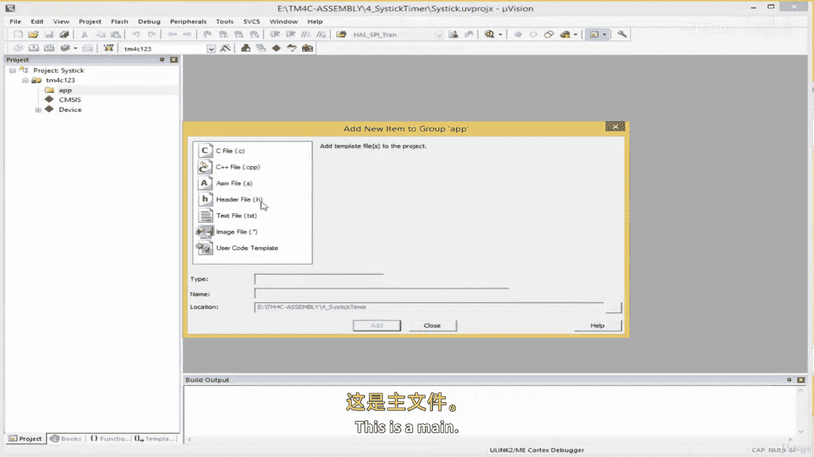

Like this， okay。So we're going to write a driver for the cystic timer。😔。

So the cystic timer is a core peripheral of arm cortex M。

 And what I mean by core peripheral is that this， this is included。

This is included in the architecture。So this is now added by the silicon manufacturer。

And what I mean is， okay， before I continue for those of you who don't know。TheWe say Ar Cortex M4。

 cortex M3， etc， arm is a company based in Cambridge， UK。

 and this company does not manufacture any hardware， they don't produce hardware。

They've just got excellent engineers who come up with designs。

 and then they sell the license of their designs to people。To companies， I should say。

 So S T Macelectronics has a license from arm。 Texas instrument has a license from armm。

 Apple has a license from arm。 Samsung has a license from arm。 Huawei has a license from arm。

 I could go on and on。 In fact， it was estimated at over 90% of。

Mobile phones out there use architecture， but the one used in mobile phones is the cortex A architecture。

 not the cortex M。 A stands for application。 M stands for microcontroller。

 So we are dealing with cortex microcontroller。Right。

 so when I say cyststic is part of the core architecture。 I mean。

 when you buy the license or when you sign up for the license from arm。

 the core design that they give you for cortex M cysttic。I part of it。

So it is up to you the silicon manufacturer to add other peripherals such as the ADC， the U add。

 the USB， the SI， I2C， etc。 those other peripherals are included by this byDM。

By the silicon manufacturer， But but thestic timer is part of the coal peripheral。

So meaning the code we write over here for cyststic should work on any cortex M4 board the same way。

 because the address is the same。 This is not decided by the silicon manufacturer。Right。

So because of this， to get the。To get the address of the system registers。

 we're going to go to the cortex M。We're going to go to the Cortex M generic user guide rather than go to our TM4 C data sheet。

 We're going to go to the generic user guide provided by arm which regards to cortex M4 so you can just come to books over here and select Cortex M4 generic user guide。

Right， this is it。 This document is provided by arm， right。So what we wanna do is find the。

Find the assist registers。AndIn the generic userr guide。Let's see。

 there should be a page that tells us the memory map of the core peripherals。Okay， so over here we。

 we have cortex M4 paraphse。 So all of this is included in cortex M4。

As they call when you buy the license， So I'm going to click on cystic timer over here。

 let's see what we have。Okay， yeah， this theistic timer， so these are the cyst registers。

And over here， it gives a short a short explanation for cyststic。 It says the processor has a 24 B。

 a 24 B time， a system timer， known a cysttic。 So the word cyststic is an abbreviation of system timer。

This timer count down from a reload value to 0 reloads。

 then it wraps to the value in the cystic reload value register。

 I think that is a RVR is reload value register， right。

 So these are the registers which will need for our cystic timer。

So we have to create symbolic names for these registers。Right， so let's start of。

 let's start with the。Sysistic control register。This one here， Cy control and status register。

 We're going to call this。 We're going to give this register a name NVC Cy control register。

 because when you take a look at the driversvis provided by the silicon manufacturer when you take a look at your Texas instrument。

 your T M 4 C12，3086 PM do H file that is often provided by Texas instrument for people who don't want to write the bare metal code when you take a look at this header file。

 the name they've given this registers， we're going to use the same name in convention so。

It's often called envi， enviic。It's written like this NVIG。😔。

And Nviix stands for nestt vector interrupt controller。 and then S T for cystsistic。

 And then we say C T。Ct RL for control and then R for register in this the address here。

 we just get it。

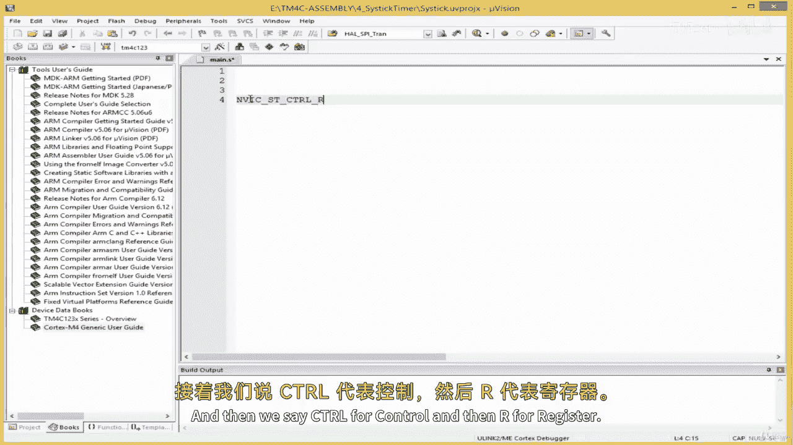

This is the address for the S control register。

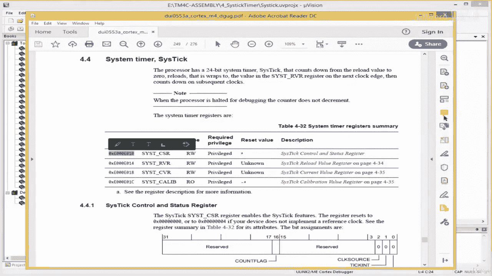

So that's the name in convention If you'll use for this。Right。

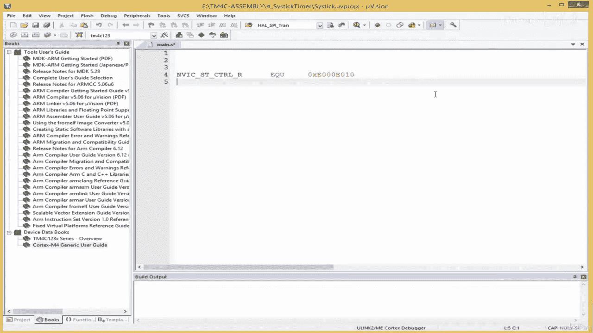

After that， let's see we also need the the system reload value register。

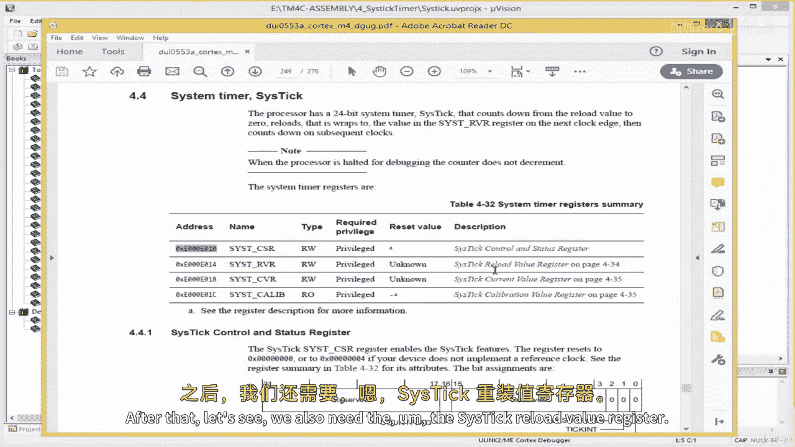

We're going to call this one enVic。And let's call S T， and let's call reload。And let's go R。

 and then we give a symbolic name。This the symbolic name， we bring the actual register。

 the actual code。

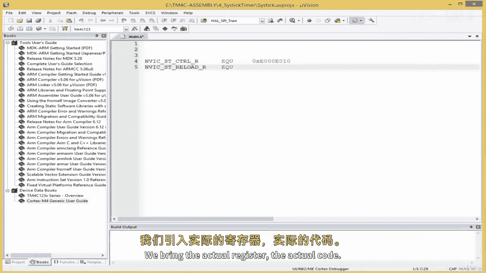

There we go。 So after this， let's take a look at the next register。

This was the current value register。Or copy it。 Were simply going to call this cystic current register。

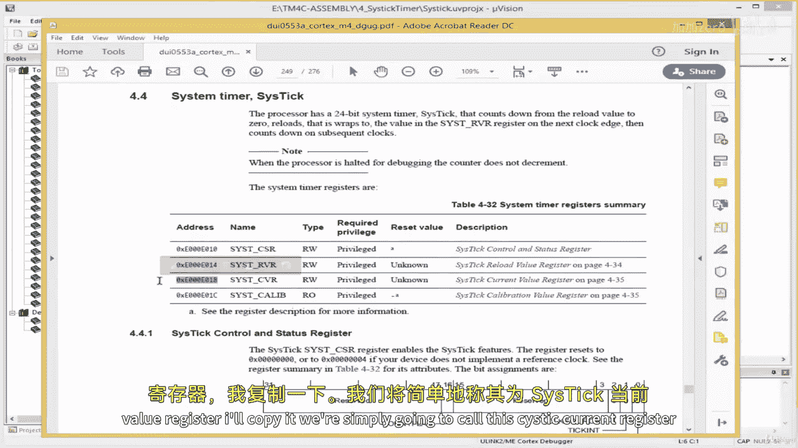

I'll say N Vic。St。Current。Under the go R。EQU and then this。😔，Right。

So these are the three important registers we need for this experiments。 We don't need this last one。

 the calibration register。 We don't need it。 So we can read up a bit about this。

 So this is the control register， the control register as you can see。

 we have bit number 01 to bit 3 to 15 are reserved。

 bit 16 is used for the count flag bit 17 to 31 are reserved。 Let's see the meaning。 Okay。

Its 16 count flag。 This returns one If the timer counted to 0 since the last time this was read。

 So this is， well use this flag to check whether our time out has occurred。

 which is located at bit number 16 of the。Of the S control register。

And bit number two indicates the clock source， whether we are using an external clock or an internal clock。

 which is the processor clock。 This is bit number2。 If we are using our internal processor clock。

 we have to pass one to bit number2。Over here called clock source。

Bits number one is known as the T interrupt， this enables the exception request。

And it says0 counting down to0 does not asset cyst exception request one counting down to0 accept。

 So we basically use this to enable the cystic interrupt or exception。

 and then bit number0 is to enable the counter In other words， to enable the cystic timer itself。

 we use bit number 0 to do that When we pass one we've enabled it when we pass0 we've disabled it。

 So that is the cystic control register。Right， and the reload register。

Specifies the stat value to load into the cystic current value register。Right， and over here。It。

 it's 24 bit。 The maximum value we can load into the reload registers 24 bit from 0 to 23 over here and over here。

 it's reserved。 So we load out value here。 The re load value can be any value in a range of0 x or 01 to0 x。

And this is the maximum 24 bit。Value。Okay， so okay。

So you you can come back here and read more about the cystistic if you want to learn more about it。

 but we're going to create symbolic names to represent these other things。

 such things like the clock source， choose and the clock source。

 enable the tick interrupt and enable disabled the timer will create symbolic names to use for those。

I'm going to come down here。😔，And I'm going to see enV。SD。😔，Control count。

This we represent the count flag。我是 EQU。And I'm simply going to pass this。This bits number 16。

 this set bits number 16 to one in the control register and then。I'll say enV。SD。

Control clock source， this will allow us to select。

Either our process are clock source or an external clock source。EQ油。

I'm going to pass one to that particular bit。😔，And if you expand this for。

 you would realize that one enables the bits that selects the processor clock source for us。

And then next， interrupting enable， we're not using interrupting this example。

 but when we start dealing with interrupt， we need this。SD。Control。And then。Enter enable EQU。

I'm gonna pass this here。Next is the。嗯内部。And we enable through the control register， and Vc S T。

Control register。内部。See EQU over here。😔，And then we know bit 0 is for enabling。😔。

And then next to reload value。We're going to say en Vic。SD control S D reload。

 we put this in the reload register M。EQU and then we're going to use the maximum 24 bit value。😔，O。

So I just put a comment here， this for the count flag。This over here is for clock source。This。

As for interrupt and enable。Or interrupt。L。Enable counter mode。And then。

There's the current load value。😔，Right， so the next thing we have to do is bring in the。

The register is for A。To registers for our LED because we want to make an LED blink。

 So because we've already learned how to create symbolic names for our registers with regards to GPPU output。

We need not do that from scratch， I'm just going to copy it from the previous project。

And bring it over here。😔。

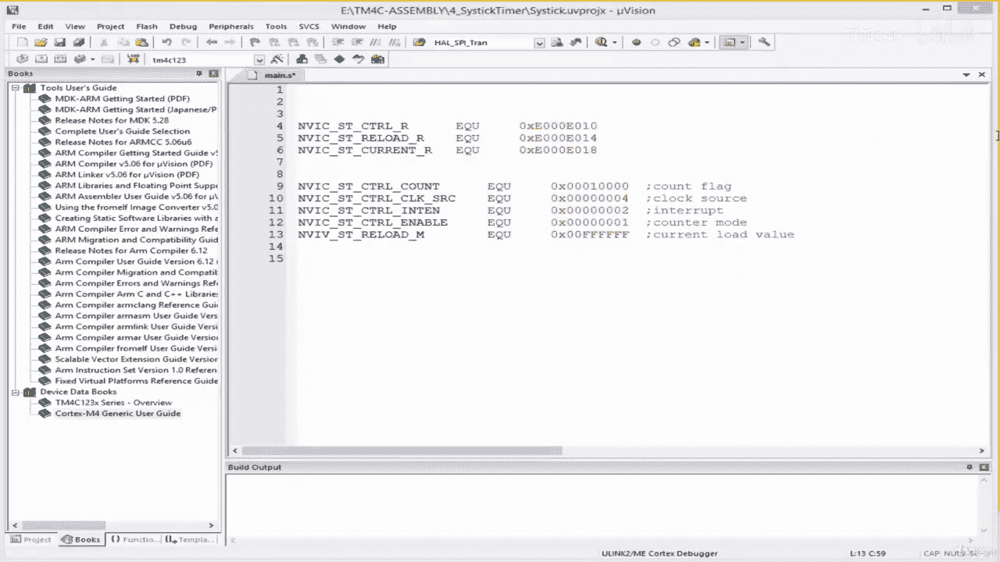

Copy this。😔，Pas it over here like this， so we've got。😔，We've got a direction。

 the digital enable the data register。😔，Yeah。And then。

Symbolic names for enabling GPRUF as well as our LEDs。And then。

Another symbolic name to turn off the red LED。 we're going to be using the red LED here。Right。Right。

 so we are done assigning symbolic names to our relevant registers。Let's continue in the next lesson。

 let's implement our driver， I'll see you later。