# 【从零开始学习 ARM 汇编语言II Udemy】 p41 p40 09.4. Coding   Creating Delay Subroutines with SysTick Timer -BV1RJU6YwEM8_p41-

Hello， welcome back。 So in this lesson， like we said， we are going to implement a was to stick。

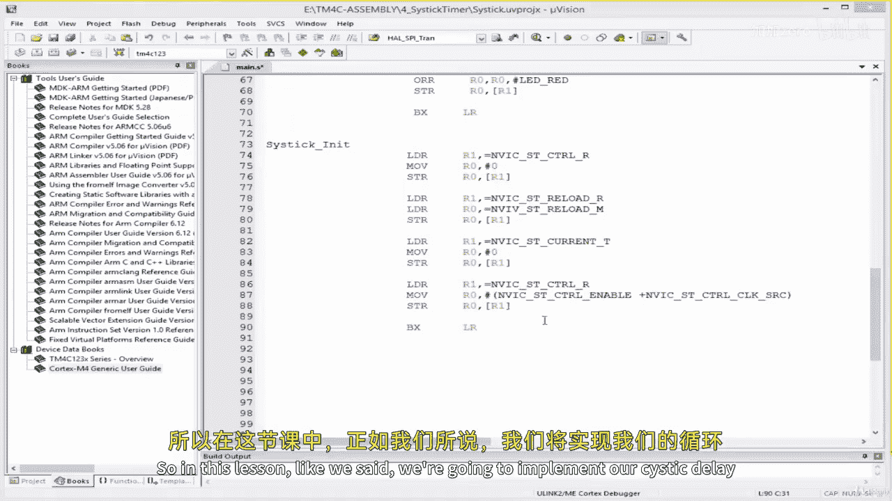

Delay subroutines。 So I'm going to create a function here called cystic weight。

I'm using the word function and subrouting here interchangeably， yeah。So' called the cyst weight。😔。

And first so forth， we go to the reload value。So what is going to happen is we're going to subtract one from the content of the reload register。

 So we push， we put our reload value into our cystic reload register。

 This is our reload value we put into the reload register。

 and we would keep subtracting one from this value until it reaches 0。

 That is where our time output would O， and the unit here is in the clock cycles。

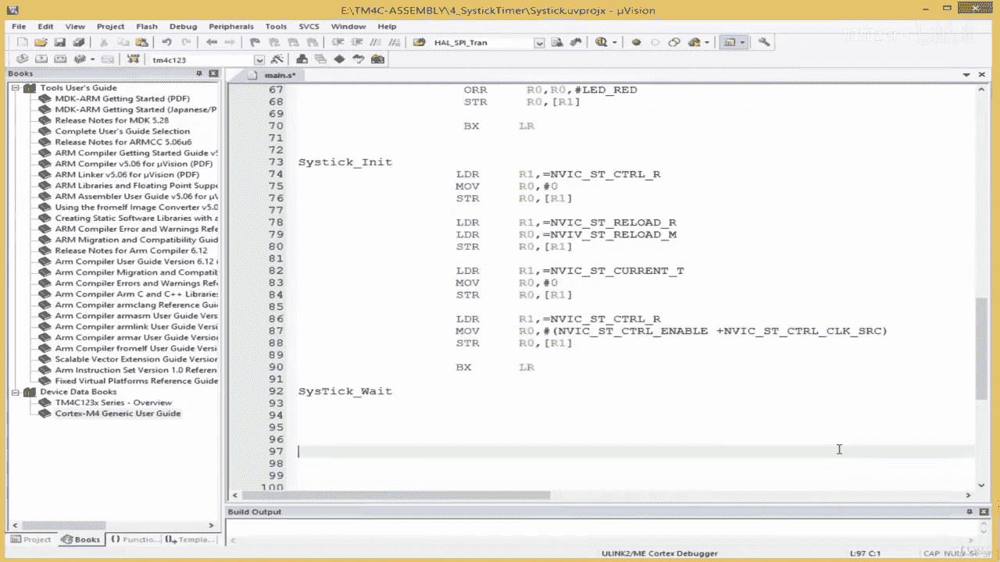

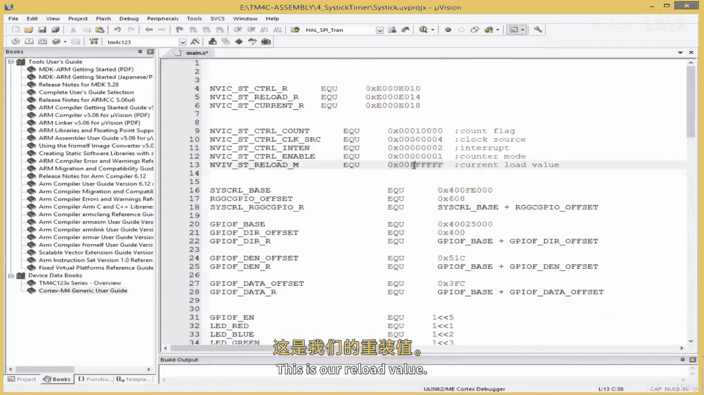

And what I mean by this is because we。Okay， what I mean by clock cycles is my microcontroller。

It default clock frequency is 16 MHz。 And what this means is。16 million cycles。Or care in one second。

So it execute 16 million cycles in one second。 Thus the meaning of 16 MHz。 It's simple to remember。

80 MHz means 80 million cycles executed in a single seconds。Is like 80 million Hz。

 Mega means million。 So 80 MHz equals 80 million Hz。 And this means 80 million cycles in a second。

So my default frequency is 16 MHz。 In other words，16 million Hz。

 meaning 16 million cycles executed in a single second。So if we know 60 million cycles。

executedecuted in a single second。 Then how long does it take to execute a single cycle。

 And this value is 62。5 nanoseconds。 So the unit here is 62。5 nanoseconds。

 which is equal to one cycle for this aistic weight subbriin that we write over here。

 So we're going to pass this argument。 How， how many cycles we want to delay for。

 We're going to pass this argument to register ourcero。 So if I pass 5。

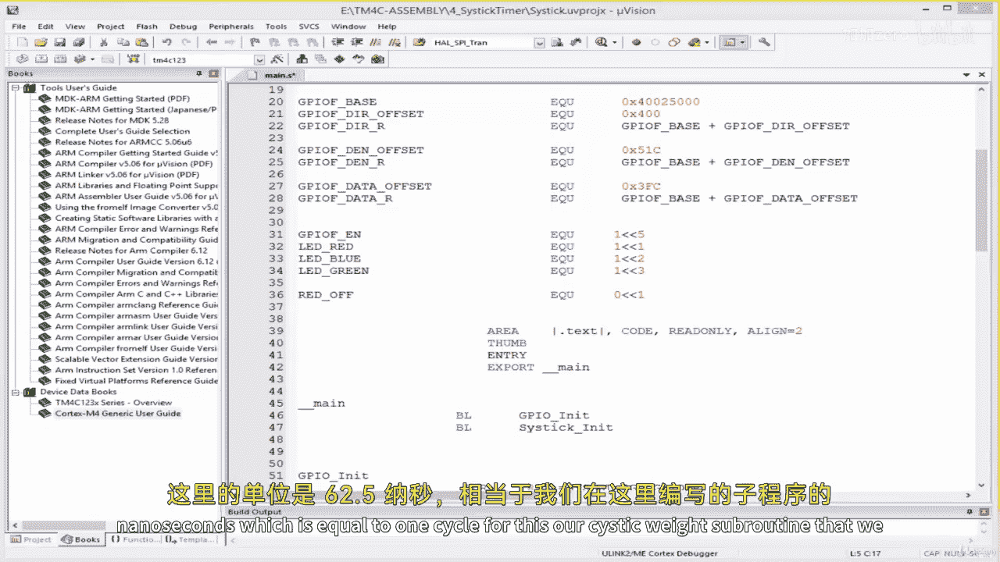

I want a delay for five cycles， which essentially equals 5 multiplly by 62。5 nanoseconds， but yeah。

We would later on see how to have our delays in， you know。

 seconds in units such as seconds or milliseconds。 So the argument is going to pass into register R 0。

 So by the time we get to the subrout， we are assuming we already have R 0 with our delay amount。

 What I'm going to do now is get the arm。The value that is in the cystic load or the cystic reload register。

 So do Nvic S T。Reload。Under theco R over here。And then。I'm simply going to subtractt one。Or do小。

1 from our0。Our0 has a a delay amount。And then。I'm going to store a new value after I perform the subtraction。

 what is left。I'm gonna store it。So after I perform this subtraction。

 I'm going to store the result in the reload register。By using the store instruction。

And then R0 R1 over here。Okay， so once that is done。I'm gonna do load。A one。Becauses N V。

Sistic control register underscore R。Right。What I'm gonna to do next is。

Load or use a different register。A3。R one over here。

And then I'm going to check whether our account flag is set。I do end S。And then R3， R3。A three are3。

 and then we created a symbolic name for the account， this one here。

So we perform an an operation of the content of R3。Because of the content of R 3。

There's a mistake here。Of the content of R 3 with the count flag。 Remember。

 R 3 would have what is located in。Register， this is the control register we've put in in R 3。

 and we're doing what is in R 3。 and is an end operation。 And then we store the result back into R 3。

 I'm using three opera here。 is the same as using two opera。 It's fine。 It should work the same way。

Right。Once that is done。We're going to check if the account flag is set， if it is not set。

We branch to let's say， ourll creator loop。 I'll say LP1 here。

 We keep checking if the count flag is not set， we come over here。Right。

 and the reason we are using B E Q is， when we perform the N operation， we appended S over here。

 whenever you see me or whenever you see an instruction such as move S。Or sub S。Or at S。In fact。

 whenever you see an instruction with S， it means you want to update the APSR registers when you perform that particular instruction。

And the AR registers the， you wanna update the AR flags。

There are some flags in the APSR register that get updated based on the result of a particular execution。

 So we have the zero flag， we have the overflow flag， we have the carry flag。

 we have the negative flag。This shows you that the last operation that you performed retain the negative value。

 the last operation that you performed retain to 0。So that is why we areend here。

 So this checks whether after our subtraction， the the answer is 0， If it is not。

 we come back to the top。Over here。嗯。This checks whether after our end operation， I should say。

 because with the formula end over here。So we keep returning to the top here until the flag is set。

 right， the count flag is set。Okay， so。Once that is done， we can return from this sub routine。Px low。

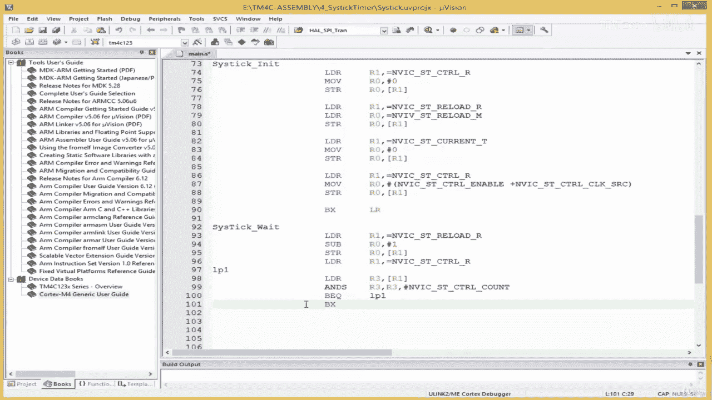

Like this。 Okay， so this is our assist weight subrout。 Now we're going create another subrout to。

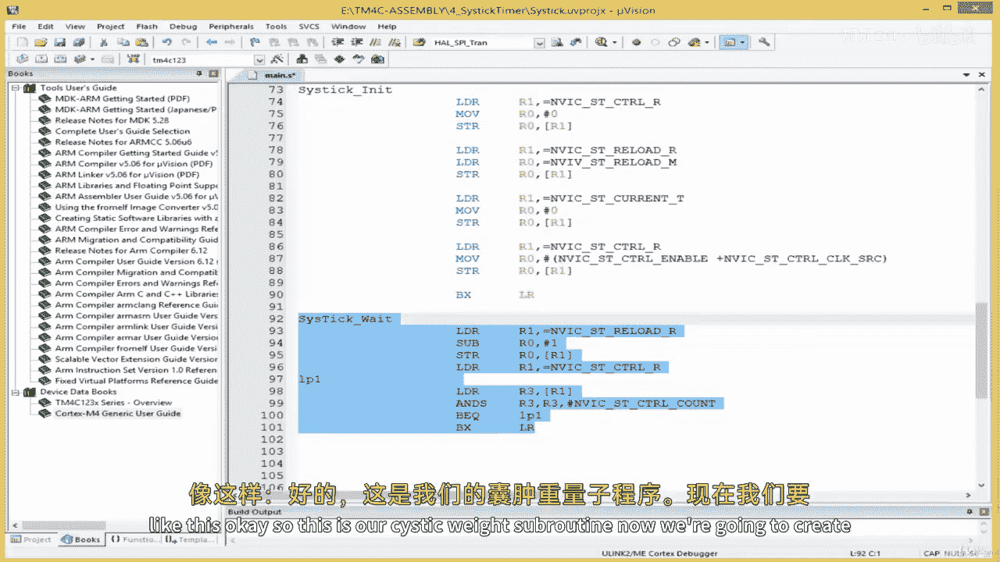

To to allow us to be able to delay in， let's say， milliseconds。

 we're going to create 10 milliseconds delay such that。

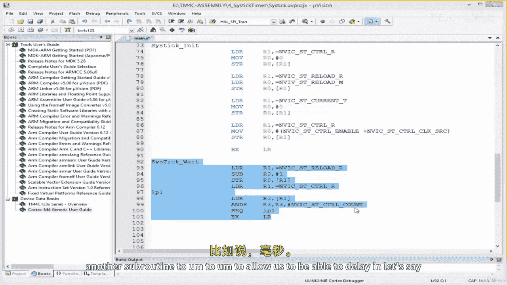

We gonna make。Such that when you call the subrout， it's going to delay for 10 millisecond if you pass an argument of1 and if you pass an argument of 00。

 it's going to delay 100 multiplied by 10 m， which is equal to one second， something of that nature。

So I'm going to come over here to create a use I routine I'll call this。Acoristic。Wait，10 minutes。

And then I'm gonna take the argument。 So we're going to pass our delay amount into register R0。

 So I'm gonna move it from r4。 I'm gonna move it into r 4， or do move S。And as you can see。

 I've added S to this operation because I need the AR flags to update on this。

Move what is in r0 into r 4。And I'm going to say。B E Q， if。If after this operation， if。If the。

If the argument is 0， then branch to a place that I'm going to name done。

 meaning if you pass 0 for the delay amount， there is no need to execute anything。

 The subbri should simply return。 So I'm going to pull a label here。 underscore， underscore done。

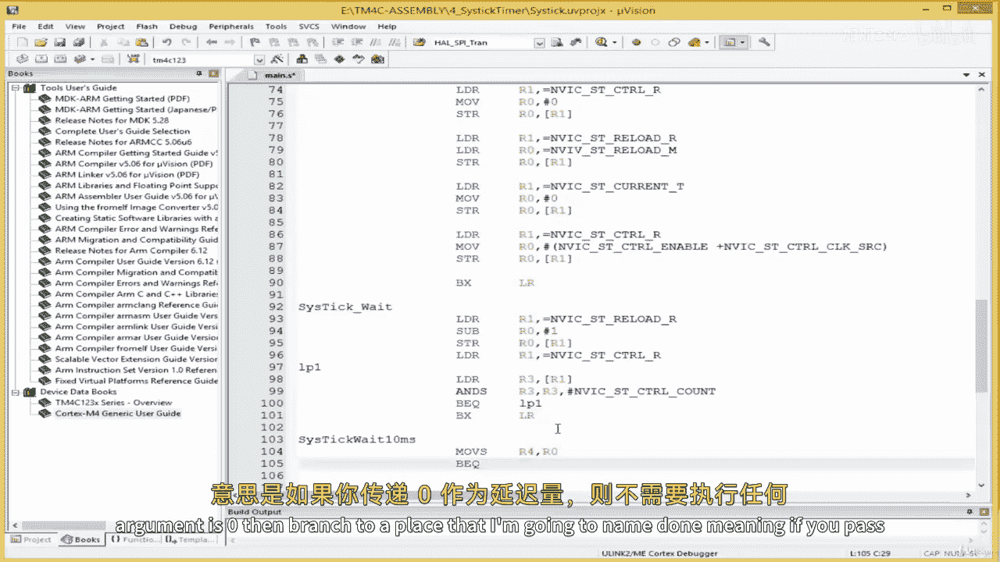

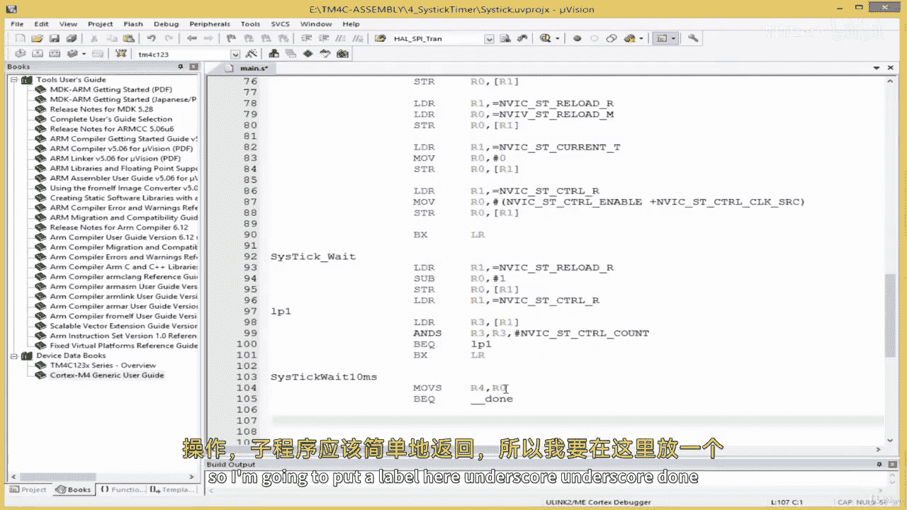

And this is simply going to return from the cyberbertine PxLR。The Xelr over here。Right， okay。

So if that's not a case， then I'm going to。I'm going to perform the actual delay。

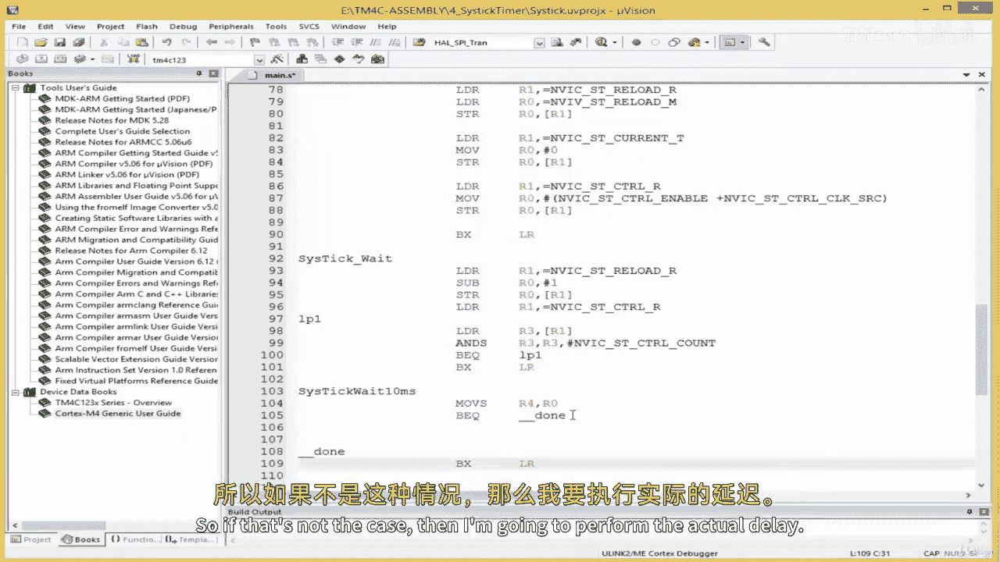

So I'm gonna create a constant。

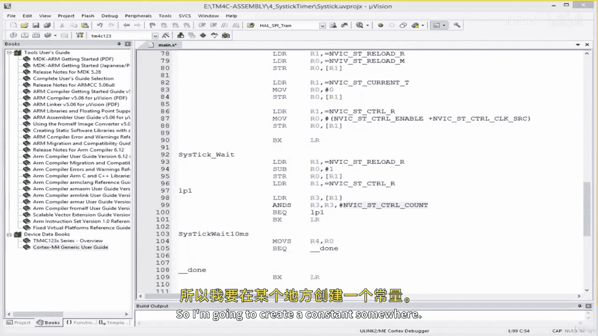

Somewhere。I'll put it up here。Or create delay。Let's see。Chen。😔，Call this tenim delay。 How about this。

And then I'm gonna assign the number。 This is based on my clock frequency。 E Q U， I'm gonna give 1。

60000。I'm going to give 1，60000。Right， so that's the explanation for the 1，60000 we have here。 right。

 like I mentioned earlier，16 million。Equals 1 Hz。 My microcontroller is running at 16 MHz。

 meaning 16 million cycles in a second。And。And another way of expressing this is 16 million equals 1 Hz。

 And we know，1000 milliseconds。Es one hers as well。Then we want to create to 10 seconds。

 We want to find how many。How many cycles do we get with 10 milliseconds then because we say were creating 10 milliseconds？

Well， for 10， we do110 divided by 1000，10 milliseconds divided by 1000 milliseconds times 1 herz。

 which equals one over 100。To see how many cycles we get for one over 100th heads。

 we simply multiply  one over 100 times our 16 million。Our 60 million cycles。

 switch is equal to 1 Hz。 And then we get 1，60000。 So this， this， perhaps， I don't know if。

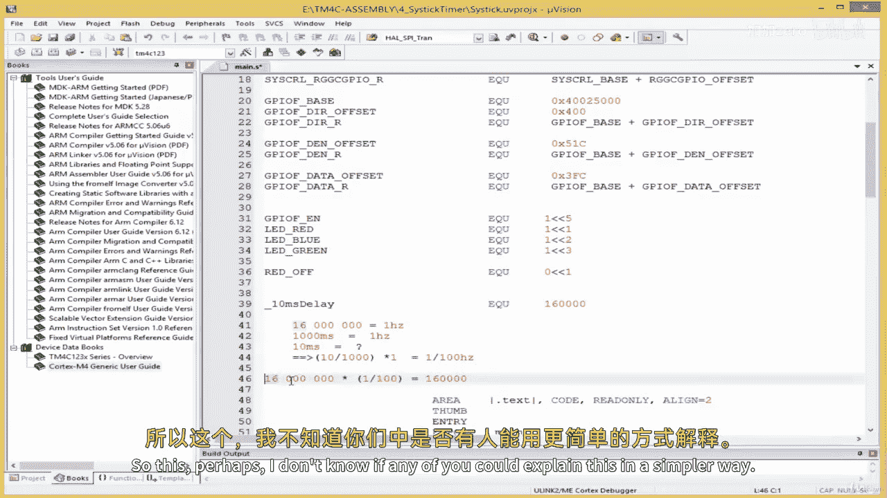

Any of you could explain this in in a simpler way， but yeah。

 I'm sure there are simpler explanations out there and then you can share it in the comment area if you can explain this to your fellow students in a simpler way。

 so basically。

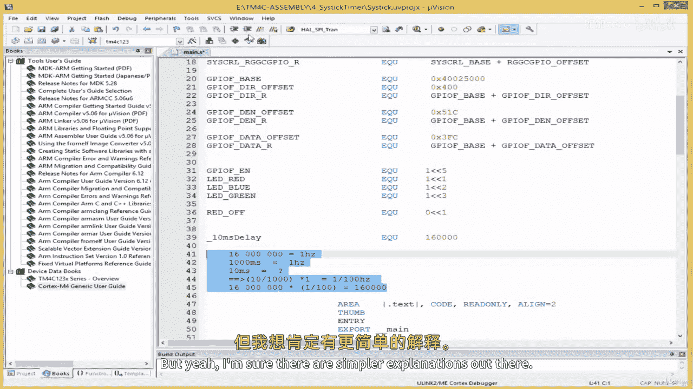

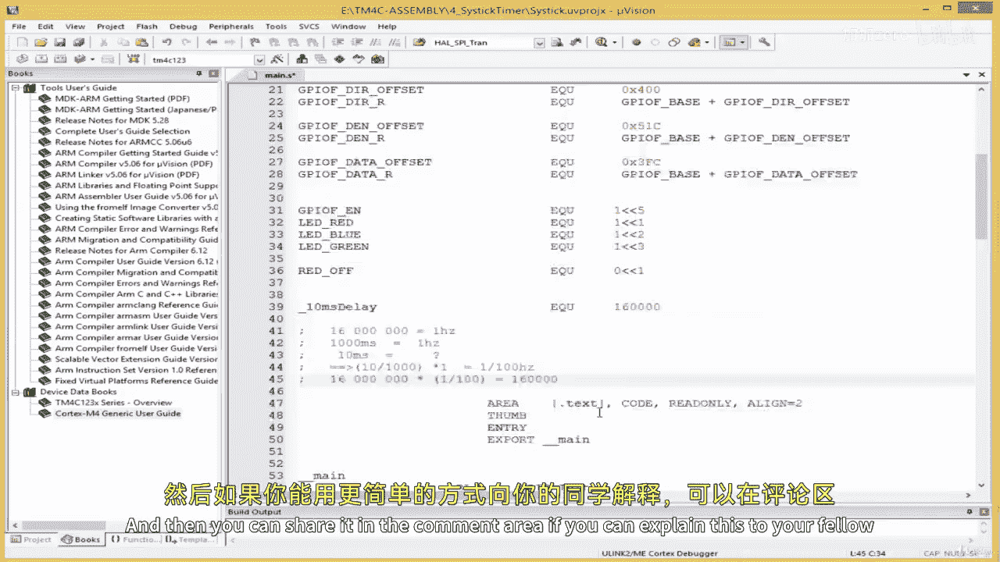

16 million cycles equals 1 Herz， and this equals。100 M this equal 1000 M。

 so then the question is we want100 M equivalent in cycles。

And one could say you are you cancel two zeros here， you cancel two zeros here。

 you are left with 160，000 cycles， hence this constant is 160，000。

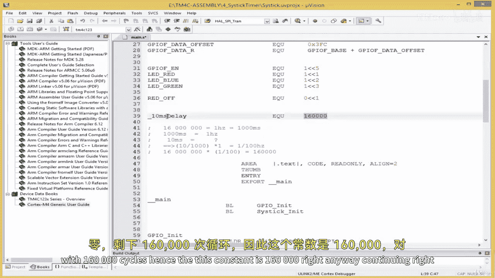

Right， in a way continuing。Right， so we've created a constant。

 Let's continue to create our10MS delay。

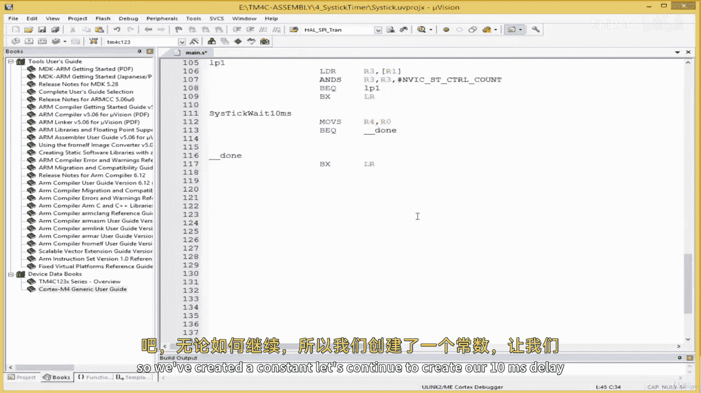

嗯。

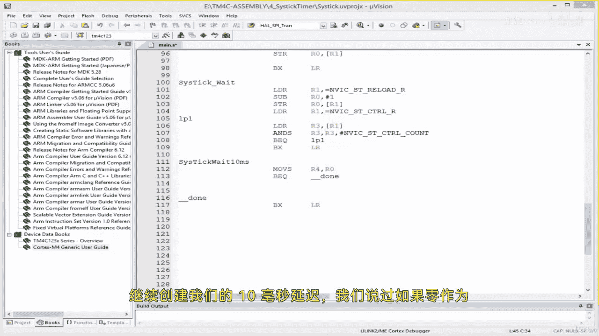

So we said F 0 is past as argument。 the， the subbri is going to return。 If that's not the case。

 then we're going to subtract。

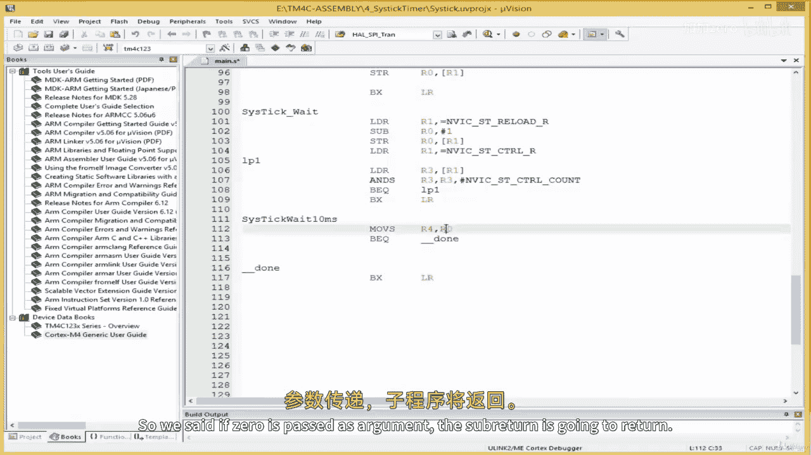

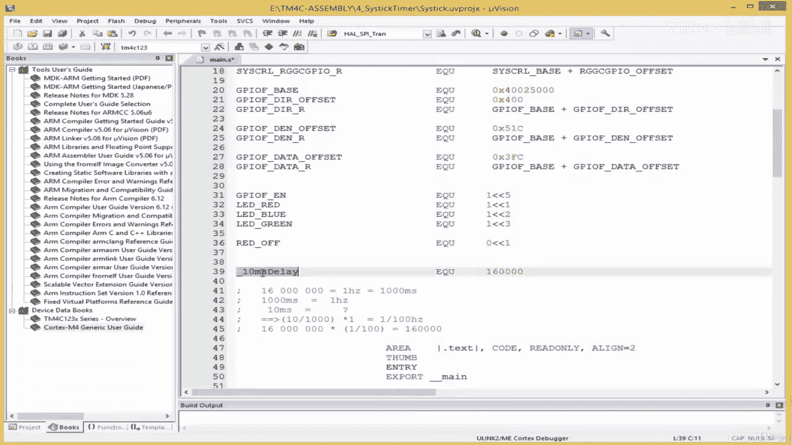

We're going to subtract something from our constant our delay amount。

 I'm going load our delay amount here。

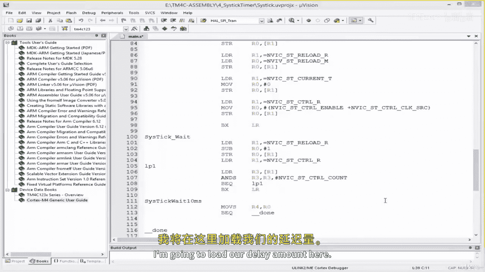

I'm going to load。I'm gonna use a load。Our0 with our delay amount。Which is this or 10 M。

And then I'm going to call our cystic weight。Bio。Sistic weights over here。

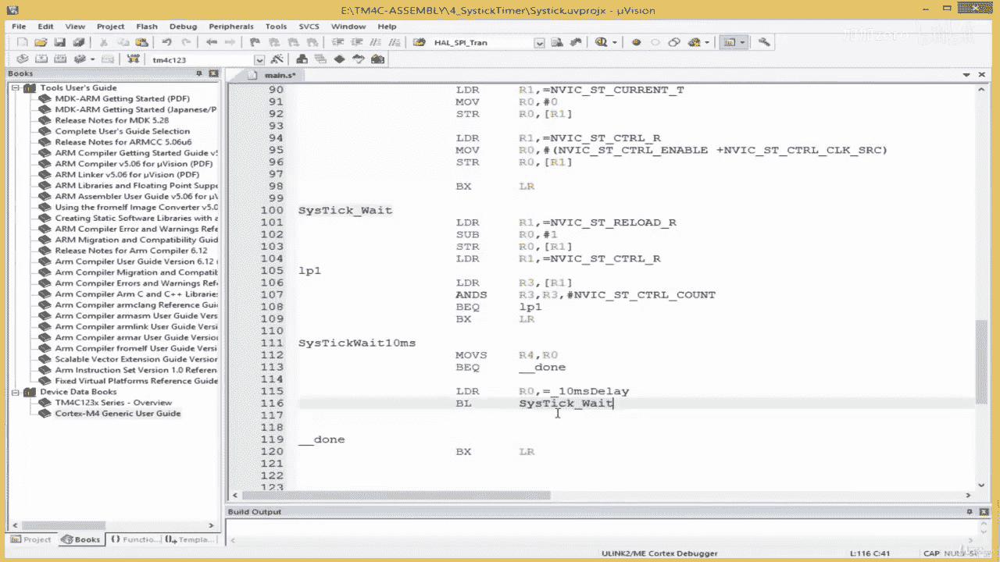

Right， and then once this the weight has done its thin once。You know， its return。

 I'm going to subtract one from our delay amount。

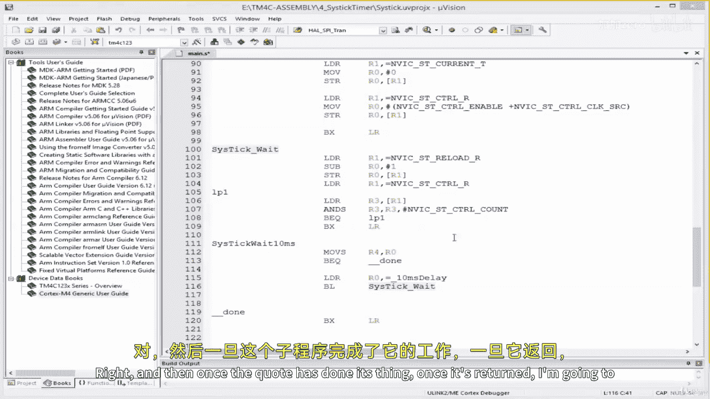

By doing sub as sub。Sps。SUB S。And then remember， R 4 still has a copy of the argument what the the argument we passed。

 because the argument is R is an R 0， but we copied it into r 4。

 So we still have the original argument here。 We reus。 We used r 0 later on for our 10MS S constant。

 So R 4 has the argument we passed initially now。 So we say r 4。A for。inus1。

And then we are going to subtract one and if we subtract and it's not equal to 0。

 If the result is not 0， were going to。Branrunch， if it's higher。

We're going to branch if the result in r4 is higher than0， I'm going to use PHI instruction here。

 and then I'm going to branch to this part LP2 and I'm going to put LP2 here。Right。So this is it。

I think yeah， it looks good no。Okay， so we can align and。And。This is the loss of routine。😔，Right。

Okay， okay。 so now let's test our。Our programme， I'm gonna create two new subbris here for LED on and LED off。

 gonna have LED on。And this is simply going to turn on the red LED。 I'm going to do load。R 1。

And then GI U F data register。And then move into ourhiu。The LED red。And then你 store。20。R1。

And then B XL R。Return from subroutin。 Then we're gonna have。L lady off。

And then this is implemented the same way， load。A1。GPI U F。Data register。Move to r0。This time。

Red off。And then store。R 0， R1。An NXL R。Okay， so now in our main loop over here。

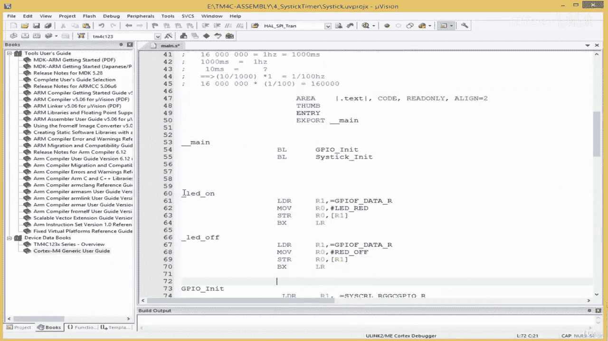

We can。We can test out our code。I'm going come over here and load our0ro。She。

I' load aer across Ier is the register that collects the argument of outside routine。

 I'm going to load it with the number。But this，100。And then I'm gonna do BL。To our weight 10MS。

And then I'm going to call the LED on BL。And us call LED on。And then。I'm gonna load our0ro again。

With 100。 So 100 multiply by 10 M S equals 100 M S equals 1 second。Then I'm going to do BL。

To weight 10MS。And then， BL。Let's call LED off。Right， and I'm going to keep this in a loop。

And I'll put a loop here。😔，Right， we're looking good。Okay， so we can try out our code。

See what we have。滚了。Click here to build。Back to their Ros， by register symbol。

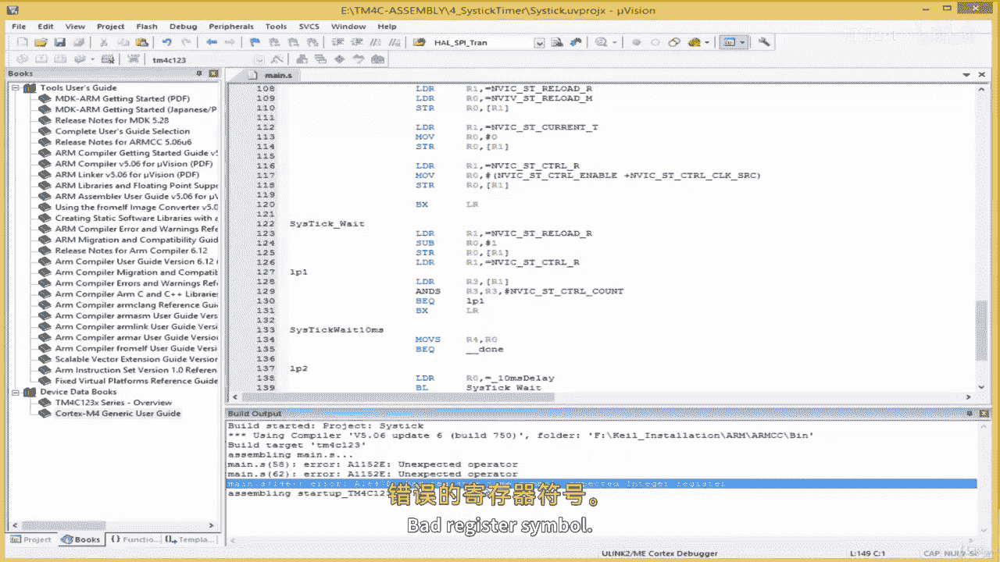

质一。Probably have a bar register somewhere。

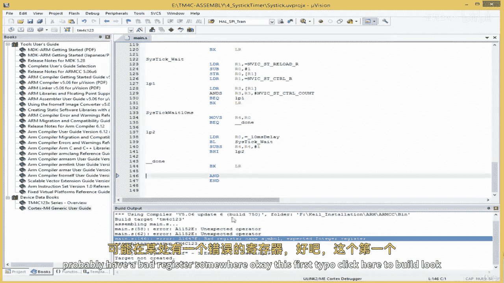

Okay， this first typo。Click here to build。Look at her I was supposed to write a line。

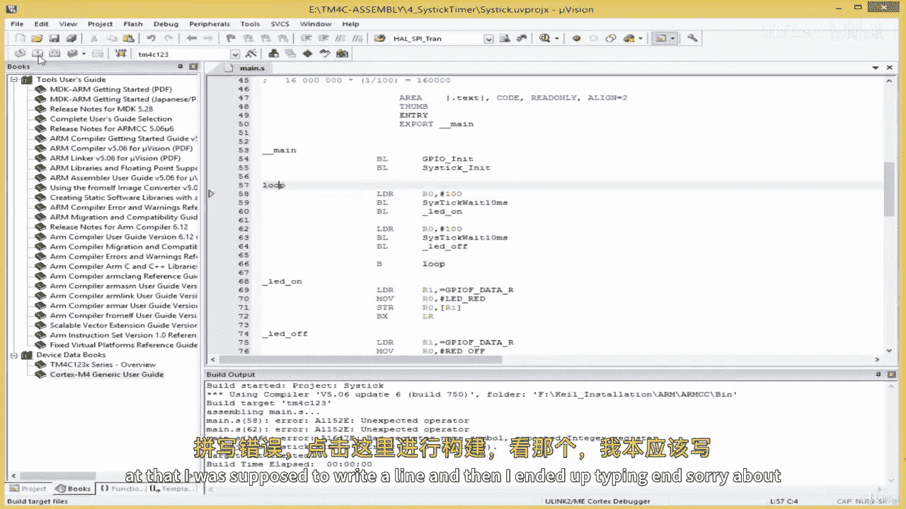

And then I ended up typing end。😔，Sure about that。Okay， we've got two more。Says Bob。Yeah。

 if you're using the load， you don't use this。This is hard to load。We could have done move。Okay。

 so there's a typo with regards to this and V ST current register are over here。😔，Okay。

 let's set what target option is。Debaer musing the Stlarious IDI。

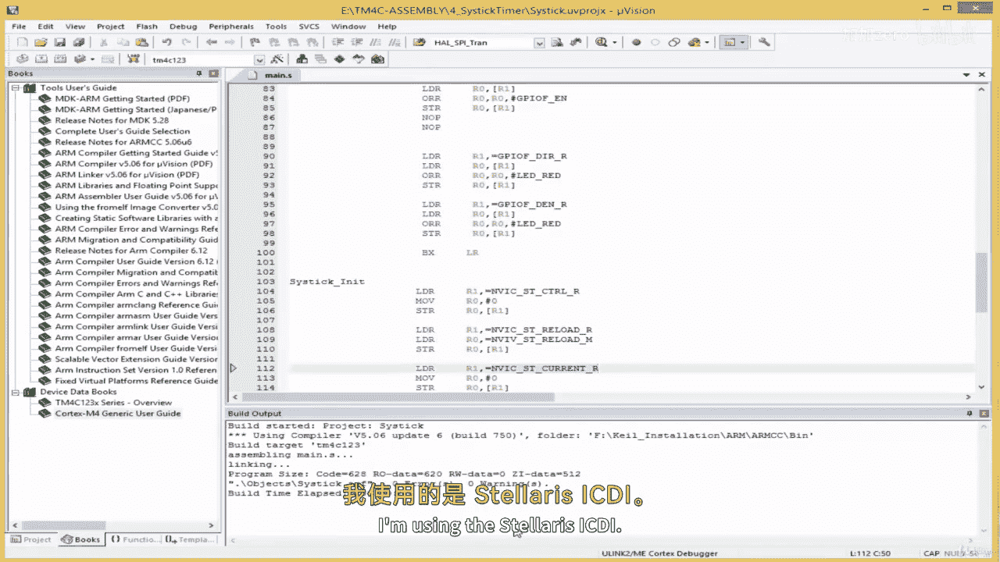

I'm going to come over here。Re set and run， okay， and then okay。

So I'm gonna click here to download it onto my board。download路灯。My LED is not blinking。 Let's see。

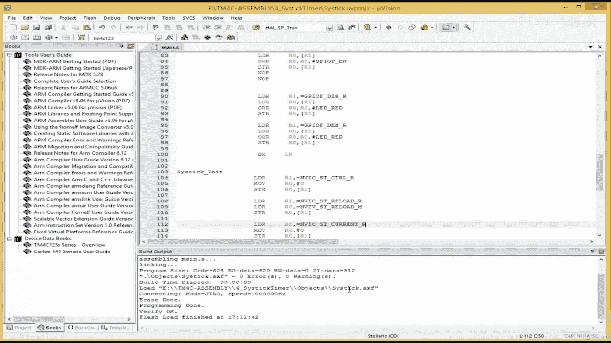

Right。Right， the reason we have in this issue is we need to push register R for and。Efo。

 we need to save them。Yeah。I'm gonna push。R 4。And a link register。

And then before I return from the sub routineoutine， I'm gonna pop them。Pop。A four。

And then the link register。Okay， let's build and sea if the solve so。也许。

I'm going to click here to build。I'm going to click here to download onto the board。As can see。

 my LED is blinking， so this brings us to the end of this lesson if you have any questions at all。

 just let me know and I'll see you later。 Have a nice day。

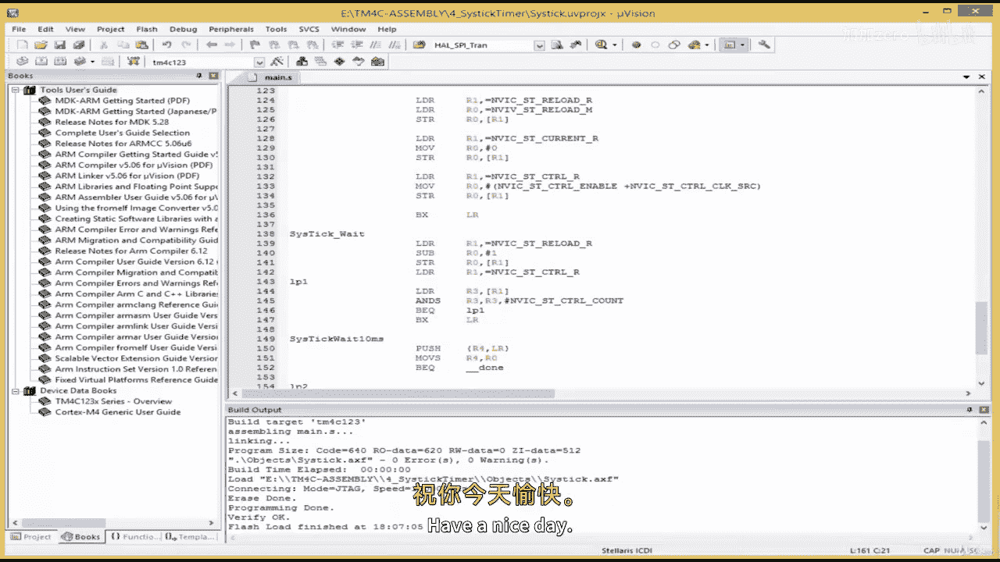